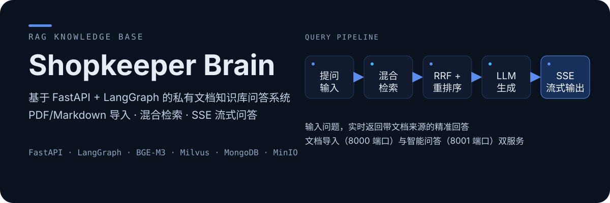
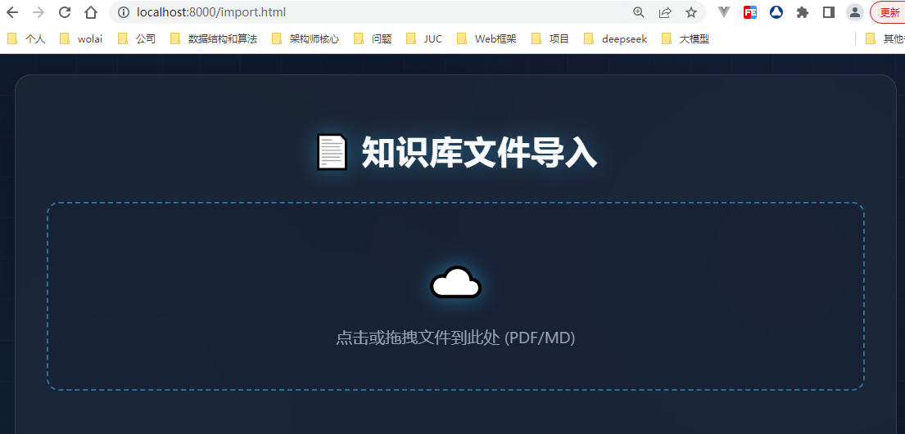
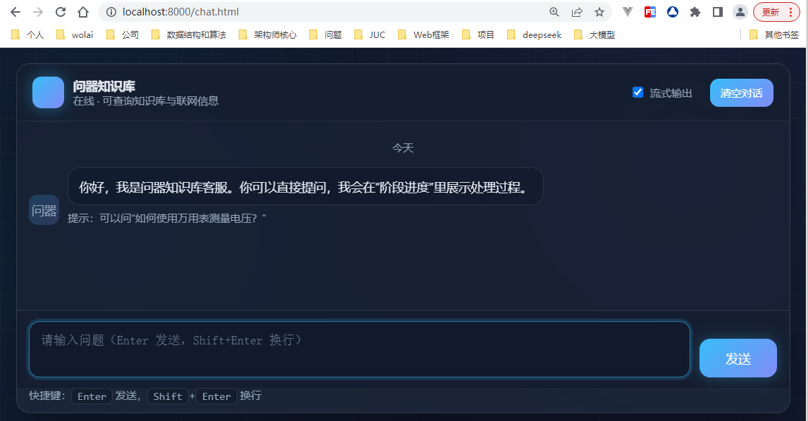

# Shopkeeper Brain

<p align="center">
  
</p>


基于 **FastAPI + LangGraph** 构建的私有文档 **RAG 知识库问答系统**：支持 PDF/Markdown 自动导入、混合向量检索、SSE 流式问答与多轮对话，面向产品手册、维修文档、企业内部规范等场景，基于私有文档提供精准问答能力，有效缓解大模型幻觉问题。

## ✨ 核心能力

### 📄 文档导入服务（8000 端口）

- **批量上传**：PDF/Markdown 文件批量上传，原始文件持久化至 MinIO 对象存储
- **智能解析**：MinerU 完整提取文字、表格、图片、公式并转为 Markdown
- **实体识别**：自动识别文档内商品实体，独立存入专用向量集合
- **语义切分**：语义化文本切分，避免长文本上下文割裂
- **混合向量化**：BGE-M3 生成稠密 + 稀疏混合向量，写入 Milvus 向量库
- **任务追踪**：全流程任务状态记录，支持实时查询导入进度与失败信息

<p align="center">
  
</p>


### 💬 智能问答服务（8001 端口）

- **多轮对话**：自动生成会话 ID，MongoDB 持久化多轮对话上下文
- **混合检索**：稠密向量语义匹配 + 稀疏向量 BM25 关键词检索
- **多路召回**：HyDE 假设文档检索、本地知识库检索、MCP 联网检索
- **结果精排**：RRF 倒数排名融合 → BGE-Reranker 重排序 → 分数断崖自动截断
- **双输出模式**：同步模式一次性返回完整答案 / SSE 流式模式逐字实时输出
- **会话管理**：查询历史记录、一键清空单会话全部对话

<p align="center">
  
</p>


## 🏗️ 系统架构

三层分层架构，职责清晰解耦：

| 层次           | 职责                                                         |
| -------------- | ------------------------------------------------------------ |
| **API 路由层** | 接收 HTTP 请求，完成参数校验、跨域处理、SSE 流式响应封装     |
| **业务流程层** | 基于 LangGraph 拆分独立 Node 节点，编排文档导入、问答检索完整流程 |
| **存储工具层** | 统一封装 Milvus / MongoDB / MinIO / LLM 客户端，提供通用调用方法 |

### 文档导入流

```text
文件上传 → MinIO 持久化 → PDF 转结构化 Markdown → 语义切片
→ 商品实体提取 → BGE-M3 向量化 → Milvus 向量入库
```

### 问答检索流

```text
用户提问 → HyDE 生成假设文档 → 多路并行召回 → RRF 结果融合
→ Rerank 重排序 → 分数断崖过滤 → LLM 生成回答 → SSE 流式 / 同步返回
```

## 🧰 技术栈

- **Web 框架**：FastAPI + Uvicorn（ASGI 异步服务）
- **流程编排**：LangGraph（有状态 DAG 工作流）
- **LLM 服务**：阿里云通义 DashScope（qwen-flash / qwen3-vl-flash）
- **向量模型**：BGE-M3（稠密 + 稀疏混合嵌入）
- **重排模型**：BGE-Reranker-Large（GPU 本地推理）
- **向量数据库**：Milvus（混合检索、HNSW 索引）
- **文档数据库**：MongoDB（对话历史持久化）
- **对象存储**：MinIO（原始文件、图片存储）
- **PDF 解析**：MinerU
- **前端**：原生 HTML + JS 轻量化页面，无需前端框架
- **数据校验**：Pydantic

## 🚀 快速开始

### 环境要求

- Python 3.12
- Docker & Docker Compose
- CUDA 适配本地 GPU 驱动（本地 AI 模型推理必需）

**硬件最低配置：**

| 资源 | 要求                                                     |
| ---- | -------------------------------------------------------- |
| 内存 | ≥ 16GB（推荐 32GB）                                      |
| 显存 | ≥ 8GB（FP16 半精度推理，BGE + Reranker 模型约占用 3.5G） |
| 磁盘 | ≥ 50GB（AI 模型缓存、文档持久化存储）                    |

### 1. 启动存储中间件

Milvus、MongoDB、MinIO 通过 Docker 部署。仓库当前未包含 `docker-compose.yml`，请参考 `notes/02_环境配置&服务部署指南.md` 准备中间件配置后启动。

### 2. 初始化 Python 环境（Windows）

```bash
# 创建虚拟环境
python -m venv .venv
# 激活虚拟环境
.venv\Scripts\activate
# 安装项目依赖
pip install -r requirements.txt -i https://pypi.tuna.tsinghua.edu.cn/simple
```

### 3. 配置环境变量

在 `knowledge/` 目录下创建 `.env`（参考 `notes/02_环境配置&服务部署指南.md` 中的完整示例），填写密钥、模型路径、服务地址。

### 4. 下载本地 AI 模型

```python
from modelscope import snapshot_download

# BGE-M3 混合嵌入模型
snapshot_download("BAAI/bge-m3")
# BGE-Reranker-Large 重排序模型
snapshot_download("BAAI/bge-reranker-large")
```

### 5. 启动两个业务服务

```bash
# 文档导入服务（8000 端口）
uvicorn knowledge.api.import_router:create_app --host 0.0.0.0 --port 8000 --reload

# 问答对话服务（8001 端口）
uvicorn knowledge.api.query_router:create_app --host 0.0.0.0 --port 8001 --reload
```

### 6. 访问页面与接口文档

| 入口             | 地址                           |
| ---------------- | ------------------------------ |
| 文档上传页面     | <http://127.0.0.1:8000/import> |
| 对话聊天页面     | <http://127.0.0.1:8001/chat>   |
| 导入服务接口文档 | <http://127.0.0.1:8000/docs>   |
| 问答服务接口文档 | <http://127.0.0.1:8001/docs>   |

## 📚 API 接口

### 导入服务（8000 端口）

| 请求方式 | 接口路径            | 功能说明                   |
| :------: | ------------------- | -------------------------- |
|   POST   | `/upload`           | 批量上传 PDF/Markdown 文件 |
|   GET    | `/status/{task_id}` | 查询文档导入任务进度、状态 |
|   GET    | `/health`           | 服务健康状态检测           |

### 问答服务（8001 端口）

| 请求方式 | 接口路径                | 功能说明                                  |
| :------: | ----------------------- | ----------------------------------------- |
|   POST   | `/query`                | 发起用户提问，支持流式 / 同步两种返回模式 |
|   GET    | `/stream/{task_id}`     | SSE 长连接，持续接收问答文字增量          |
|   GET    | `/history/{session_id}` | 查询指定会话全部聊天记录                  |
|  DELETE  | `/history/{session_id}` | 清空单个会话所有对话历史                  |
|   GET    | `/chat`                 | 返回前端聊天页面                          |
|   GET    | `/health`               | 服务健康状态检测                          |

## 📁 项目结构

```text
shopkeeper_brain/
├── knowledge/
│   ├── api/                      # API 路由入口
│   │   ├── import_router.py      # 文档导入服务（8000）
│   │   └── query_router.py       # 问答服务（8001）
│   ├── core/                     # 全局配置、依赖注入
│   │   ├── deps.py               # 业务服务单例注入
│   │   └── paths.py              # 全局路径常量
│   ├── processor/                # LangGraph 业务流程
│   │   ├── import_process/       # 文档导入流程、处理节点
│   │   └── query_process/        # 问答检索流程、处理节点
│   ├── schema/                   # Pydantic 请求/响应模型
│   ├── service/                  # 上层业务服务封装
│   │   ├── import_file_service.py
│   │   └── query_service.py
│   ├── utils/                    # 通用工具
│   │   ├── client/               # LLM、Embedding、Reranker、存储客户端
│   │   ├── embedding_util.py     # 向量工具
│   │   ├── milvus_util.py        # Milvus 操作封装
│   │   ├── mongo_history_util.py # 会话历史工具
│   │   ├── sse_util.py           # SSE 消息队列、流式生成器
│   │   └── task_util.py          # 任务状态读写工具
│   ├── prompt/                   # LLM 提示词模板
│   ├── front/                    # 静态前端页面
│   │   ├── import.html           # 文档上传页面
│   │   └── chat.html             # 对话聊天页面
│   ├── test/                     # 本地测试脚本
│   └── temp_data/                # 临时文件缓存目录
├── notes/                        # 开发笔记与截图
├── requirements.txt              # Python 依赖清单
└── README.md
```

## 🧠 核心技术原理

### 混合向量检索

基于 BGE-M3 同时生成稠密语义向量、稀疏关键词向量，两路并行检索后加权融合，兼顾语义相似度与关键词精准匹配。

### RRF 多路召回融合

对知识库检索、HyDE 检索、联网检索多路结果使用倒数排名融合（RRF）算法，平衡多来源文档权重，避免单一检索渠道结果偏差。

### 分数断崖自动截断

Reranker 重排完成后检测文档分数落差，自动截断低分无关文档，精简 LLM 上下文，提升生成速度与回答准确性。

### SSE 流式交互

采用 Server-Sent Events 单向长连接，后端通过内存队列缓存 LLM 逐字输出，实时推送到前端，轻量无额外通信框架依赖。

### 双任务执行方案

1. **流式对话**：使用 `BackgroundTasks` 后台执行完整推理逻辑，接口直接返回任务 ID，不阻塞前端请求响应
2. **同步问答**：通过 `run_in_executor` 将同步向量 / LLM 计算放入线程池，防止占用事件循环阻塞其他接口

## 🔧 常见问题排查

| 报错                                                         | 原因与处理                                                   |
| ------------------------------------------------------------ | ------------------------------------------------------------ |
| `MilvusException code=106`                                   | 向量集合处于恢复加载状态，等待 Milvus 就绪后手动执行 `collection.load()` 加载集合 |
| `create_sse_queue() missing required positional argument: 'task_id'` | 调用 SSE 队列工具时未传入 `task_id`，补充任务唯一标识        |
| `GET /upload` 返回 405                                       | 文件上传接口仅支持 POST，浏览器地址栏 GET 访问会被拦截，使用前端页面或接口工具测试 |
| `StreamingResponse` 搭配 `response_model` 启动报错           | SSE 流式响应无法使用 `response_model`，直接删除该配置项      |
| 单条推理任务阻塞全部接口                                     | 同步向量、LLM 计算逻辑必须放入 `run_in_executor` 线程池，禁止直接 await 同步函数 |

## 📐 开发规范

1. **分层开发**：接口层仅处理请求接收与参数校验，业务逻辑统一封装至 Service，底层存储、AI 能力抽离至 utils 工具
2. **LangGraph 规范**：单个 Node 仅负责单一逻辑，全流程上下文通过 State 统一传递
3. **异常处理**：Milvus、Mongo、LLM 调用全量捕获异常，同步更新任务失败状态，避免流程卡死
4. **ID 区分**：`session_id` 绑定多轮上下文，`task_id` 标识单次导入 / 提问任务
5. **配置管理**：密钥、模型路径、服务端口全部存放于 `.env`，禁止硬编码配置
6. **日志规范**：向量检索、任务状态变更、第三方服务异常统一打印日志
7. **模型加载**：向量、重排模型统一本地加载，减少远程 API 调用耗时

