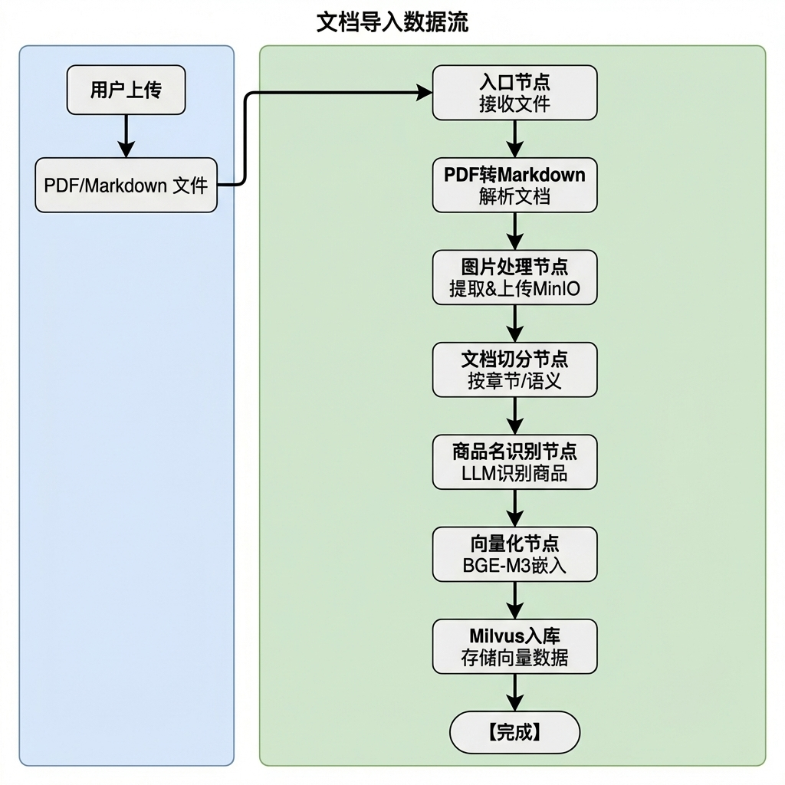
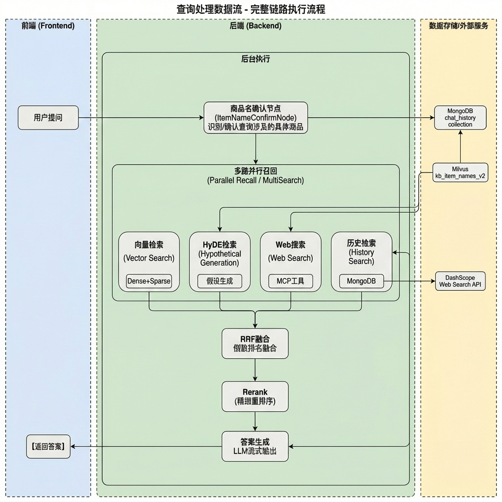
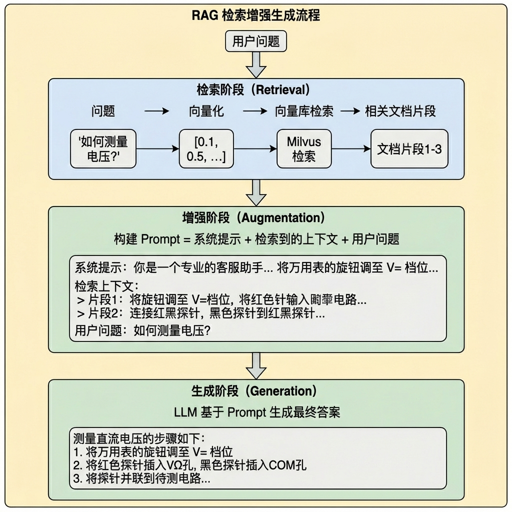
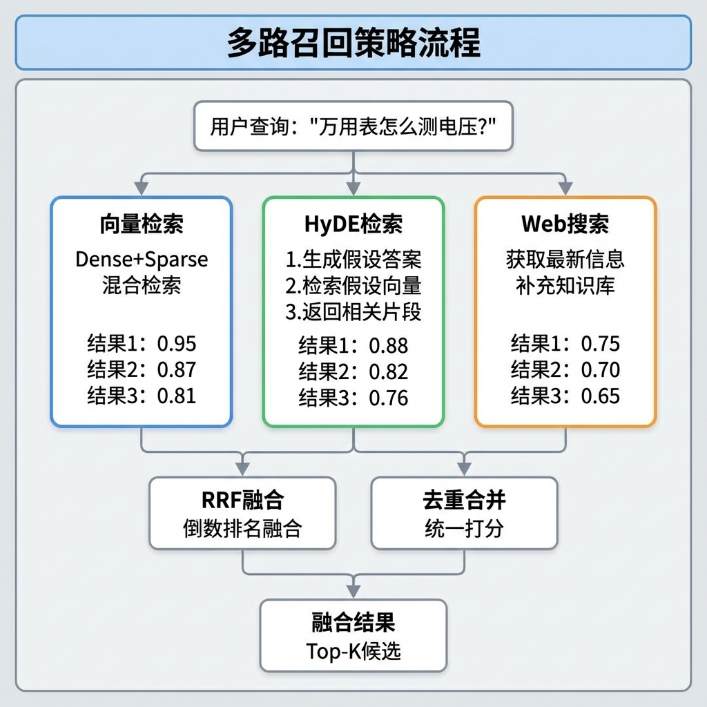
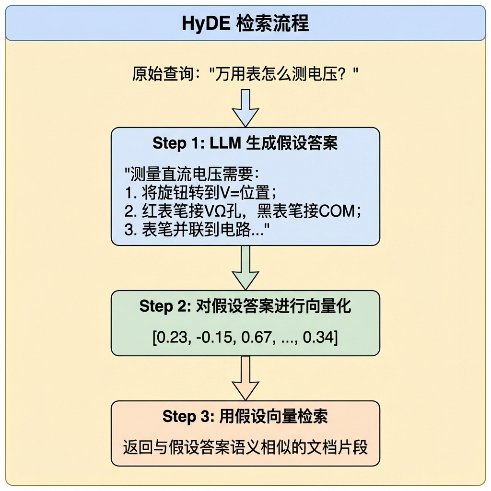
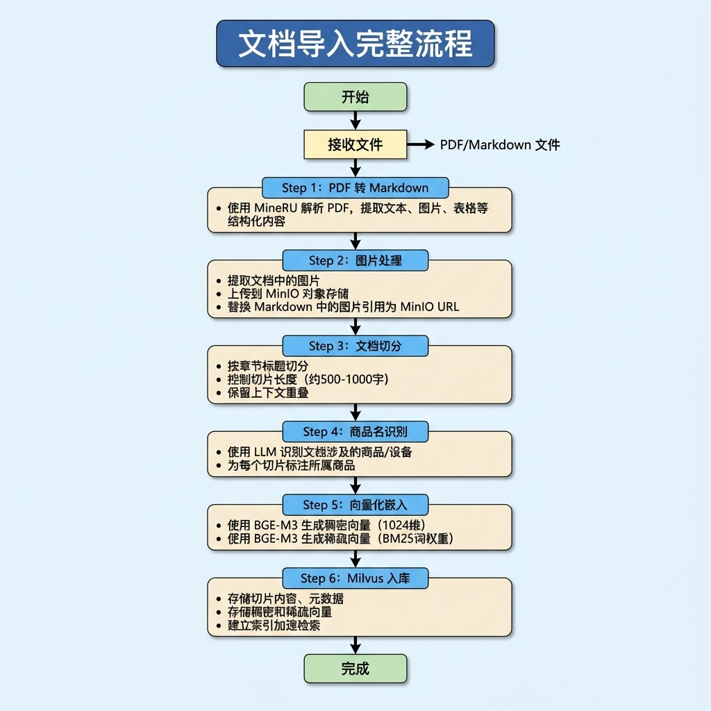
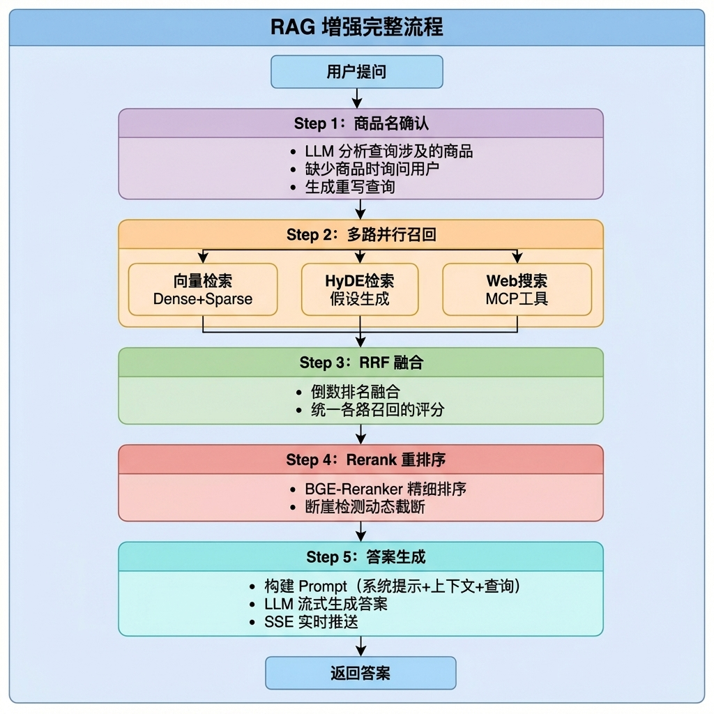
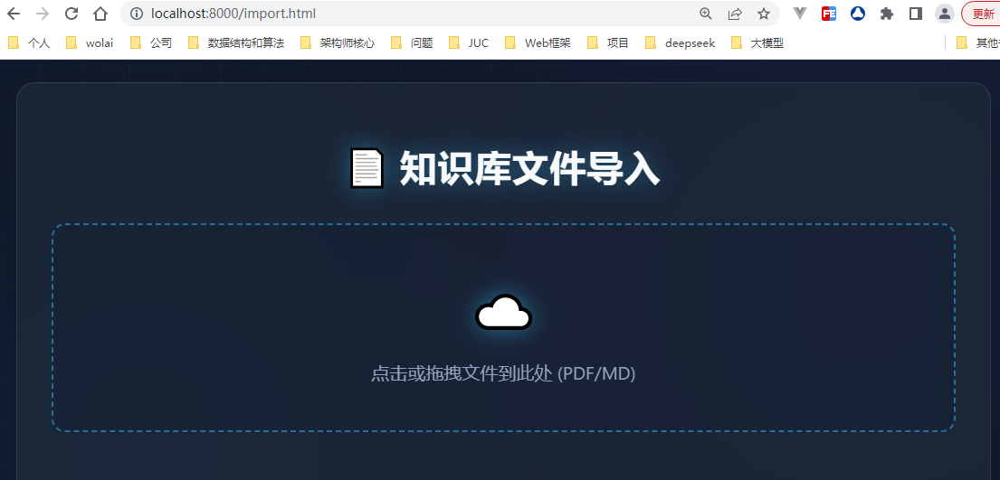
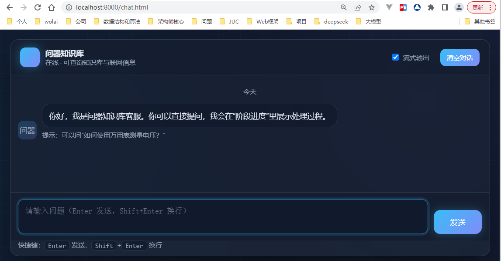

# 项目全景

> 本文档为 Knowledge 知识库系统的全景概览课件，涵盖项目定位、系统架构、核心技术原理、目录结构、快速开始指南、数据处理流程及前后端交互等内容。

---

## 1. 项目概述

### 1.1 项目定位与目标

**项目定位：**

掌柜智库是一个企业级智能知识库系统，基于 **RAG（检索增强生成Retrieval-augmented Generation）** 技术，旨在为垂直领域（如电子产品手册、维修指南、技术文档等）提供精准、智能的知识检索与问答服务。

**核心目标：**

- 将非结构化文档（PDF、Markdown）转化为可检索的结构化知识
- 通过多路召回策略提升检索准确率
- 提供流畅的流式问答交互体验

------

### 1.2 核心功能特性

| 功能模块         | 描述                                                    |
| ---------------- | ------------------------------------------------------- |
| **文档智能导入** | 支持 PDF/Markdown 文件上传，自动解析、切分、向量化      |
| **混合向量检索** | 稠密向量 + 稀疏向量（BM25（Best Matching 25））混合检索 |
| **多路召回融合** | 向量检索 + HyDE + Web 搜索                              |
| **智能重排序**   | Reranker 模型重排序，断崖检测动态截断                   |
| **流式问答**     | SSE 实时推送，逐字输出答案                              |
| **会话历史管理** | MongoDB 存储对话历史，支持上下文连续对话                |

------

### 1.3 适用场景

- **产品手册问答**：电子产品使用说明、维修手册等
- **技术文档检索**：API 文档、开发指南、FAQ 等
- **企业知识库**：内部制度、操作规范、培训资料等
- **售后客服支持**：产品故障排查、使用指导等

---

## 2. 系统架构

### 2.1 整体架构图


### 2.2 核心模块说明

| 模块             | 职责                       | 技术实现                 |
| ---------------- | -------------------------- | ------------------------ |
| **API 层**       | HTTP 接口暴露、请求路由    | FastAPI + Uvicorn        |
| **Processor 层** | 业务流程编排、节点调度     | LangGraph                |
| **Utils 层**     | 工具函数封装、外部服务调用 | Python 模块              |
| **数据层**       | 数据持久化、检索           | Milvus / MongoDB / MinIO |

### 2.3 数据流向图

#### 2.3.1 导入流程数据流



#### 2.3.2 查询流程数据流



### 2.4 技术栈选型

| 类别           | 技术选型                                | 版本/说明                   |
| -------------- | --------------------------------------- | --------------------------- |
| **后端框架**   | FastAPI + Uvicorn                       | 异步高性能 HTTP 服务        |
| **工作流引擎** | LangGraph                               | 有状态图编排框架            |
| **大语言模型** | 阿里云 DashScope (Qwen)                 | qwen-flash / qwen3-vl-flash |
| **向量嵌入**   | OpenAI API (text-embedding-v4) + BGE-M3 | 1536维 / 1024维+稀疏        |
| **重排序模型** | BGE-Reranker-Large                      | 本地部署                    |
| **向量数据库** | Milvus                                  | 混合检索（稠密+稀疏）       |
| **文档数据库** | MongoDB                                 | 对话历史存储                |
| **对象存储**   | MinIO                                   | 文件与图片存储              |
| **PDF解析**    | MineRU                                  | PDF 转 Markdown             |
| **前端**       | HTML5 + JS                              | 无框架，轻量实现            |

---

## 3. 第三方中间件与技术栈

### 3.1 核心中间件

| 中间件      | 官网地址                | 作用                           | 使用位置                     |
| ----------- | ----------------------- | ------------------------------ | ---------------------------- |
| **Milvus**  | https://milvus.io       | 向量数据库，存储和检索文档向量 | 向量检索节点、向量化入库节点 |
| **MongoDB** | https://www.mongodb.com | 文档数据库，存储对话历史       | 历史管理、答案生成节点       |
| **MinIO**   | https://min.io          | 对象存储，存储原始文件和图片   | 图片处理节点、PDF转换节点    |

### 3.2 AI/ML 框架与模型

| 框架/模型         | 官网地址                                       | 作用                                                 | 使用位置                 |
| ----------------- | ---------------------------------------------- | ---------------------------------------------------- | ------------------------ |
| **LangChain**     | https://python.langchain.com                   | LLM 应用框架，统一 LLM 调用接口                      | 各 LLM 调用节点          |
| **LangGraph**     | https://langchain-ai.github.io/langgraph       | 工作流编排框架，构建 DAG 流程                        | 主图编排（导入/查询）    |
| **BGE-M3**        | https://huggingface.co/BAAI/bge-m3             | 混合向量嵌入模型（稠密+稀疏）                        | 向量化节点、向量检索节点 |
| **BGE-Reranker**  | https://huggingface.co/BAAI/bge-reranker-large | 重排序模型（交叉编码器）                             | Rerank重排序节点         |
| **FlagEmbedding** | https://github.com/FlagOpen/FlagEmbedding      | 嵌入模型工具库                                       | 向量化、重排序           |
| **MinerU**        | https://github.com/opendatalab/MinerU          | PDF 转 Markdown 工具（支持公式、表格等复杂排版提取） | PDF转换节点              |

### 3.3 Web 框架与协议

| 框架/协议    | 官网地址                        | 作用               | 使用位置           |
| ------------ | ------------------------------- | ------------------ | ------------------ |
| **FastAPI**  | https://fastapi.tiangolo.com    | 高性能 Web 框架    | 导入路由、查询路由 |
| **Pydantic** | https://docs.pydantic.dev       | 数据验证和序列化   | 请求/响应模型      |
| **Uvicorn**  | https://www.uvicorn.org         | ASGI 服务器        | 应用启动入口       |
| **SSE**      | MDN Web Docs                    | 服务端推送事件协议 | 流式输出           |
| **MCP**      | https://modelcontextprotocol.io | 模型上下文协议     | 网络搜索节点       |

### 3.4 Python 核心库

| 库                | 官网地址                                                     | 作用                  | 使用位置          |
| ----------------- | ------------------------------------------------------------ | --------------------- | ----------------- |
| **pymilvus**      | https://milvus.io/docs                                       | Milvus Python SDK     | 向量操作          |
| **pymongo**       | https://pymongo.readthedocs.io                               | MongoDB Python Driver | 历史记录管理      |
| **minio**         | https://min.io/docs/minio/linux/developers/python/minio-py.html | MinIO Python SDK      | 文件上传          |
| **python-dotenv** | https://github.com/theskumar/python-dotenv                   | 环境变量管理          | 各模块配置加载    |
| **asyncio**       | Python 标准库                                                | 异步编程支持          | 网络搜索节点、SSE |

## 4. 核心技术原理

### 4.1 RAG 工作机制

**RAG (Retrieval-Augmented Generation)** 是一种结合检索与生成的技术范式：



### 4.2 向量检索

**混合向量 (Dense + Sparse)**

本项目采用 **BGE-M3** 模型实现混合向量检索：

| 向量类型              | 维度     | 检索方式        | 优势           |
| --------------------- | -------- | --------------- | -------------- |
| **稠密向量 (Dense)**  | 1024维   | HNSW 近似最近邻 | 语义相似性强   |
| **稀疏向量 (Sparse)** | 动态维度 | BM25 倒排索引   | 关键词精确匹配 |

**检索流程：**

```python
# 混合检索示例
reqs = build_hybrid_search_requests(
    dense_vector=query_dense,      # 稠密向量
    sparse_vector=query_sparse,    # 稀疏向量
    dense_search_params={"metric_type": "COSINE"},#余弦相似度
    sparse_search_params={"metric_type": "IP"},#内积Inner Product
    top_k=10
)

# 融合排序（权重可调）
results = execute_hybrid_search(
    search_requests=reqs,
    ranker_weights=(0.5, 0.5)  # 50% 稠密 + 50% 稀疏
)
```

### 4.3 多路召回策略

本项目实现了 **多路并行召回**：



**RRF (Reciprocal Rank Fusion) 公式：**
$$
RRF\_score(d) = \sum_{r \in R} \frac{1}{k + rank_r(d)}
$$

其中：

- R 是所有召回来源
- rank_r(d) 是文档 d 在来源 r 中的排名
- k 是平滑参数（通常取 60）

**断崖检测算法：**

```python
for i in range(0, upper_bound - 1):
    current_score = reranked_docs[i].get("score")
    next_score = reranked_docs[i + 1].get("score")

    if current_score is None or next_score is None:
        continue

    # 分数差值
    gap = current_score - next_score

    if gap >=self.config.rerank_gap_abs and gap > max_gap:  #self.config.rerank_gap_abs=0.15
        max_gap = gap
        cut_off = i + 1
        self.logger.info(f"位置{cut_off}发生断崖，gap={gap:.4f}")
# 兜底：不管断崖在哪，至少保留lower_bound个
cut_off = max(cut_off, lower_bound)
return reranked_docs[:cut_off] #左闭开区间：包含起始位置，不包含结束位置
```

### 4.4 HyDE 检索技术

**HyDE (Hypothetical Document Embeddings)** 是一种通过生成假设文档来改善检索效果的技术：



---

## 5. 项目目录结构说明

### 5.1 各模块职责

```
shopkeeper_brain:
    knowledge/
    ├── api/                              # API 路由层
    │   ├── query_router.py              # 查询服务路由 (port 8001)
    │   │   ├── POST /query              # 发起查询
    │   │   ├── GET /stream/{session_id} # SSE 流式获取
    │   │   ├── GET /history/{session_id}# 获取历史
    │   │   └── DELETE /history/...      # 清除历史
    │   └── import_router.py             # 导入服务路由 (port 8000)
    │       ├── POST /upload             # 上传文件
    │       └── GET /status/{task_id}    # 查询任务状态
    │
    ├── core/                             # 核心配置
    │   ├── deps.py                      # 依赖注入（单例管理）
    │   └── paths.py                     # 路径常量配置
    │
    ├── processor/                        # 业务处理流程（LangGraph）
    │   ├── import_process/              # 导入流程
    │   │   ├── main_graph.py           # 导入流程图定义
    │   │   ├── state.py                # 状态类型定义
    │   │   ├── base.py                 # 父节点模板代码
    │   │   ├── config.py               # 导入流程配置
    │   │   ├── exceptions.py           # 导入流程异常类
    │   │   └── nodes/                  # 处理节点
    │   │       ├── entry.py            # 入口节点
    │   │       ├── pdf_to_md.py        # PDF 转 MD
    │   │       ├── md_img.py           # 图片处理
    │   │       ├── document_split.py   # 文档切分
    │   │       ├── item_name_recognition.py  # 商品识别
    │   │       ├── bge_embedding.py    # 向量嵌入
    │   │       └── import_milvus.py    # Milvus 存储
    │   │
    │   └── query_process/               # 查询流程
    │       ├── main_graph.py           # 查询流程图定义
    │       ├── state.py                # 状态类型定义
    │       ├── base.py                 # 父节点模板代码
    │       ├── config.py               # 查询流程配置
    │       ├── exceptions.py           # 查询流程异常类
    │       └── nodes/                  # 处理节点
    │           ├── item_name_confirm.py    # 商品确认
    │           ├── vector_search.py        # 向量检索
    │           ├── hyde_search.py          # HyDE 检索
    │           ├── web_search_mcp.py       # Web 搜索
    │           ├── rrf.py                  # RRF 融合
    │           ├── rerank.py               # 重排序
    │           └── answer_output.py        # 答案生成
    │
    ├── schema/                           # 数据模型定义
    │   ├── query_schema.py              # 查询请求/响应模型
    │   ├── upload_schema.py             # 上传响应模型
    │   └── task_schema.py               # 任务状态模型
    │
    ├── services/                         # 业务服务层
    │   ├── file_import_service.py       # 文件导入服务
    │   └── query_service.py              # 检索服务
    │
    ├── utils/                            # 工具函数库
    │   │   ├── base.py                  # 客户端管理器基类，双重检查锁模板方法
    │   │   ├── ai_clients.py            # LLM客户端、BGE-M3模型、Reranker模型
    │   │   ├── storage_clients.py       # MinIO、Milvus、Mongo客户端
    │   ├── milvus_utils.py              # Milvus 向量库操作
    │   ├── embedding_utils.py           # 向量嵌入工具
    │   ├── llm_utils.py                 # LLM 客户端封装
    │   ├── mongo_history_utils.py       # MongoDB 历史记录
    │   ├── sse_utils.py                 # SSE 流式推送
    │   ├── task_utils.py                # 任务状态管理
    │
    ├── schema/                            # 数据模型
    │   ├── query_schema.py   # QueryRequest、QueryResponse、StreamSubmitResponse
    │   ├── task_schema.py    # TaskStatusResponse
    │   └── upload_schema.py  # UploadResponse、TaskStatusResponse
    │
    ├── prompt/                            # 提示词
    │   ├── import_prompt.py              # 商品名提取
    │   └── query_prompt.py               # 假设问题、答案
    │
    ├── front/                            # 前端页面
    │   ├── chat.html                    # 聊天界面
    │   └── import.html                  # 导入界面
    │
    ├── test/                             # 测试代码
    ├── docs/                             # 文档目录
    ├── temp_data/                        # 临时数据目录
    ├── .env                              # 环境配置文件
    └── requirements.txt                  # Python 依赖声明
```

### 5.2 配置文件说明

**.env 环境配置**

```ini
# ====== 模型缓存配置 ======
MINERU_MODEL_SOURCE=modelscope          # MineRU 模型来源
MODELSCOPE_OFFLINE=1                     # 离线模式
MODELSCOPE_CACHE=/path/to/cache          # ModelScope 缓存路径
HF_HOME=/path/to/huggingface             # HuggingFace 缓存路径

# ====== LLM API 配置 ======
OPENAI_API_KEY=sk-xxx                    # API 密钥
OPENAI_API_BASE=https://dashscope...     # API 基础地址
LLM_DEFAULT_MODEL=qwen-flash             # 默认 LLM 模型
LLM_DEFAULT_TEMPERATURE=0.1              # 温度参数
VL_MODEL=qwen3-vl-flash                  # 视觉语言模型
ITEM_MODEL=qwen-flash                    # 商品识别模型

# ====== BGE 模型配置 ======
BGE_M3_PATH=/path/to/bge-m3              # BGE-M3 本地路径
BGE_DEVICE=cuda:0                        # GPU 设备
BGE_FP16=True                            # 半精度推理
BGE_RERANKER_LARGE=/path/to/reranker     # Reranker 路径
BGE_RERANKER_DEVICE=cuda:0               # Reranker 设备

# ====== 向量配置 ======
EMBEDDING_DIM=1536                       # 嵌入维度
EMBEDDING_MODEL=text-embedding-v4        # 嵌入模型

# ====== Milvus 配置 ======
MILVUS_URL=http://localhost:19530        # Milvus 服务地址
CHUNKS_COLLECTION=kb_chunks              # 切片集合名
ENTITY_NAME_COLLECTION=kb_entity_names   # 实体名集合
ITEM_NAME_COLLECTION=kb_item_names       # 商品名集合
MILVUS_METRIC_TYPE=COSINE                # 距离度量
MILVUS_MIN_COSINE_SCORE=0.75             # 最小相似度

# ====== MongoDB 配置 ======
MONGO_URL=mongodb://localhost:27017      # MongoDB 连接
MONGO_DB_NAME=kb001                      # 数据库名

# ====== MinIO 配置 ======
MINIO_ENDPOINT=localhost:9000            # MinIO 端点
MINIO_ACCESS_KEY=minioadmin              # 访问密钥
MINIO_SECRET_KEY=minioadmin              # 私有密钥
MINIO_BUCKET_NAME=knowledge-base         # 存储桶名
```

---

## 6. 数据处理流程

### 6.1 文档导入流程



### 6.2 检索增强流程



## 7. 前后端数据交互

### 7.1 主要 API 接口概览

#### 7.1.1 导入服务 (Port 8000)

| 方法 | 路径                | 描述                   |
| ---- | ------------------- | ---------------------- |
| POST | `/upload`           | 上传文件（支持多文件） |
| GET  | `/status/{task_id}` | 查询任务处理状态       |
| GET  | `/health`           | 健康检查               |

#### 7.1.2 查询服务 (Port 8001)

| 方法   | 路径                    | 描述                    |
| ------ | ----------------------- | ----------------------- |
| POST   | `/query`                | 发起查询（流式/非流式） |
| GET    | `/stream/{session_id}`  | SSE 流式获取答案        |
| GET    | `/history/{session_id}` | 获取会话历史            |
| DELETE | `/history/{session_id}` | 清除会话历史            |
| GET    | `/health`               | 健康检查                |

### 7.2 请求/响应格式

#### 7.2.1 文件上传

**请求：**

```http
POST /upload
Content-Type: multipart/form-data

files: [file1.pdf, file2.md, ...]
```

**响应：**

```json
{
  "message": "Files uploaded successfully",
  "task_ids": ["task_001", "task_002"]
}
```

#### 7.2.2 任务状态查询

**请求：**

```http
GET /status/task_001
```

**响应：**

```json
{
  "task_id": "task_001",
  "status": "processing",    // pending | processing | completed | failed
  "progress": 45,            // 0-100
  "message": "正在向量入库...",
  "file_name": "万用表使用手册.pdf",
  "created_at": "2026-02-23T10:00:00"
}
```

#### 7.2.3 知识查询（非流式）

**请求：**

```http
POST /query
Content-Type: application/json

{
  "query": "万用表如何测量直流电压？",
  "session_id": "sess_001",   // 可选，留空自动生成
  "is_stream": false
}
```

**响应：**

```json
{
  "message": "处理完成",
  "session_id": "sess_001",
  "answer": "测量直流电压的步骤如下：\n1. 将旋钮调至 V= 档位...",
  "done_list": []
}
```

#### 7.2.4 知识查询（流式）

**请求：**

```http
POST /query
Content-Type: application/json

{
  "query": "万用表如何测量直流电压？",
  "session_id": "sess_001",
  "is_stream": true
}
```

**响应（建立 SSE 连接）：**

```http
GET /stream/sess_001
Accept: text/event-stream
```

**SSE 事件流：**

```
data: {"type": "delta", "data": {"delta": "测"}}
data: {"type": "delta", "data": {"delta": "量"}}
data: {"type": "delta", "data": {"delta": "直"}}
...
data: {"type": "final", "data": {"answer": "测量直流电压...", "status": "completed"}}
```

#### 7.2.5 历史查询

**请求：**

```http
GET /history/sess_001?limit=10
```

**响应：**

```json
{
  "session_id": "sess_001",
  "items": [
    {
      "_id": "65d1a2b3...",
      "session_id": "sess_001",
      "role": "user",
      "text": "万用表如何测量电压？",
      "rewritten_query": "万用表测量直流电压的步骤",
      "item_names": ["万用表"],
      "ts": 1708756800
    },
    {
      "_id": "65d1a2c4...",
      "session_id": "sess_001",
      "role": "assistant",
      "text": "测量直流电压的步骤如下...",
      "ts": 1708756805
    }
  ]
}
```

### 7.3 前端交互流程

#### 7.3.1 查询界面交互

```javascript
// 1. 发送查询
async function sendQuery(query) {
  const response = await fetch('/query', {
    method: 'POST',
    headers: { 'Content-Type': 'application/json' },
    body: JSON.stringify({
      query: query,
      session_id: currentSessionId,
      is_stream: true
    })
  });

  const data = await response.json();
  currentSessionId = data.session_id;

  // 2. 建立 SSE 连接
  const eventSource = new EventSource(`/stream/${currentSessionId}`);

  eventSource.onmessage = (event) => {
    const msg = JSON.parse(event.data);

    if (msg.type === 'delta') {
      // 3. 逐字渲染
      appendToAnswer(msg.data.delta);
    } else if (msg.type === 'final') {
      // 4. 完成处理
      eventSource.close();
      finalizeAnswer(msg.data.answer);
    }
  };
}
```

#### 7.3.2 导入界面交互

```javascript
// 1. 上传文件
async function uploadFiles(files) {
  const formData = new FormData();
  files.forEach(file => formData.append('files', file));

  const response = await fetch('/upload', {
    method: 'POST',
    body: formData
  });

  const data = await response.json();

  // 2. 轮询任务状态
  data.task_ids.forEach(taskId => {
    pollTaskStatus(taskId);
  });
}

// 3. 状态轮询
async function pollTaskStatus(taskId) {
  const interval = setInterval(async () => {
    const response = await fetch(`/status/${taskId}`);
    const status = await response.json();

    updateProgressBar(taskId, status.progress);

    if (status.status === 'completed' || status.status === 'failed') {
      clearInterval(interval);
      showResult(status);
    }
  }, 2000);  // 每2秒轮询
}
```

---

## 8. 快速开始

### 8.1 环境要求

| 项目       | 要求                                  |
| ---------- | ------------------------------------- |
| **Python** | >= 3.10                               |
| **CUDA**   | >= 自己机器适配的版本（GPU 推理需要） |
| **内存**   | >= 16GB（建议 32GB）                  |
| **显存**   | >= 8GB（BGE-M3 + Reranker）           |
| **存储**   | >= 50GB（模型缓存）                   |

**依赖服务：**

- Milvus（向量数据库）
- MongoDB（文档数据库）
- MinIO（对象存储）

### 8.2 安装步骤

```bash
# 删除旧虚拟环境
Remove-Item -Recurse -Force .venv

# 1. 创建虚拟环境
python -m venv .venv
.venv\Scripts\activate  # Windows
# source .venv/bin/activate  # Linux/Mac

# 2. 安装依赖（使用国内镜像）
#python.exe -m pip install --upgrade pip
pip install -r requirements.txt -i https://pypi.tuna.tsinghua.edu.cn/simple

# 3. 配置环境变量
copy .env.example .env
# 编辑 .env 文件，填入正确的配置
```

### 8.3 基础配置

1. **启动依赖服务**

```bash
# Docker Compose 方式（推荐）
docker-compose up -d milvus mongodb minio
```

2. **下载模型**

```bash
# BGE-M3 模型（通过 ModelScope）
python -c "from modelscope import snapshot_download; snapshot_download('BAAI/bge-m3')"

# BGE-Reranker-Large
python -c "from modelscope import snapshot_download; snapshot_download('BAAI/bge-reranker-large')"
```

3. **初始化数据库**

```bash
# 运行初始化脚本（如有）
python scripts/init_db.py
```

### 8.4 运行示例

```bash
# 启动导入服务 (端口 8000)
uvicorn api.import_router:app --host 0.0.0.0 --port 8000 --reload

# 启动查询服务 (端口 8001)
uvicorn api.query_router:app --host 0.0.0.0 --port 8001 --reload
```

**访问前端页面：**

- 导入界面：http://localhost:8000/import.html

  

- 聊天界面：http://localhost:8001/chat.html

  

---

## 9. 附录

###  关键文件速查表

| 功能        | 文件路径                                              |
| ----------- | ----------------------------------------------------- |
| 导入 API    | `api/import_router.py`                                |
| 查询 API    | `api/query_router.py`                                 |
| 导入流程图  | `processor/import_process/main_graph.py`              |
| 查询流程图  | `processor/query_process/main_graph.py`               |
| 向量检索    | `processor/query_process/nodes/vector_search_node.py` |
| HyDE 检索   | `processor/query_process/nodes/hyde_search_node.py`   |
| Web 搜索    | `processor/query_process/nodes/mcp_search_node.py`    |
| RRF 融合    | `processor/query_process/nodes/rrf_node.py`           |
| 重排序      | `processor/query_process/nodes/rerank_node.py`        |
| 答案生成    | `processor/query_process/nodes/answer_output_node.py` |
| 提示词模板  | `processor/query_process/prompt.py`                   |
| Milvus 工具 | `utils/milvus_utils.py`                               |
| SSE 推送    | `utils/sse_utils.py`                                  |
| LLM 客户端  | `utils/client/ai_clients.py`                          |
| 存储客户端  | `utils/client/storage_clients.py`                     |

---