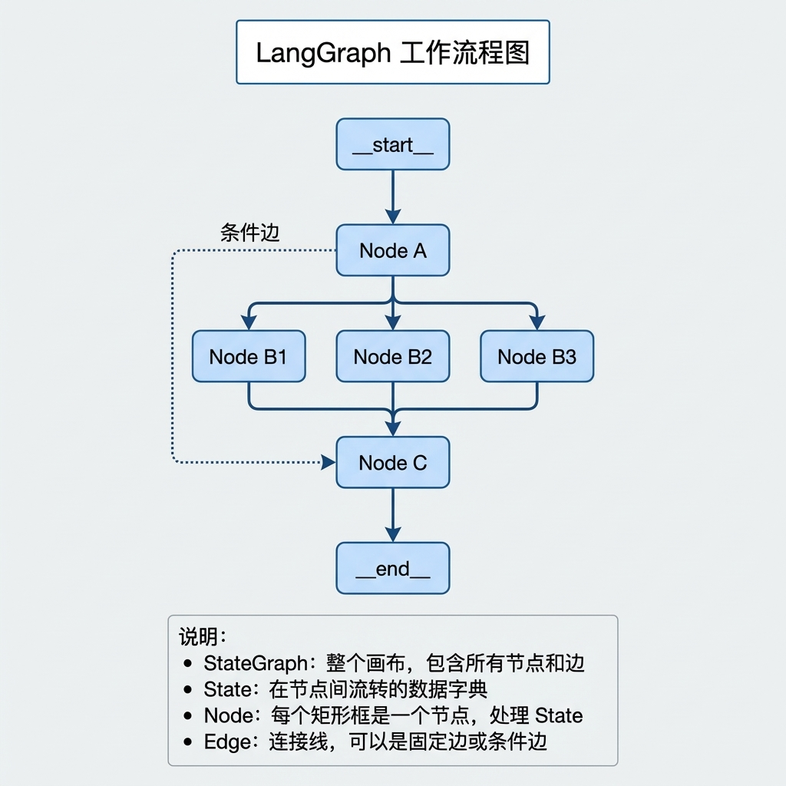
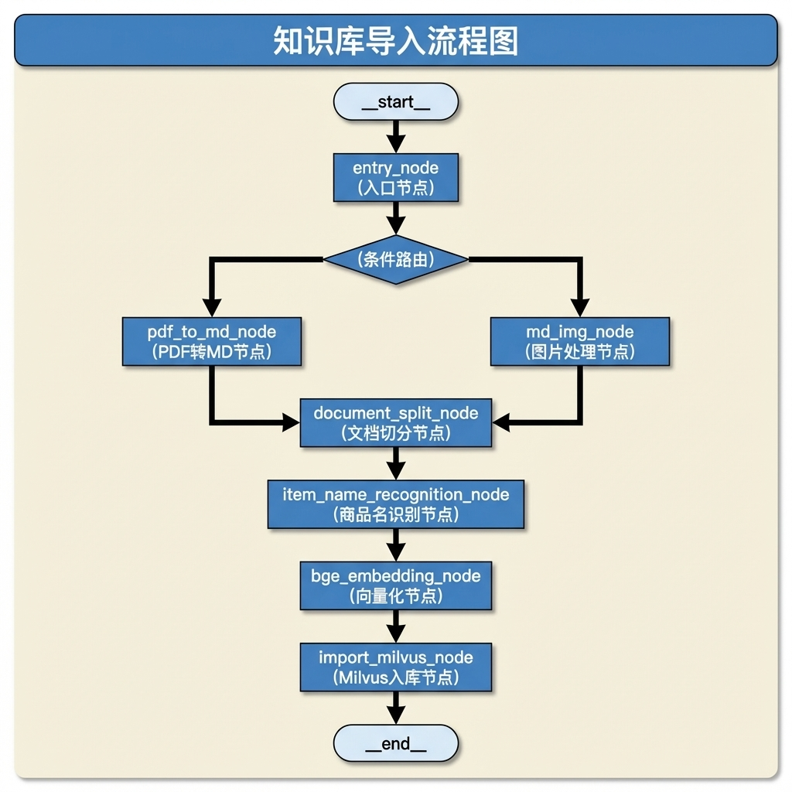
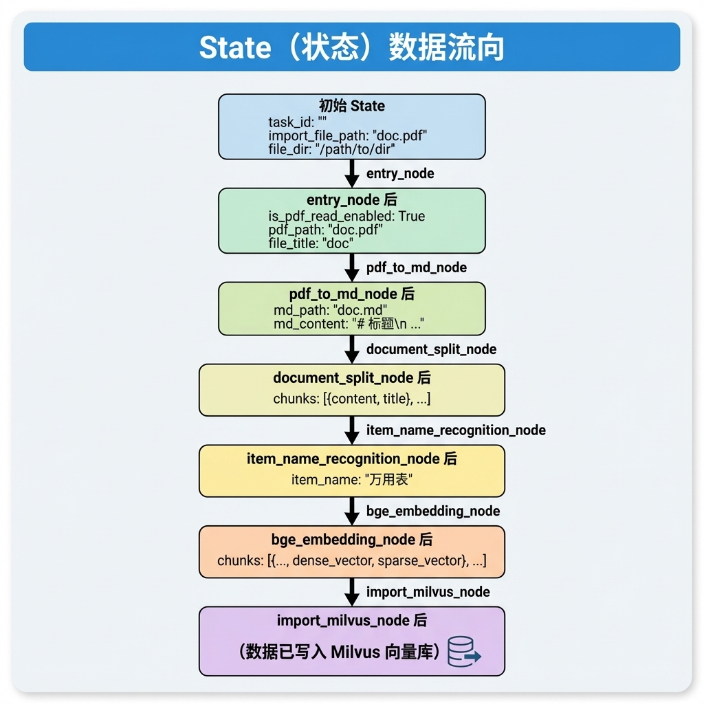
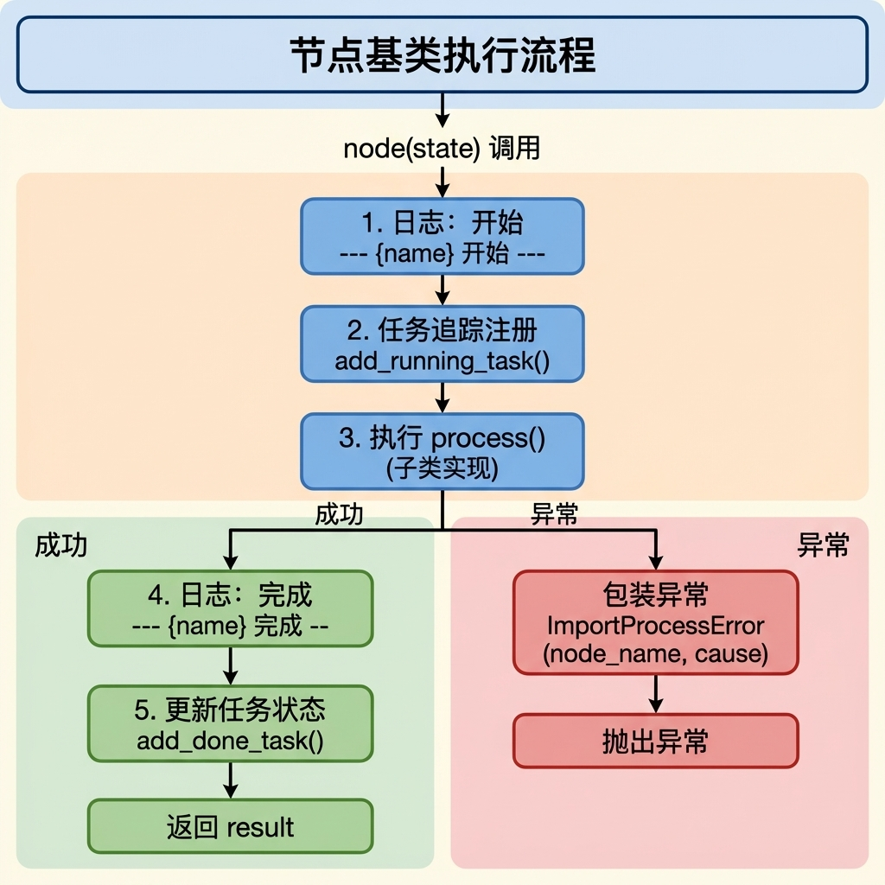

# 骨架代码与周边模块

> 本文档详细介绍知识库导入流程的骨架代码设计与实现，包括配置管理、异常处理、状态定义、节点基类和流程图构建。

---

## 1. 任务目标

### 1.1 本章目标

通过本章学习，你将掌握：

1. **理解 LangGraph 工作流框架**：掌握图状态、节点、边的核心概念
2. **设计可扩展的流程骨架**：学会使用基类、配置、异常等模式构建健壮的处理流程
3. **实现导入流程主图**：构建完整的文档导入工作流
4. **编写可测试的代码**：通过 `if __name__ == "__main__"` 验证流程

### 1.2 涉及模块

```
knowledge/processor/import_process/
├── config.py        # 配置管理模块
├── exceptions.py    # 自定义异常类
├── state.py         # 图状态类型定义
├── base.py          # 节点基类
├── main_graph.py    # 主图定义与构建
└── __init__.py      # 模块导出
```

### 1.3 文件依赖关系

```
┌─────────────────────────────────────────────────────────────┐
│                              模块依赖关系                                     
└─────────────────────────────────────────────────────────────┘

        config.py
            │
            │    exceptions.py
            │         │
            │         │    state.py
            │         │         │
            └─────────┼─────────┘
                      │
                      ▼
                  base.py
                      │
                      ▼
               main_graph.py
```

---

## 2. 核心概念扫盲

### 2.1 LangGraph 基础概念

**LangGraph** 是 LangChain 生态中的工作流编排框架，核心概念包括：

| 概念                 | 说明                                | 类比           |
| -------------------- | ----------------------------------- | -------------- |
| **StateGraph**       | 状态图，工作流的容器                | 流程图画布     |
| **State**            | 图状态，在节点间传递的数据          | 流水线上的工件 |
| **Node**             | 节点，执行具体任务的函数/可调用对象 | 流水线工位     |
| **Edge**             | 边，连接节点的路径                  | 流水线传送带   |
| **Conditional Edge** | 条件边，根据状态决定下一个节点      | 分拣机         |

**工作流程示意：**



### 2.2 TypedDict 类型提示

Python 的 `TypedDict` 用于定义字典的类型结构：

```python
from typing import TypedDict, List

class MyState(TypedDict, total=False):
    """
    total=False 表示所有字段都是可选的
    """
    name: str           # 字符串类型
    count: int          # 整数类型
    items: List[str]    # 字符串列表
```

**为什么使用 TypedDict？**

- 提供 IDE 智能提示
- 静态类型检查
- 文档化数据结构
- 与 LangGraph 无缝集成

### 2.3 dataclass 配置管理

`dataclass` 是 Python 3.7+ 的装饰器，用于简化类定义：

```python
from dataclasses import dataclass, field

@dataclass
class Config:
    # 简单默认值
    name: str = "default"

    # 动态默认值（使用 field + default_factory）
    items: list = field(default_factory=list)

    # 从环境变量读取
    api_key: str = field(
        default_factory=lambda: os.getenv("API_KEY", "")
    )
```

### 2.4 抽象基类 (ABC)

抽象基类定义接口规范，强制子类实现特定方法：

```python
from abc import ABC, abstractmethod

class BaseNode(ABC):
    """抽象基类，定义节点接口"""

    @abstractmethod
    def process(self, state):
        """子类必须实现此方法"""
        pass
```

---

## 3. 知识库导入业务处理流程（总）

### 3.1 整体流程图



### 3.2 骨架模块职责

| 模块              | 职责                                 | 重要性         |
| ----------------- | ------------------------------------ | -------------- |
| **config.py**     | 集中管理所有配置项，支持环境变量覆盖 | 配置与代码分离 |
| **exceptions.py** | 定义异常层级，统一错误处理           | 错误可追踪     |
| **state.py**      | 定义图状态结构，节点间数据传递       | 数据契约       |
| **base.py**       | 定义节点基类，统一执行逻辑           | 代码复用       |
| **main_graph.py** | 构建工作流图，编排节点执行顺序       | 流程编排       |

### 3.3 数据流向



---

## 4. 知识库导入业务处理流程（分）

### 4.1 配置管理模块 (config.py)

#### 4.1.1 目标

- 集中管理所有配置项
- 支持环境变量覆盖
- 提供配置验证
- 实现单例模式

#### 4.1.2 需求分析

**配置来源：**

1. 代码默认值（开发环境）
2. 环境变量（生产环境）
3. `.env` 文件（本地开发）

**配置分类：**

- 文档处理配置（切片长度、图片扩展名等）
- LLM API 配置（API Key、模型名等）
- 数据库配置（Milvus、MinIO）
- 向量配置（维度、批次大小）

#### 4.1.3 实现流程

```
┌────────────────────────────────────────────────────────────┐
│                           配置加载流程                                        
└────────────────────────────────────────────────────────────┘

  程序启动
      │
      ▼
  ┌─────────────────┐
  │ load_dotenv()   │ ──→ 加载 .env 文件到环境变量
  └────────┬────────┘
           │
           ▼
  ┌──────────────────────────────────────────────────────────┐
  │ @dataclass ImportConfig                                                 
  │                                                                         
  │  字段定义:                                                              
  │  ├── max_content_length = 2000        # 默认值                         
  │  ├── openai_api_key = field(           # 从环境变量读取                 
  │  │     default_factory=lambda: os.getenv("OPENAI_API_KEY", ""))        
  │  └── ...                                                               
  └──────────────────────────────────────────────────────────┘
           │
           ▼
  ┌─────────────────┐
  │ get_config()    │ ──→ 返回全局单例
  └─────────────────┘
```

#### 4.1.4 代码实现

```python
# knowledge/processor/import_process/config.py

"""
导入流程配置管理模块

集中管理所有配置项，支持环境变量覆盖
"""

from dataclasses import dataclass, field
from typing import Set, Optional
import os
from dotenv import load_dotenv

# 加载 .env 文件
load_dotenv()


@dataclass
class ImportConfig:
    """导入流程配置"""

    # ==================== 文档处理配置 ====================
    max_content_length: int = 2000      # 切片最大长度
    img_content_length: int = 200       # 图片上下文最大长度
    min_content_length: int = 500       # 合并短内容的最小长度
    overlap_sentences: int = 1          # 句子级切分时重叠句数
    item_name_chunk_k: int = 3          # 商品名识别时使用的切片数量
    item_name_chunk_size: int = 2500    # 商品名识别时使用的切片内容长度

    # 支持的图片扩展名
    image_extensions: Set[str] = field(
        default_factory=lambda: {".jpg", ".jpeg", ".png", ".gif", ".bmp", ".webp"}
    )

    # ==================== LLM 配置 ====================
    openai_api_base: str = field(
        default_factory=lambda: os.getenv("OPENAI_API_BASE", "")
    )
    openai_api_key: str = field(
        default_factory=lambda: os.getenv("OPENAI_API_KEY", "")
    )
    vl_model: str = field(
        default_factory=lambda: os.getenv("VL_MODEL", "")
    )
    item_model: str = field(
        default_factory=lambda: os.getenv("ITEM_MODEL", "")
    )
    default_model: str = field(
        default_factory=lambda: os.getenv("MODEL", "")
    )

    # ==================== Milvus 配置 ====================
    milvus_url: str = field(
        default_factory=lambda: os.getenv("MILVUS_URL", "")
    )
    chunks_collection: str = field(
        default_factory=lambda: os.getenv("CHUNKS_COLLECTION", "")
    )
    item_name_collection: str = field(
        default_factory=lambda: os.getenv("ITEM_NAME_COLLECTION", "")
    )

    # ==================== MinIO 配置 ====================
    minio_endpoint: str = field(
        default_factory=lambda: os.getenv("MINIO_ENDPOINT", "")
    )
    minio_access_key: str = field(
        default_factory=lambda: os.getenv("MINIO_ACCESS_KEY", "")
    )
    minio_secret_key: str = field(
        default_factory=lambda: os.getenv("MINIO_SECRET_KEY", "")
    )
    minio_bucket: str = field(
        default_factory=lambda: os.getenv("MINIO_BUCKET_NAME", "")
    )
    minio_secure: bool = False

    # ==================== 向量配置 ====================
    embedding_dim: int = field(
        default_factory=lambda: int(os.getenv("EMBEDDING_DIM", "1024"))
    )
    embedding_batch_size: int = 8

    # ==================== 速率限制 ====================
    requests_per_minute: int = 15       # 图片总结 API 速率限制

    @classmethod
    def from_env(cls) -> "ImportConfig":
        """从环境变量加载配置"""
        return cls()

    def get_minio_base_url(self) -> str:
        """获取 MinIO 基础 URL"""
        protocol = "https://" if self.minio_secure else "http://"
        return protocol + f"{self.minio_endpoint}"


# ==================== 全局单例 ====================
_config: Optional[ImportConfig] = None


def get_config() -> ImportConfig:
    """获取配置单例"""
    global _config
    if _config is None:
        _config = ImportConfig.from_env()
    return _config
```

**关键设计点：**

1. **使用 `field(default_factory=lambda: ...)` 延迟求值**
   - `dataclass` 的字段默认值在类定义时求值
   - 使用 `default_factory` 可以在实例化时才读取环境变量

2. **单例模式 `get_config()`**
   - 避免重复创建配置对象
   - 全局共享同一份配置

---

### 4.2 异常处理模块 (exceptions.py)

#### 4.2.1 目标

- 定义统一的异常层级结构
- 提供清晰的错误信息
- 支持错误溯源

#### 4.2.2 需求分析

**异常分类：**

```
┌──────────────────────────────────────────────────────────────┐
│                           异常层级结构                                       │
└──────────────────────────────────────────────────────────────┘

ImportProcessError (基础异常)
│
├── ConfigurationError      # 配置错误
│
├── FileProcessingError     # 文件处理错误
│   ├── PdfConversionError  # PDF 转换错误
│   └── ImageProcessingError# 图片处理错误
│
├── DocumentSplitError      # 文档切分错误
│
├── EmbeddingError          # 向量化错误
│
├── LLMError                # LLM 调用错误
│
├── StorageError            # 存储错误
│   ├── MilvusError         # Milvus 存储错误
│   └── MinioError          # MinIO 存储错误
│
└── ValidationError         # 数据验证错误
```

**设计原则：**

- 继承层级清晰，便于分类捕获
- 每个异常携带上下文信息（节点名、原因）
- 支持异常链追溯

#### 4.2.3 代码实现

```python
# knowledge/processor/import_process/exceptions.py

"""
导入流程自定义异常类

统一错误处理，提供更清晰的错误信息
"""


class ImportProcessError(Exception):
    """导入流程基础异常"""

    def __init__(self, message: str, node_name: str = "", cause: Exception = None):
        self.node_name = node_name
        self.cause = cause
        super().__init__(message)

    def __str__(self):
        parts = []
        if self.node_name:
            parts.append(f"[{self.node_name}]")
        parts.append(super().__str__())
        if self.cause:
            parts.append(f"(原因: {self.cause})")
        return " ".join(parts)


class StateFieldError(ImportProcessError):
    """状态字段错误。

    从 state 中获取必需字段缺失、为空或类型不符时抛出。

    Attributes:
        field_name: 缺失或无效的字段名称。
        expected_type: 期望的字段类型（可选）。
    """

    def __init__(
            self,
            node_name: str = "",
            field_name: str = "",
            expected_type: type = None,
            message: str = "",
            cause: Exception = None,
    ):
        self.field_name = field_name
        self.expected_type = expected_type
        if not message:
            message = f"状态字段 '{field_name}' 缺失或无效"
            if expected_type:
                message += f"，期望类型: {expected_type.__name__}"
        super().__init__(message, node_name=node_name, cause=cause)


class ConfigurationError(ImportProcessError):
    """配置错误：环境变量缺失或配置值无效"""
    pass


class FileProcessingError(ImportProcessError):
    """文件处理错误：文件不存在、格式错误、读写失败"""
    pass


class PdfConversionError(FileProcessingError):
    """PDF 转换错误：MinerU 转换失败"""
    pass


class ImageProcessingError(FileProcessingError):
    """图片处理错误：图片总结、上传失败"""
    pass


class DocumentSplitError(ImportProcessError):
    """文档切分错误：切分逻辑异常"""
    pass


class EmbeddingError(ImportProcessError):
    """向量化错误：模型调用失败、向量生成异常"""
    pass


class LLMError(ImportProcessError):
    """LLM 调用错误：API 调用失败、响应解析失败"""
    pass


class StorageError(ImportProcessError):
    """存储错误：数据库操作失败"""
    pass


class MilvusError(StorageError):
    """Milvus 存储错误"""
    pass


class MinioError(StorageError):
    """MinIO 存储错误"""
    pass


class ValidationError(ImportProcessError):
    """数据验证错误：输入数据不符合预期"""
    pass

```

**使用示例：**

```python
try:
    # 可能失败的操作
    result = milvus_client.insert(data)
except Exception as e:
    raise MilvusError(
        message="向量写入失败",
        node_name="import_milvus",
        cause=e
    )
```

**输出效果：**

```
MilvusError: [import_milvus] 向量写入失败 (原因: ConnectionError: ...)
```

---

### 4.3 状态定义模块 (state.py)

#### 4.3.1 目标

- 定义图状态的完整结构
- 提供默认状态工厂函数
- 文档化每个字段的用途

#### 4.3.2 需求分析

**状态字段分类：**

| 类别         | 字段                                                  | 说明         |
| ------------ | ----------------------------------------------------- | ------------ |
| **任务标识** | `task_id`                                             | 任务追踪 ID  |
| **控制标志** | `is_pdf_read_enabled`, `is_md_read_enabled`           | 文件类型标志 |
| **路径信息** | `import_file_path`, `file_dir`, `pdf_path`, `md_path` | 文件路径     |
| **文件信息** | `file_title`, `item_name`                             | 元数据       |
| **处理数据** | `md_content`, `chunks`                                | 中间结果     |

#### 4.3.3 代码实现

```python
# knowledge/processor/import_process/state.py

"""
导入流程状态类型定义

定义完整的状态结构和辅助函数
"""

from typing import TypedDict, List
import copy


class ImportGraphState(TypedDict, total=False):
    """
    导入流程图状态

    包含整个导入流程中传递的所有数据。
    使用 total=False 表示所有字段都是可选的。
    """

    # ==================== 任务标识 ====================
    task_id: str                    # 任务 ID，用于任务追踪

    # ==================== 控制标志 ====================
    is_md_read_enabled: bool        # 是否启用 MD 读取
    is_pdf_read_enabled: bool       # 是否启用 PDF 读取

    # ==================== 路径信息 ====================
    import_file_path: str           # 导入文件路径（原始输入）
    file_dir: str                   # 导入(出)文件目录
    pdf_path: str                   # PDF 文件路径
    md_path: str                    # 转换后 Markdown 文件路径

    # ==================== 文件信息 ====================
    file_title: str                 # 文件标题（不含扩展名）
    item_name: str                  # 识别出的商品/产品名称

    # ==================== 处理中间数据 ====================
    md_content: str                 # Markdown 文档内容
    chunks: List                    # 文档切片列表


# ==================== 默认状态模板 ====================
GRAPH_DEFAULT_STATE: ImportGraphState = {
    "task_id": "",
    "is_pdf_read_enabled": False,
    "is_md_read_enabled": False,
    "file_dir": "",
    "import_file_path": "",
    "pdf_path": "",
    "md_path": "",
    "file_title": "",
    "md_content": "",
    "chunks": [],
    "item_name": "",
}


def create_default_state(**overrides) -> ImportGraphState:
    """
    创建默认状态，支持覆盖

    Args:
        **overrides: 要覆盖的字段

    Returns:
        新的状态实例

    Examples:
        >>> state = create_default_state(
        ...     task_id="task_001",
        ...     import_file_path="doc.pdf"
        ... )
    """
    state = copy.deepcopy(GRAPH_DEFAULT_STATE)
    state.update(overrides)
    return state


def get_default_state() -> ImportGraphState:
    """
    获取默认状态副本

    Returns:
        状态副本（避免全局污染）
    """
    return copy.deepcopy(GRAPH_DEFAULT_STATE)
```

**关键设计点：**

1. **`total=False`**
   - 所有字段都是可选的
   - 节点只需更新自己关心的字段

2. **`copy.deepcopy()`**
   - 避免修改全局模板
   - 每次创建独立的状态实例

3. **工厂函数模式**
   - `create_default_state()` 支持参数覆盖
   - 方便测试和初始化

---

### 4.4 节点基类模块 (base.py)

#### 4.4.1 目标

- 定义统一的节点接口
- 提供通用功能（日志、任务追踪、异常处理）
- 减少重复代码

#### 4.4.2 需求分析

**节点通用功能：**

1. **日志记录**：节点开始/结束、步骤日志
2. **任务追踪**：注册当前执行的节点
3. **异常处理**：统一包装异常，添加节点信息
4. **配置注入**：提供配置对象访问

#### 4.4.3 实现流程



#### 4.4.4 代码实现

```python
# knowledge/processor/import_process/base.py

"""
导入流程节点基类

定义统一的节点接口规范，提供通用功能
"""

from abc import ABC, abstractmethod
from typing import TypeVar, Optional
import logging

from knowledge.processor.import_process.config import ImportConfig, get_config
from knowledge.processor.import_process.exceptions import ImportProcessError
from knowledge.utils.task_util import add_running_task, add_done_task

T = TypeVar("T")  # 泛型状态类型


class BaseNode(ABC):
    """
    导入流程节点基类

    所有节点类都应继承此基类，实现 process 方法。
    基类提供统一的日志、任务追踪和错误处理。

    使用示例:
        class MyNode(BaseNode):
            name = "my_node"

            def process(self, state):
                # 实现具体逻辑
                return state

        # 作为 LangGraph 节点使用
        node = MyNode()
        workflow.add_node("my_node", node)
    """

    name: str = "base_node"  # 节点名称，子类应覆盖

    def __init__(self, config: Optional[ImportConfig] = None):
        """
        初始化节点

        Args:
            config: 配置对象，默认使用全局配置
        """
        self.config = config or get_config()
        self.logger = logging.getLogger(f"import.{self.name}")

    def __call__(self, state: T) -> T:
        """
        节点执行入口

        LangGraph 调用节点时会调用此方法。
        提供统一的日志输出、任务追踪和异常处理。

        Args:
            state: 图状态字典

        Returns:
            更新后的状态字典

        Raises:
            ImportProcessError: 节点执行失败时抛出
        """
        task_id = state.get("task_id", "")
        try:
            # 1. 开始准备执行节点
            self.logger.info(f"--- {self.name} 开始 ---")
            if task_id:
                # 1.1 更新节点状态
                add_running_task(task_id, self.name)

            # 2. 执行节点
            result = self.process(state)

            # 3. 执行节点成功
            self.logger.info(f"--- {self.name} 完成 ---")
            if task_id:
                # 3.1 更新状态
                add_done_task(task_id, self.name)
            return result
        except Exception as e:
            self.logger.error(f"{self.name} 执行失败: {e}")
            raise ImportProcessError(
                message=str(e),
                node_name=self.name,
                cause=e
            )

    @abstractmethod
    def process(self, state: T) -> T:
        """
        节点核心处理逻辑

        子类必须实现此方法。

        Args:
            state: 图状态字典

        Returns:
            更新后的状态字典
        """
        pass

    def log_step(self, step_name: str, message: str = ""):
        """
        记录步骤日志

        Args:
            step_name: 步骤名称
            message: 附加信息
        """
        log_msg = f"[{step_name}]"
        if message:
            log_msg += f" {message}"
        self.logger.info(log_msg)


# 配置日志格式
def setup_logging(level: int = logging.INFO):
    """
    配置导入流程日志

    Args:
        level: 日志级别
    """
    logging.basicConfig(
        level=level,
        format='%(asctime)s - %(name)s - %(levelname)s - %(message)s',
        datefmt='%Y-%m-%d %H:%M:%S'
    )
```

**关键设计点：**

1. **`__call__` 方法**
   - 使节点实例可调用
   - LangGraph 调用 `node(state)` 时触发

2. **模板方法模式**
   - `__call__` 定义执行骨架
   - `process` 由子类实现具体逻辑

3. **异常包装**
   - 非自定义异常自动包装为 `ImportProcessError`
   - 保留原始异常信息

4. **日志命名空间**
   - `logging.getLogger(f"import.{self.name}")`
   - 便于按节点过滤日志

---

### 4.5 主图构建模块 (main_graph.py)

#### 4.5.1 目标

- 构建完整的导入工作流图
- 定义节点执行顺序和条件路由
- 提供便捷的测试入口

#### 4.5.2 需求分析

**流程结构：**

1. **入口节点**：检测文件类型
2. **条件路由**：PDF → `pdf_to_md`；MD → `md_img`
3. **顺序执行**：`md_img` → `document_split` → ... → `import_milvus`
4. **结束节点**：`END`

#### 4.5.3 代码实现

```python
# knowledge/processor/import_process/main_graph.py

"""
导入流程主图

使用 LangGraph 构建文档导入工作流
"""

import json
from langgraph.graph import StateGraph, END
from langgraph.graph.state import CompiledStateGraph

from knowledge.processor.import_process.state import ImportGraphState, create_default_state
from knowledge.processor.import_process.nodes.pdf_to_md_node import PdfToMdNode
from knowledge.processor.import_process.nodes.entry_node import EntryNode
from knowledge.processor.import_process.nodes.md_img_node import MarkDownImageNode
from knowledge.processor.import_process.nodes.document_split_node import DocumentSplitNode
from knowledge.processor.import_process.nodes.item_name_recognition_node import ItemNameRecognitionNode
from knowledge.processor.import_process.nodes.bge_embedding_chunks_node import BgeEmbeddingChunksNode
from knowledge.processor.import_process.nodes.import_milvus_node import ImportMilvusNode
from knowledge.processor.import_process.base import setup_logging


def import_router(state: ImportGraphState) -> str:
    """
    入口节点后的路由逻辑

    根据文件类型决定走 PDF 转换分支还是直接处理 MD 分支

    Args:
        state: 当前图状态

    Returns:
        下一个节点名称
    """
    if state.get('is_md_read_enabled'):
        return "md_img_node"
    if state.get('is_pdf_read_enabled'):
        return "pdf_to_md_node"
    return END  # 安全降级


def create_import_graph() -> CompiledStateGraph:
    """
    创建导入流程图

    Returns:
        编译后的 StateGraph 实例

    流程结构:
        entry_node
              │
              ├── (PDF) ──> pdf_to_md_node ──┐
              │                              │
              └── (MD) ─────────────────────>├──> md_img_node
                                              │
                                              v
                                      document_split_node
                                              │
                                              v
                                      item_name_rec_node
                                              │
                                              v
                                        bge_embedding_node
                                              │
                                              v
                                        import_milvus_node
                                              │
                                              v
                                             END
    """

    # 1. 定义状态图
    graph_pipeline = StateGraph(ImportGraphState)

    # 2. 定义节点
    nodes = {
        "entry_node": EntryNode(),
        "pdf_to_md_node": PdfToMdNode(),
        "md_img_node": MarkDownImageNode(),
        "document_split_node": DocumentSplitNode(),
        "item_name_rec_node": ItemNameRecognitionNode(),
        "bge_embedding_node": BgeEmbeddingChunksNode(),
        "import_milvus_node": ImportMilvusNode(),
    }

    # 2.1 添加入口节点
    graph_pipeline.set_entry_point("entry_node")

    # 2.2 添加所有节点到图中
    for key, value in nodes.items():
        graph_pipeline.add_node(key, value)

    # 3. 定义边（条件边、顺序边）
    # 3.1 条件边：入口节点后根据文件类型路由
    # 定义路由映射表（routing map），将路由函数的返回值映射到实际的下一个节点。
    # 键（Key）：import_router 函数可能返回的值
    # 值（Value）：实际要跳转到的目标节点名称
    graph_pipeline.add_conditional_edges(
        "entry_node",
        import_router,
        {
            "md_img_node": "md_img_node",
            "pdf_to_md_node": "pdf_to_md_node",
            END: END
        }
    )

    # 3.2 顺序边
    graph_pipeline.add_edge("pdf_to_md_node", "md_img_node")
    graph_pipeline.add_edge("md_img_node", "document_split_node")
    graph_pipeline.add_edge("document_split_node", "item_name_rec_node")
    graph_pipeline.add_edge("item_name_rec_node", "bge_embedding_node")
    graph_pipeline.add_edge("bge_embedding_node", "import_milvus_node")
    graph_pipeline.add_edge("import_milvus_node", END)

    # 4. 编译图
    return graph_pipeline.compile()


# 创建全局图实例
kb_import_graph_app = create_import_graph()


def run_import_graph(import_file_path: str, file_dir: str) -> dict:
    """
    便捷函数：运行导入流程

    Args:
        import_file_path: 输入文件路径（PDF 或 MD）
        file_dir: 本地工作目录

    Returns:
        最终状态字典
    """
    # 1. 构建初始状态
    state = {
        "import_file_path": import_file_path,
        "file_dir": file_dir
    }
    init_state = create_default_state(**state)

    # 2. 调用 stream 获取每个节点的处理结果
    final_state = None
    for event in kb_import_graph_app.stream(init_state):
        for node_name, state in event.items():
            print(f"运行节点: {node_name}")
            final_state = state

    return final_state


if __name__ == '__main__':
    setup_logging()

    import_file_path = r"D:\test_data\万用表的使用.pdf"
    file_dir = r"D:\test_data"

    # 1. 测试编排流程
    final_state = run_import_graph(
        import_file_path=import_file_path,
        file_dir=file_dir
    )
    print(json.dumps(final_state, indent=2, ensure_ascii=False))

    # 2. 打印图结构（ASCII 可视化）
    print("-" * 50)
    print("图结构:")
    kb_import_graph_app.get_graph().print_ascii()
```

---

## 5. 测试入口

**运行测试：**

```bash
# 进入项目目录
cd knowledge

# 激活虚拟环境
.venv\Scripts\activate

# 运行测试
python -m knowledge.processor.import_process.main_graph
```

**预期输出：**

```
运行节点: entry_node
运行节点: pdf_to_md_node
运行节点: md_img_node
运行节点: document_split_node
运行节点: item_name_rec_node
运行节点: bge_embedding_node
运行节点: import_milvus_node
--------------------------------------------------
图结构:
           +-----------+
           | __start__ |
           +-----------+
                 *
                 *
                 *
           +------------+
           | entry_node |
           +------------+
              *   *
             *     *
            *       *
 +----------------+   +-------------+
 | pdf_to_md_node |   | md_img_node |
 +----------------+   +-------------+
         *                  *
          *                *
           *              *
          +-------------+
          | md_img_node |
          +-------------+
                *
                *
                *
      +--------------------+
      | document_split_node|
      +--------------------+
                *
                *
                *
      +----------------------+
      | item_name_rec_node   |
      +----------------------+
                *
                *
                *
      +--------------------+
      | bge_embedding_node |
      +--------------------+
                *
                *
                *
      +--------------------+
      | import_milvus_node |
      +--------------------+
                *
                *
                *
           +---------+
           | __end__ |
           +---------+
```

---

## 6. 总结

### 6.1 关键设计模式

| 模式             | 应用场景                        | 优势                       |
| ---------------- | ------------------------------- | -------------------------- |
| **单例模式**     | `get_config()`                  | 全局共享配置，避免重复创建 |
| **模板方法模式** | `BaseNode.__call__` + `process` | 统一执行流程，子类专注业务 |
| **工厂模式**     | `create_default_state()`        | 灵活创建状态实例           |
| **异常链**       | `ImportProcessError(cause=e)`   | 保留原始错误信息           |

### 6.2 扩展指南

**添加新节点：**

1. 创建节点类，继承 `BaseNode`
2. 设置 `name` 属性
3. 实现 `process` 方法
4. 在 `main_graph.py` 中注册节点
5. 添加相应的边

```python
# 新节点示例
class NewNode(BaseNode):
    name = "new_node"

    def process(self, state):
        # 业务逻辑
        self.log_step("处理中", "...")

        # 更新状态
        state["new_field"] = "value"
        return state
```

---