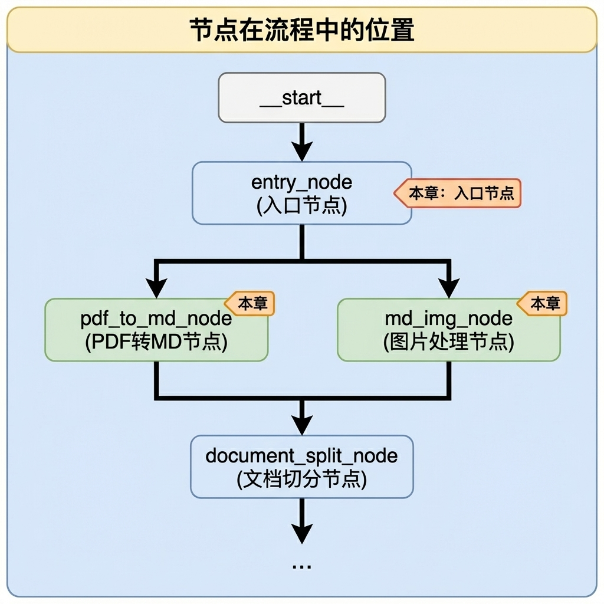
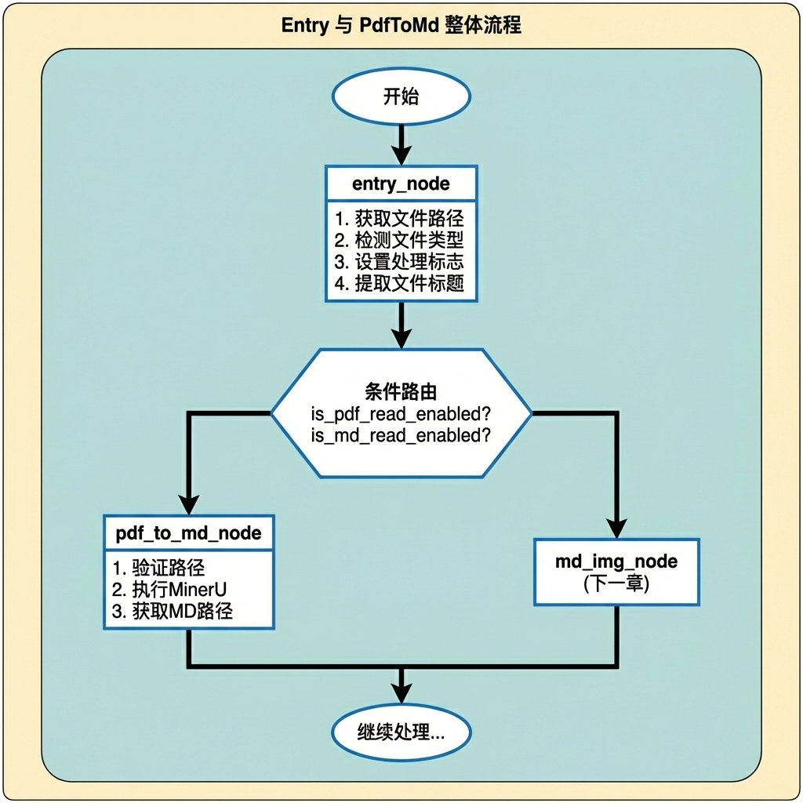
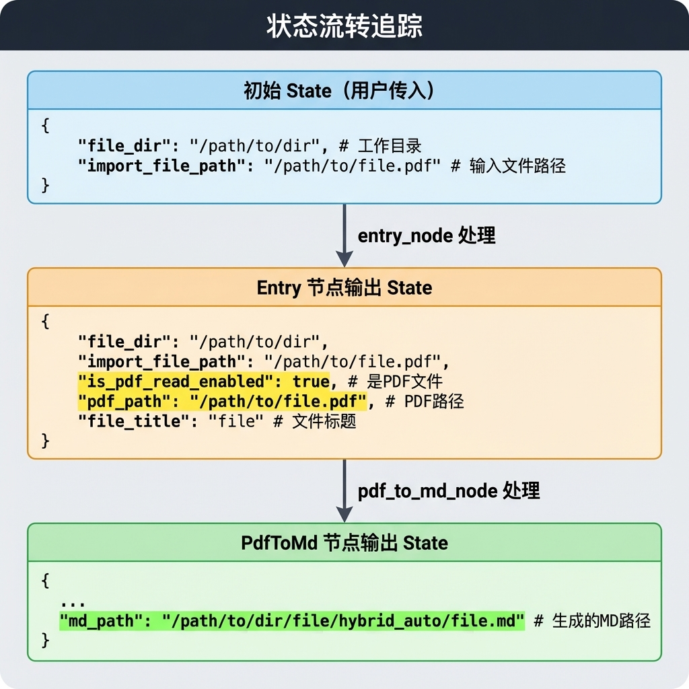
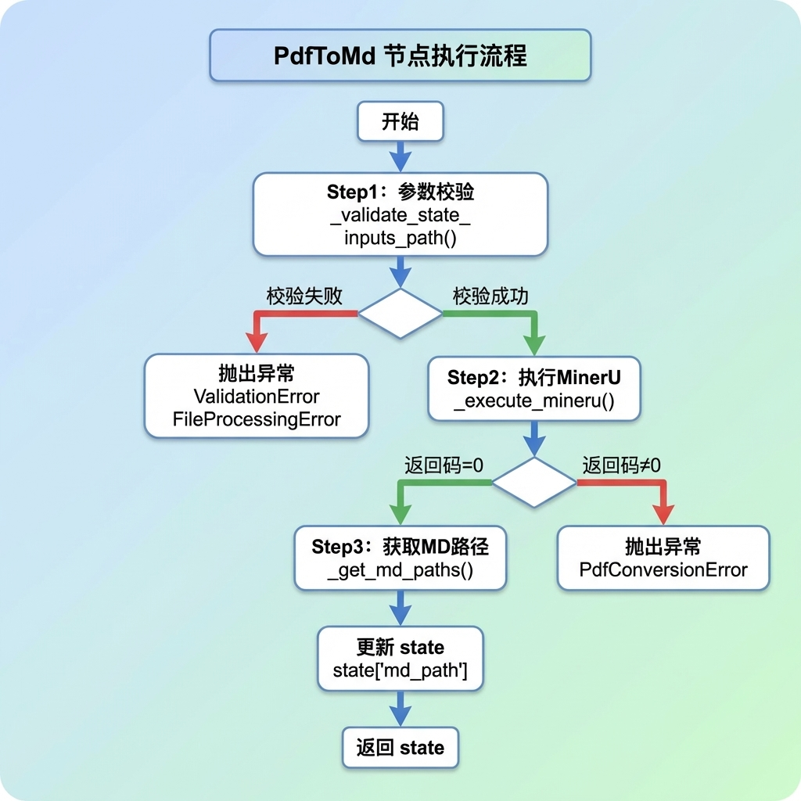

# 入口节点与 PDF 转 Markdown 节点

> 本文档详细介绍知识库导入流程的前两个业务节点：
>
> 入口节点（Entry）负责文件类型检测与路由
>
> PDF 转 Markdown 节点负责将 PDF 文档转换为 Markdown 格式。

---

## 1. 任务目标

### 1.1 本章目标

通过本章学习，你将掌握：

1. **入口节点设计**：理解文件类型检测与条件路由的实现方式
2. **PDF 转换流程**：掌握使用 MinerU 进行 PDF 解析的完整流程
3. **子进程调用**：学会使用 `subprocess` 模块调用外部命令行工具
4. **异常处理**：针对文件处理场景的异常设计
5. **单元测试**：为每个节点编写 `if __name__ == "__main__"` 测试

### 1.2 涉及模块

```
knowledge/processor/import_process/nodes/
├── __init__.py           # 节点模块导出
├── entry_node.py         # 入口节点
└── pdf_to_md_node.py     # PDF 转 Markdown 节点
```

### 1.3 节点在流程中的位置



---

## 2. 核心概念扫盲

### 2.1 pathlib.Path

Python 3.4+ 引入的面向对象路径处理库，比 `os.path` 更优雅：

```python
from pathlib import Path

# 创建 Path 对象
path = Path("D:/documents/万用表的使用.pdf")

# 常用属性
path.name       # "万用表的使用.pdf" - 完整文件名
path.stem       # "万用表的使用" - 不含扩展名的文件名
path.suffix     # ".pdf" - 扩展名
path.parent     # Path("D:/documents") - 父目录

# 常用方法
path.exists()   # True/False - 文件是否存在
path.is_file()  # True/False - 是否为文件
path.is_dir()   # True/False - 是否为目录

# 路径拼接（使用 / 运算符）
output_path = path.parent / "output" / "result.md"
```

### 2.2 subprocess 子进程调用

`subprocess` 模块用于调用外部命令行工具：

```python
import os
import subprocess
from pathlib import Path

# 基础用法：run() - 同步执行，等待完成
os.environ['MINERU_MODEL_SOURCE'] = 'modelscope'#设置MinerU的模型来源 ModelScope（阿里魔搭）
os.environ['MODELSCOPE_OFFLINE'] = '1'#1 表示开启离线模式（MODELSCOPE_CACHE 指定的目录）
os.environ['HF_HUB_OFFLINE'] = '1'#启用 HuggingFace Hub 离线模式
os.environ['TRANSFORMERS_OFFLINE'] = '1'#启用 Transformers 库离线模式

print("✅ 环境变量已配置")
print(f"   MINERU_MODEL_SOURCE = {os.environ.get('MINERU_MODEL_SOURCE')}")
print(f"   MODELSCOPE_OFFLINE = {os.environ.get('MODELSCOPE_OFFLINE')}")
print(f"   HF_HOME = {os.environ.get('HF_HOME')}")
print()

result = subprocess.run(
    [
        "mineru",
        "-p",
        r"hak180产品安全手册.pdf",
        "-o",
        r"output/",
        "--backend",
        "pipeline"
    ],
    capture_output=True,  # 捕获输出
    encoding='utf-8',  # 指定 UTF-8 编码（Windows 下避免 GBK 问题）
    errors='replace',  # 遇到无法解码的字符用  替换
    check=False  # 不自动抛异常，手动检查
)
```

```python
# 高级用法：Popen() - 实时获取输出
# ===============================================================

# === 关键：加载环境变量（模拟 PyCharm 运行 pdf_to_md.py 时的环境）===
# 方法1：直接读取 .env 文件并设置环境变量
# env_file = Path(__file__).parent.parent.parent / '.env'
# if env_file.exists():
#     with open(env_file, 'r', encoding='utf-8') as f:
#         for line in f:
#             line = line.strip()
#             if line and not line.startswith('#') and '=' in line:
#                 key, value = line.split('=', 1)
#                 os.environ[key.strip()] = value.strip()

# 方法2：显式设置关键环境变量（确保 MinerU 使用 ModelScope 离线模式）
os.environ['MINERU_MODEL_SOURCE'] = 'modelscope'
os.environ['MODELSCOPE_OFFLINE'] = '1'
os.environ['HF_HUB_OFFLINE'] = '1'
os.environ['TRANSFORMERS_OFFLINE'] = '1'

print("✅ 环境变量已配置")
print(f"   MINERU_MODEL_SOURCE = {os.environ.get('MINERU_MODEL_SOURCE')}")
print(f"   MODELSCOPE_OFFLINE = {os.environ.get('MODELSCOPE_OFFLINE')}")
print(f"   HF_HOME = {os.environ.get('HF_HOME')}")
print()
proc = subprocess.Popen(
    args=["mineru", "-p", r"hak180产品安全手册.pdf",
          "-o", r"output/", "--backend", "pipeline"],
    stdout=subprocess.PIPE,    # 捕获标准输出
    stderr=subprocess.STDOUT,  # 合并错误到标准输出
    text=True,
    encoding="utf-8",
    errors="replace",          # 遇到乱码时替换
    bufsize=1                  # 行缓冲，实时输出
)

for line in proc.stdout:
    print(line.rstrip())

return_code = proc.wait()
print(return_code)
```

**关键参数说明：**

| 参数                       | 说明                                 |
| -------------------------- | ------------------------------------ |
| `stdout=subprocess.PIPE`   | 捕获标准输出                         |
| `stderr=subprocess.STDOUT` | 将错误流合并到标准输出               |
| `text=True`                | 文本模式（自动解码为字符串）         |
| `encoding="utf-8"`         | 指定编码                             |
| `errors="replace"`         | 遇到无法解码的字符时替换（避免崩溃） |
| `bufsize=1`                | 行缓冲，每行立即输出                 |

### 2.3 MinerU 工具介绍

**MinerU** 是一个开源的 PDF 解析工具，能够将 PDF 文档转换为 Markdown 格式，保留文档结构和图片。

**安装：**

```bash
pip install mineru[all] -i https://pypi.tuna.tsinghua.edu.cn/simple
```

**命令行用法：**

```bash
mineru -p input.pdf -o output_dir/ --source local
```

**参数说明：**

| 参数             | 说明                                 |
| ---------------- | ------------------------------------ |
| `-p`             | 输入 PDF 文件路径                    |
| `-o`             | 输出目录                             |
| `--source local` | 使用本地已下载的模型（避免每次下载） |

**输出目录结构：**

```
output_dir/
└── 文件名/
    └── hybrid_auto/
        ├── 文件名.md      # 转换后的 Markdown
        └── images/         # 提取的图片
            ├── image_0.png
            └── image_1.png
```

### 2.4 条件路由

LangGraph 中的条件路由允许根据状态决定下一个节点：

```python
def route_function(state):
    """路由函数：返回下一个节点名称"""
    if state.get("is_pdf_read_enabled"):
        return "pdf_to_md_node"
    elif state.get("is_md_read_enabled"):
        return "md_img_node"
    return END

# 添加条件边
workflow.add_conditional_edges(
    "entry_node",          # 源节点
    route_function,        # 路由函数
    {
        "pdf_to_md_node": "pdf_to_md_node",
        "md_img_node": "md_img_node",
        END: END
    }
)
#左边（Key）：路由函数 route_function 可能返回的值。 右边（Value）：LangGraph 工作流中实际定义的节点名称。
```

---

## 3. 文件导入业务处理流程（总）

### 3.1 整体流程概述



### 3.2 状态流转



---

## 4. 文件导入业务处理流程（分）

### 4.1 入口节点

#### 4.1.1 目标

- 检测输入文件的类型（PDF 或 MD）
- 设置相应的处理标志
- 提取文件标题
- 为后续路由提供判断依据

#### 4.1.2 需求分析

**输入：**

- `import_file_path`：用户上传的文件路径
- `file_dir`：文件所在目录

**输出：**

- `is_pdf_read_enabled`：是否为 PDF 文件
- `is_md_read_enabled`：是否为 MD 文件
- `pdf_path` 或 `md_path`：对应的文件路径
- `file_title`：文件标题（不含扩展名）

**边界条件：**

| 场景                                  | 处理方式                          |
| ------------------------------------- | --------------------------------- |
| `import_file_path` 或 `file_dir` 为空 | 抛出 `ValidationError`            |
| 文件扩展名为 `.pdf`                   | 设置 `is_pdf_read_enabled = True` |
| 文件扩展名为 `.md`                    | 设置 `is_md_read_enabled = True`  |
| 其他扩展名                            | 抛出 `ValidationError`            |

#### 4.1.3 实现流程


#### 4.1. 4 代码实现

```python
# knowledge/processor/import_process/nodes/entry_node.py

"""
入口节点

检测文件类型并设置处理标志
"""

import json
from pathlib import Path
from knowledge.processor.import_process.base import BaseNode, setup_logging
from knowledge.processor.import_process.state import ImportGraphState
from knowledge.processor.import_process.exceptions import ValidationError


class EntryNode(BaseNode):
    """
    入口节点

    根据输入文件的扩展名设置相应的处理标志，
    决定后续流程走 PDF 转换分支还是直接处理 MD 分支。
    """

    name = "entry"

    def process(self, state: ImportGraphState) -> ImportGraphState:
        """
        处理文件类型的检测

        Args:
            state: ImportGraphState 该节点处理之前的节点状态

        Returns:
            ImportGraphState：该节点处理之后的节点状态
        """
        # 1. 获取导入的文件路径以及文件所在的目录
        self.log_step("Step1", "[获取文件路径]")
        file_dir = state.get('file_dir') #上传PDF后存储的目录 D:\test_data,以及后续用这个目录存储生成的MD文件
        import_file_path = state.get('import_file_path') #导入文件的完整路径及文件名称 D:\test_data\万用表的使用.pdf|md

        # 2. 简单校验一下 文件路径以及所在目录
        self.log_step("Step2", "[检测文件路径]")
        if not file_dir or not import_file_path:
            raise ValidationError("文件目录或者文件不存在", self.name)

        # 3. 使用标准的Path对象操作文件逻辑
        path = Path(import_file_path)

        # 4. 获取上传文件的后缀
        suffix = path.suffix.lower()

        # 5. 判断文件的后缀
        if suffix == '.pdf':
            state['is_pdf_read_enabled'] = True
            state['pdf_path'] = import_file_path
        elif suffix == '.md':
            state['is_md_read_enabled'] = True
            state['md_path'] = import_file_path
        else:
            self.logger.debug(f"文件类型{suffix}不支持")
            raise ValidationError(f"文件类型{suffix}不支持")

        # 6. 获取文件的标题名
        file_title = path.stem
        state['file_title'] = file_title

        # 7. 返回state
        return state


# ================================================================== #
#                        测试                                        #
# ================================================================== #

if __name__ == '__main__':
    setup_logging()

    # 方式：直接实例该节点对象，调用 process 方法
    # 1. 构建该节点需要的 state
    test_entry_state = {
        "file_dir": r"D:\test_data",
        "import_file_path": r"D:\test_data\万用表的使用.pdf"
    }

    # 2. 实例 EntryNode 节点
    entry_node = EntryNode()

    # 3. 调用 process 方法
    processed_state = entry_node(test_entry_state)

    # 序列化打印
    print(json.dumps(processed_state, ensure_ascii=False, indent=4))
```

**关键设计点：**

1. **路径验证优先**
   - 空路径直接抛出异常，避免后续处理

2. **扩展名统一小写**
   - `suffix.lower()` 确保 `.PDF` 和 `.pdf` 处理一致

3. **标志位设计**
   - 使用布尔标志位而非枚举，便于路由判断
   - 同时保存原始路径到 `pdf_path` 或 `md_path`

4. **文件标题提取**
   - 使用 `path.stem` 提取不含扩展名的文件名
   - 后续用于商品名识别等场景

---

### 4.2 PDF 转 Markdown 节点

#### 4.2.1 目标

- 将 PDF 文档转换为 Markdown 格式
- 调用 MinerU 命令行工具
- 实时输出转换日志
- 处理转换异常

#### 4.2.2 需求分析

**输入：**

- `import_file_path`：PDF 文件路径
- `file_dir`：输出目录（可选，默认为 PDF 所在目录）

**输出：**

- `md_path`：转换后的 Markdown 文件路径

**依赖：**

- MinerU 命令行工具已安装
- 模型文件已下载到本地

**边界条件：**

| 场景                    | 处理方式                   |
| ----------------------- | -------------------------- |
| `import_file_path` 为空 | 抛出 `ValidationError`     |
| PDF 文件不存在          | 抛出 `FileProcessingError` |
| MinerU 转换失败         | 抛出 `PdfConversionError`  |
| 输出目录不存在          | MinerU 会自动创建          |

#### 4.2.3 实现流程



**MinerU 命令参数：**

```bash
mineru -p <pdf_path> -o <output_dir> --source local
```

| 参数             | 说明                         |
| ---------------- | ---------------------------- |
| `-p`             | 输入 PDF 文件路径            |
| `-o`             | 输出目录                     |
| `--source local` | 使用本地模型（避免每次下载） |

**subprocess.Popen 参数详解：**

```python
proc = subprocess.Popen(
    cmd,
    stdout=subprocess.PIPE,     # 捕获标准输出
    stderr=subprocess.STDOUT,   # 合并错误到标准输出
    text=True,                  # 文本模式（字符串）
    encoding="utf-8",           # 编码
    errors="replace",           # 遇到非 UTF-8 字符不会崩溃，显示空串
    bufsize=1,                  # 行缓冲（实时输出）
)
```

#### 4.2.4 代码实现

```python
# knowledge/processor/import_process/nodes/pdf_to_md_node.py

"""
PDF 转 Markdown 节点

使用 MinerU 将 PDF 文档转换为 Markdown 格式
"""

import json
import subprocess
import time
from pathlib import Path
from typing import Tuple

from knowledge.processor.import_process.base import BaseNode, setup_logging
from knowledge.processor.import_process.state import ImportGraphState
from knowledge.processor.import_process.exceptions import (
    ValidationError, FileProcessingError, PdfConversionError
)


class PdfToMdNode(BaseNode):
    """
    PDF 转 Markdown 节点

    调用 MinerU 命令行工具将 PDF 转换为 Markdown，
    支持实时输出转换日志。
    """

    name = "pdf_to_md_node"

    def process(self, state: ImportGraphState) -> ImportGraphState:
        """
        执行 PDF 转换

        Args:
            state: 图状态

        Returns:
            更新后的状态（包含 md_path）
        """
        # 1. 对参数校验
        import_file_path, file_dir_path = self._validate_state_inputs_path(state)

        # 2. 利用MinerU工具解析pdf成为md
        processed_code = self._execute_mineru(import_file_path, file_dir_path)
        if processed_code != 0:
            raise PdfConversionError("MinerU解析PDF失败", self.name)

        # 3. 获取md的path
        md_path = self._get_md_paths(import_file_path, file_dir_path)

        # 4. 更新state 字典的md_path
        state['md_path'] = md_path

        # 5. 返回state
        return state

    def _validate_state_inputs_path(self, state: ImportGraphState) -> Tuple[Path, Path]:
        """
        验证输入路径

        Args:
            state: 该节点接收到的状态

        Returns:
            (import_file_path_obj, file_dir_path_obj) 元组
        """
        self.log_step("step1", "对状态的路径输入参数做校验")

        # 1. 获取输入pdf文件路径
        import_file_path = state.get('import_file_path', '')

        # 2. 获取解析后的输出目录
        file_dir = state.get('file_dir', '')

        # 3. 校验文件是否存在(非空判断)
        if not import_file_path:
            raise ValidationError("解析的文件不存在", self.name)

        # 4. 用Path标准化
        import_file_path_obj = Path(import_file_path)

        # 5. 校验是一个真实的路径
        if not import_file_path_obj.exists():
            raise FileProcessingError("解析的文件路径不存在", self.name)

        # 6. 判断输出目录是否为空
        if not file_dir:
            # 默认目录做兜底
            file_dir = import_file_path_obj.parent

        # 7. 标准输出目录
        file_dir_path_obj = Path(file_dir)
        self.logger.info(f"上传文件的路径:{import_file_path}")
        self.logger.info(f"输出的目录:{file_dir}")

        # 8. 返回 输出文件以及输出目录的标准path
        return import_file_path_obj, file_dir_path_obj

    def _execute_mineru(self, import_file_path: Path, file_dir_path: Path) -> int:
        """
        执行 MinerU 命令

        Args:
            import_file_path: 解析的文件路径
            file_dir_path: 解析后的文件目录

        Returns:
            命令返回码（0 表示成功）
        """
        self.log_step("step2", "执行MinerU解析PDF")

        # 1. 构建命令行
        cmd = [
            "mineru",
            "-p",
            str(import_file_path),
            "-o",
            str(file_dir_path),
            "--source",
            "local"
        ]

        process_start_time = time.time()

        # 2. 执行命令行(子进程执行命令行)
        proc = subprocess.Popen(
            args=cmd,
            stdout=subprocess.PIPE,
            stderr=subprocess.STDOUT,
            errors="replace",       # 遇到乱码时替换
            text=True,              # 输出的内容是字符串 不是字节
            encoding="utf-8",       # 用指定的中文字符集进行编解码
            bufsize=1               # 按行缓冲，只要缓冲区一行满了就输出
        )

        # 3. 获取日志信息
        for line in proc.stdout:
            self.logger.info(f"执行MinerU产生的日志：{line}")

        # 4. 等待子进程做完
        processed_code = proc.wait()

        process_end_time = time.time()
        if processed_code == 0:
            self.logger.info(
                f"MinerU成功解析PDF文件：{import_file_path.name} "
                f"耗时:{process_end_time - process_start_time:.2f}s"
            )
        else:
            self.logger.error(f"MinerU解析PDF文件：{import_file_path.name}失败")

        # 5. 返回状态码
        return processed_code

    def _get_md_paths(self, import_file_path: Path, file_dir_path: Path) -> str:
        """
        获取转换结果路径

        MinerU 输出目录结构:
        file_dir_path/
          └── 文件名/
               └── hybrid_auto/
                    ├── 文件名.md
                    └── images/

        Args:
            import_file_path: PDF 文件 Path 对象
            file_dir_path: 输出目录 Path 对象

        Returns:
            Markdown 文件路径字符串
        """
        file_name = import_file_path.stem
        md_path = file_dir_path / file_name / "hybrid_auto" / f"{file_name}.md"
        return str(md_path)


# ================================================================== #
#                        测试                                        #
# ================================================================== #

if __name__ == '__main__':
    setup_logging()
    pdf_to_md_node = PdfToMdNode()

    pdf_to_md_node_init_state = {
        "import_file_path": r"D:\test_data\万用表的使用.pdf",
        "file_dir": r"D:\test_data"
    }
    processed_result = pdf_to_md_node.process(pdf_to_md_node_init_state)
	#indent=4 缩进
    #ensure_ascii=False确保不出现乱码
    print(json.dumps(processed_result, indent=4, ensure_ascii=False))
```

**关键设计点：**

1. **职责分离**
   - `_validate_state_inputs_path()`：验证逻辑
   - `_execute_mineru()`：执行逻辑
   - `_get_md_paths()`：路径计算

2. **实时日志输出**
   - 使用 `bufsize=1` 行缓冲
   - 逐行读取 `proc.stdout` 并打印

3. **错误处理**
   - 返回码非零时抛出 `PdfConversionError`
   - 文件不存在时抛出 `FileProcessingError`

4. **路径兜底**
   - `file_dir` 为空时使用 `import_file_path.parent` 作为默认输出目录

---

## 5. 测试运行

### 5.1 运行 Entry 节点测试

```bash
# 进入项目目录
cd knowledge

# 激活虚拟环境
.venv\Scripts\activate

# 运行测试
python -m knowledge.processor.import_process.nodes.entry_node
```

**预期输出：**

```
2026-02-23 10:00:00 - import.entry - INFO - --- entry 开始 ---
2026-02-23 10:00:00 - import.entry - INFO - [Step1] [获取文件路径]
2026-02-23 10:00:00 - import.entry - INFO - [Step2] [检测文件路径]
2026-02-23 10:00:00 - import.entry - INFO - --- entry 完成 ---
{
    "file_dir": "D:\\test_data",
    "import_file_path": "D:\\test_data\\万用表的使用.pdf",
    "is_pdf_read_enabled": true,
    "pdf_path": "D:\\test_data\\万用表的使用.pdf",
    "file_title": "万用表的使用"
}
```

### 5.2 运行 PDF to MD 节点测试 

```bash
# 运行测试
python -m knowledge.processor.import_process.nodes.pdf_to_md_node
```

**预期输出：**

```
2026-02-23 10:00:00 - import.pdf_to_md_node - INFO - --- pdf_to_md_node 开始 ---
2026-02-23 10:00:00 - import.pdf_to_md_node - INFO - [step1] 对状态的路径输入参数做校验
2026-02-23 10:00:00 - import.pdf_to_md_node - INFO - 上传文件的路径:D:\test_data\万用表的使用.pdf
2026-02-23 10:00:00 - import.pdf_to_md_node - INFO - 输出的目录:D:\test_data
2026-02-23 10:00:00 - import.pdf_to_md_node - INFO - [step2] 执行MinerU解析PDF
2026-02-23 10:00:05 - import.pdf_to_md_node - INFO - 执行MinerU产生的日志：Processing page 1/10...
2026-02-23 10:00:10 - import.pdf_to_md_node - INFO - 执行MinerU产生的日志：Processing page 2/10...
...
2026-02-23 10:00:30 - import.pdf_to_md_node - INFO - MinerU成功解析PDF文件：万用表的使用.pdf 耗时:30.15s
2026-02-23 10:00:30 - import.pdf_to_md_node - INFO - --- pdf_to_md_node 完成 ---
{
    "import_file_path": "D:\\test_data\\万用表的使用.pdf",
    "file_dir": "D:\\test_data",
    "md_path": "D:\\test_data\\万用表的使用\\hybrid_auto\\万用表的使用.md"
}
```

---

## 6. 总结

### 6.1 两个节点对比

| 特性         | Entry 节点        | PDF to MD 节点                                               |
| ------------ | ----------------- | ------------------------------------------------------------ |
| **职责**     | 文件类型检测      | PDF 转换                                                     |
| **复杂度**   | 简单              | 中等                                                         |
| **外部依赖** | 无                | MinerU 命令行工具                                            |
| **异常类型** | `ValidationError` | `ValidationError`, `FileProcessingError`, `PdfConversionError` |
| **输出**     | 标志位 + 路径     | md_path                                                      |

### 6.2 设计要点

1. **单一职责**
   - 每个节点只做一件事
   - Entry 只检测类型，不做转换
   - PDF to MD 只做转换，不做后续处理

2. **防御性编程**
   - 所有输入都要验证
   - 文件路径要检查存在性
   - 外部命令要检查返回码

3. **可观测性**
   - 详细的日志输出
   - 实时日志（`bufsize=1`）
   - 步骤标记（`log_step`）

4. **可测试性**
   - 每个节点都有独立的测试入口
   - 多种边界条件测试
   - 异常捕获验证

---