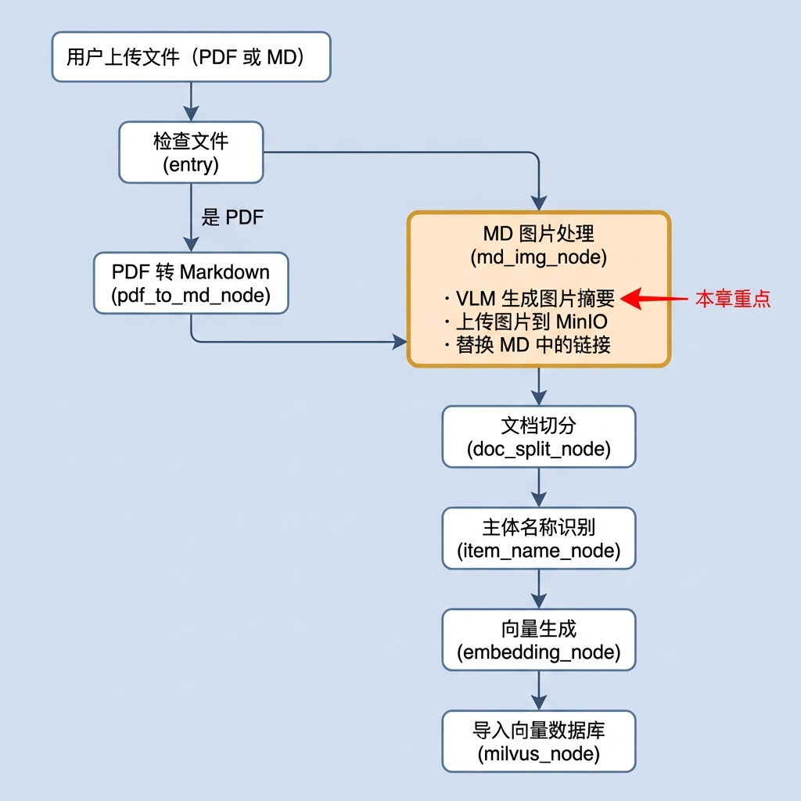
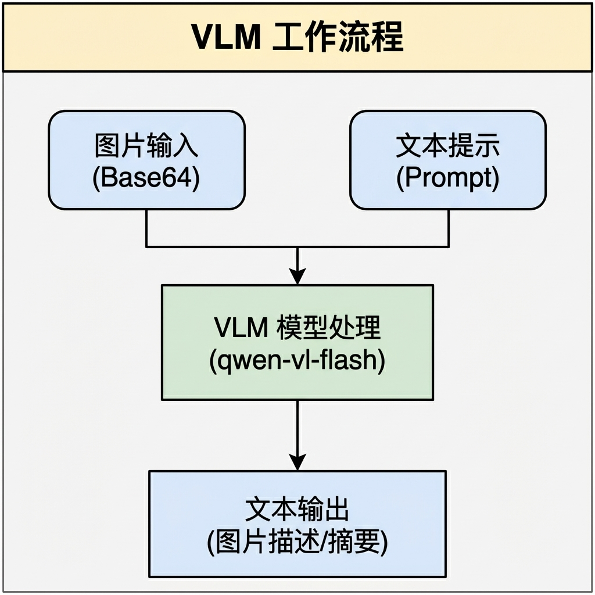
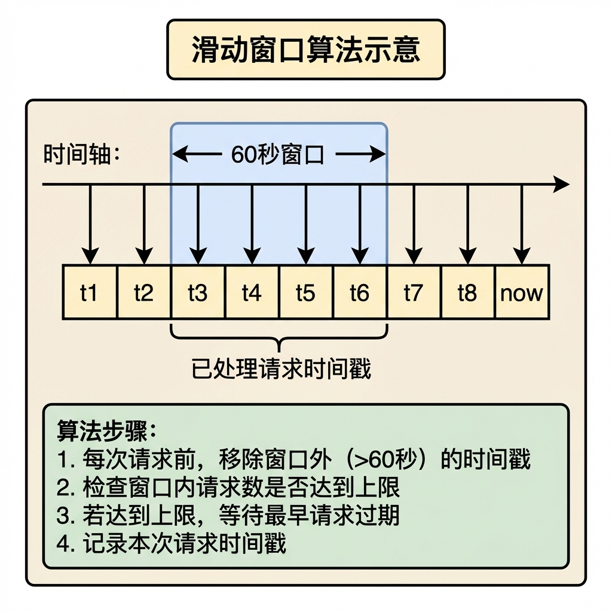
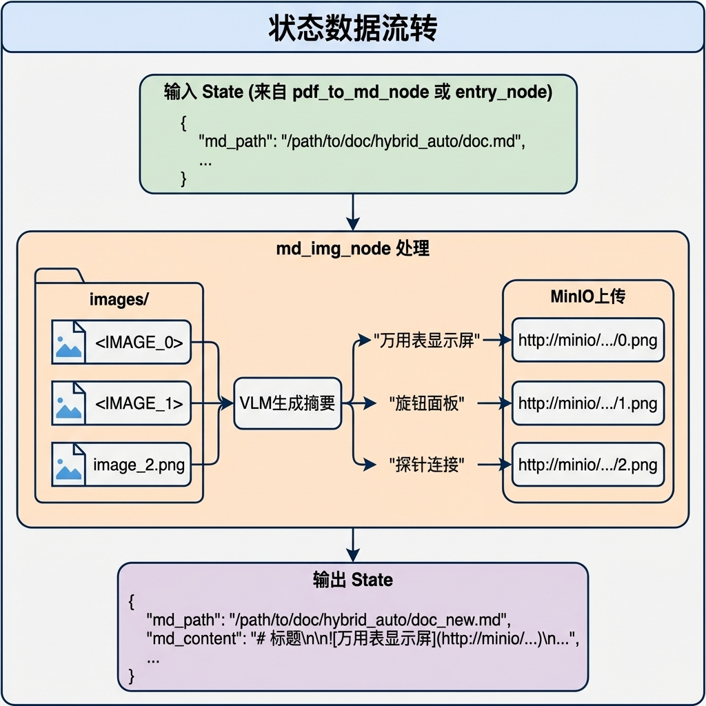
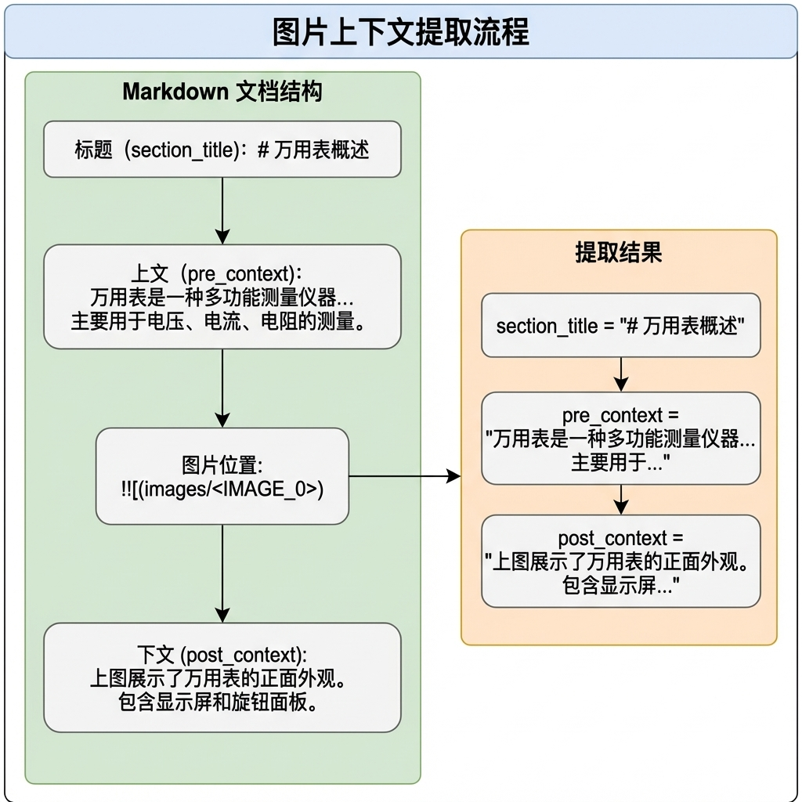
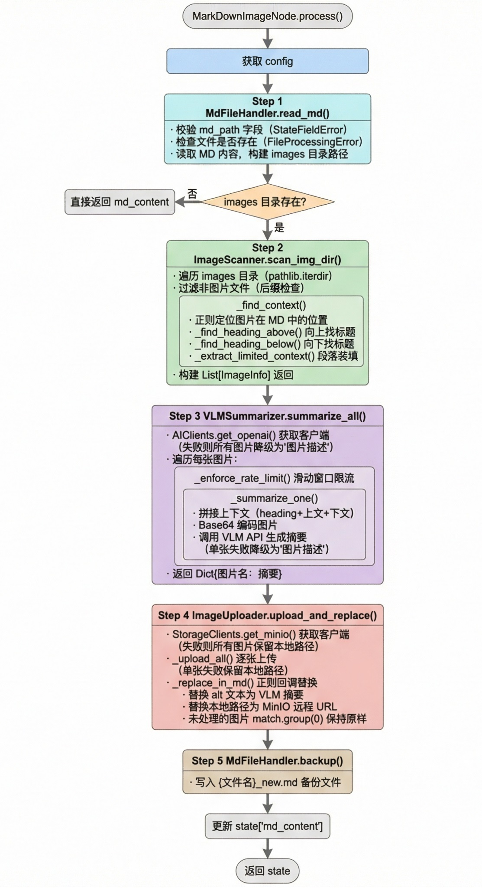

# 图片处理与 MinIO 上传节点

> 本文档详细介绍知识库导入流程中的图片处理节点（MdImgNode），该节点负责处理 Markdown 文档中的本地图片，包括生成图片摘要、上传至 MinIO 对象存储、替换链接等功能。

---

## 1. 任务目标

### 1.1 节点在流程中的位置



**路由逻辑：** `entry_node` 检查上传文件的类型。

如果是 PDF，先经过 `pdf_to_md_node` 转成 Markdown，再进入 `md_img_node`；

如果本身就是 MD 文件，跳过 PDF 转换，直接进入 `md_img_node`。

两条路径在图片处理节点汇合，后续流程一致。

### 1.2 该节点在业务中的意义

MinerU 将 PDF 解析成 Markdown 之后，图片以本地路径的形式存放在临时目录中（如 ``）。如果不经过本节点处理，这些图片在后续的知识库检索和展示中会遇到三个问题：

**图片无法展示。** 用户通过浏览器提问并查看答案时，返回的 MD 切片中包含图片引用。浏览器会根据图片地址发起 HTTP 请求加载图片，但本地路径不是一个有效的 HTTP 地址，页面上只会显示一个裂图。上传到 MinIO 后，图片变成了一个标准的 HTTP URL，任何浏览器都能正常加载。

**图片没有语义信息。** MinerU 解析出来的图片引用是 ``，alt 文本为空。这意味着在后续的文档切分和向量化环节中，图片所在的位置没有任何可检索的文本信息。通过 VLM 生成中文摘要并写入 alt 文本（如 ``），图片的语义信息就融入了文档的文本流，能够被向量化和检索命中。

**图片生命周期不可控。** 临时目录 `import_temp_dir` 随时可能被清理，图片文件会丢失。上传到 MinIO 对象存储后，图片作为持久化资源独立于处理流程存在，不受临时目录清理的影响。

### 1.3 本章目标

通过本章学习，你将掌握：

1. **MinIO 对象存储**：理解对象存储的概念及 MinIO Python SDK 的使用
2. **多模态模型调用**：学会使用 VLM（Vision-Language Model）生成图片描述
3. **图片上下文提取**：基于 Markdown 语义结构提取图片的上下文信息
4. **正则表达式**：掌握 Markdown 图片语法的匹配与替换
5. **速率限制**：理解并实现 API 调用的 Rate Limiting 机制
6. **企业级架构设计**：掌握单例模式、双重检查锁、模板方法模式等设计模式在客户端管理中的应用
7. **代码重构思想**：理解职责分离、dataclass 数据建模

### 1.4 涉及文件

```
knowledge/
├── processor/import_processor/nodes/
│   └── md_img_node.py              # 图片处理节点（本章重点）
└── utils/
    └── client/
        ├── base.py                 # 客户端管理器基类
        ├── storage_clients.py      # 存储类客户端（MinIO、Milvus）
        └── ai_clients.py           # AI 模型类客户端（OpenAI/VLM）
```

---

## 2. 核心概念扫盲

### 2.1 MinIO 对象存储

**MinIO** 是一个高性能的分布式对象存储系统，兼容 Amazon S3 API。

**为什么选择 MinIO？**

图片需要从本地临时目录持久化到一个支持 HTTP 访问的存储服务中。可选方案有很多（如直接挂载共享磁盘、使用云厂商 OSS、Nginx 静态文件服务等），选择 MinIO 主要基于以下考量：

| 考量维度        | MinIO 的优势                                                 |
| --------------- | ------------------------------------------------------------ |
| 私有化部署      | 数据不出内网，适合对数据安全有要求的企业场景                 |
| S3 兼容         | 兼容 Amazon S3 API，未来迁移到云厂商 OSS 只需改 endpoint，代码不用动 |
| 轻量易部署      | 单个二进制文件即可启动，Docker 一行命令搞定，适合中小团队    |
| HTTP 原生访问   | 上传后自动生成 HTTP URL，浏览器可直接加载，无需额外配置 Nginx |
| Python SDK 成熟 | `minio` 包 API 简洁，`fput_object()` 一行代码完成上传        |

**核心概念：**

| 概念        | 说明                 | 类比       |
| ----------- | -------------------- | ---------- |
| Bucket      | 存储桶，顶级容器     | 文件夹     |
| Object      | 对象，存储的基本单元 | 文件       |
| Object Name | 对象名称，包含路径   | 文件路径   |
| Endpoint    | MinIO 服务地址       | 服务器地址 |

**Python SDK 基本用法：**

```python
from minio import Minio

# 初始化客户端
client = Minio(
    "192.168.6.150:9000",
    access_key="minioadmin",
    secret_key="minioadmin",
    secure=False  # 是否使用https
)

if not client.bucket_exists("mybucket"):
    client.make_bucket("mybucket")

# 上传文件
client.fput_object(
    bucket_name="mybucket",
    object_name="images/p1.jpg",  # Object名称含路径
    file_path="d:/temp/p1.jpg",  # 上传的本地文件路径
    content_type="image/jpeg"  # MIME类型
)

# 上传后访问地址
url = f"http://192.168.6.150:9000/mybucket/images/p1.jpg"
print(url)
```

### 2.2 Vision-Language Model (VLM)

**VLM（视觉-语言模型）** 是能够同时处理图像和文本的多模态大模型。

**工作原理：**



**API 调用示例（OpenAI 兼容格式）：**

阿里云：https://bailian.console.aliyun.com/cn-beijing?spm=5176.12818093_47.overview_recent.1.461016d0SCBL6p&tab=doc#/doc/?type=model&url=2845871

```python
from openai import OpenAI
import base64

# 初始化客户端
client = OpenAI(
    api_key=os.getenv("DASHSCOPE_API_KEY"),
    base_url="https://dashscope.aliyuncs.com/compatible-mode/v1"
)

# 图片转 Base64
with open("D:/temp/p1.jpg", "rb") as f:
    base64_image = base64.b64encode(f.read()).decode("utf-8")

# 调用 VLM
response = client.chat.completions.create(
    model="qwen3.6-plus",  # 视觉模型
    #model="qwen3-vl-plus", #视觉模型
    messages=[
        {
            "role": "user",
            "content": [
                {
                    "type": "text",        # 告诉 API：这是一段文字
                    "text": "请描述这张图片的内容"
                },
                {
                    "type": "image_url",   # 告诉 API：这是一张图片
                    "image_url": {
                        "url": f"data:image/jpeg;base64,{base64_image}"
                    }
                }
            ]
        }
    ],
    max_tokens=100
)

summary = response.choices[0].message.content
```

**关于 `type` 字段：** `content` 数组中的每个块通过 `type` 告诉 API 这个块是什么。`"text"` 表示文本内容送给语言模型理解，`"image_url"` 表示图片内容送给视觉模型识别。`"image_url"` 支持两种方式：传网络图片 URL，或者传 Base64 内嵌的 Data URL（当图片在本地磁盘时使用）。

### 2.3 Markdown 图片语法

**标准图片语法：**

```markdown


# 示例


```

**正则表达式匹配：**

```python
import re

md_content = "这是一段文字  后面的文字"

# 匹配所有图片
pattern = r"!\[(.*?)\]\((.*?)\)"
matches = re.findall(pattern, md_content)
# [('图片描述', 'images/photo.jpg')]

# 匹配特定图片文件名 
# 在一段文本中，精准地把包含特定图片名字（img_name）的完整 Markdown 图片标签（）给揪出来。
image_filename = "photo.jpg"
specific_pattern = r"!\[.*?\]\(.*?" + re.escape(image_filename) + r".*?\)"

# 1. re.compile(...) 作用：预编译正则。因为这个正则可能要在几十万字的 Markdown 里循环匹配，提前编译好能极大地提升 Python 的执行速度
# 2. r"!\[" 作用：匹配 Markdown 图片的开头 ![
# 3. .*? 作用：匹配中括号里的“图片描述（Alt Text） 代表任意字符，* 代表 0 个或多个，最关键的是这个 ?。它叫“非贪婪模式”，意思是**“见好就收，遇到下一个条件就立刻停止”**。如果不加 ?，它会像贪吃蛇一样一口气吃到文章最后的一个 ]，导致把两张不同的图片连带着中间的文字全部吞掉。
# 4. \]\( 作用：匹配中间的转折部分 ](。同样，这两个符号在正则里都有特殊含义，必须加 \ 转义。
# 5. .*? 作用：匹配括号里面、图片名字前面的路径（比如 /images/temp/）。
# 6. re.escape(img_name) 强行安全注入图片名。 假设 img_name 是 "pic.png"。如果不加 re.escape，直接拼进去，正则会把里面的 . 当成“任意字符”
# 7. .*? 作用：匹配图片名字后面可能跟着的杂七杂八的东西（比如鼠标悬停提示词 "这是头像"）。
# 8. \) 作用：匹配 Markdown 语法的最后一个右括号 )，
```

### 2.4 Rate Limiting（速率限制）

**概念：** 限制一段时间内的 API 请求次数，避免触发服务端限流。在本节点中，VLM 为每张图片生成摘要时需要逐张调用 API，如果文档包含大量图片，短时间内密集请求可能触发服务端的限流策略（返回 429 错误），导致后续请求全部失败。

**滑动窗口算法：** 维护一个时间戳队列，记录每次请求的时间。每次发送新请求前，先清除窗口外（如 60 秒前）的旧时间戳，然后检查窗口内的请求数是否达到上限。如果达到上限，计算需要等待的时间并 sleep，等最早的那条请求滑出窗口后再继续。

**滑动窗口算法：**




这里使用 `deque`（双端队列）而不是 `list` 来存储时间戳，是因为滑动窗口需要频繁从左侧移除过期记录、从右侧添加新记录，`deque` 两端操作都是 O(1)，而 `list` 左侧移除是 O(n)。

> 具体的代码实现可以直接阅读 `VLMSummarizer._enforce_rate_limit()` 方法，逻辑和上述思路一一对应，这里不再单独展示

### 2.5 Base64 编码

**概念：** 将二进制数据编码为可打印文本，常用于在文本协议（如 JSON）中传输二进制数据。

**编码原理：** 原始二进制每个字节可以是 0-255 中的任意值，其中很多是不可打印的控制字符，无法直接放进 JSON。Base64 将每 3 个字节（24 比特）切分为 4 组（每组 6 比特），每组对应 64 个可打印字符之一（A-Z、a-z、0-9、+、/）。如果末尾不足 3 个字节，用 `=` 填充。

```python
import base64

# 编码
with open("image.png", "rb") as f:
    binary_data = f.read()                         # bytes: 原始二进制
    base64_bytes = base64.b64encode(binary_data)   # bytes: Base64 编码后仍是 bytes 类型
    base64_string = base64_bytes.decode("utf-8")   # str:   转成字符串（Python 类型要求）

# .decode("utf-8") 的作用：
# Python 的 b64encode 返回 bytes 类型，但 JSON/f-string 需要 str 类型
# 因为 Base64 输出全是 ASCII 字符，所以这里只是做类型转换，不涉及字符编码解读

# 解码
binary_data = base64.b64decode(base64_string)
```

**在 VLM 中的应用：**

```
  原始图片 (二进制)
        │
        ▼ base64.b64encode()
  Base64 字符串: "iVBORw0KGgoAAAANSUhEUgAA..."
        │
        ▼ 拼接为 Data URL
  "data:image/jpeg;base64,iVBORw0KGgoAAAANSUhEUgAA..."
        │      │     │    │
        │      │     │    └── 实际的图片数据
        │      │     └── 编码方式
        │      └── 媒体类型（告诉 API 这是 JPEG 图片）
        └── Data URL 协议前缀
```

### 2.6 dataclass 数据建模

**问题：** 使用嵌套 Tuple 传递数据时，代码可读性差，必须记住每个位置的含义。

```python
# 反面示例：嵌套 Tuple，需要数位置
target: List[Tuple[str, str, Tuple[str, str, str]]]
item = target[0]
img_name = item[0]      # 0 是名字？路径？
heading = item[2][0]     # 2 的 0 是什么？

# 正面示例：dataclass，属性名自解释
item = image_list[0]
item.name                # 图片名
item.path                # 路径
item.context.heading     # 标题
```

**定义方式：**

```python
from dataclasses import dataclass

@dataclass
class ImageContext:
    """图片在 MD 中的上下文信息。"""
    heading: str      # 最近的章节标题
    pre_text: str     # 图片上方的正文内容
    post_text: str    # 图片下方的正文内容

@dataclass
class ImageInfo:
    """一张图片的完整信息。"""
    name: str                # 图片文件名
    path: str                # 图片完整路径
    context: ImageContext    # 在 MD 中的上下文
```

不用@dataclass装饰器，代码得这样写：

```python
class Person:
    def __init__(self, name: str, age: int, city: str = "Unknown"):
        self.name = name
        self.age = age
        self.city = city
    def __repr__(self):
        return f"Person(name={self.name!r},age={self.age!r},city={self.city!r})"
    def __eq__(self, other):
        if not isinstance(other, Person):
            return False
        return (self.name == other.name and self.age == other.age
                and self.city == other.city)
```

```tex
!s 调用str()值不加引号
!r 调用_ _repr_ _值加引号
!a 转ASCII
```

### 2.7 并发安全与双重检查锁

**为什么客户端管理需要考虑并发？** 在 Web 服务中（如 FastAPI），每个用户请求可能由不同的线程处理。当多个请求同时触发文档导入时，可能有多个线程同时调用 `StorageClients.get_minio()`。如果不加保护，可能同时创建多个客户端实例，浪费资源甚至导致连接数超限。

**`threading.Lock()` 的作用：** 同一时刻只允许一个线程进入被保护的代码块。配合 `with` 语句使用时，进入时自动加锁，退出时自动解锁：

```python
import threading

lock = threading.Lock()

with lock:
    # 同一时刻只有一个线程能执行这里的代码
    # 其他线程到这里会阻塞等待，直到锁被释放
    client = create_client()
```

**为什么需要"双重检查"？** 单纯加锁可以保证安全，但每次调用都要加锁会有性能开销。双重检查锁在锁外面先做一次快速检查，大多数情况下直接返回已有实例，只有首次创建时才真正加锁：

```python
@classmethod
def _get_or_create(cls, attr_name, lock, factory):
    # 第一次检查（无锁，快速路径）—— 99% 的调用在这里就返回了
    instance = getattr(cls, attr_name, None)
    if instance is not None:
        return instance

    with lock:
        # 第二次检查（持锁，防并发重复创建）
        instance = getattr(cls, attr_name, None)
        if instance is not None:
            return instance

        instance = factory()
        setattr(cls, attr_name, instance)
        return instance
```

**为什么锁里面还要再检查一次？** 用一个时间线来理解：

```
时间线  线程A                          线程B
─────────────────────────────────────────────────
 t1    第一次检查: None ✓
 t2    进入 with，拿到锁 ✅
 t3    开始创建客户端...                第一次检查: None ✓
 t4    还在创建中...                   进入 with，锁被A持有，阻塞等待 🔒
 t5    创建完成，缓存实例，退出 with
 t6                                    锁释放，B 进入 with ✅
 t7                                    第二次检查: 不是 None 了 → 直接返回
```

如果没有第二次检查，线程 B 在 t6 拿到锁后会再创建一个实例，覆盖掉线程 A 已经创建好的那个，导致重复创建。

---

## 3. 架构设计

### 3.1 整体架构

本节点采用**职责分离**的设计，将原来全部堆在一个类中的逻辑拆分为四个协作类，由一个瘦编排层统一调度：

```
┌────────────────────────────────────────────┐
│  MarkDownImageNode  (继承 BaseNode)                                     │
│      调用下面四个协作者，串联整条流水线                                      │
└─────┬─────┬──────┬──────┬──────────────────┘
           │          │           │           │
 MdFileHandler   ImageScanner    VLMSummarizer  ImageUploader
  文件读写/备份   扫描图片+上下文  VLM摘要生成     MinIO上传+MD替换
```

| 协作类          | 职责                     | 公开方法                |
| --------------- | ------------------------ | ----------------------- |
| `MdFileHandler` | 文件读取、路径校验、备份 | `read_md()`、`backup()` |
| `ImageScanner`  | 扫描图片目录、提取上下文 | `scan_img_dir()`        |
| `VLMSummarizer` | VLM 摘要生成、速率限制   | `summarize_all()`       |
| `ImageUploader` | MinIO 上传、MD 内容替换  | `upload_and_replace()`  |

### 3.2 客户端管理架构

外部服务客户端采用**按领域拆分**的管理器模式，基类提供双重检查锁模板，子类只关注创建逻辑：

```
BaseClientManager（基类）                                   子类
┌──────────────────────┐           ┌──────────────────────┐
│ 要不要创建？（缓存检查）               │            │                                    │
│ 并发安全？ （双重检查锁）              │──调用──▶ │ 怎么创建？（工厂方法）                │
│ 创建后怎么存？（setattr）             │            │ 连哪个地址？读哪些配置？               │
└──────────────────────┘           └──────────────────────┘

StorageClients  →  get_minio()、get_milvus()
AIClients       →  get_openai()、get_embedding()、get_reranker()
DBClients       →  get_mongo()
```

**为什么不用一个 ClientManager 管所有客户端？** 随着客户端数量增长，单一管理器会变成"上帝类"。按领域拆分后，每个管理器只管自己领域的客户端，职责清晰，互不干扰。

### 3.3 数据流转



### 3.4 图片上下文提取策略



**为什么上下文都要提取？** 图片和说明文字的位置关系并不固定。有的文档先文后图（上文是说明），有的先图后文（下文是说明），有的上下文共同说明。

以万用表文档为例：

```markdown
# 电阻测量                    ← 上文标题：保留，送给 VLM

警告: 为防触电...              ← 上文正文
1. 将功能转盘置于...

        ← 当前图片

                               ← 下文正文

# 短路蜂鸣测试                ← 下文标题：不保留，属于下一章节
```

**为什么保留上文标题但不保留下文标题？** 两个方向找标题的用途不同。向上找到的标题是当前图片所属的章节标题（如"电阻测量"），告诉 VLM 这张图片是关于什么主题的，对生成准确摘要帮助很大。而向下找到的标题已经属于下一个章节了（如"短路蜂鸣测试"），和当前图片没有语义关系，保留下来反而会干扰 VLM 的判断。所以代码中 `_find_heading_above()` 返回标题内容和行号，而 `_find_heading_below()` 只返回行号作为截取边界，标题内容本身不保留。

**为什么要分段提取？** 截断时不会把一个段落从中间劈开。以段落为单位贪心装填，送给 VLM 的永远是语义完整的段落。代码中用 `if not line.strip()` 检测空行来分段，恰好和 Markdown 的段落定义一致（两段文字之间隔一个空行）。同时遇到其他图片引用（`` ）也会触发段落分割，避免把别的图片的描述文字混进当前图片的上下文，造成语义污染。

**提取上文时为什么要进行两次反转？** 上文的段落是从标题到图片之间的内容，自然顺序是从上往下排列的。但我们想要的是"离图片最近的段落优先保留"，所以需要从下往上收集。两次反转各有用途：

```markdown
原文段落顺序（标题 → 图片方向）：
    段落A（离标题近，离图片远）
    段落B
    段落C（离标题远，离图片近）

第一次 reverse —— 收集前反转，让贪心装填从离图片最近的段落开始：
    段落C → 段落B → 段落A
    假设 max_chars 只够装 C 和 B，selected = [段落C, 段落B]

第二次 reverse —— 收集后反转，恢复原文的阅读顺序：
    selected = [段落B, 段落C]
    最终返回的上文：段落B 在前，段落C 在后，和原文顺序一致
```

如果只反转一次，要么收集到的是离图片远的段落（不反转直接从上往下装填），要么返回给 VLM 的段落顺序是反的（只收集前反转不恢复）。两次反转保证了：优先保留离图片最近的内容，同时返回结果的顺序和原文一致。

下文提取时 `direction="end"` 不需要反转，因为下文本身就是从图片往下排列的，自然顺序就是"离图片近的段落在前"，直接从上往下装填即可。


**上下文最大字符数（`max_chars=200`）如何确定？** 这个值需要从两个方向来考量：

从 VLM 的角度倒推——上下文是送给 VLM 当背景信息的，太短模型缺乏语境，太长会稀释重点甚至超出 token 限制。VLM 的 prompt 由固定指令文本（约 100 字）+ 上下文 + 图片组成，上下文占比不宜过高，否则模型注意力会被文字分散而忽略图片本身。一般控制在 200-400 字是比较合理的区间。

从实际文档采样验证——拿几份有代表性的文档，打印出每张图片提取到的上下文，人工判断信息量是否足够。如果大量图片的上下文被截断得太短、关键信息丢失，就调大；如果上下文里塞了太多无关内容，就调小。

对于中文技术文档，200 字大约是 2-3 个自然段，通常足以覆盖图片周围最相关的说明文字。以万用表文档为例，每张图片附近的说明文字基本在 50-150 字，200 的上限刚好能完整收入而不会引入下一个主题的干扰内容。因此 200 作为默认值保留在代码中，同时放到 `config.img_content_length` 作为可配置项，遇到不同类型的文档时按需调整即可。

---

## 4. 图片处理业务流程

### 4.1 目标

- 读取并解析 Markdown 文档中的图片引用
- 利用 VLM 为每张图片生成语义化的中文摘要
- 将本地图片上传至 MinIO 对象存储
- 替换 Markdown 中的本地路径为远程 URL
- 生成处理后的新 Markdown 文件

### 4.2 需求分析

**输入：**

- `md_path`：Markdown 文件路径（从 state 中获取）
- `images` 目录：与 Markdown 文件同级的图片目录

**输出：**

- `md_content`：处理后的 Markdown 内容（写回 state）

**依赖：**

- MinIO 对象存储服务（通过 `StorageClients.get_minio()` 获取）
- VLM 多模态大模型 API（通过 `AIClients.get_openai()` 获取）

**边界条件与降级策略：**

| 场景                   | 处理方式                                   |
| ---------------------- | ------------------------------------------ |
| `md_path` 为空         | 抛出 `StateFieldError`（精确的字段级异常） |
| `md_path` 文件不存在   | 抛出 `FileProcessingError`                 |
| `images` 目录不存在    | 跳过图片处理，直接返回原始 MD 内容         |
| 图片未在 MD 中被引用   | 跳过该图片，记录警告日志                   |
| VLM 客户端连接失败     | 所有图片使用默认描述 "图片描述"            |
| VLM 单张图片调用失败   | 该图片使用默认描述，其他图片继续           |
| MinIO 客户端连接失败   | 所有图片保留本地路径                       |
| MinIO 单张图片上传失败 | 该图片保留本地路径，其他图片继续           |
| 达到 API 速率限制      | 自动等待后重试                             |

**用户直接上传 MD 文件时图片怎么办？** 本节点不仅处理 MinerU 解析 PDF 生成的 MD，也会处理用户直接上传的 MD 文件（`entry_node` 检测到 MD 格式后直接路由到本节点）。用户上传的 MD 中图片来源可能有多种情况：

| 场景                                  | 图片引用示例                         | 处理结果                                                     |
| ------------------------------------- | ------------------------------------ | ------------------------------------------------------------ |
| 上传了 MD + 图片目录                  | ``                | 正常流程：扫描→摘要→上传→替换                                |
| 只上传了 MD，无图片目录               | ``                | `images/` 目录不存在，跳过图片处理，返回原始内容             |
| MD 中引用网络 URL                     | `` | 图片已在线上，目录中无对应文件，自动跳过，不影响展示         |
| 混合本地路径 + 网络 URL（带图片目录） | 两种都有                             | 本地图片正常上传替换，网络 URL 通过 `match.group(0)` 保持原样 |

因此，如果用户上传的 MD 包含本地图片引用，需要在上传接口或前端层面约束用户同时上传关联的图片目录（例如打包为 zip 后上传），否则本地图片无法处理，后续展示时会出现裂图。这是产品层面的约束，不需要修改本节点的代码逻辑。


### 4.3 实现流程

#### 4.3.1 实现流程图



#### 4.3.2 具体实现步骤

| 步骤         | 协作类          | 方法                         | 操作                                              |
| ------------ | --------------- | ---------------------------- | ------------------------------------------------- |
| **Step 1**   | `MdFileHandler` | `read_md()`                  | 校验 state 字段、读取 MD 内容、构建图片目录       |
| **Step 2**   | `ImageScanner`  | `scan_img_dir()`             | 遍历图片目录、过滤有效图片、提取上下文            |
| **Step 2.1** | `ImageScanner`  | `_find_context()`            | 正则定位图片、向上/向下找标题边界、提取上下文段落 |
| **Step 2.2** | `ImageScanner`  | `_extract_limited_context()` | 按段落分割、按字符数贪心装填、保持段落完整性      |
| **Step 3**   | `VLMSummarizer` | `summarize_all()`            | 获取 OpenAI 客户端、遍历图片、速率限制、调用 VLM  |
| **Step 3.1** | `VLMSummarizer` | `_enforce_rate_limit()`      | 滑动窗口算法限流                                  |
| **Step 3.2** | `VLMSummarizer` | `_summarize_one()`           | 构建上下文、Base64 编码、API 调用                 |
| **Step 4**   | `ImageUploader` | `upload_and_replace()`       | MinIO 上传、正则替换 MD 内容                      |
| **Step 5**   | `MdFileHandler` | `backup()`                   | 写入 *_new.md 备份文件                            |

**config 只在编排层解包：** 每个协作类的方法只接收自己需要的具体参数（如 `image_extensions`、`vl_model`），不接收整个 config 对象。这样方法签名就是它的"需求清单"，读代码时不用翻 config 类就知道它依赖什么。

**MinIO 对象路径设计：**

```
Bucket: knowledge-base
Object 路径: {文档名称}/{图片文件名}

示例:
knowledge-base/
└── 万用表的使用/
    ├── image_0.png
    ├── image_1.png
    └── image_2.png

访问 URL: http://minio:9000/knowledge-base/万用表的使用/image_0.png
```

### 4.4 代码实现

#### 4.4.1 客户端管理器基类

```python
# knowledge/utils/client/base.py

import os
import logging
import threading

logger = logging.getLogger(__name__)


class BaseClientManager:
    """
    客户端管理器基类，提供：
        - _require_env()：环境变量校验
        - _get_or_create()：双重检查锁模板方法

    子类只需要关注「怎么创建客户端」，不用重复写锁逻辑。
    """

    @staticmethod
    def _require_env(key: str) -> str:
        """读取必需的环境变量，缺失时立即抛异常。"""
        value = os.getenv(key)
        if not value:
            raise EnvironmentError(f"缺少必需的环境变量: {key}")
        return value

    @classmethod
    def _get_or_create(cls, attr_name: str, lock: threading.Lock, factory):
        """
        双重检查锁的通用模板。

        factory 是一个工厂方法对象（不加括号传入），只有确认需要创建时才调用。
        这就是延迟执行 —— 把"创建"这个动作推迟到真正需要的那一刻。
        """
        # 第一次检查（无锁，快速路径）
        instance = getattr(cls, attr_name, None)
        if instance is not None:
            return instance

        with lock:
            # 第二次检查（持锁，防并发重复创建）
            instance = getattr(cls, attr_name, None)
            if instance is not None:
                return instance

            instance = factory()
            setattr(cls, attr_name, instance)
            return instance
```

**关于 `getattr(cls, attr_name, None)` 的第三个参数：** `getattr` 在属性不存在时的默认行为是抛 `AttributeError`，而不是返回 `None`。必须显式指定默认值 `None`，才能安全地走后面的判空逻辑。

#### 4.4.2 存储类客户端（MinIO）

```python
# knowledge/utils/client/storage_clients.py

import threading
from typing import Optional
import logging

from minio import Minio
from pymilvus import MilvusClient
from dotenv import load_dotenv
from knowledge.utils.client.base import BaseClientManager

logger = logging.getLogger(__name__)
load_dotenv()


class StorageClients(BaseClientManager):
    """存储类客户端：MinIO、Milvus"""

    _minio_client: Optional[Minio] = None
    _minio_lock = threading.Lock()

    @classmethod
    def get_minio(cls) -> Minio:
        return cls._get_or_create(
            "_minio_client", cls._minio_lock, cls._create_minio
        )

    @classmethod
    def _create_minio(cls) -> Minio:
        try:
            endpoint = cls._require_env("MINIO_ENDPOINT")
            access_key = cls._require_env("MINIO_ACCESS_KEY")
            secret_key = cls._require_env("MINIO_SECRET_KEY")
            bucket_name = cls._require_env("MINIO_BUCKET_NAME")

            client = Minio(
                endpoint, access_key=access_key,
                secret_key=secret_key, secure=False
            )

            if not client.bucket_exists(bucket_name):
                client.make_bucket(bucket_name)
                logger.info(f"MinIO bucket '{bucket_name}' 已自动创建")
            else:
                logger.info(f"MinIO bucket '{bucket_name}' 已存在")

            logger.info(f"MinIO 客户端初始化成功 (endpoint={endpoint})")
            return client

        except EnvironmentError:
            raise  # 配置缺失，直接往上抛
        except Exception as e:
            logger.error(f"MinIO 客户端创建失败: {e}")
            raise ConnectionError(f"MinIO 连接失败: {e}") from e
```

**异常处理策略：** `EnvironmentError`（配置缺失）直接 raise，属于部署阶段应解决的问题；其他异常包装成 `ConnectionError` 并用 `from e` 保留原始异常链。

#### 4.4.3 AI 模型类客户端（OpenAI/VLM）

```python
# knowledge/utils/client/ai_clients.py

import threading
from typing import Optional

from openai import OpenAI
from dotenv import load_dotenv
from knowledge.utils.client.base import BaseClientManager, logger

load_dotenv()


class AIClients(BaseClientManager):
    """AI 模型类客户端：OpenAI(VLM)"""

    _openai_client: Optional[OpenAI] = None
    _openai_lock = threading.Lock()

    @classmethod
    def get_openai(cls) -> OpenAI:
        return cls._get_or_create(
            "_openai_client", cls._openai_lock, cls._create_openai
        )

    @classmethod
    def _create_openai(cls) -> OpenAI:
        try:
            api_key = cls._require_env("OPENAI_API_KEY")
            base_url = cls._require_env("OPENAI_API_BASE")

            client = OpenAI(api_key=api_key, base_url=base_url)
            logger.info(f"OpenAI 客户端初始化成功 (base_url={base_url})")
            return client

        except EnvironmentError:
            raise
        except Exception as e:
            logger.error(f"OpenAI 客户端创建失败: {e}")
            raise ConnectionError(f"OpenAI 连接失败: {e}") from e
```

#### 4.4.4 图片处理节点

```python
# knowledge/processor/import_processor/nodes/md_img_node.py

"""
MarkDown图片处理节点

将MarkDownImageNode 中的逻辑拆分为四个职责单一的协作类，统一调度。
"""

import logging
import time
import re
import base64
from collections import deque
from dataclasses import dataclass
from pathlib import Path
from typing import Tuple, List, Dict, Deque, Set

from openai import OpenAI

from knowledge.utils.client.storage_clients import StorageClients
from knowledge.utils.client.ai_clients import AIClients
from knowledge.processor.import_processor.base import BaseNode, setup_logging
from knowledge.processor.import_processor.state import ImportGraphState
from knowledge.processor.import_processor.exceptions import (
    StateFieldError, FileProcessingError, ImageProcessingError,
)
from knowledge.processor.import_processor.config import get_config


# ── 数据模型 ──

@dataclass
class ImageContext:
    """图片在 MD 中的上下文信息。"""
    heading: str      # 最近的章节标题
    pre_text: str     # 图片上方的正文内容
    post_text: str    # 图片下方的正文内容


@dataclass
class ImageInfo:
    """一张图片的完整信息。"""
    name: str                # 图片文件名，如 "abc123.jpg"
    path: str                # 图片完整路径
    context: ImageContext    # 在 MD 中的上下文


# ── 1. 文件读写 & 备份 ──

class MdFileHandler:
    """负责 MD 文件的读取、路径校验、图片目录构建以及处理后备份。"""

    def __init__(self, logger: logging.Logger):
        self.logger = logger

    def read_md(self, state: ImportGraphState) -> Tuple[str, Path, Path]:
        self.logger.info("【step_1】读取MD内容及构建图片目录")

        md_path = state.get("md_path", "")
        if not md_path:
            raise StateFieldError(
                node_name="md_img_node",
                field_name="md_path",
                expected_type=str,
            )

        md_path_obj = Path(md_path)
        if not md_path_obj.exists():
            raise FileProcessingError(
                f"md文件路径无效: {md_path}", node_name="md_img_node"
            )

        with open(md_path_obj, "r", encoding="utf-8") as f:
            md_content = f.read()

        image_dir = md_path_obj.parent / "images"
        return md_content, md_path_obj, image_dir

    def backup(self, md_path_obj: Path, new_md_content: str) -> str:
        self.logger.info("【step_5】备份新文件")

        new_file_path = md_path_obj.with_name(
            f"{md_path_obj.stem}_new{md_path_obj.suffix}"
        )
        try:
            with open(new_file_path, "w", encoding="utf-8") as f:
                f.write(new_md_content)
            self.logger.info(f"处理后的文件已备份至: {new_file_path}")
        except IOError as e:
            self.logger.error(f"写入新文件失败 {new_file_path}: {e}")
            raise ImageProcessingError(
                f"文件写入失败: {e}", node_name="md_img_node"
            )
        return str(new_file_path)


# ── 2. 图片扫描 & 上下文提取 ──

class ImageScanner:
    """扫描图片目录，提取每张图片在 MD 中的上下文信息。"""

    def __init__(self, logger: logging.Logger):
        self.logger = logger

    def scan_img_dir(
        self,
        image_dir: Path,
        md_content: str,
        image_extensions: Set[str],
        context_length: int,
    ) -> List[ImageInfo]:
        self.logger.info(f"【step_2】扫描图片目录 {image_dir}")

        image_list: List[ImageInfo] = []

        for img_path in Path(image_dir).iterdir():
            if not img_path.is_file():
                continue
            if img_path.suffix not in image_extensions:
                continue

            ctx = self._find_context(
                md_content, img_path.name, context_length
            )
            if ctx is None:
                self.logger.warning(
                    f"MD文件中未找到图片 {img_path.name} 的引用"
                )
                continue

            image_list.append(ImageInfo(
                name=img_path.name,
                path=str(img_path),
                context=ctx,
            ))

        self.logger.info(f"找到 {len(image_list)} 张有效图片")
        return image_list

    def _find_context(
        self, md_content: str, img_name: str, max_chars: int = 200
    ) -> ImageContext | None:
        """返回图片在 MD 中第一次出现位置的上下文，找不到返回 None。"""
        pattern = re.compile(
            r"!\[.*?\]\(.*?" + re.escape(img_name) + r".*?\)"
        )
        md_lines = md_content.split("\n")

        for line_idx, line in enumerate(md_lines):
            if not pattern.search(line):
                continue

            # 向上：找最近标题，取标题到图片之间的内容作为上文
            prev_title, prev_boundary = self._find_heading_above(
                md_lines, line_idx
            )
            pre_content = md_lines[prev_boundary + 1: line_idx]
            img_pre = self._extract_limited_context(
                pre_content, max_chars, direction="front"
            )

            # 向下：找下一个标题，取图片到标题之间的内容作为下文
            next_boundary = self._find_heading_below(md_lines, line_idx)
            post_content = md_lines[line_idx + 1: next_boundary]
            img_post = self._extract_limited_context(
                post_content, max_chars, direction="end"
            )

            return ImageContext(
                heading=prev_title,
                pre_text=img_pre,
                post_text=img_post,
            )

        return None

    @staticmethod
    def _find_heading_above(
        md_lines: List[str], from_idx: int
    ) -> Tuple[str, int]:
        """从 from_idx 向上查找最近的标题。"""
        for i in range(from_idx - 1, -1, -1):
            if re.match(r"^#{1,6}\s+", md_lines[i]):
                return md_lines[i], i
        return "", -1

    @staticmethod
    def _find_heading_below(md_lines: List[str], from_idx: int) -> int:
        """从 from_idx 向下查找下一个标题。"""
        for i in range(from_idx + 1, len(md_lines)):
            if re.match(r"^#{1,6}\s+", md_lines[i]):
                return i
        return len(md_lines)

    @staticmethod
    def _extract_limited_context(
        lines: List[str], max_chars: int, direction: str
    ) -> str:
        """按段落分割，按 direction 方向贪心装填，保持段落完整性。"""
        current_paragraph: List[str] = []
        paragraphs: List[str] = []

        for line in lines:
            #line.strip(): 去除字符串首尾的空白字符(空格、制表符、换行符等)
            is_blank_line = not line.strip()
            is_other_image = re.match(
                r"^!\[.*?\]\(.*?\)$", line.strip()
            )

            if is_blank_line or is_other_image:
                if current_paragraph:
                    paragraphs.append("\n".join(current_paragraph))
                    current_paragraph = []
                continue

            current_paragraph.append(line)

        if current_paragraph:
            paragraphs.append("\n".join(current_paragraph))

        if direction == "front":
            paragraphs.reverse()#就近原则

        total = 0
        selected: List[str] = []
        for para in paragraphs:
            if (total + len(para) > max_chars) and selected:#至少有个段落
                break
            selected.append(para)
            total += len(para)

        if direction == "front":
            selected.reverse()#与原文顺序一致，利于VLM

        return "\n\n".join(selected)#折行并空一行


# ── 3. VLM 摘要生成 ──

class VLMSummarizer:
    """通过视觉语言模型为每张图片生成中文标题/摘要。"""

    def __init__(self, logger: logging.Logger):
        self.logger = logger

    def summarize_all(
        self,
        document_title: str,
        image_list: List[ImageInfo],
        vl_model: str,
        requests_per_minute: int,
    ) -> Dict[str, str]:
        self.logger.info("【step_3】提取图片摘要")

        summaries: Dict[str, str] = {}
        request_timestamps: Deque[float] = deque()

        try:
            client = AIClients.get_openai()
        except Exception as e:
            self.logger.warning(
                f"VLM 不可用，跳过图片摘要生成: {e}"
            )
            for img in image_list:
                summaries[img.name] = "图片描述"
            return summaries

        for img in image_list:
            self._enforce_rate_limit(
                request_timestamps, requests_per_minute
            )
            summaries[img.name] = self._summarize_one(
                client, vl_model, document_title, img
            )

        self.logger.info(f"生成 {len(summaries)} 张图片摘要")
        return summaries

    def _summarize_one(
        self, client: OpenAI, vl_model: str,
        document_title: str, img: ImageInfo,
    ) -> str:
        parts = [p for p in (
            img.context.heading,
            img.context.pre_text,
            img.context.post_text
        ) if p]
        final_context = "\n".join(parts) if parts else "暂无可用上下文"

        try:
            with open(img.path, "rb") as f:
                b64 = base64.b64encode(f.read()).decode("utf-8")
        except Exception:
            return "暂无图片"

        try:
            resp = client.chat.completions.create(
                model=vl_model,
                messages=[{
                    "role": "user",
                    "content": [
                        {
                            "type": "text",
                            "text": (
                                f"任务：为Markdown文档中的图片生成一个简短的中文标题。\n"
                                f"背景信息：\n"
                                f"  1. 所属文档标题：\"{document_title}\"\n"
                                f"  2. 图片上下文：{final_context}\n"
                                f"请结合图片内容和上述上下文信息，"
                                f"用中文简要总结这张图片的内容，"
                                f"生成一个精准的中文标题（不要包含图片二字）。"
                            ),
                        },
                        {
                            "type": "image_url",
                            "image_url": {
                                "url": f"data:image/jpeg;base64,{b64}"
                            },
                        },
                    ],
                }],
            )
            return resp.choices[0].message.content.strip()
        except Exception as e:
            self.logger.warning(f"图片摘要生成失败 {img.path}: {e}")
            return "图片描述"

    def _enforce_rate_limit(
        self, timestamps: Deque[float],
        max_requests: int, window: int = 60,
    ):
        now = time.time()
        while timestamps and now - timestamps[0] >= window:
            timestamps.popleft()

        if len(timestamps) >= max_requests:
            sleep_dur = window - (now - timestamps[0])
            if sleep_dur > 0:
                self.logger.info(
                    f"达到速率限制，暂停 {sleep_dur:.2f} 秒..."
                )
                time.sleep(sleep_dur)
            now = time.time()
            while timestamps and now - timestamps[0] >= window:
                timestamps.popleft()

        timestamps.append(now)


# ── 4. MinIO 上传 & MD 内容替换 ──

class ImageUploader:
    """将本地图片上传至 MinIO，并在 MD 内容中替换为远程 URL + 摘要。"""

    def __init__(self, logger: logging.Logger):
        self.logger = logger

    def upload_and_replace(
        self, document_name: str, md_content: str,
        images_summaries: Dict[str, str],
        image_list: List[ImageInfo],
        minio_bucket: str, minio_base_url: str,
    ) -> str:
        self.logger.info("【step_4】上传图片到MinIO并更新MD")

        remote_urls = self._upload_all(
            document_name, image_list, minio_bucket, minio_base_url
        )
        return self._replace_in_md(
            md_content, images_summaries, remote_urls
        )

    def _upload_all(
        self, document_name: str, image_list: List[ImageInfo],
        minio_bucket: str, minio_base_url: str,
    ) -> Dict[str, str]:
        remote_urls: Dict[str, str] = {}

        try:
            minio_client = StorageClients.get_minio()
        except Exception as e:
            self.logger.warning(
                f"MinIO 不可用，所有图片保留本地路径: {e}"
            )
            for img in image_list:
                remote_urls[img.name] = img.path
            return remote_urls

        for img in image_list:
            object_name = f"{document_name}/{img.name}"
            try:
                minio_client.fput_object(
                    minio_bucket, object_name, img.path
                )
                remote_url = (
                    f"{minio_base_url}/{minio_bucket}/{object_name}"
                )
                self.logger.info(f"{img.name} 上传成功")
                remote_urls[img.name] = remote_url
            except Exception:
                self.logger.warning(
                    f"{img.name} 上传失败，保留本地路径"
                )
                remote_urls[img.name] = img.path

        self.logger.info(
            f"成功上传 {len(remote_urls)} 张图片到 MinIO"
        )
        return remote_urls

    @staticmethod
    def _replace_in_md(
            md_content: str,
            summaries: Dict[str, str],
            remote_urls: Dict[str, str],
    ) -> str:
        """替换 MD 中的图片引用为远程 URL + 摘要。"""
        pattern = re.compile(r"!\[(.*?)\]\((.*?)\)")

        def replacer(match: re.Match) -> str:
            original_path = match.group(2).strip()
            file_name_in_md = Path(original_path).name
            for img_name, summary in summaries.items():
                if img_name == file_name_in_md:
                    return f""
            return match.group(0)

        return pattern.sub(replacer, md_content)


# ── 主节点 ──

class MarkDownImageNode(BaseNode):
    """处理 MarkDown 图片的管道节点 —— 仅负责编排，不含业务细节。"""

    name = "md_img_node"

    def __init__(self):
        super().__init__()
        self.file_handler = MdFileHandler(self.logger)
        self.scanner = ImageScanner(self.logger)
        self.summarizer = VLMSummarizer(self.logger)
        self.uploader = ImageUploader(self.logger)

    def process(self, state: ImportGraphState) -> ImportGraphState:
        config = get_config()

        # 1. 读取文件
        md_content, md_path_obj, image_dir = self.file_handler.read_md(state)

        if not image_dir.exists():
            self.logger.warning(
                f"文件 {md_path_obj.name} 暂无图片要处理"
            )
            state["md_content"] = md_content
            return state

        # 2. 扫描图片 & 提取上下文
        image_list = self.scanner.scan_img_dir(
            image_dir, md_content,
            image_extensions=config.image_extensions,
            context_length=config.img_content_length,
        )

        # 3. VLM 生成摘要
        summaries = self.summarizer.summarize_all(
            document_title=md_path_obj.stem,
            image_list=image_list,
            vl_model=config.vl_model,
            requests_per_minute=config.requests_per_minute,
        )

        # 4. 上传 & 替换
        new_md_content = self.uploader.upload_and_replace(
            document_name=md_path_obj.stem,
            md_content=md_content,
            images_summaries=summaries,
            image_list=image_list,
            minio_bucket=config.minio_bucket,
            minio_base_url=config.get_minio_base_url(),
        )

        # 5. 备份
        self.file_handler.backup(md_path_obj, new_md_content)

        # 6. 更新并返回 state
        state["md_content"] = new_md_content
        return state


if __name__ == "__main__":
    setup_logging()

    node = MarkDownImageNode()
    state = {
        "md_path": r"D:\test_data\万用表的使用\hybrid_auto\万用表的使用.md"
    }
    node.process(state)
```

---

## 5. 测试运行

### 5.1 运行测试

```bash
# 进入项目目录
cd knowledge

# 激活虚拟环境
.venv\Scripts\activate

# 运行测试
python -m knowledge.processor.import_processor.nodes.md_img_node
```

### 5.2 预期输出

```
2026-06-26 10:00:00 - import.md_img_node - INFO - --- md_img_node 开始 ---
2026-06-26 10:00:00 - import.md_img_node - INFO - 【step_1】读取MD内容及构建图片目录
2026-06-26 10:00:00 - import.md_img_node - INFO - 【step_2】扫描图片目录 D:\...\images
2026-06-26 10:00:00 - import.md_img_node - INFO - 找到 5 张有效图片
2026-06-26 10:00:00 - import.md_img_node - INFO - 【step_3】提取图片摘要
2026-06-26 10:00:05 - import.md_img_node - INFO - 生成 5 张图片摘要
2026-06-26 10:00:05 - import.md_img_node - INFO - 【step_4】上传图片到MinIO并更新MD
2026-06-26 10:00:06 - import.md_img_node - INFO - image_0.png 上传成功
...
2026-06-26 10:00:10 - import.md_img_node - INFO - 成功上传 5 张图片到 MinIO
2026-06-26 10:00:10 - import.md_img_node - INFO - 【step_5】备份新文件
2026-06-26 10:00:10 - import.md_img_node - INFO - 处理后的文件已备份至: D:\...\万用表的使用_new.md
2026-06-26 10:00:10 - import.md_img_node - INFO - --- md_img_node 完成 ---
```

### 5.3 处理前后对比

**处理前 (原始 Markdown)：**

```markdown
# 万用表概述

万用表是一种多功能测量仪器。


上图展示了万用表的正面外观。
```

**处理后 (新 Markdown)：**

```markdown
# 万用表概述

万用表是一种多功能测量仪器。


上图展示了万用表的正面外观。
```

---

## 6. 总结

### 6.1 节点功能概览

| 功能模块       | 负责类              | 说明                                   |
| -------------- | ------------------- | -------------------------------------- |
| **MD 解析**    | `MdFileHandler`     | 读取文件、校验路径、备份               |
| **上下文提取** | `ImageScanner`      | 基于 Markdown 语义结构，保持段落完整性 |
| **VLM 调用**   | `VLMSummarizer`     | 多模态模型生成图片描述，含速率限制     |
| **MinIO 上传** | `ImageUploader`     | 对象存储持久化，含降级策略             |
| **编排调度**   | `MarkDownImageNode` | 瘦编排层，只做 config 解包和流程串联   |

### 6.2 设计要点

1. **职责分离与瘦编排层**
   - 每个协作类只做一件事，`process` 方法只有 20 行编排代码
   - 任何一个环节想单独测试或替换都很方便

2. **dataclass 数据建模**
   - 用 `ImageContext` 和 `ImageInfo` 替代嵌套 Tuple
   - 属性名自解释，读代码时不用数位置

3. **config 只在编排层解包**
   - 每个方法只接收自己需要的参数，签名就是"需求清单"
   - 测试时不用构造完整的 config 对象

4. **语义感知的上下文提取**
   - 上下文都提取，覆盖先文后图和先图后文两种排版习惯
   - 以段落为单位贪心装填，截断边界落在段落之间而非句子中间

5. **两层降级的错误处理**
   - 连接级失败：整体降级（VLM 不可用→全部用默认描述，MinIO 不可用→全部保留本地路径）
   - 单张图片失败：个体降级，不影响其他图片的处理

6. **企业级客户端管理**
   - 双重检查锁保证线程安全和单例
   - 按领域拆分避免"上帝类"
   - 基类模板方法消除样板代码，子类只写工厂方法
   - raise 而非返回 None，调用方按需 try-catch

---