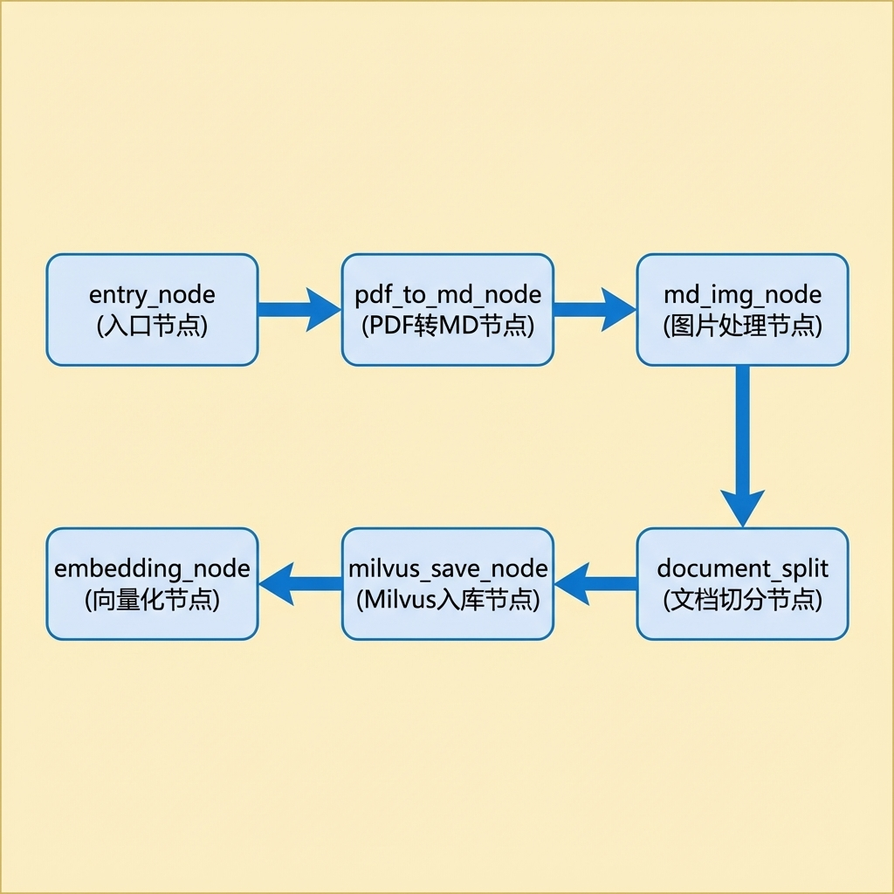
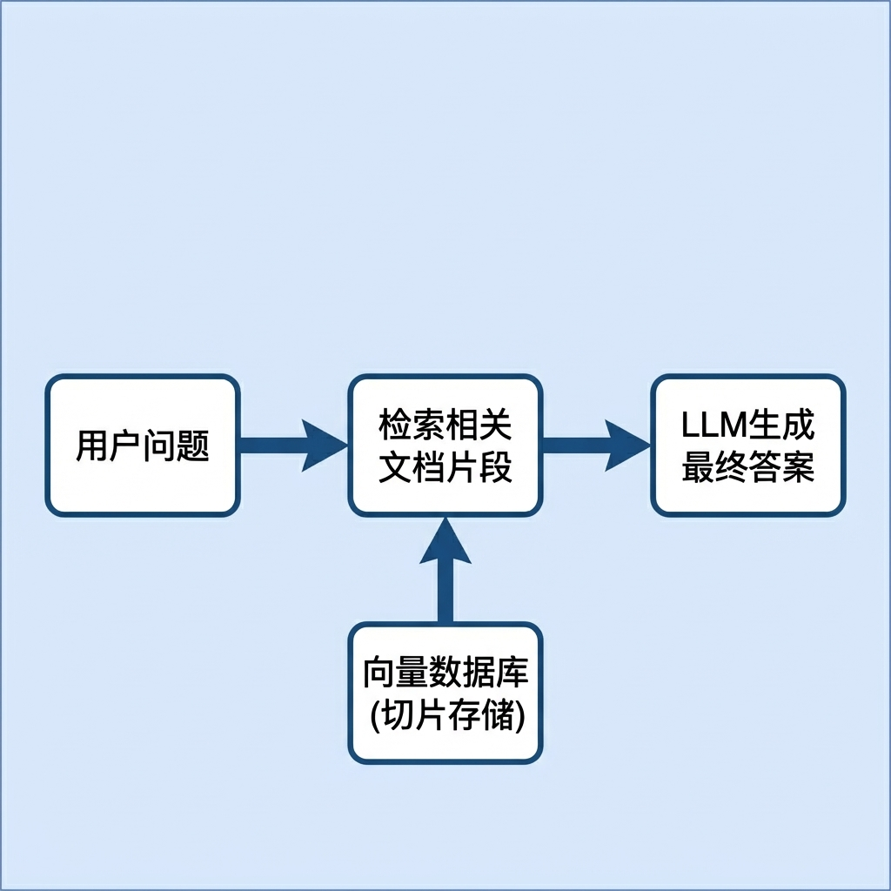
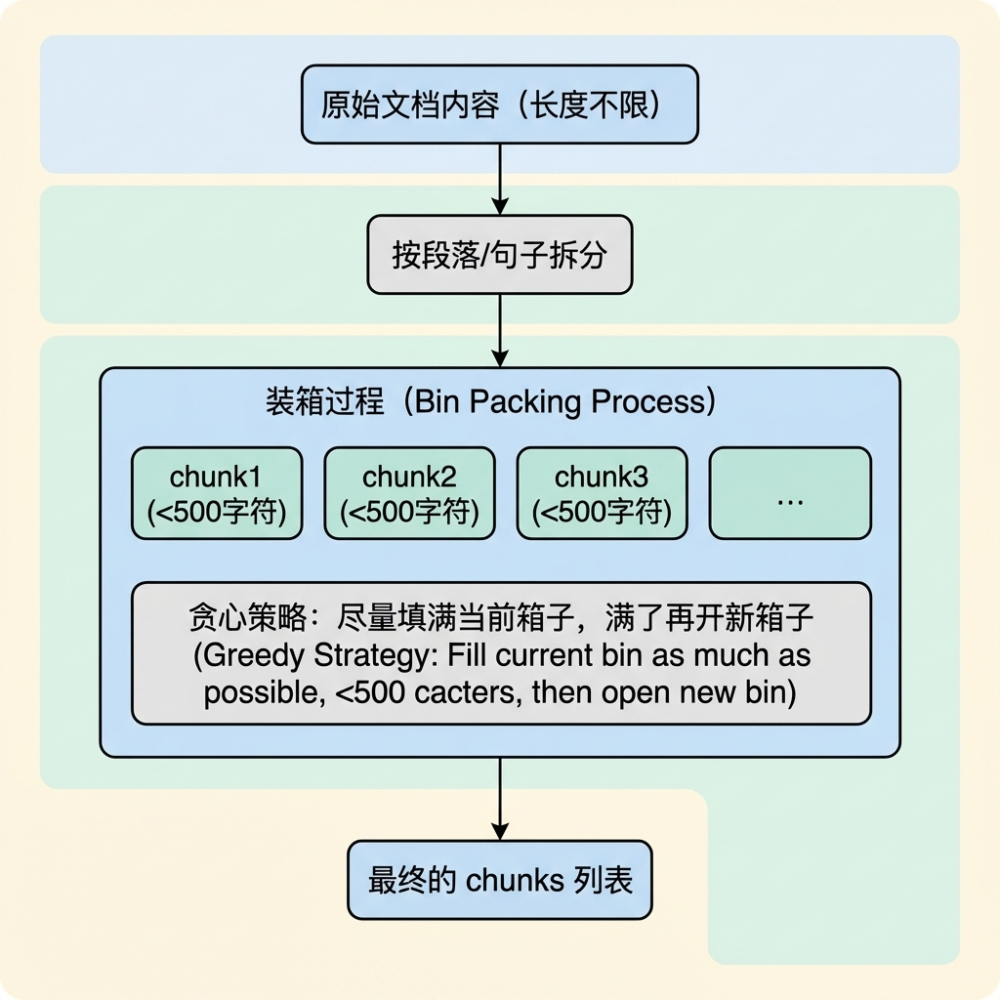
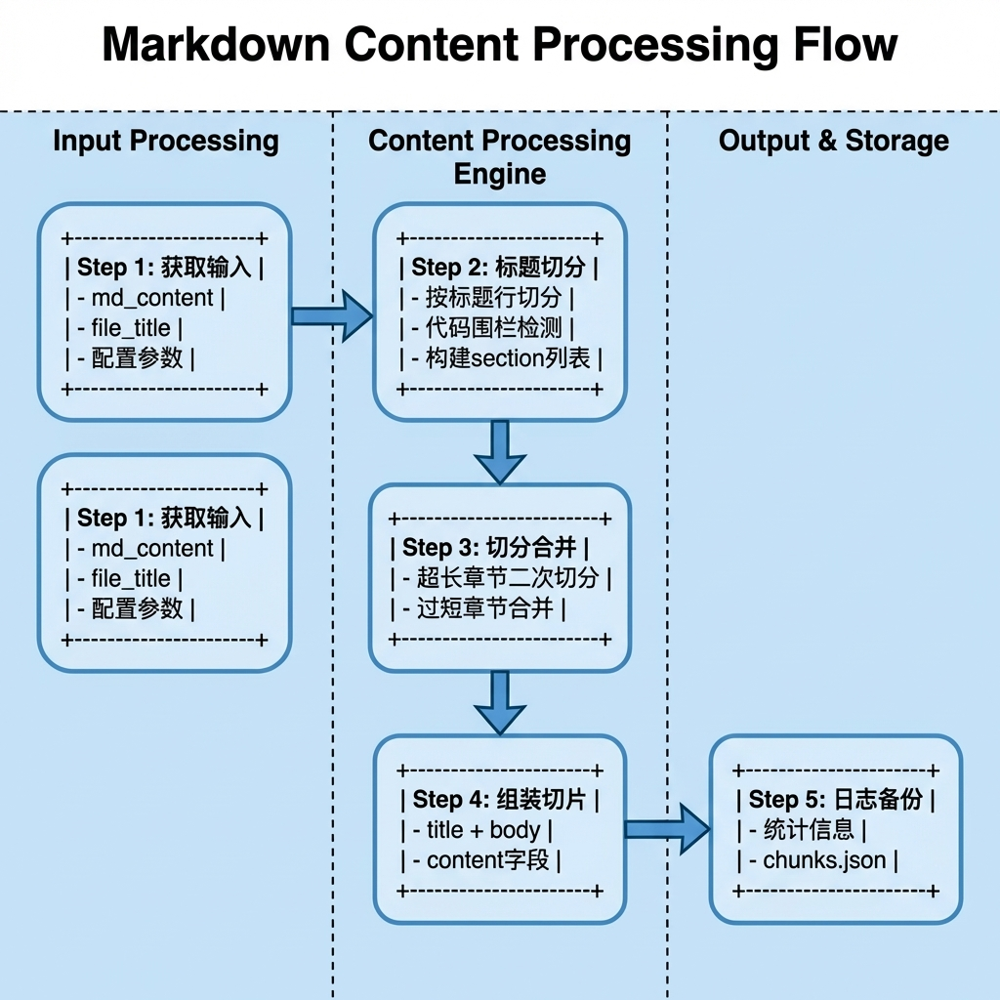
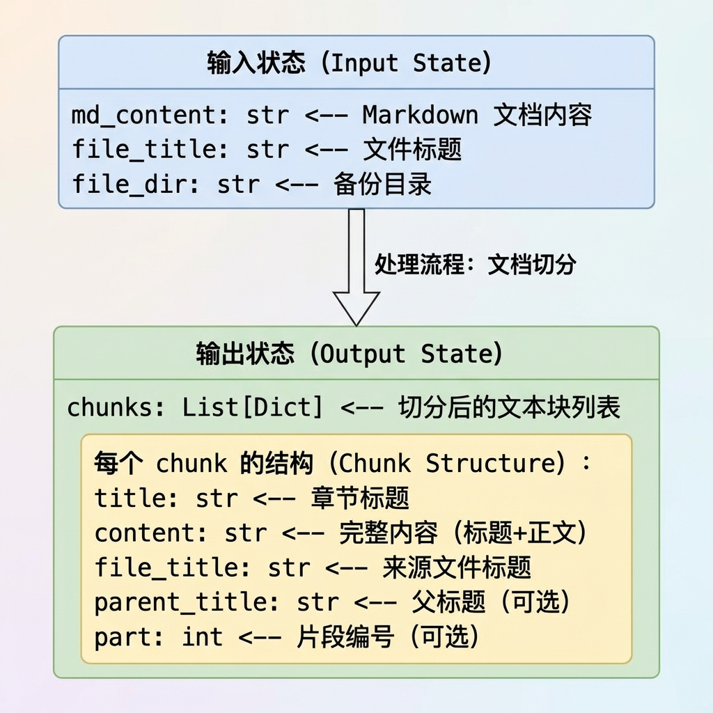
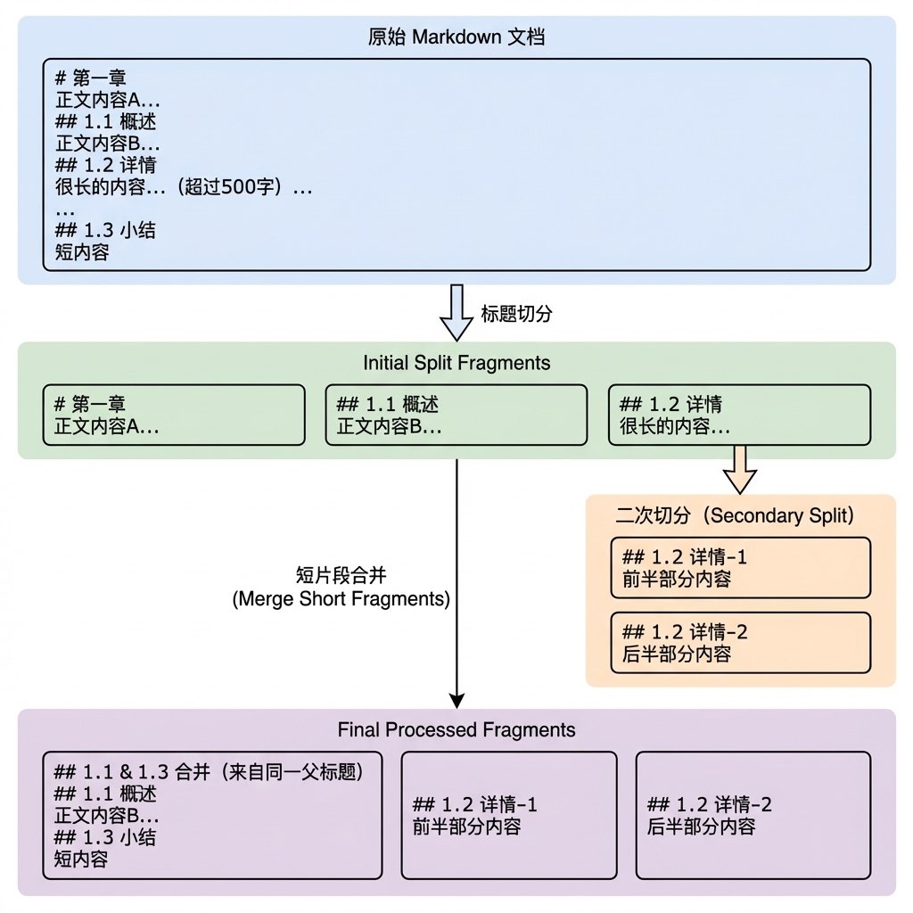
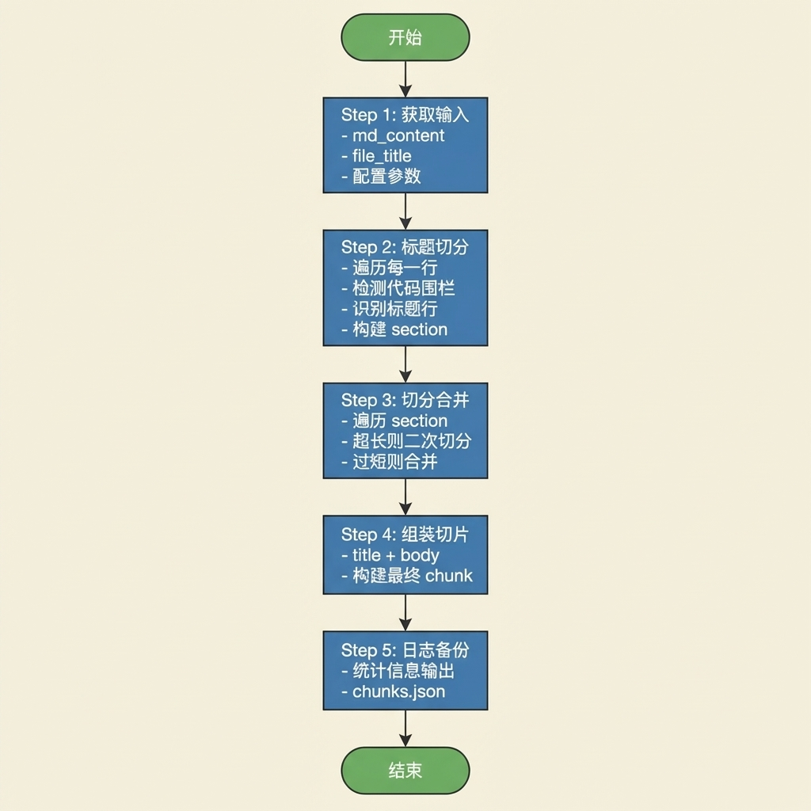

# 文档切分节点

> 本文档详细介绍知识库导入流程中的文档切分节点（DocumentSplitNode），该节点负责将 Markdown 文档按标题结构切分为语义完整的文本块（Chunks），支持超长章节的二次切分和短内容的智能合并。

---

## 1. 任务目标

### 1.1 本章目标

通过本章学习，你将掌握：

1. **文档切分原理**：理解 RAG 系统中文档分块的重要性和策略
2. **Markdown 解析**：学会使用正则表达式解析 Markdown 标题结构
3. **代码围栏检测**：避免将代码块中的 `#` 误识别为标题
4. **分层切分策略**：掌握 段落 → 句子 的逐级切分方法
5. **装箱算法**：理解文本装箱（Bin Packing）的实现思路
6. **智能合并**：学会合并过短的相邻片段以提高检索质量

### 1.2 涉及文件

```
knowledge/processor/import_process/nodes/
└── document_split_node.py    # 文档切分节点（本章重点）
```

### 1.3 节点在流程中的位置



---

## 2. 核心概念扫盲

### 2.1 为什么需要文档切分？

**RAG（检索增强生成）** 系统的核心流程：



**切分的重要性：**

| 切分粒度 | 优点               | 缺点                     |
| -------- | ------------------ | ------------------------ |
| **太大** | 上下文完整         | 检索不精确，噪声多       |
| **太小** | 检索精确           | 上下文碎片化，语义不完整 |
| **适中** | 平衡精确度和完整性 | 需要智能切分策略         |

**本节点的切分策略：**

- 按 Markdown 标题自然切分（保持语义完整）
- 超长章节二次切分（控制向量化成本）
- 过短片段合并（避免信息碎片化）

### 2.2 Markdown 标题语法

**标题层级：**

```markdown
# 一级标题 (H1)
## 二级标题 (H2)
### 三级标题 (H3)
#### 四级标题 (H4)
##### 五级标题 (H5)
###### 六级标题 (H6)
```

**正则表达式匹配：**

```python
import re

# 匹配 1-6 级标题
heading_re = re.compile(r"^\s*#{1,6}\s+.+")

# 示例
lines = [
    "# 第一章",           # ✓ 匹配
    "## 1.1 概述",        # ✓ 匹配
    "  ### 缩进标题",     # ✓ 匹配（允许前导空格）
    "正文内容",           # ✗ 不匹配
    "#标签",              # ✗ 不匹配（# 后需要空格）
    "####### 七级",       # ✗ 不匹配（最多6级）
]

for line in lines:
    if heading_re.match(line):
        print(f"标题: {line}")
```

**正则解析：**

```
^\s*#{1,6}\s+.+
│ │  │    │  │
│ │  │    │  └── .+ : 至少一个任意字符（标题文本）
│ │  │    └── \s+ : 至少一个空白字符
│ │  └── #{1,6} : 1到6个 # 符号
│ └── \s* : 零个或多个前导空白
└── ^ : 行首
```

### 2.3 代码围栏检测

**问题：** 代码块内的 `#` 不应被识别为标题

```markdown
## 真正的标题

下面是一段 Python 代码：

​```python
# 这是注释，不是标题
def foo():
    pass
```

**解决方案：** 使用状态机追踪代码围栏

```python
in_fence = False  # 是否在代码块内

for line in lines:
    # 检测代码围栏边界（``` 或 ~~~）
    if line.strip().startswith("```") or line.strip().startswith("~~~"):
        in_fence = not in_fence  # 切换状态

    # 只有不在代码块内时才识别标题
    is_heading = (not in_fence) and heading_re.match(line)
```

**状态转换图：**

```
              +------------------+
              |                  |
              |   in_fence=False |
              |   (正常模式)      |
              |                  |
              +--------+---------+
                       |
           遇到 ```    |    遇到 ```
           或 ~~~      |    或 ~~~
                       v
              +------------------+
              |                  |
              |   in_fence=True  |
              |   (代码块模式)    |
              |                  |
              +------------------+
```

### 2.4 文本装箱算法（Bin Packing）

**概念：** 将多个小物品装入固定容量的箱子，尽量减少箱子数量。

**在文档切分中的应用：**



**Python 实现思路：**

```python
def pack_paragraphs(paragraphs: List[str], max_length: int) -> List[str]:
    """将段落装箱到多个 chunk 中"""
    chunks = []
    current_chunk = ""

    for para in paragraphs:
        # 计算加入当前段落后的长度
        new_length = len(current_chunk) + len(para) + 2  # +2 for "\n\n"

        if new_length <= max_length:
            # 可以装入当前箱子
            current_chunk += ("\n\n" if current_chunk else "") + para
        else:
            # 当前箱子已满，开启新箱子
            if current_chunk:
                chunks.append(current_chunk)
            current_chunk = para

    # 处理最后一个箱子
    if current_chunk:
        chunks.append(current_chunk)

    return chunks
```

### 2.5 句子切分

**句子边界标点：**

```python
# 中英文句子结束标点
sentence_pattern = r"(?<=[。！？；.!?;])\s*"

text = "这是第一句。这是第二句！第三句？"
sentences = re.split(sentence_pattern, text)
# ['这是第一句', '这是第二句', '第三句', '']
```

**正则解析：**

```
(?<=[。！？；.!?;])\s*
│                  │
│                  └── \s* : 零个或多个空白字符
└── (?<=...) : 正向后瞻断言（匹配前面是指定字符的位置）
```

---

## 3. 文档切分业务处理流程（总）

### 3.1 整体流程概述



### 3.2 数据流转



### 3.3 切分策略示意图



---

## 4. 文档切分业务处理流程（分）

### 4.1 目标

- 按 Markdown 标题结构将文档切分为语义完整的文本块
- 控制每个文本块的长度在合理范围内（不超过 max_length）
- 避免产生过短的碎片化文本块（小于 min_length 时合并）
- 保留标题与正文的结构关系，便于后续检索和展示

### 4.2 需求分析

**输入：**

- `md_content`：Markdown 文档内容
- `file_title`：文件标题（用于标记来源）

**输出：**

- `chunks`：切分后的文本块列表，每个 chunk 包含：
  - `title`：章节标题
  - `content`：完整内容（标题 + 正文）
  - `file_title`：来源文件标题
  - `parent_title`（可选）：父标题（二次切分时产生）
  - `part`（可选）：片段编号（二次切分时产生）

**配置参数：**

- `max_content_length`：单个 chunk 的最大字符数（默认 500）
- `min_content_length`：触发合并的最小字符数（默认 100）

**边界条件：**

| 场景              | 处理方式                                |
| ----------------- | --------------------------------------- |
| `md_content` 为空 | 正常处理，返回空列表                    |
| 全文无标题        | 整体作为一个 chunk，标题设为 file_title |
| 章节超长          | 按段落→句子逐级二次切分                 |
| 章节过短          | 与下一个同父标题的章节合并              |
| 代码块内有 `#`    | 不识别为标题（代码围栏检测）            |

### 4.3 实现流程

#### 4.3.1 实现流程图



#### 4.3.2 具体实现步骤

##### Step 1: 获取输入

**功能描述：**
从状态字典中获取 Markdown 内容和配置参数，统一换行符格式。

**实现要点：**

1. **获取 md_content**
   - 从 `state.get('md_content')` 获取内容

2. **统一换行符**
   - Windows 换行符 `\r\n` 转为 `\n`
   - Mac 旧版换行符 `\r` 转为 `\n`
   - 确保后续按行处理时行为一致

3. **获取配置**
   - `file_title`：来源文件标题
   - `max_content_length`：从 config 获取最大切片长度
   - `min_content_length`：从 config 获取最小切片长度

**代码片段：**

```python
def _get_inputs(self, state: ImportGraphState) -> Tuple[str, str, int, int]:
    self.log_step("step1", "切分文档的参数校验以及获取...")

    config = get_config()
    # 1. 获取md_content
    md_content = state.get('md_content')

    # 2. 统一换行符
    if md_content:
        md_content = md_content.replace("\r\n", "\n").replace("\r", "\n")

    # 3. 获取文件标题
    file_title = state.get('file_title')

    # 4. 校验最大最小值
    if config.max_content_length <= 0 or config.min_content_length <= 0 \
       or config.max_content_length <= config.min_content_length:
        raise ValueError(f"切片长度参数校验失败")

    return md_content, file_title, config.max_content_length, config.min_content_length
```

---

##### Step 2: 按标题一级切分

**功能描述：**
按 Markdown 标题行将文档切分为多个 section，每个 section 包含 title 和 body。

**实现要点：**

1. **编译标题正则**

   ```python
   heading_re = re.compile(r"^\s*(#{1,6})\s+(.+)")
   ```

2. **初始化状态变量**

   - `sections`: 存储切分结果
   - `current_title`: 当前章节标题
   - `body_lines`: 当前章节正文行列表
   - `hierarchy`: 标题层级追踪（用于确定父标题）
   - `in_fence`: 是否在代码围栏内

3. **定义内部函数 `_flush()`**

   - 将当前积累的 title 和 body 保存为一个 section
   - 计算父标题（向上查找最近的上级标题）
   - 清空 body_lines 准备下一个章节

4. **逐行遍历**

   ```python
   for content_line in content_lines:
       # 检测代码围栏
       if content_line.strip().startswith("```") or content_line.strip().startswith("~~~"):
           in_fence = not in_fence
   
       # 判断是否为标题（不在代码块内时）
       match = heading_re.match(content_line) if not in_fence else None
   
       if match:
           _flush()  # 保存上一个章节
           level = len(match.group(1))  # 当前标题的级别
           current_level = level
           current_title = content_line
           hierarchy[level] = current_title
           # 清空下级标题
           for i in range(level + 1, 7):
               hierarchy[i] = ""
           body_lines = []
       else:
           # 除了标题行以外全都收集起来
           body_lines.append(content_line)
   ```

5. **最后调用 `_flush()`**

   - 保存最后一个章节

**输出格式：**

```python
sections = [
    {
        "title": "# 第一章",
        "body": "正文内容...",
        "file_title": "万用表",
        "parent_title": "# 第一章"
    },
    {
        "title": "## 1.1 概述",
        "body": "...",
        "file_title": "万用表",
        "parent_title": "# 第一章"
    },
    ...
]
```

---

##### Step 3: 切分与合并

**功能描述：**
对切分后的 sections 进行二次处理：

- 超长章节进行二次切分
- 过短章节进行合并

**split_and_merge 方法：**

```python
def split_and_merge(self, sections: List[Dict[str, Any]],
                     max_content_length: int, min_content_length: int):
    self.log_step("step3", "切分及合并...")

    # 1. 切分
    current_sections = []
    for section in sections:
        current_sections.extend(self.split_long_section(section, max_content_length))

    # 2. 合并
    final_sections = self.merge_short_section(current_sections, min_content_length)

    # 3. 返回
    return final_sections
```

---

##### Step 3a: 超长章节二次切分

**功能描述：**
对超过 max_content_length 的章节进行二次切分，使用 LangChain 的 RecursiveCharacterTextSplitter。

**实现要点：**

1. **判断是否需要切分**

   ```python
   title_prefix = f"{title}\n\n"
   total_length = len(title_prefix) + len(body)
   
   if total_length <= max_content_length:
       return [section]  # 无需切分
   ```

2. **处理表格**

   ```python
   if "<table>" in body:
       self.logger.info("检测到了表格数据...")
       body = MarkdownTableLinearizer.process(body)
   ```

3. **计算可用空间**

   ```python
   body_length = max_content_length - len(title_prefix)
   if body_length <= 0:
       return [section]
   ```

4. **使用 RecursiveCharacterTextSplitter 切分**

   ```python
   text_splitter = RecursiveCharacterTextSplitter(
       chunk_size=body_length,
       chunk_overlap=0,
       separators=["\n\n", "\n", "。", "！", "？", "；", ".", "!", "?", ";", " ", ""],
       keep_separator=False
   )
   texts = text_splitter.split_text(body)
   ```

5. **生成子片段**

   ```python
   sub_section = []
   for index, text in enumerate(texts):
       sub_section.append({
           "title": title + "-" + f"{index + 1}",
           "body": text,
           "file_title": file_title,
           "parent_title": parent_title,
           "part": f"{index + 1}"  # 标记序号
       })
   return sub_section
   ```

**RecursiveCharacterTextSplitter 工作原理：**

```
原始文本
    |
    v
尝试按 "\n\n" 分割（段落）
    |
    +-- 如果段落仍然过长 --> 尝试按 "\n" 分割（行）
                                |
                                +-- 如果行仍然过长 --> 尝试按句号分割
                                                            |
                                                            +-- ...继续细分
```

---

##### Step 3b: 合并过短章节

**功能描述：**
合并 body 长度小于 min_content_length 的相邻片段，避免信息碎片化。

**合并条件：**

1. 当前片段 body 长度 < min_content_length
2. 当前片段与下一个片段拥有相同的 parent_title

**贪心累加算法：**

```python
def merge_short_section(self, current_sections: List[Dict[str, Any]],
                        min_content_length: int):
    # 1. 定义变量
    current_section = current_sections[0]
    final_sections = []  # 最终的箱子

    # 2. 遍历以及合并
    for next_section in current_sections[1:]:
        # 同源检查
        same_parent = (current_section['parent_title'] == next_section['parent_title'])

        if same_parent and len(current_section.get('body')) < min_content_length:
            # body的合并(更新当前的section的body)
            current_section['body'] = (
                current_section.get('body').rstrip() + "\n\n" + next_section.get('body').lstrip()
            )
            # 更新current_title
            current_section['title'] = current_section['parent_title']
            current_section['part'] = 0
        else:
            # 将原来current_section进行封箱
            final_sections.append(current_section)
            # 更新next_section
            current_section = next_section

    # 最后一个（封装起来）
    final_sections.append(current_section)

    return final_sections
```

**为什么只合并同一 parent_title 下的片段？**

- 不同原始章节的内容不应混合
- 保持语义边界清晰

---

##### Step 4: 组装最终 chunk

**功能描述：**
将分离的 title 和 body 组装为最终的 content 字段。

**实现要点：**

```python
def _assemble_chunk(self, final_chunks: List[Dict[str, Any]]) -> List[Dict[str, Any]]:
    self.log_step("step4", "组装最终的切片信息...")
    chunks = []

    for chunk in final_chunks:
        # 1. 获取chunk的信息
        title = chunk.get('title')
        file_title = chunk.get('file_title')
        parent_title = chunk.get('parent_title')
        body = chunk.get('body')
        content = f"{title}\n\n{body}"

        # 2. 构建最终chunk对象
        assemble_chunk = {
            "title": title,
            "file_title": file_title,
            "parent_title": parent_title,
            "content": content,
        }

        # 3. 判断part是否存在
        if "part" in chunk:
            assemble_chunk['part'] = chunk.get('part')

        chunks.append(assemble_chunk)

    return chunks
```

---

##### Step 5: 日志统计

**功能描述：**
输出切分统计信息，便于调试和监控。

**输出内容：**

- 原文档行数
- 最终切分章节数
- 最大切片长度
- 前 5 个章节标题预览

```python
def _log_summary(self, raw_content: str, chunks: List[dict], max_length: int):
    """输出切分统计信息"""
    self.log_step("step5", "输出统计")

    lines_count = raw_content.count("\n") + 1
    self.logger.info(f"原文档行数: {lines_count}")
    self.logger.info(f"最终切分章节数: {len(chunks)}")
    self.logger.info(f"最大切片长度: {max_length}")

    if chunks:
        self.logger.info("章节预览:")
        for i, sec in enumerate(chunks[:5]):
            title = sec.get("title", "")[:30]
            self.logger.info(f"  {i + 1}. {title}...")
        if len(chunks) > 5:
            self.logger.info(f"  ... 还有 {len(chunks) - 5} 个章节")
```

---

##### Step 6: 备份切片

**功能描述：**
将切分结果备份到 JSON 文件，便于调试和追溯。

**实现要点：**

```python
def _backup_chunks(self, state: ImportGraphState, sections: List[dict]):
    """将切分结果备份到 JSON 文件"""
    self.log_step("step6", "备份切片")

    local_dir = state.get("file_dir", "")
    if not local_dir:
        self.logger.debug("未设置 file_dir，跳过备份")
        return

    try:
        os.makedirs(local_dir, exist_ok=True)
        output_path = os.path.join(local_dir, "chunks.json")
        with open(output_path, "w", encoding="utf-8") as f:
            json.dump(sections, f, ensure_ascii=False, indent=2)
        self.logger.info(f"已备份到: {output_path}")
    except Exception as e:
        self.logger.warning(f"备份失败: {e}")
```

---

### 4.4 代码实现

```python
# knowledge/processor/import_process/nodes/document_split_node.py

"""
文档切分节点

按 Markdown 标题切分文档，支持二次切分和短内容合并
"""

import os
import re
import json
from typing import Tuple, List, Dict, Any

from knowledge.processor.import_process.base import BaseNode, setup_logging
from knowledge.processor.import_process.state import ImportGraphState
from knowledge.processor.import_process.config import get_config
from langchain_text_splitters import RecursiveCharacterTextSplitter
from knowledge.utils.markdown_util import MarkdownTableLinearizer


class DocumentSplitNode(BaseNode):
    """
    文档切分节点

    处理流程：
    1. 读取 MD 内容
    2. 按 Markdown 标题进行一级切分（title 与 body 分离存储）
    3. 对超长章节进行二次切分
    4. 合并过短的相邻章节
    5. 组装最终 content = title + body
    """

    name = "document_split_node"

    # ------------------------------------------------------------------ #
    #                           主流程                                     #
    # ------------------------------------------------------------------ #

    def process(self, state: ImportGraphState) -> ImportGraphState:
        # 1. 获取参数
        md_content, file_title, max_content_length, min_content_length = self._get_inputs(state)

        # 2. 根据标题切割(核心)
        sections = self._split_by_headings(md_content, file_title)

        # 3. 处理(切分和合并)
        final_chunks = self.split_and_merge(sections, max_content_length, min_content_length)

        # 4. 组装
        chunks = self._assemble_chunk(final_chunks)

        # 5. 更新state:chunks
        state['chunks'] = chunks

        # 6. 日志统计
        self._log_summary(md_content, chunks, max_content_length)

        # 7. 备份
        self._backup_chunks(state, chunks)

        # 8. 返回
        return state

    # ------------------------------------------------------------------ #
    #                       Step 1: 获取输入                               #
    # ------------------------------------------------------------------ #

    def _get_inputs(self, state: ImportGraphState) -> Tuple[str, str, int, int]:
        """获取输入参数并预处理"""
        self.log_step("step1", "切分文档的参数校验以及获取...")

        config = get_config()
        # 1. 获取md_content
        md_content = state.get('md_content')

        # 2. 统一换行符
        if md_content:
            md_content = md_content.replace("\r\n", "\n").replace("\r", "\n")

        # 3. 获取文件标题
        file_title = state.get('file_title')

        # 4. 校验最大最小值
        if config.max_content_length <= 0 or config.min_content_length <= 0 \
           or config.max_content_length <= config.min_content_length:
            raise ValueError(f"切片长度参数校验失败")

        return md_content, file_title, config.max_content_length, config.min_content_length

    # ------------------------------------------------------------------ #
    #                  Step 2: 按标题一级切分                               #
    # ------------------------------------------------------------------ #

    def _split_by_headings(self, md_content: str, file_title: str) -> List[dict]:
        """
        根据 MD 的标题（1-6）级标题进行切分

        Args:
            md_content: md内容
            file_title: 文档名字

        Returns:
            sections: 列表，每个元素格式：
            {
                "title": "# 第一章",
                "body": "正文内容...",
                "file_title": "万用表",
                "parent_title": "# 第一章"
            }
        """
        self.log_step("step2", "根据标题进行切分...")

        # 1. 定义变量
        in_fence = False
        body_lines = []
        sections = []
        current_level = 0
        current_title = ""
        hierarchy = [""] * 7  # 7个长度，第一个（0）不用  等级、层级

        # 2. 定义正则表达式
        heading_re = re.compile(r"^\s*(#{1,6})\s+(.+)")

        # 3. 切分
        content_lines = md_content.split("\n")

        def _flush():
            """封装 section 对象"""
            body = "\n".join(body_lines)
            if current_title or body:
                parent_title = ""
                for i in range(current_level - 1, 0, -1):
                    if hierarchy[i]:
                        parent_title = hierarchy[i]
                        break

                if not parent_title:
                    parent_title = current_title if current_title else file_title

                return sections.append({
                    "title": current_title if current_title else file_title,
                    "body": body,
                    "file_title": file_title,
                    "parent_title": parent_title
                })

        for content_line in content_lines:
            # 判断是否存在代码块围栏
            if content_line.strip().startswith("```") or content_line.strip().startswith("~~~"):
                in_fence = not in_fence

            match = heading_re.match(content_line) if not in_fence else None

            if match:
                _flush()

                level = len(match.group(1))  # 当前标题的级别
                current_level = level
                current_title = content_line
                hierarchy[level] = current_title

                # 清空下级标题
                for i in range(level + 1, 7):
                    hierarchy[i] = ""

                body_lines = []
            else:
                # 除了标题行以外全都收集起来
                body_lines.append(content_line)

        _flush()

        return sections

    # ------------------------------------------------------------------ #
    #                Step 3: 二次切分 + 合并短章节                          #
    # ------------------------------------------------------------------ #

    def split_and_merge(self, sections: List[Dict[str, Any]],
                        max_content_length: int, min_content_length: int):
        """
        二次切分和合并

        Args:
            sections: 根据一级标题切分后的所有 section（章节）块
            max_content_length: 每一个 section 的 content 内容最大长度
            min_content_length: 触发合并的最小长度
        """
        self.log_step("step3", "切分及合并...")

        # 1. 切分
        current_sections = []
        for section in sections:
            current_sections.extend(self.split_long_section(section, max_content_length))

        # 2. 合并
        final_sections = self.merge_short_section(current_sections, min_content_length)

        # 3. 返回
        return final_sections

    def split_long_section(self, section: Dict[str, Any], max_content_length: int):
        """
        对超长章节进行二次切分
        """
        self.log_step("step3", "进行长内容的切分")

        # 1. 获取 section 对象属性
        title = section.get('title')
        body = section.get('body')
        file_title = section.get('file_title')
        parent_title = section.get('parent_title')

        # 2. 判断表格
        if "<table>" in body:
            self.logger.info("检测到了表格数据...")
            body = MarkdownTableLinearizer.process(body)
            section['body'] = body

        # 3. 对标题做校验
        TITLE_MAX_LENGTH = 50
        if len(title) > TITLE_MAX_LENGTH:
            self.logger.warning(f"检测文件{file_title}对应的{title}长度过长...")
            title = title[:50]

        # 4. 拼接 title 前缀
        title_prefix = f"{title}\n\n"

        # 5. 计算总长度
        total_length = len(title_prefix) + len(body)

        # 6. 判断是否需要切分
        if total_length <= max_content_length:            
            return [section]

        # 7. 计算 body 可用的长度
        body_length = max_content_length - len(title_prefix)

        if body_length <= 0:
            return [section]

        # 8. 使用 RecursiveCharacterTextSplitter 切分
        text_splitter = RecursiveCharacterTextSplitter(
            chunk_size=body_length,
            chunk_overlap=0,
            separators=["\n\n", "\n", "。", "！", "？", "；", ".", "!", "?", ";", " ", ""],
            keep_separator=False
        )
        texts = text_splitter.split_text(body)

        # 8.3 判断切分结果
        if len(texts) <= 1:
            return [section]

        sub_section = []
        for index, text in enumerate(texts):
            sub_section.append({
                "title": title + "-" + f"{index + 1}",
                "body": text,
                "file_title": file_title,
                "parent_title": parent_title,
                "part": f"{index + 1}"  # 标记序号
            })

        return sub_section

    def merge_short_section(self, current_sections: List[Dict[str, Any]],
                            min_content_length: int):
        """
        贪心累加算法合并过短的章节

        局限性：
        1. 撑破最小的阈值：大一点不用管
        2. 孤儿小块：也不用管（大量都是小块）
        """
        # 1. 定义变量
        current_section = current_sections[0]
        final_sections = []  # 最终的箱子

        # 2. 遍历以及合并
        for next_section in current_sections[1:]:
            # 同源检查
            same_parent = (current_section['parent_title'] == next_section['parent_title'])

            if same_parent and len(current_section.get('body')) < min_content_length:
                # body的合并
                current_section['body'] = (
                    current_section.get('body').rstrip() + "\n\n" + next_section.get('body').lstrip()
                )
                # 更新 current_title
                current_section['title'] = current_section['parent_title']
                current_section['part'] = 0
            else:
                # 将原来 current_section 进行封箱
                final_sections.append(current_section)
                # 更新 next_section
                current_section = next_section

        # 最后一个（封装起来）
        final_sections.append(current_section)

        # 4. 对所有 section 的 part 做处理
        part_counter = {}
        result = []
        for final_section in final_sections:
            if "part" in final_section:
                parent_title = final_section.get('parent_title')
                part_counter[parent_title] = part_counter.get(parent_title, 0) + 1
                new_part = part_counter[parent_title]
                final_section['part'] = new_part
                final_section['title'] = final_section['title'] + f"- {new_part}"

            result.append(final_section)

        return result

    # ------------------------------------------------------------------ #
    #               Step 4: 组装最终 chunk                                 #
    # ------------------------------------------------------------------ #

    def _assemble_chunk(self, final_chunks: List[Dict[str, Any]]) -> List[Dict[str, Any]]:
        """最终组合 chunk"""
        self.log_step("step4", "组装最终的切片信息...")
        chunks = []

        for chunk in final_chunks:
            # 1. 获取 chunk 的信息
            title = chunk.get('title')
            file_title = chunk.get('file_title')
            parent_title = chunk.get('parent_title')
            body = chunk.get('body')
            content = f"{title}\n\n{body}"

            # 2. 构建最终 chunk 对象
            assemble_chunk = {
                "title": title,
                "file_title": file_title,
                "parent_title": parent_title,
                "content": content,
            }

            # 3. 判断 part 是否存在
            if "part" in chunk:
                assemble_chunk['part'] = chunk.get('part')

            chunks.append(assemble_chunk)

        return chunks

    # ------------------------------------------------------------------ #
    #                       日志 & 备份                                    #
    # ------------------------------------------------------------------ #

    def _log_summary(self, raw_content: str, chunks: List[dict], max_length: int):
        """输出切分统计信息"""
        self.log_step("step5", "输出统计")

        lines_count = raw_content.count("\n") + 1
        self.logger.info(f"原文档行数: {lines_count}")
        self.logger.info(f"最终切分章节数: {len(chunks)}")
        self.logger.info(f"最大切片长度: {max_length}")

        if chunks:
            self.logger.info("章节预览:")
            for i, sec in enumerate(chunks[:5]):
                title = sec.get("title", "")[:30]
                self.logger.info(f"  {i + 1}. {title}...")
            if len(chunks) > 5:
                self.logger.info(f"  ... 还有 {len(chunks) - 5} 个章节")

    def _backup_chunks(self, state: ImportGraphState, sections: List[dict]):
        """将切分结果备份到 JSON 文件"""
        self.log_step("step6", "备份切片")

        local_dir = state.get("file_dir", "")
        if not local_dir:
            self.logger.debug("未设置 file_dir，跳过备份")
            return

        try:
            os.makedirs(local_dir, exist_ok=True)
            output_path = os.path.join(local_dir, "chunks.json")
            with open(output_path, "w", encoding="utf-8") as f:
                json.dump(sections, f, ensure_ascii=False, indent=2)
            self.logger.info(f"已备份到: {output_path}")
        except Exception as e:
            self.logger.warning(f"备份失败: {e}")
```

**关键设计点：**

1. **title 与 body 分离存储**
   - 便于单独处理标题编号
   - 便于计算 body 长度
   - 最终组装时保持格式一致

2. **代码围栏检测**
   - 使用状态机追踪 \`\`\` 和 \~\~\~
   - 避免代码块内的 # 被识别为标题

3. **分层切分策略**
   - 优先按段落切分（保持段落完整性）
   - 段落超长时按句子切分（保持句子完整性）
   - 使用 LangChain 的 RecursiveCharacterTextSplitter

4. **智能合并**
   - 只合并同一父标题下的片段
   - 避免跨章节内容混合
   - 标题回退为父标题保持清晰

---

## 5. 测试运行

### 5.1 测试代码

```python
if __name__ == '__main__':
    setup_logging()

    document_node = DocumentSplitNode()
    # 构造状态字典
    file_path = r"D:\develop\...\万用表的使用.md"
    with open(file_path, "r", encoding="utf-8") as f:
        content = f.read()

    state = {
        "file_title": "万用表的使用",
        "md_content": content,
        "file_dir": r"D:\develop\...\import_temp_dir\万用表的使用\hybrid_auto"
    }
    document_node.process(state)
```

### 5.2 运行测试

```bash
# 进入项目目录
cd knowledge

# 激活虚拟环境
.venv\Scripts\activate

# 运行测试
python -m knowledge.processor.import_process.nodes.document_split_node
```

### 5.3 预期输出

```
2026-03-26 10:00:00 - import.document_split_node - INFO - --- document_split_node 开始 ---
2026-03-26 10:00:00 - import.document_split_node - INFO - [step1] 切分文档的参数校验以及获取...
2026-03-26 10:00:00 - import.document_split_node - INFO - [step2] 根据标题进行切分...
2026-03-26 10:00:00 - import.document_split_node - INFO - [step3] 切分及合并...
2026-03-26 10:00:00 - import.document_split_node - INFO - [step4] 组装最终的切片信息...
2026-03-26 10:00:00 - import.document_split_node - INFO - [step5] 输出统计
2026-03-26 10:00:00 - import.document_split_node - INFO - 原文档行数: 125
2026-03-26 10:00:00 - import.document_split_node - INFO - 最终切分章节数: 8
2026-03-26 10:00:00 - import.document_split_node - INFO - 最大切片长度: 500
2026-03-26 10:00:00 - import.document_split_node - INFO - 章节预览:
2026-03-26 10:00:00 - import.document_split_node - INFO -   1. # 万用表的使用...
2026-03-26 10:00:00 - import.document_split_node - INFO -   2. ## 一、认识万用表...
2026-03-26 10:00:00 - import.document_split_node - INFO -   3. ## 二、测量方法...
2026-03-26 10:00:00 - import.document_split_node - INFO - [step6] 备份切片
2026-03-26 10:00:00 - import.document_split_node - INFO - 已备份到: D:\...\chunks.json
2026-03-26 10:00:00 - import.document_split_node - INFO - --- document_split_node 完成 ---
```

---

## 6. 总结

### 6.1 节点功能概览

| 功能模块         | 说明                                                    |
| ---------------- | ------------------------------------------------------- |
| **标题切分**     | 按 Markdown 标题结构切分，保持语义完整                  |
| **代码围栏检测** | 避免代码块内的 # 被误识别为标题                         |
| **二次切分**     | 使用 RecursiveCharacterTextSplitter 按段落→句子逐级切分 |
| **短片段合并**   | 贪心算法合并同父标题下的过短片段                        |
| **表格处理**     | 使用 MarkdownTableLinearizer 线性化表格                 |
| **备份机制**     | 输出 chunks.json 便于调试                               |

### 6.2 设计要点

1. **分离 title 和 body**
   - 便于标题编号处理
   - 便于长度计算
   - 最终组装保持格式一致

2. **代码围栏状态机**
   - 简洁的开关切换逻辑
   - 支持 \`\`\` 和 \~\~\~ 两种围栏

3. **分层切分策略**
   - 段落优先（保持段落完整性）
   - 句子兜底（保持句子完整性）
   - 使用 LangChain 的 RecursiveCharacterTextSplitter

4. **智能合并约束**
   - 只合并同一父标题下的片段
   - 避免跨章节内容混合
   - 保持语义边界清晰