# 商品名识别节点

> 本文档详细介绍知识库导入流程中的商品名识别节点（ItemNameRecognitionNode），该节点负责从文档切片中识别商品/产品名称，并将识别结果向量化后存储到 Milvus 向量数据库，为后续的商品级检索提供基础数据。

---

## 1. 任务目标

### 1.1 本章目标

通过本章学习，你将掌握：

1. **LLM 调用**：学会使用 LangChain 封装调用大语言模型进行信息提取
2. **Prompt 工程**：理解商品名识别的提示词设计思路
3. **BGE-M3 混合嵌入**：掌握同时生成稠密向量和稀疏向量的技术
4. **Milvus 集合管理**：学会创建带索引的向量集合并插入数据
5. **状态回填**：理解如何将识别结果回填到图状态和切片中
6. **客户端统一管理**：掌握 AIClients / StorageClients 分层管理客户端的架构设计

### 1.2 涉及文件

```
knowledge/
├── processor/import_processor/nodes/
│   └── item_name_recognition_node.py    # 商品名识别节点（本章重点）
│
├── utils/client/
│   ├── base.py                          # 客户端管理器基类（双重检查锁）
│   ├── ai_clients.py                    # AI 模型类客户端（LLM、BGE-M3）
│   └── storage_clients.py              # 存储类客户端（Milvus、MinIO）
│
└── prompts/
    └── import_prompt.py                 # 提示词模板
```

### 1.3 节点在流程中的位置

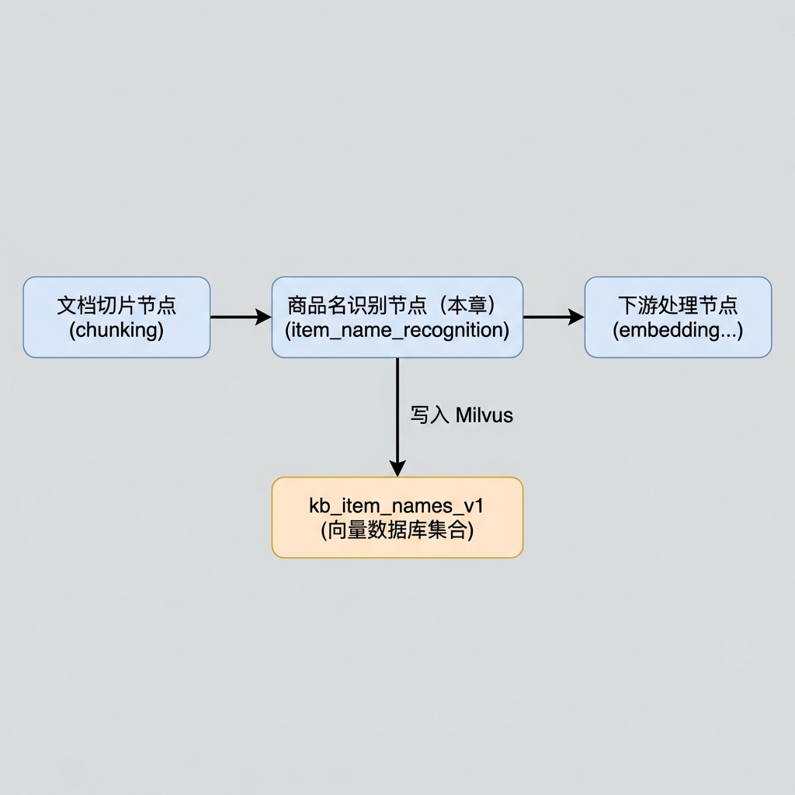

### 1.4 节点在业务中的意义 

商品名识别节点不是孤立的，它产出的数据直接服务于**查询阶段**的商品名确认节点（ItemNameConfirmNode）。两者构成了一条完整的业务链路：

**导入阶段（本章）—— 建库**

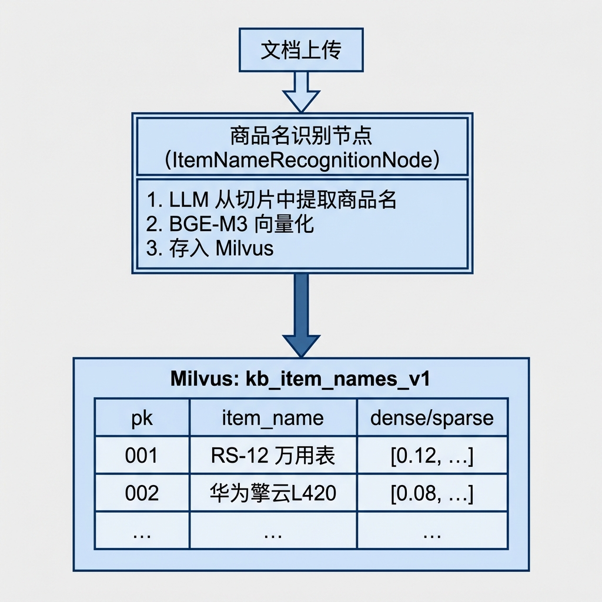

**查询阶段 —— 用库**

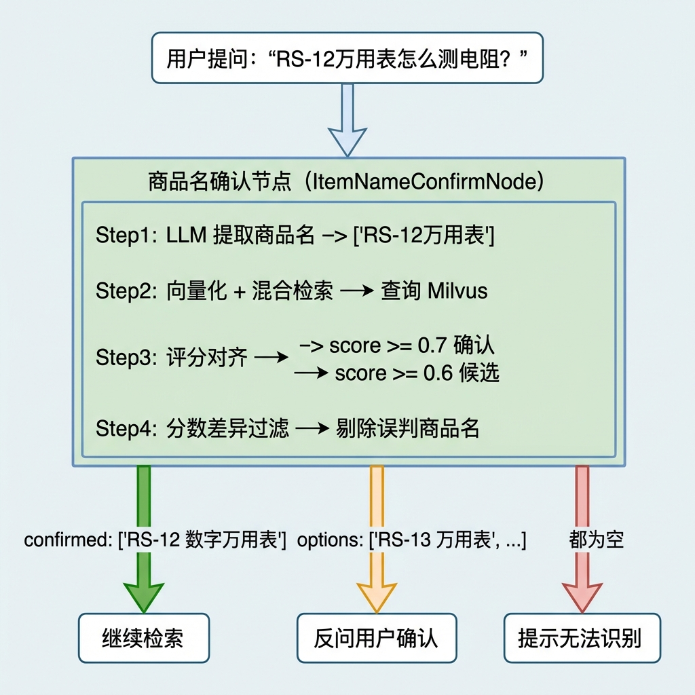

**业务流转全景：导入 → 查询的完整链路**

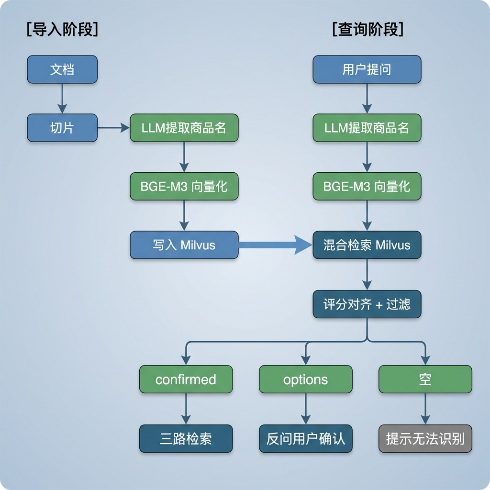

**三个核心决策场景：**

| 场景     | confirmed              | options                            | 系统行为                           |
| -------- | ---------------------- | ---------------------------------- | ---------------------------------- |
| 精准匹配 | `["RS-12 数字万用表"]` | `[]`                               | 直接进入三路检索，返回答案         |
| 模糊匹配 | `[]`                   | `["RS-12 万用表", "RS-13 万用表"]` | 反问用户："您是在询问以下产品吗？" |
| 无法识别 | `[]`                   | `[]`                               | 提示用户提供更准确的产品名称       |

**设计要点：**

1. **导入阶段的质量决定查询阶段的效果** —— 如果商品名提取不准确，向量化后在 Milvus 中的表示就会有偏差，查询时的混合检索得分会下降，直接影响 confirmed/options 的判定
2. **混合嵌入的必要性** —— 用户可能用"万用表"（语义）或"RS-12"（关键词）来提问，稠密向量捕捉前者，稀疏向量捕捉后者，两者结合才能覆盖各种查询模式

---

## 2. 核心概念扫盲

### 2.1 为什么需要商品名识别？

在知识库系统中，**商品名称**是连接文档与用户查询的关键桥梁：

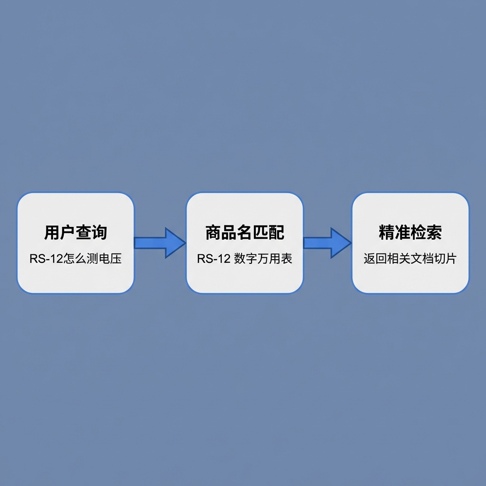

**业务价值：**

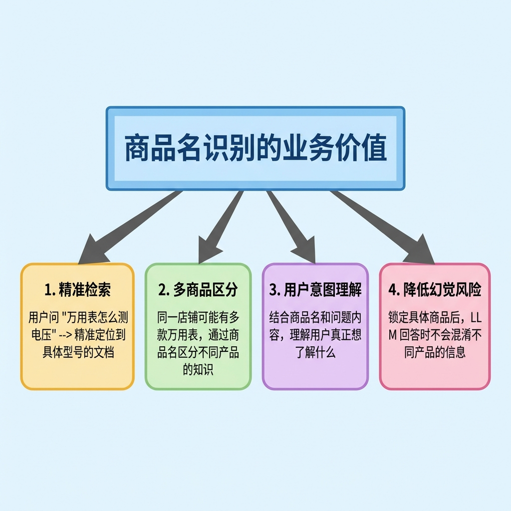

### 2.2 LLM 信息提取

**大语言模型（LLM）** 是从非结构化文本中提取结构化信息的利器：

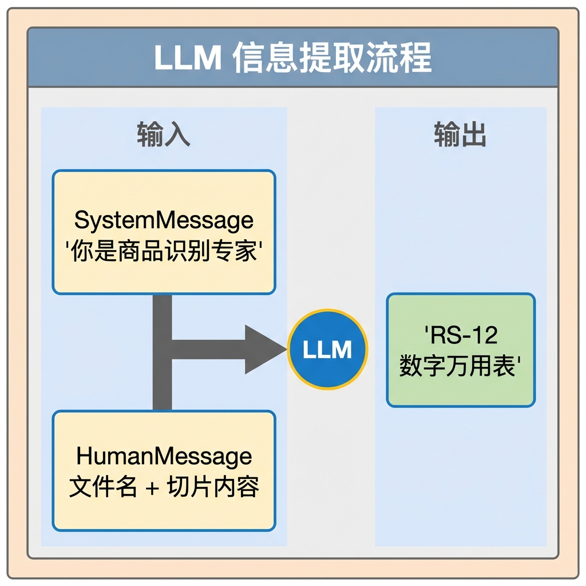

**LangChain 调用方式：**

```python
from langchain_openai import ChatOpenAI
from langchain_core.messages import SystemMessage, HumanMessage
import os
from dotenv import load_dotenv
load_dotenv()

# 1. 创建 LLM 客户端
llm = ChatOpenAI(
    model="qwen-flash",
    temperature=0.0,           # 低温度 = 更确定性输出
    api_key=os.getenv("DASHSCOPE_API_KEY"),
    base_url=os.getenv("OPENAI_API_BASE"),
)

# 2. 构建消息
messages = [
    SystemMessage(content="你是商品识别专家，只输出字符串。"),
    HumanMessage(content="请从以下信息中识别商品名称：R12万用表如何使用?"),
]

# 3. 调用并获取响应
response = llm.invoke(messages)
item_name = response.content.strip()
print(item_name)
```

### 2.3 BGE-M3 混合嵌入

**BGE-M3** 是一个强大的嵌入模型，能同时生成**稠密向量**和**稀疏向量**：


**为什么需要混合嵌入？**

| 向量类型     | 优势                     | 劣势               | 适用场景                            |
| ------------ | ------------------------ | ------------------ | ----------------------------------- |
| **稠密向量** | 语义理解强，能识别同义词 | 可能丢失关键词信息 | "如何使用万用表" ↔ "万用表操作方法" |
| **稀疏向量** | 精确匹配关键词           | 语义理解弱         | "RS-12" 精确匹配型号                |
| **混合检索** | 兼顾语义和关键词         | 计算成本略高       | 生产环境推荐方案                    |

**代码示例：**

```python
from pymilvus.model.hybrid import BGEM3EmbeddingFunction

# 1. 加载模型
bge_m3 = BGEM3EmbeddingFunction(
    model_name="BAAI/bge-m3",
    device="cuda:0",
    use_fp16=True,
)

# 2. 生成嵌入
embeddings = bge_m3.encode_documents(["RS-12 数字万用表"])

# 3. 提取向量
dense_vector = embeddings["dense"][0].tolist()   # List[float], 长度 1024
sparse_matrix = embeddings["sparse"]              # CSR 稀疏矩阵

# 4. 从 CSR 矩阵提取稀疏向量
start_idx = sparse_matrix.indptr[0]
end_idx = sparse_matrix.indptr[1]
token_ids = sparse_matrix.indices[start_idx:end_idx].tolist()
weights = sparse_matrix.data[start_idx:end_idx].tolist()
sparse_vector = dict(zip(token_ids, weights))    # Dict[int, float]
```

**`use_fp16` 参数说明：**

`use_fp16` 控制模型是否使用**半精度浮点数（FP16）** 进行计算，而不是默认的单精度浮点数（FP32）：

```
FP32（单精度）                    FP16（半精度）
每个数占 32 位（4字节）            每个数占 16 位（2字节）
精度高，计算慢，显存占用大          精度略低，计算快，显存占用减半

数值范围:                         数值范围:
±3.4 × 10^38                    ±6.5 × 10^4
有效位数: ~7位                    有效位数: ~3位
```

| 配置             | 适用场景         | 效果                                                         |
| ---------------- | ---------------- | ------------------------------------------------------------ |
| `use_fp16=True`  | GPU 推理（cuda） | 速度提升约 1.5-2 倍，显存减半，精度轻微下降（几乎不影响检索效果） |
| `use_fp16=False` | CPU 推理         | 必须设为 False，因为 CPU 不支持 FP16 原生计算                |

**注意事项：**

- 如果 `device="cpu"` 时设置 `use_fp16=True`，会报错或性能反而下降
- GPU 场景下推荐开启，因为现代 GPU（如 NVIDIA V100/A100/RTX 系列）对 FP16 有专门的硬件加速单元（Tensor Cores），速度提升显著
- 对于商品名嵌入这种短文本场景，FP16 的精度损失可以忽略不计

**CSR 矩阵结构解析：**

```
CSR (Compressed Sparse Row) 矩阵
==================================

indptr  = [0, 5]          # 行指针：第0行的非零元素在 indices/data 中的位置是 [0, 5)
indices = [6, 1173, 3895, 5873, 76798]    # 列索引 = token_id
data    = [0.015, 0.186, 0.215, 0.270, 0.191]  # 非零值 = 权重

组合结果: {6: 0.015, 1173: 0.186, 3895: 0.215, 5873: 0.270, 76798: 0.191}

多行场景（同时嵌入3个文本）:
indptr = [0, 5, 12, 18]
  第0行: data[0:5],  indices[0:5]
  第1行: data[5:12], indices[5:12]
  第2行: data[12:18], indices[12:18]
```

### 2.4 Milvus 向量数据库

#### 2.4.1 什么是 Milvus？

在传统数据库（如 MySQL）中，我们通过**精确匹配**来查数据，比如 `SELECT * FROM products WHERE name = 'RS-12'`。但在 AI 场景下，我们需要的是**相似性搜索**——用户输入"万用表怎么用"，系统要找到语义最接近的文档，而不是精确匹配某个字符串。

**Milvus** 就是专门用来做这件事的数据库，它存储的不是普通的文本或数字，而是**向量**（一组浮点数），并且能在海量向量中快速找到最相似的那些。


#### 2.4.2 Milvus 核心概念

你可以把 Milvus 类比为 MySQL 来理解：

```
MySQL 概念              Milvus 概念            说明
===========             ===========           ========
Database (数据库)       Database              数据的最顶层容器
Table (表)              Collection (集合)      存储数据的容器
Column (列)             Field (字段)           数据的属性定义
Row (行)                Entity (实体)          一条数据记录
Schema (表结构)         Schema (集合结构)      定义字段名、类型、约束
Index (索引)            Index (索引)           加速查询的数据结构
```

**Milvus 中的字段类型：**


**一个集合的完整结构示例（以商品名集合为例）：**

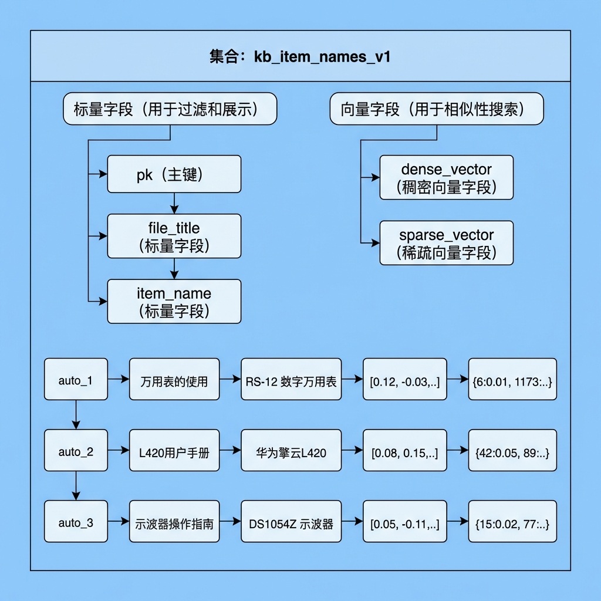

#### 2.4.3 Milvus 基本操作流程


对应的代码：

```python
from pymilvus import MilvusClient

# Step 1: 连接
client = MilvusClient(uri="http://192.168.200.130:19530")

# Step 2: 建集合（定义 Schema + Index，下面会详细讲）
# ...

# Step 3: 插入数据
data = {
    "file_title": "万用表的使用",
    "item_name": "RS-12 数字万用表",
    "dense_vector": [0.12, -0.03, ...],     # 1024维浮点数列表
    "sparse_vector": {6: 0.015, 1173: 0.186}  # token_id: weight 字典
}
client.insert(collection_name="kb_item_names_v1", data=[data])

# Step 4: 搜索（后续章节会讲）
results = client.search(collection_name="kb_item_names_v1", data=[query_vector], ...)
```

#### 2.4.4 本项目的 Milvus 架构


#### 2.4.5 集合 Schema 设计

```python
from pymilvus import DataType

# 创建 Schema
schema = client.create_schema()

# 添加字段
schema.add_field(
    field_name="pk",
    datatype=DataType.VARCHAR,
    is_primary=True,
    auto_id=True,        # 自动生成主键
    max_length=100
)
schema.add_field(
    field_name="file_title",
    datatype=DataType.VARCHAR,
    max_length=65535
)
schema.add_field(
    field_name="item_name",
    datatype=DataType.VARCHAR,
    max_length=65535
)
schema.add_field(
    field_name="dense_vector",
    datatype=DataType.FLOAT_VECTOR,
    dim=1024             # BGE-M3 输出维度
)
schema.add_field(
    field_name="sparse_vector",
    datatype=DataType.SPARSE_FLOAT_VECTOR
)
```

Schema 定义了集合的结构，类似 MySQL 的 `CREATE TABLE`，告诉 Milvus 每个字段叫什么名字、是什么类型、有什么约束。

#### 2.4.6 索引配置

索引是加速搜索的数据结构，和 MySQL 的索引概念类似。在 MySQL 中，没有索引就要全表扫描；在 Milvus 中，没有索引就要逐一比对每个向量，数据量大时非常慢。索引的作用就是提前组织好数据，让搜索时只需要比较一小部分向量就能找到最相似的结果。

向量索引需要配置两个关键参数：`index_type`（索引类型，决定用什么算法组织数据）和 `metric_type`（度量类型，决定用什么公式计算两个向量的相似度）。

```python
index_params = client.prepare_index_params()

# 稠密向量索引（自动选择最优算法）
index_params.add_index(
    field_name="dense_vector",
    index_name="dense_vector_index",
    index_type="AUTOINDEX",       # 自动选择 HNSW 等算法
    metric_type="COSINE"          # 余弦相似度
)

# 稀疏向量索引（倒排索引）
index_params.add_index(
    field_name="sparse_vector",
    index_name="sparse_inverted_index",
    index_type="SPARSE_INVERTED_INDEX",
    metric_type="IP"              # 内积
)
```

**`index_type="AUTOINDEX"` 索引类型说明：**

Milvus 支持多种索引类型，`AUTOINDEX` 是其中最省心的选择：

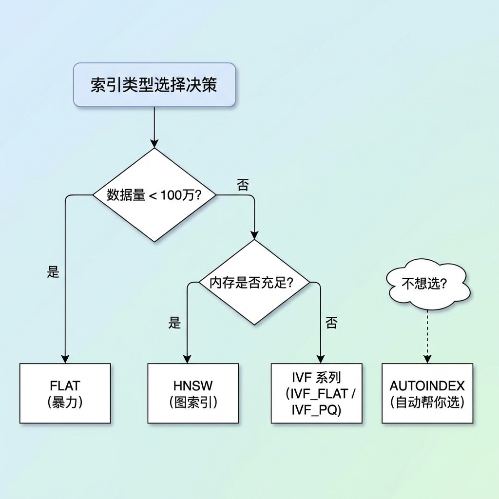

| 索引类型      | 原理                | 优势                         | 劣势                 |
| ------------- | ------------------- | ---------------------------- | -------------------- |
| **FLAT**      | 暴力遍历，逐一比对  | 100% 精确                    | 数据量大时极慢       |
| **IVF_FLAT**  | 聚类 + 局部搜索     | 内存效率高，精度较高         | 需要调参             |
| **IVF_PQ**    | 聚类 + 乘积量化压缩 | 内存占用极低，适合超大数据集 | 精度有损失，需要调参 |
| **HNSW**      | 多层图结构导航      | 搜索速度快，召回率高         | 内存占用较大         |
| **AUTOINDEX** | 自动选择最优算法    | 零配置，无需调参             | 不可控底层实现       |

`AUTOINDEX` 在开源 Milvus 中默认使用 HNSW 算法，这意味着你实际上得到了一个经过预调优的 HNSW 索引

**HNSW 工作原理简述：**

HNSW 的核心思想是**先粗后细**，类似于在陌生城市找一家餐厅：

```
类比：从外地来，要找 "朝阳街128号" 这家餐厅

Layer 2 (高速公路):  只有几个出口，快速锁定大方向
                    "大概在东城区" → 下高速

Layer 1 (主干道):    能看到各个街区，缩小范围
                    "在朝阳街附近" → 拐进去

Layer 0 (小巷子):    挨家挨户看门牌号，精确定位
                    "128号，找到了！"
```

对应到向量搜索，假设数据库中有 8 个商品名（A~H），要找和"万用表"最相似的：

```
数据库中的商品名：
  A = "示波器操作指南"     D = "RS-12 数字万用表"
  B = "电源适配器说明"     E = "万用表配件清单"
  C = "数字万用表手册"     F = "信号发生器指南"
  G = "电路板设计规范"     H = "焊接工具使用"

查询: "万用表怎么测电压"

Layer 2 (只放了 A、D):
  比较相似度: A=0.35  D=0.92
  D 更近（相似度更高） → 从 D 往下找
                    |
                    v
Layer 1 (放了 A、C、D、F):
  从 D 出发看邻居: A=0.35  C=0.88  F=0.21
  C D 更近 （相似度更高） → 从 C 往下找
                    |
                    v
Layer 0 (放了所有 A~H):
  从 C 出发看邻居: B=0.15  D=0.92  E=0.85
  D 相似度最高，再看 D 的邻居也没有更相似的
  最终结果 → D ("RS-12 数字万用表")
```

**为什么要分层？对比暴力搜索：**

```
FLAT（暴力搜索）:
  A → B → C → D → E → F → G → H
  逐一比较全部 8 个，找出最相似的 → 比较了 8 次

HNSW（分层搜索）:
  Layer 2: 只看 A、D                → 2 次
  Layer 1: 从 D 出发只看邻居 A、C、F → 3 次
  Layer 0: 从 C 出发只看邻居 B、D、E → 3 次
                                    → 总共 8 次（数据少时差别不大）

如果有 100 万个商品名：
  FLAT:  逐一比较 → 1,000,000 次
  HNSW:  逐层跳跃 → 大约几百次（跳过了 99.99% 的无关数据）
```

数据量越大，HNSW 的优势越明显。上层节点少，快速排除大片无关区域；下层节点多，在小范围内精确定位。


**为什么商品名场景用 AUTOINDEX？**

- 商品名集合的数据量通常不大（几百到几千条），AUTOINDEX 自动选择的 HNSW 完全够用
- 无需关心 M、efConstruction 等调参细节，降低使用门槛
- 如果未来数据量增长，AUTOINDEX 会自动适配更优的策略

---

**`metric_type="COSINE"` 度量类型说明：**

度量类型决定了"两个向量有多相似"的计算方式。Milvus 对稠密向量支持三种度量类型：

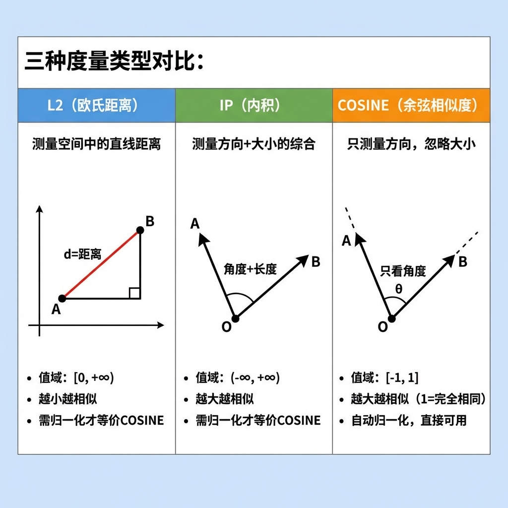

| 度量类型   | 是否需要归一化               | 值域                 | 适用场景               |
| ---------- | ---------------------------- | -------------------- | ---------------------- |
| **L2**     | 不需要                       | [0, +∞)，越小越相似  | 关注绝对距离的场景     |
| **IP**     | **必须归一化**               | (-∞, +∞)，越大越相似 | 已归一化的向量         |
| **COSINE** | **不需要**（Milvus自动处理） | [-1, 1]，越大越相似  | 文本语义相似度（推荐） |

**为什么稠密向量选 COSINE？**

1. **语义匹配只关心方向，不关心大小** —— "RS-12 数字万用表"和"RS-12数字万用表"语义相同，但由于分词差异，向量的模长（大小）可能不同。COSINE 只看方向，忽略模长差异，更稳定
2. **不需要手动归一化** —— IP 度量要求向量必须预先归一化到单位长度，否则结果不正确；COSINE 由 Milvus 自动处理归一化，使用更简单
3. **分数值直观** —— COSINE 的值域是 [-1, 1]，1 表示完全相同，0 表示无关，便于设置阈值（如商品名确认节点中的 0.7 和 0.6）

**为什么稀疏向量选 IP（内积）？**

稀疏向量的值本身就是 token 的权重（TF-IDF 风格），IP 直接计算两个稀疏向量对应 token 权重的乘积之和，天然契合关键词匹配的语义：共同 token 越多且权重越高，IP 值越大。稀疏向量不适合用 COSINE 或 L2。

### 2.5 客户端统一管理架构

本项目采用分层的客户端管理架构，通过继承 `BaseClientManager` 实现统一的双重检查锁缓存机制：

```
+---------------------------------------+
|        BaseClientManager              |
|  (基类：锁、缓存、环境变量校验)          |
|                                       |
|  _require_env(key) -> str             |
|  _get_or_create(attr, lock, factory)  |
+------------------+--------------------+
                   |
          +--------+--------+
          |                 |
          v                 v
+------------------+  +------------------+
|   AIClients      |  | StorageClients   |
|                  |  |                  |
| - OpenAI (VLM)   |  | - Milvus         |
| - ChatOpenAI(LLM)|  | - MinIO          |
| - BGE-M3 (嵌入)  |  |                  |
+------------------+  +------------------+
```

---

## 3. 商品名识别业务处理流程（总）

### 3.1 整体流程概述

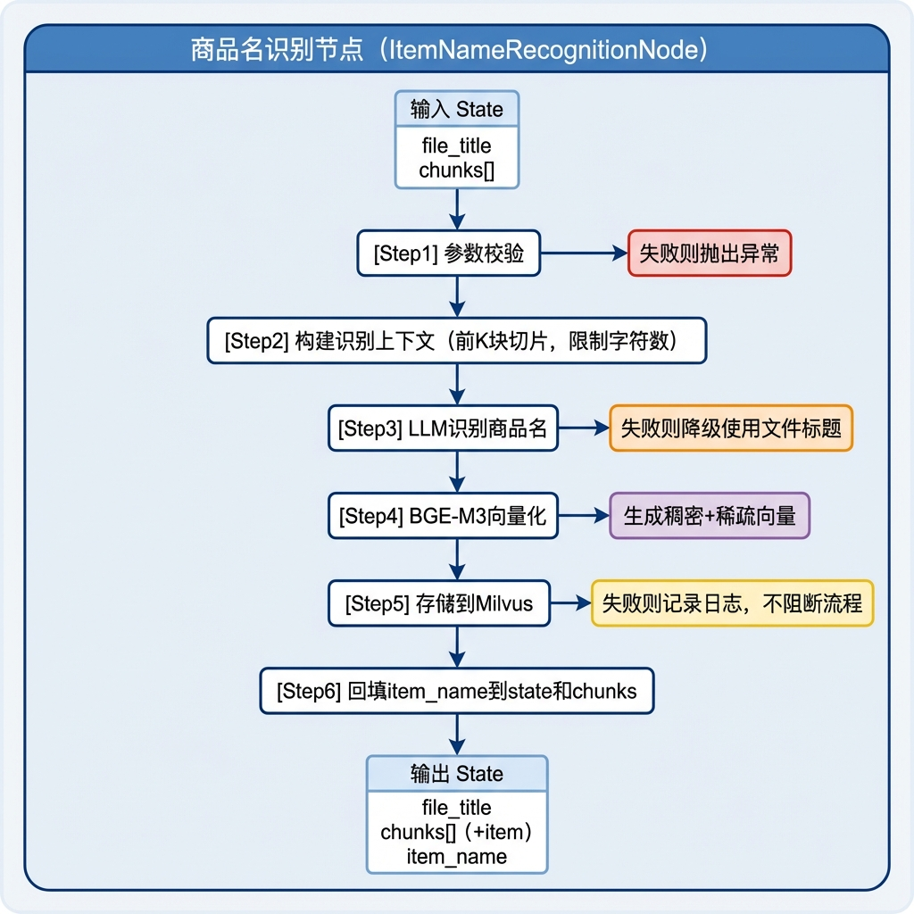

### 3.2 数据流转

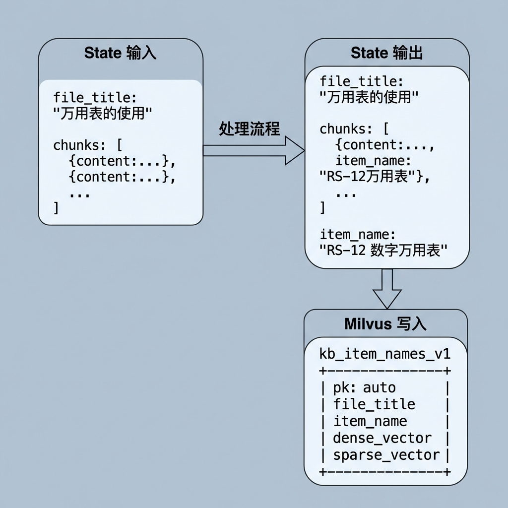

---

## 4. 商品名识别业务处理流程（分）

### 4.1 目标

- 从文档切片中准确识别商品/产品名称（包含品牌、型号）
- 将识别结果回填到图状态和每个切片中
- 生成商品名称的混合嵌入向量（稠密 + 稀疏）
- 将商品名及向量持久化到 Milvus 向量数据库

### 4.2 需求分析

**输入：**

- `file_title`：文件标题（如 "万用表的使用"）
- `chunks`：文档切片列表，每个切片包含 title 和 content

**输出：**

- `item_name`：识别出的商品名称
- 更新后的 `chunks`：每个切片增加 `item_name` 字段
- Milvus 中新增一条商品名记录

**配置参数：**

- `item_name_chunk_k`：用于识别的切片数量
- `item_name_chunk_size`：上下文最大字符数
- `item_name_collection`：商品名集合名称

**边界条件处理：**

| 场景                       | 处理方式                               |
| -------------------------- | -------------------------------------- |
| `file_title` 为空          | 抛出 `StateFieldError`                 |
| `chunks` 为空或无效        | 抛出 `StateFieldError`                 |
| LLM 客户端获取失败         | 降级使用 `file_title` 作为 `item_name` |
| LLM 返回空字符串或 UNKNOWN | 降级使用 `file_title` 作为 `item_name` |
| BGE-M3 客户端获取失败      | 返回 `(None, None)`，跳过入库          |
| 向量化处理失败             | 返回 `(None, None)`，跳过入库          |
| Milvus 客户端获取失败      | 记录错误日志，跳过入库                 |
| Milvus 数据操作失败        | 记录错误日志，不影响回填               |

### 4.3 实现流程

#### 4.3.1 实现流程图

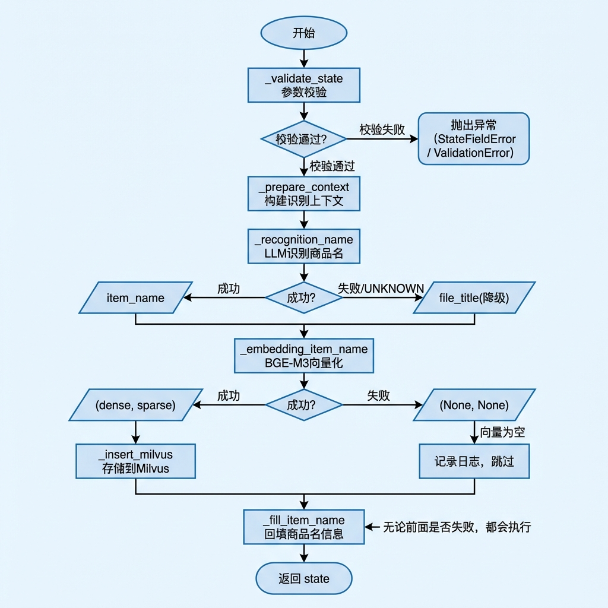

#### 4.3.2 具体实现步骤

##### Step 1: 参数校验

**功能描述：**
验证输入状态中的必要字段，确保后续处理有有效数据。

**实现要点：**

1. **获取 file_title**
   - 从 `state.get('file_title')` 获取文件标题
   - 这是商品名识别的重要参考信息

2. **获取 chunks**
   - 从 `state.get('chunks')` 获取切片列表
   - 切片内容用于辅助 LLM 识别

3. **验证参数有效性**
   - `file_title` 不能为空
   - `chunks` 必须是非空列表
   - `item_name_chunk_k` 必须大于 0
   - `item_name_chunk_size` 必须大于 0

**代码片段：**

```python
def _validate_state(self, state: ImportGraphState):
    # 1. 获取文件标题
    file_title = state.get('file_title')

    # 2. 获取chunks
    chunks = state.get('chunks')

    # 3. 校验标题名
    if not file_title:
        raise StateFieldError(node_name=self.name, field_name="file_title", expected_type=str)

    # 4. 校验chunks
    if not chunks or not isinstance(chunks, list):
        raise StateFieldError(node_name=self.name, field_name="chunks", expected_type=list)

    # 5. 获取商品名识别需要的chunk块数
    item_name_chunks_k = self.config.item_name_chunk_k
    if not item_name_chunks_k or item_name_chunks_k <= 0:
        raise ValidationError(message="item_name_chunk_k为空或者无效", node_name=self.name)

    # 6. 获取商品名识别上下文的最大字符数
    item_name_chunk_size = self.config.item_name_chunk_size
    if not item_name_chunk_size or item_name_chunk_size <= 0:
        raise ValidationError(message="item_name_chunk_size为空或者无效", node_name=self.name)

    return file_title, chunks, item_name_chunks_k, item_name_chunk_size
```

---

##### Step 2: 构建识别上下文

**功能描述：**
从前 K 个切片中提取关键信息，构造供 LLM 识别的上下文文本。

**实现要点：**

1. **确定取样数量**
   - 默认取前 K 个切片（K 由配置 `item_name_chunk_k` 决定）
   - 前几个切片通常包含商品概述、型号等关键信息

2. **按完整 chunk 为单位截断**
   - 先判断加入当前块后是否会超过阈值，超过就不加入，直接跳出
   - 保证每个已加入的 chunk 都是语义完整的，不会出现句子被截断的情况

3. **格式化输出**
   - 使用 "【切片】- N - content" 格式
   - 结构化的输入有助于 LLM 理解

**代码片段：**

```python
def _prepare_item_name_recognition_context(self, chunks: List[Dict], item_name_chunks_k: int,
                                           item_name_chunk_size: int):
    total = 0
    final_context = []
    for index, chunk in enumerate(chunks[:item_name_chunks_k]):

        # 1. 判断chunk对象的类型
        if not isinstance(chunk, dict):
            continue

        # 2. 获取内容
        chunk_content = chunk.get('content')
        context = f"【切片】-{index}-{chunk_content}"

        # 3. 先判断再加入，保证语义完整性
        if total + len(context) > item_name_chunk_size:
            break

        total += len(context)
        final_context.append(context)

    return "\n".join(final_context)
```

**为什么先判断再加入？**

```
chunk1(200字) -> 200 < 1000 -> 加入 -> total=200
chunk2(300字) -> 500 < 1000 -> 加入 -> total=500
chunk3(800字) -> 1300 > 1000 -> 不加入 -> break
最终结果: chunk1 + chunk2  <-- 每个chunk语义完整
```

---

##### Step 3: 调用 LLM 识别

**功能描述：**
调用大语言模型从文件标题和切片内容中识别商品名称。

**实现要点：**

1. **获取 LLM 客户端**
   - 通过 `AIClients.get_openai_llm(response_format=False)` 获取客户端
   - 注意：商品名识别只需返回纯文本，不需要 JSON 格式，所以 `response_format=False`

2. **构建提示词**
   - SystemMessage：系统角色设定
   - HumanMessage：包含文件标题和上下文内容

3. **异常分离处理**
   - 客户端获取失败和 LLM 调用失败分别捕获，日志精确定位问题
   - 所有失败场景均降级使用 `file_title`

**代码片段：**

```python
def _recognition_name(self, file_title: str, item_name_recognition_context: str) -> str:
    try:
        # 1. 获取LLM客户端（不需要JSON格式）
        llm_client = AIClients.get_openai_llm(response_format=False)

        # 2. 构建提示词
        user_prompt = ITEM_NAME_USER_PROMPT_TEMPLATE.format(
            file_title=file_title,
            context=item_name_recognition_context
        )
        system_prompt = ITEM_NAME_SYSTEM_PROMPT

        # 3. LLM调用
        llm_response = llm_client.invoke([
            SystemMessage(content=system_prompt),
            HumanMessage(content=user_prompt)
        ])

        # 4. 获取并校验结果
        llm_result = llm_response.content.strip()

        if not llm_result or llm_result == "UNKNOWN":
            self.logger.info(f"LLM未识别出商品名，降级使用标题: {file_title}")
            return file_title

        self.logger.info(f"LLM提取到商品名: {llm_result}")
        return llm_result

    except Exception as e:
        self.logger.error(f"LLM调用失败，降级使用标题: {file_title}，异常: {e}")
        return file_title
```

**提示词模板示例：**

```python
# System Prompt
ITEM_NAME_SYSTEM_PROMPT = "你是商品识别专家，只输出商品名称字符串。"

# User Prompt Template
ITEM_NAME_USER_PROMPT_TEMPLATE = """
请从以下信息中识别出商品名称与型号：
文件名：{file_title}

正文切片（用于辅助识别）：
{context}

要求：
1. 返回内容为字符串形式，最好是带品牌、型号和名称的完整商品名称；
2. 返回结果应该只包含商品名称，不要添加任何解释或其他内容；
3. 如果无法识别商品名称,请返回 UNKNOWN。
"""
```

---

##### Step 4: 向量嵌入

**功能描述：**
使用 BGE-M3 模型为商品名称生成稠密向量和稀疏向量。

**实现要点：**

1. **获取 BGE-M3 模型**
   - 通过 `AIClients.get_bge_m3_client()` 获取，线程安全且带缓存

2. **异常分离**
   - `ConnectionError`：客户端获取失败
   - `Exception`：向量化处理失败（encode、CSR 解析等）
   - 两者日志信息不同，便于排查

3. **注意 CSR 矩阵中 indices 和 data 的含义**
   - `indices` 存的是 token_id（列索引）
   - `data` 存的是 weight（权重值）
   - **不要搞反！** 搞反会导致 Milvus 报 `invalid input for sparse float vector`

**代码片段：**

```python
def _embedding_item_name(self, item_name: str) -> Tuple[Optional[List], Optional[Dict[str, Any]]]:
    try:
        # 1. 获取嵌入模型客户端
        bge_m3_client = AIClients.get_bge_m3_client()

        vector_result = bge_m3_client.encode_documents([item_name])

        # 2. 获取稠密向量
        dense_vector = vector_result['dense'][0].tolist()

        # 3. 获取稀疏向量
        start_index = vector_result['sparse'].indptr[0]
        end_index = vector_result['sparse'].indptr[1]

        # 注意：indices 是 token_id，data 是权重，不要搞反！
        token_id = vector_result['sparse'].indices[start_index:end_index].tolist()
        weight = vector_result['sparse'].data[start_index:end_index].tolist()

        sparse_vector = dict(zip(token_id, weight))

        return dense_vector, sparse_vector

    except ConnectionError as e:
        self.logger.error(f"BGE-M3 客户端获取失败: {e}")
        return None, None
    except Exception as e:
        self.logger.error(f"商品名 [{item_name}] 向量化处理失败: {e}")
        return None, None
```

---

##### Step 5: 保存到 Milvus

**功能描述：**
将商品名称及其向量持久化到 Milvus 向量数据库。

**实现要点：**

1. **向量有效性检查**
   - 先判断 `dense_vector` 和 `sparse_vector` 是否为空
   - 为空则直接 return，不会去创建 Milvus 客户端（避免无意义的连接）

2. **Milvus 客户端获取与数据操作分离 try**
   - 客户端获取失败和数据操作失败的日志信息不同
   - 每个 try 只包一个可能失败的"动作"，日志精确

3. **集合幂等创建**
   - 使用 `has_collection()` 检查，不存在则创建
   - 首次运行时自动建表，简化部署

**代码片段：**

```python
def _insert_milvus(self, file_title, item_name, dense_vector, sparse_vector, item_name_collection):

    # 1. 向量有效性检查（为空则跳过，不去创建Milvus连接）
    if not dense_vector or not sparse_vector:
        self.logger.error(f"文档{file_title} 对应的商品名{item_name} 向量生成不完整")
        return

    # 2. 获取 Milvus 客户端（单独 try）
    try:
        milvus_client = StorageClients.get_milvus_client()
    except Exception as e:
        self.logger.error(f"Milvus 客户端创建失败: {e}")
        return

    # 3. 数据操作（单独 try）
    try:
        if not milvus_client.has_collection(item_name_collection):
            self._create_item_name_collection(item_name_collection, milvus_client)

        data = {
            "file_title": file_title,
            "item_name": item_name,
            "dense_vector": dense_vector,
            "sparse_vector": sparse_vector
        }

        result = milvus_client.insert(collection_name=item_name_collection, data=[data])
        self.logger.info(f"已成功保存到 Milvus，ID: {result['ids'][0]}")
    except Exception as e:
        self.logger.error(f"Milvus 数据操作失败: {e}")
```

---

##### 辅助方法: 创建集合

**功能描述：**
创建商品名集合的 Schema 和索引。

**实现要点：**

1. **创建 Schema**
   - 主键 `pk`：VARCHAR 类型，自动生成
   - 标量字段：`file_title`、`item_name`
   - 向量字段：`dense_vector`（1024维）、`sparse_vector`

2. **创建索引**
   - 稠密向量使用 AUTOINDEX + COSINE
   - 稀疏向量使用 SPARSE_INVERTED_INDEX + IP

**代码片段：**

```python
def _create_item_name_collection(self, collection_name, milvus_client):
    schema = milvus_client.create_schema()

    schema.add_field(field_name="pk", datatype=DataType.VARCHAR,
                    is_primary=True, auto_id=True, max_length=100)
    schema.add_field(field_name="file_title", datatype=DataType.VARCHAR, max_length=65535)
    schema.add_field(field_name="item_name", datatype=DataType.VARCHAR, max_length=65535)
    schema.add_field(field_name="dense_vector", datatype=DataType.FLOAT_VECTOR, dim=1024)
    schema.add_field(field_name="sparse_vector", datatype=DataType.SPARSE_FLOAT_VECTOR)

    index_param = milvus_client.prepare_index_params()
    index_param.add_index(field_name="dense_vector",
                          index_name="dense_vector_index",
                          index_type="AUTOINDEX", metric_type="COSINE")
    index_param.add_index(field_name="sparse_vector",
                          index_name="sparse_vector_index",
                          index_type="SPARSE_INVERTED_INDEX", metric_type="IP")

    milvus_client.create_collection(
        collection_name=collection_name,
        schema=schema, index_params=index_param
    )
    self.logger.info(f"集合 {collection_name} 创建成功并构建了索引")
```

---

##### Step 6: 回填结果

**功能描述：**
将识别出的商品名称回填到状态和每个切片中。

**实现要点：**

1. **更新 chunks（给下游模型用）**
   - 为每个 chunk 字典添加 `item_name` 字段
   - 下游节点处理单个切片时可直接获取商品名作为上下文

2. **更新 state（给下游程序逻辑用）**
   - 设置 `state['item_name']`
   - 后续节点通过 `state['item_name']` 直接获取，无需遍历 chunks

3. **为什么不需要手动将 chunks 写回 state？**
   - Python 中 list 和 dict 是引用类型
   - `chunks = state.get('chunks')` 拿到的是同一个列表对象
   - 修改 chunks 里的 dict，`state['chunks']` 同步变化

**代码片段：**

```python
def _fill_item_name(self, item_name, state, chunks):
    for chunk in chunks:
        chunk['item_name'] = item_name  # chunk 级别的回填是给下游模型用的

    state['item_name'] = item_name     # state 级别的回填是给下游程序逻辑用的
```

---

### 4.4 完整代码实现

```python
# knowledge/processor/import_processor/nodes/item_name_recognition_node.py

from json import JSONDecodeError
from typing import Dict, List, Tuple, Optional, Any
from langchain_core.messages import SystemMessage, HumanMessage
from pymilvus.model.hybrid import BGEM3EmbeddingFunction
from pymilvus import MilvusClient, DataType

from knowledge.processor.import_processor.state import ImportGraphState
from knowledge.processor.import_processor.base import BaseNode
from knowledge.processor.import_processor.exceptions import StateFieldError, ValidationError
from knowledge.utils.client.ai_clients import AIClients
from knowledge.prompts.import_prompt import ITEM_NAME_SYSTEM_PROMPT, ITEM_NAME_USER_PROMPT_TEMPLATE
from knowledge.utils.client.storage_clients import StorageClients


class ItemNameRecognitionNode(BaseNode):
    name = "item_name_recognition_node"

    def process(self, state: ImportGraphState) -> ImportGraphState:
        # 1. 参数校验
        file_title, chunks, item_name_chunks_k, item_name_chunk_size = self._validate_state(state)

        # 2. 构建商品名识别上下文
        item_name_recognition_context = self._prepare_item_name_recognition_context(
            chunks, item_name_chunks_k, item_name_chunk_size
        )

        # 3. LLM商品名识别
        item_name = self._recognition_name(file_title, item_name_recognition_context)

        # 4. 向量化提取到商品名
        dense_vector, sparse_vector = self._embedding_item_name(item_name)

        # 5. 存储到milvus中
        self._insert_milvus(file_title, item_name, dense_vector, sparse_vector,
                           self.config.item_name_collection)

        # 6. 回填item_name信息
        self._fill_item_name(item_name, state, chunks)

        return state

    def _validate_state(self, state: ImportGraphState) ->Tuple[str,List,int,int]:
        file_title = state.get('file_title')
        chunks = state.get('chunks')

        if not file_title:
            raise StateFieldError(node_name=self.name, field_name="file_title", expected_type=str)
        if not chunks or not isinstance(chunks, list):
            raise StateFieldError(node_name=self.name, field_name="chunks", expected_type=list)

        item_name_chunks_k = self.config.item_name_chunk_k
        if not item_name_chunks_k or item_name_chunks_k <= 0:
            raise ValidationError(message="item_name_chunk_k为空或者无效", node_name=self.name)

        item_name_chunk_size = self.config.item_name_chunk_size
        if not item_name_chunk_size or item_name_chunk_size <= 0:
            raise ValidationError(message="item_name_chunk_size为空或者无效", node_name=self.name)

        return file_title, chunks, item_name_chunks_k, item_name_chunk_size

    def _prepare_item_name_recognition_context(self, chunks, item_name_chunks_k, item_name_chunk_size)->str:
        total = 0
        final_context = []
        for index, chunk in enumerate(chunks[:item_name_chunks_k]):
            if not isinstance(chunk, dict):
                continue
            chunk_content = chunk.get('content')
            context = f"【切片】-{index}-{chunk_content}"

            if total + len(context) > item_name_chunk_size:
                break

            total += len(context)
            final_context.append(context)

        return "\n".join(final_context)

    def _recognition_name(self, file_title, item_name_recognition_context)->str:
        try:
            llm_client = AIClients.get_openai_llm(response_format=False)
            user_prompt = ITEM_NAME_USER_PROMPT_TEMPLATE.format(
                file_title=file_title, context=item_name_recognition_context
            )

            llm_response = llm_client.invoke([
                SystemMessage(content=ITEM_NAME_SYSTEM_PROMPT),
                HumanMessage(content=user_prompt)
            ])

            llm_result = llm_response.content.strip()
            if not llm_result or llm_result == "UNKNOWN":
                self.logger.info(f"LLM未识别出商品名，降级使用标题: {file_title}")
                return file_title

            self.logger.info(f"LLM提取到商品名: {llm_result}")
            return llm_result
        except Exception as e:
            self.logger.error(f"LLM调用失败，降级使用标题: {file_title}，异常: {e}")
            return file_title

    def _embedding_item_name(self, item_name)-> Tuple[List[float], Dict[int, float]]:
        try:
            bge_m3_client = AIClients.get_bge_m3_client()
            vector_result = bge_m3_client.encode_documents([item_name])

            dense_vector = vector_result['dense'][0].tolist()
            start_index = vector_result['sparse'].indptr[0]
            end_index = vector_result['sparse'].indptr[1]
            token_id = vector_result['sparse'].indices[start_index:end_index].tolist()
            weight = vector_result['sparse'].data[start_index:end_index].tolist()
            sparse_vector = dict(zip(token_id, weight))

            return dense_vector, sparse_vector
        except ConnectionError as e:
            self.logger.error(f"BGE-M3 客户端获取失败: {e}")
            return None, None
        except Exception as e:
            self.logger.error(f"商品名 [{item_name}] 向量化处理失败: {e}")
            return None, None

    def _insert_milvus(self, file_title, item_name, dense_vector, sparse_vector, item_name_collection):
        if not dense_vector or not sparse_vector:
            self.logger.error(f"文档{file_title} 对应的商品名{item_name} 向量生成不完整")
            return

        try:
            milvus_client = StorageClients.get_milvus_client()
        except Exception as e:
            self.logger.error(f"Milvus 客户端创建失败: {e}")
            return

        try:
            if not milvus_client.has_collection(item_name_collection):
                self._create_item_name_collection(item_name_collection, milvus_client)

            data = {
                "file_title": file_title,
                "item_name": item_name,
                "dense_vector": dense_vector,
                "sparse_vector": sparse_vector
            }
            result = milvus_client.insert(collection_name=item_name_collection, data=[data])
            self.logger.info(f"已成功保存到 Milvus，ID: {result['ids'][0]}")
        except Exception as e:
            self.logger.error(f"Milvus 数据操作失败: {e}")

    def _create_item_name_collection(self, collection_name, milvus_client):
        schema = milvus_client.create_schema()
        schema.add_field(field_name="pk", datatype=DataType.VARCHAR,
                        is_primary=True, auto_id=True, max_length=100)
        schema.add_field(field_name="file_title", datatype=DataType.VARCHAR, max_length=65535)
        schema.add_field(field_name="item_name", datatype=DataType.VARCHAR, max_length=65535)
        schema.add_field(field_name="dense_vector", datatype=DataType.FLOAT_VECTOR, dim=1024)
        schema.add_field(field_name="sparse_vector", datatype=DataType.SPARSE_FLOAT_VECTOR)

        index_param = milvus_client.prepare_index_params()
        index_param.add_index(field_name="dense_vector", index_name="dense_vector_index",
                              index_type="AUTOINDEX", metric_type="COSINE")
        index_param.add_index(field_name="sparse_vector", index_name="sparse_vector_index",
                              index_type="SPARSE_INVERTED_INDEX", metric_type="IP")

        milvus_client.create_collection(collection_name=collection_name,
                                        schema=schema, index_params=index_param)
        self.logger.info(f"集合 {collection_name} 创建成功并构建了索引")

    def _fill_item_name(self, item_name, state, chunks):
        for chunk in chunks:
            chunk['item_name'] = item_name

        state['item_name'] = item_name
```

**关键设计点：**

1. **客户端统一管理**
   - LLM、BGE-M3 通过 `AIClients` 获取，Milvus 通过 `StorageClients` 获取
   - 底层不打日志只抛异常，业务节点统一处理

2. **异常分离**
   - 每个可能失败的步骤独立 try/catch
   - 日志精确描述是哪一步失败（客户端获取 vs 业务调用）

3. **优雅降级**
   - LLM 失败 → 使用文件标题
   - 嵌入失败 → 返回 (None, None)，跳过入库
   - Milvus 失败 → 记录日志，不阻断回填

4. **上下文按完整 chunk 截断**
   - 先判断再加入，保证每个切片语义完整

---

## 5. 测试运行

### 5.1 测试代码

```python
import json
from knowledge.processor.import_processor.base import setup_logging

if __name__ == '__main__':
    setup_logging()

    # 1. 读取chunk.json
    chunk_json_path = r"D:\...\chunks.json"
    with open(chunk_json_path, "r", encoding="utf-8") as f:
        chunk_content = json.load(f)

    # 2. 构建state
    state = {
        "file_title": "万用表的使用",
        "chunks": chunk_content
    }

    # 3. 实例化节点
    node = ItemNameRecognitionNode()

    # 4. 调用process
    result = node.process(state)

    # 5. 输出结果
    print(f"商品名: {result.get('item_name')}")
    print(f"chunks数量: {len(result.get('chunks', []))}")
    print(f"首个chunk是否含item_name: {'item_name' in result['chunks'][0]}")
```

### 5.2 运行测试

```bash
# 进入项目目录
cd knowledge

# 激活虚拟环境
.venv\Scripts\activate

# 运行测试
python -m knowledge.processor.import_processor.nodes.item_name_recognition_node
```

### 5.3 预期输出

```
2026-04-01 23:24:52 - httpx - INFO - HTTP Request: POST https://dashscope.aliyuncs.com/compatible-mode/v1/chat/completions "HTTP/1.1 200 OK"
2026-04-01 23:24:52 - import.item_name_recognition_node - INFO - LLM提取到商品名:RS-12 数字万用表
2026-04-01 23:24:53 - FlagEmbedding - INFO - loading existing colbert_linear and sparse_linear---------
2026-04-01 23:24:58 - import.item_name_recognition_node - INFO - 集合 kb_item_names_v1 创建成功并构建了索引
2026-04-01 23:24:58 - import.item_name_recognition_node - INFO - 已成功保存到 Milvus，ID: 449234567890123456
商品名: RS-12 数字万用表
chunks数量: 22
首个chunk是否含item_name: True
```

---

## 6. 总结

### 6.1 节点功能概览

| 功能模块        | 说明                                       |
| --------------- | ------------------------------------------ |
| **参数校验**    | 检查 file_title、chunks、config 的有效性   |
| **上下文构建**  | 从前 K 个切片按完整 chunk 截断提取关键信息 |
| **LLM 识别**    | 调用大语言模型从文本中提取商品名称         |
| **向量嵌入**    | 使用 BGE-M3 生成混合嵌入（稠密 + 稀疏）    |
| **Milvus 存储** | 创建集合并持久化商品名向量                 |
| **状态回填**    | 将识别结果写入 state 和每个 chunk          |

### 6.2 设计要点

1. **客户端分层管理**
   - `BaseClientManager` 提供双重检查锁模板
   - `AIClients` 管理 AI 模型类客户端
   - `StorageClients` 管理存储类客户端
   - 底层只抛异常，业务层统一打日志

2. **优雅降级**
   - LLM 初始化/调用失败 → 使用文件标题
   - LLM 返回空或 UNKNOWN → 使用文件标题
   - 嵌入失败 → 跳过入库，不阻断回填
   - Milvus 失败 → 记录日志，不阻断回填

3. **混合嵌入**
   - 稠密向量捕捉语义相似性（"万用表" ↔ "数字万用表"）
   - 稀疏向量保留关键词匹配（"RS-12" 精确匹配型号）
   - 两者结合提升检索准确率

4. **异常精确分离**
   - 每个 try 只包一个可能失败的动作
   - `ConnectionError` vs `Exception` 区分客户端获取与业务操作
   - 日志信息精确描述失败原因

