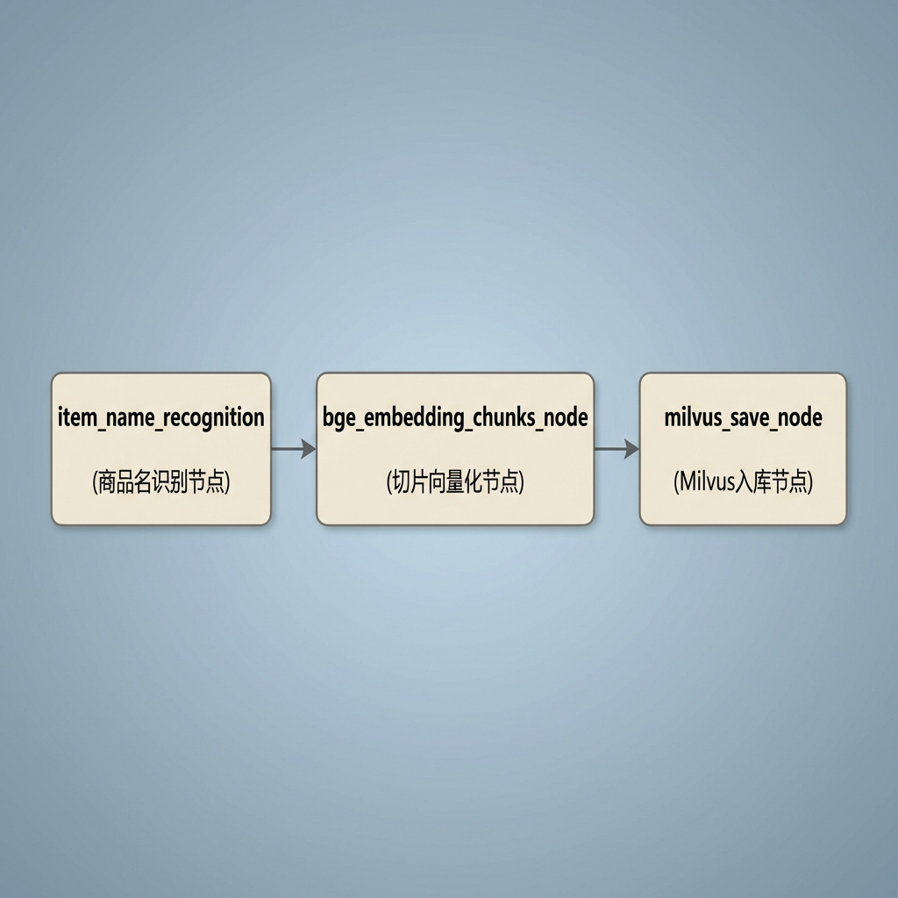
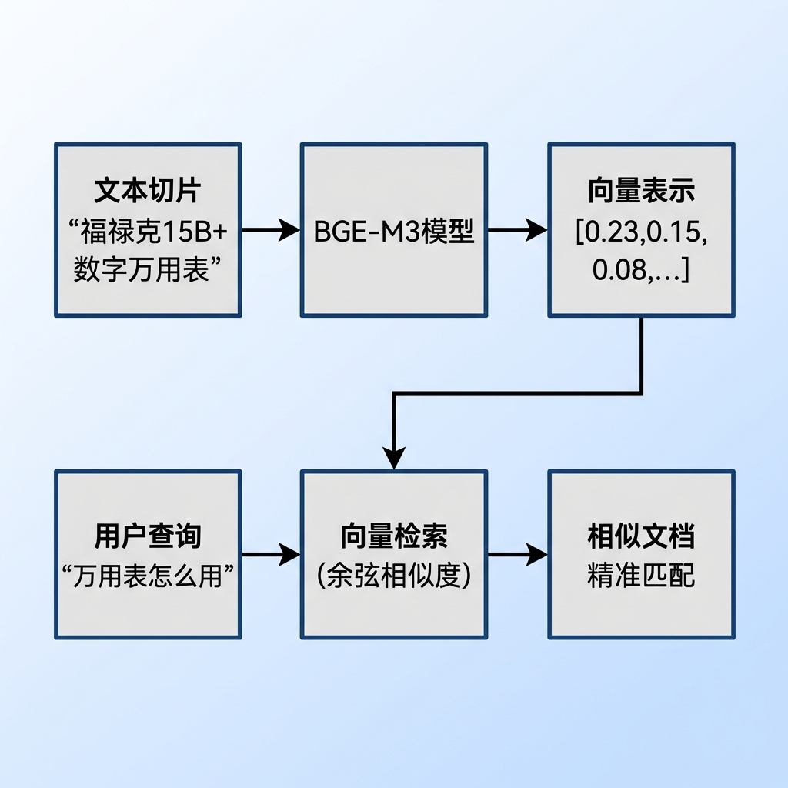
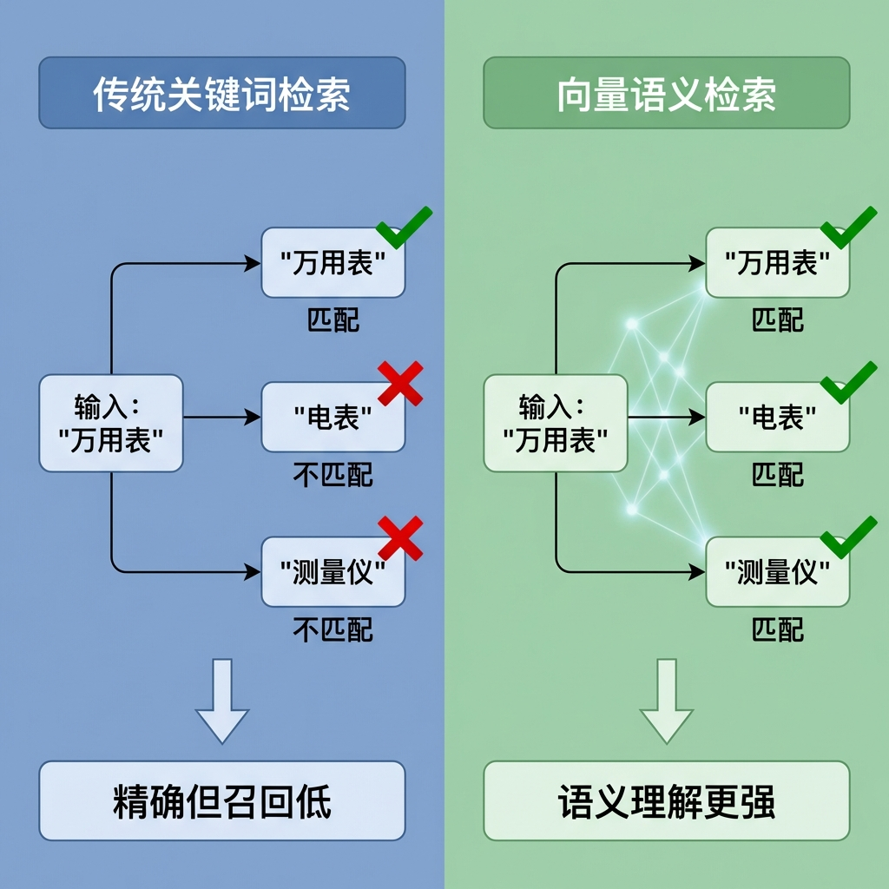
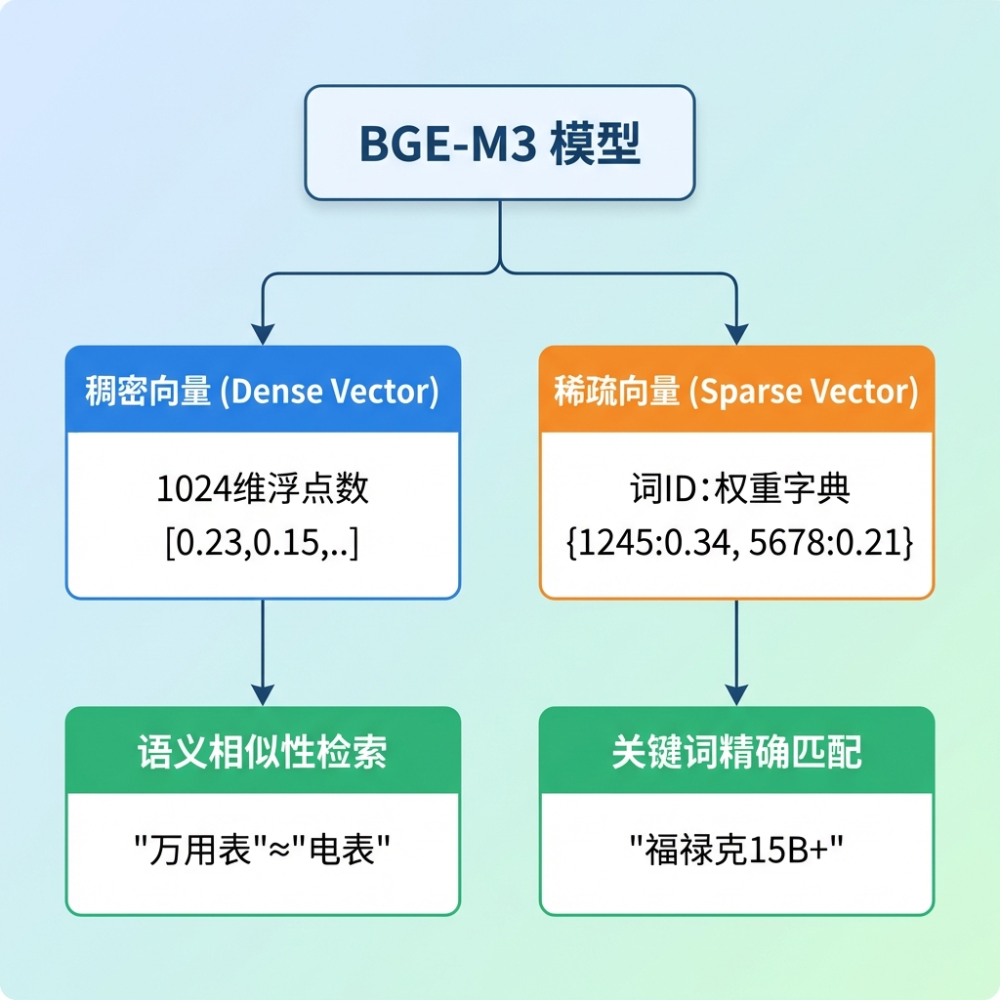
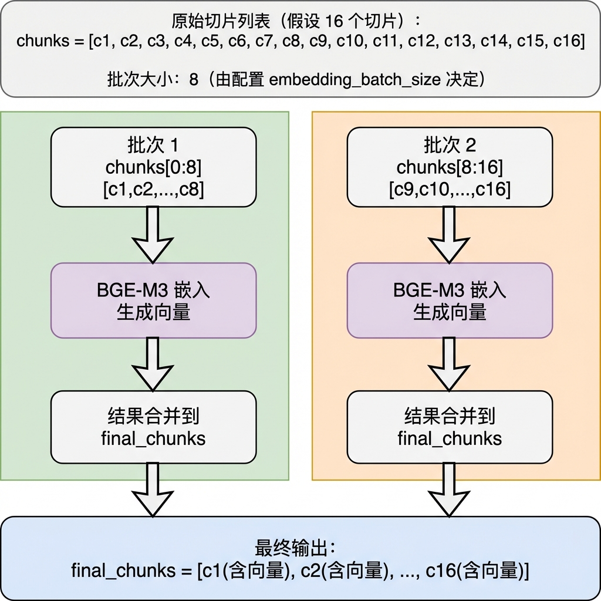
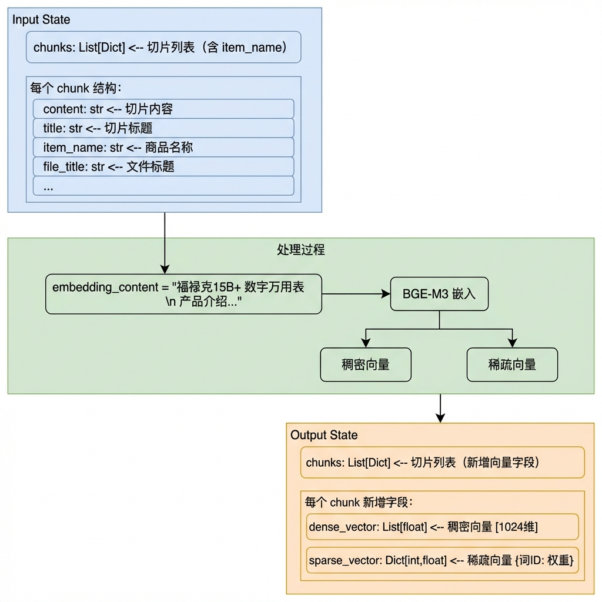
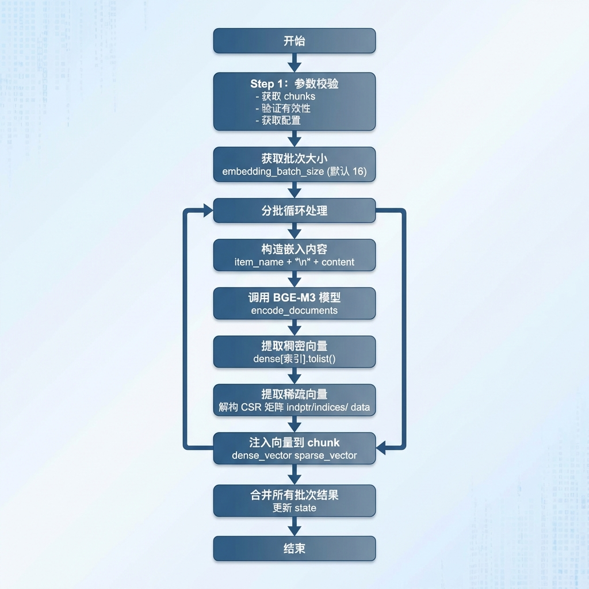

# 切片向量化节点

> 本文档详细介绍知识库导入流程中的切片向量化节点（BgeEmbeddingChunksNode），该节点负责为每个文档切片生成稠密向量和稀疏向量，为后续的混合检索提供向量基础。

---

## 1. 任务目标

### 1.1 本章目标

通过本章学习，你将掌握：

1. **BGE-M3 模型原理**：理解稠密向量与稀疏向量的区别与互补性
2. **CSR 稀疏矩阵**：学会从 CSR 格式中提取稀疏向量
3. **批量处理策略**：掌握大规模向量化的分批处理技术
4. **错误容忍设计**：学会设计单批失败不影响全局的健壮架构

### 1.2 涉及文件

```
knowledge/
├── processor/import_process/nodes/
│   └── bge_embedding_chunks_node.py    # 切片向量化节点（本章重点）
│
└── utils/
    └── bge_m3_embedding_util.py         # BGE-M3 模型封装
```

### 1.3 节点在流程中的位置



---

## 2. 核心概念扫盲

### 2.1 为什么切片需要向量化？

向量化是将文本转换为数学表示的过程，是实现语义检索的基础：



**向量化的意义：**



### 2.2 稠密向量 vs 稀疏向量

BGE-M3 模型同时输出两种向量，各有优势：



**对比分析：**

| 特性           | 稠密向量             | 稀疏向量         |
| -------------- | -------------------- | ---------------- |
| **维度**       | 固定 1024 维         | 动态（非零元素） |
| **存储**       | 全量存储             | 只存非零元素     |
| **语义理解**   | 强（同义词、近义词） | 弱（精确匹配）   |
| **关键词匹配** | 弱                   | 强（型号、品牌） |
| **适用场景**   | 语义检索             | 关键词检索       |

### 2.3 CSR 稀疏矩阵格式

BGE-M3 返回的稀疏向量采用 **CSR（Compressed Sparse Row）** 格式存储：


**CSR 三数组解析：**

```python
# indptr: 行指针数组，长度为 (行数 + 1)
indptr = csr_array.indptr

# indices: 列索引数组，存储非零元素的列位置
indices = csr_array.indices

# data: 数值数组，存储非零元素的值
data = csr_array.data

# 提取第 i 行的稀疏向量
start = indptr[i]      # 第 i 行起始位置
end = indptr[i + 1]    # 第 i 行结束位置
token_ids = indices[start:end].tolist()  # 词 ID 列表
weights = data[start:end].tolist()        # 权重列表
sparse_vector = dict(zip(token_ids, weights))
```

### 2.4 批量处理策略

大规模向量化需要分批处理，以平衡内存占用和处理效率：



**为什么分批处理？**

| 原因             | 说明                       |
| ---------------- | -------------------------- |
| **GPU 显存限制** | 批量过大可能导致 OOM       |
| **错误隔离**     | 单批失败不影响其他批次     |
| **进度反馈**     | 可以记录每个批次的处理进度 |

---

## 3. 切片向量化业务处理流程（总）

### 3.1 整体流程概述


### 3.2 数据流转图



---

## 4. 切片向量化业务处理流程（分）

### 4.1 目标

为每个文档切片生成高质量的稠密向量和稀疏向量，使其能够支持后续的混合检索（语义检索 + 关键词检索）。

### 4.2 需求分析

| 需求项     | 说明                                 | 解决方案                         |
| ---------- | ------------------------------------ | -------------------------------- |
| 向量质量   | 需要同时支持语义检索和关键词精确匹配 | 使用 BGE-M3 生成稠密+稀疏双向量  |
| 商品关联   | 同一商品的切片向量应有较高相似度     | 拼接 item_name 到输入文本        |
| 大规模处理 | 可能有数百甚至上千个切片             | 分批处理，避免 OOM               |
| 错误容忍   | 单个批次失败不应影响全局             | 批次级错误捕获，失败时返回原数据 |

### 4.3 实现流程

#### 4.3.1 实现流程图



#### 4.3.2 具体实现步骤

##### Step 1：参数校验

**功能描述：**
从状态中获取切片列表，并验证其有效性。

**处理逻辑：**

1. 从 state 中获取 "chunks" 字段
2. 检查 chunks 是否为非空列表
3. 如果无效，抛出 `ValidationError` 异常
4. 获取配置信息

**代码片段：**

```python
def _validate_get_inputs(self, state: ImportGraphState):
    config = get_config()

    self.log_step("step1", "参数校验")

    # 1. 获取chunks
    chunks = state.get('chunks')

    # 2. 校验chunks
    if not chunks or not isinstance(chunks, list):
        raise ValidationError(f"chunks为空或者无效", self.name)

    # 3. 返回chunks
    self.logger.info(f"嵌入的块数：{len(chunks)}")
    return chunks, config
```

---

##### Step 2：分批处理入口

**功能描述：**
按照配置的批次大小，分批调用模型生成向量。

**处理逻辑：**

1. 获取批次大小 `embedding_batch_size`（默认 16）
2. 计算总切片数量
3. 循环分批处理
4. 合并所有批次结果

**代码片段：**

```python
def process(self, state: ImportGraphState) -> ImportGraphState:
    # 1. 参数校验
    validated_chunks, config = self._validate_get_inputs(state)

    # 2. 获取批量嵌入的阈值
    embedding_batch_chunk_size = getattr(config, 'embedding_batch_size', 16)

    # 3. 准备分批嵌入
    total_length = len(validated_chunks)
    final_chunks = []

    for i in range(0, total_length, embedding_batch_chunk_size):
        batch = validated_chunks[i:i + embedding_batch_chunk_size]
        # 拼接要嵌入的内容，向量嵌入，把嵌入的向量注入到chunk中
        batch_chunks = self._process_batch_chunks(batch, i, total_length)
        final_chunks.extend(batch_chunks)

    # 4. 更新&返回state
    state['chunks'] = final_chunks

    return state
```

---

##### Step 3：构造输入文本

**功能描述：**
为每个切片构造模型输入文本。

**处理逻辑：**

1. 遍历批次中的每个 chunk
2. 提取 `content` 和 `item_name`
3. 拼接为最终嵌入内容

**设计原因：**

- 将商品名称编码到向量中，使同一商品的切片具有更高相似度
- 便于后续按商品维度进行向量过滤和聚合

**代码片段：**

```python
# 1. 循环处理所有chunk的要嵌入的内容拼接
embedding_contents = []
for _, chunk in enumerate(batch):
    # 1.1 提取content
    content = chunk.get('content')

    # 1.2 提取item_name
    item_name = chunk.get('item_name')

    # 1.3 拼接要嵌入的最终内容
    embedding_content = f"{item_name}\n{content}"

    embedding_contents.append(embedding_content)
```

---

##### Step 4：调用模型生成向量

**功能描述：**
批量调用 BGE-M3 模型生成嵌入。

**输入：**

- `embedding_contents`: 拼接后的文本列表

**输出：**

- `embedding_result`: 包含 "dense" 和 "sparse" 两个键的字典

**代码片段：**

```python
# 2. 批量嵌入
try:
    bge_m3_model = get_beg_m3_embedding_model()
    embedding_result = bge_m3_model.encode_documents(documents=embedding_contents)

    if not embedding_result:
        self.logger.warning(f"嵌入后的结果不存在...")
        return batch
except Exception as e:
    self.logger.warning(f"嵌入向量嵌入失败...{str(e)}")
    return batch
```

---

##### Step 5：提取稠密向量

**功能描述：**
从模型输出中提取稠密向量。

**处理逻辑：**

1. 从 `embedding_result['dense']` 中按索引获取对应行
2. 调用 `.tolist()` 转换为 Python 列表

**代码片段：**

```python
# 3.1 获取稠密向量
dense_vector = embedding_result['dense'][index].tolist()
```

---

##### Step 6：提取稀疏向量

**功能描述：**
从 CSR 矩阵中提取稀疏向量。

**处理逻辑：**

1. 获取 CSR 矩阵的三个数组：`indptr`、`indices`、`data`
2. 使用 `indptr` 确定当前行的起止索引
3. 从 `indices` 提取 Token ID
4. 从 `data` 提取对应权重
5. 组装为字典格式

**代码片段：**

```python
# 3.2 解构csr矩阵&获取稀疏向量
csr_array = embedding_result['sparse']

# a) 行索引
ind_ptr = csr_array.indptr

# b) 获取行索引的起始值
start_ind_ptr = ind_ptr[index]
end_ind_ptr = ind_ptr[index + 1]

# c) 获取token_id
token_id = csr_array.indices[start_ind_ptr:end_ind_ptr].tolist()

# d) 获取权重
weight = csr_array.data[start_ind_ptr:end_ind_ptr].tolist()

# 3.3 获取稀疏向量
sparse_vector = dict(zip(token_id, weight))
```

---

##### Step 7：注入向量到 chunk

**功能描述：**
将生成的向量注入到原始 chunk 中。

**代码片段：**

```python
# 3.4 注入
chunk['dense_vector'] = dense_vector
chunk['sparse_vector'] = sparse_vector
```

---

##### Step 8：完整批次处理方法

**功能描述：**
完整的批次处理逻辑，包含错误处理。

**代码片段：**

```python
def _process_batch_chunks(self, batch: List[Dict[str, Any]], star_index: int, total_length: int):
    self.log_step("step2", f"开始批量处理chunk嵌入:批次{star_index + 1}-{star_index + len(batch)}")

    # 1. 循环处理所有chunk的要嵌入的内容拼接
    embedding_contents = []
    for _, chunk in enumerate(batch):
        content = chunk.get('content')
        item_name = chunk.get('item_name')
        embedding_content = f"{item_name}\n{content}"
        embedding_contents.append(embedding_content)

    # 2. 批量嵌入
    try:
        bge_m3_model = get_beg_m3_embedding_model()
        embedding_result = bge_m3_model.encode_documents(documents=embedding_contents)

        if not embedding_result:
            self.logger.warning(f"嵌入后的结果不存在...")
            return batch
    except Exception as e:
        self.logger.warning(f"嵌入向量嵌入失败...{str(e)}")
        return batch

    # 3. 循环处理所有chunk的向量以及注入到每一个chunk中
    for index, chunk in enumerate(batch):
        # 3.1 获取稠密向量
        dense_vector = embedding_result['dense'][index].tolist()

        # 3.2 解构csr矩阵&获取稀疏向量
        csr_array = embedding_result['sparse']
        ind_ptr = csr_array.indptr
        start_ind_ptr = ind_ptr[index]
        end_ind_ptr = ind_ptr[index + 1]
        token_id = csr_array.indices[start_ind_ptr:end_ind_ptr].tolist()
        weight = csr_array.data[start_ind_ptr:end_ind_ptr].tolist()
        sparse_vector = dict(zip(token_id, weight))

        # 3.3 注入
        chunk['dense_vector'] = dense_vector
        chunk['sparse_vector'] = sparse_vector

    self.logger.info(f"开始批量处理chunk嵌入:批次{star_index + 1}-{star_index + len(batch)}/{total_length}")
    return batch
```

---

### 4.4 代码实现

```python
# knowledge/processor/import_process/nodes/bge_embedding_chunks_node.py

"""
BGE-M3 切片向量化节点

为文档切片生成稠密和稀疏向量
"""

import os
import json
from typing import Dict, List, Any
from pathlib import Path

from knowledge.processor.import_process.base import BaseNode, setup_logging
from knowledge.processor.import_process.state import ImportGraphState
from knowledge.processor.import_process.exceptions import ValidationError, EmbeddingError
from knowledge.processor.import_process.config import get_config
from knowledge.utils.bge_m3_embedding_util import get_beg_m3_embedding_model


class BgeEmbeddingChunksNode(BaseNode):
    """
    BgeEmbeddingChunksNode 主要职责：

    1. 获取所有的 chunks 拼接要向量的内容
    2. 批量嵌入 chunk 的（embedding_content: item_name + chunk.get('content')）
    3. 将所有 chunk 嵌入后的向量值，存储到列表中，在返回给下一个节点用
    """

    name = "beg_embedding_chunks_node"

    def process(self, state: ImportGraphState) -> ImportGraphState:
        # 1. 参数校验
        validated_chunks, config = self._validate_get_inputs(state)

        # 2. 获取批量嵌入的阈值
        embedding_batch_chunk_size = getattr(config, 'embedding_batch_size', 16)

        # 3. 准备分批嵌入
        total_length = len(validated_chunks)
        final_chunks = []

        for i in range(0, total_length, embedding_batch_chunk_size):
            batch = validated_chunks[i:i + embedding_batch_chunk_size]
            # 拼接要嵌入的内容，向量嵌入，把嵌入的向量注入到 chunk 中
            batch_chunks = self._process_batch_chunks(batch, i, total_length)
            final_chunks.extend(batch_chunks)

        # 4. 更新&返回state
        state['chunks'] = final_chunks

        return state

    def _process_batch_chunks(self, batch: List[Dict[str, Any]],
                               star_index: int, total_length: int):
        """处理一个批次的切片"""
        self.log_step("step2", f"开始批量处理chunk嵌入:批次{star_index + 1}-{star_index + len(batch)}")

        # 1. 循环处理所有 chunk 的要嵌入的内容拼接
        embedding_contents = []
        for _, chunk in enumerate(batch):
            content = chunk.get('content')
            item_name = chunk.get('item_name')
            embedding_content = f"{item_name}\n{content}"
            embedding_contents.append(embedding_content)

        # 2. 批量嵌入
        try:
            bge_m3_model = get_beg_m3_embedding_model()
            embedding_result = bge_m3_model.encode_documents(documents=embedding_contents)

            if not embedding_result:
                self.logger.warning(f"嵌入后的结果不存在...")
                return batch
        except Exception as e:
            self.logger.warning(f"嵌入向量嵌入失败...{str(e)}")
            return batch

        # 3. 循环处理所有 chunk 的向量以及注入到每一个 chunk 中
        for index, chunk in enumerate(batch):
            # 3.1 获取稠密向量
            dense_vector = embedding_result['dense'][index].tolist()

            # 3.2 解构 csr 矩阵 & 获取稀疏向量
            csr_array = embedding_result['sparse']
            ind_ptr = csr_array.indptr
            start_ind_ptr = ind_ptr[index]
            end_ind_ptr = ind_ptr[index + 1]
            token_id = csr_array.indices[start_ind_ptr:end_ind_ptr].tolist()
            weight = csr_array.data[start_ind_ptr:end_ind_ptr].tolist()
            sparse_vector = dict(zip(token_id, weight))

            # 3.3 注入
            chunk['dense_vector'] = dense_vector
            chunk['sparse_vector'] = sparse_vector

        self.logger.info(f"开始批量处理chunk嵌入:批次{star_index + 1}-{star_index + len(batch)}/{total_length}")
        return batch

    def _validate_get_inputs(self, state: ImportGraphState):
        """验证输入参数"""
        config = get_config()

        self.log_step("step1", "参数校验")

        chunks = state.get('chunks')

        if not chunks or not isinstance(chunks, list):
            raise ValidationError(f"chunks为空或者无效", self.name)

        self.logger.info(f"嵌入的块数：{len(chunks)}")
        return chunks, config


# ================================================================== #
#                        测试代码                                     #
# ================================================================== #

if __name__ == '__main__':
    setup_logging()

    base_temp_dir = Path(r"D:\...\import_temp_dir\万用表的使用\hybrid_auto")

    input_path = base_temp_dir / "chunks.json"
    output_path = base_temp_dir / "chunks_vector.json"

    # 1. 读取上游状态
    if not input_path.exists():
        print(f"找不到输入文件: {input_path}")

    with open(input_path, "r", encoding="utf-8") as f:
        content = json.load(f)

    # 2. 构建模拟的图状态
    state = {
        "chunks": content
    }

    # 3. 触发节点执行
    node_bge_embedding = BgeEmbeddingChunksNode()
    proceed_result = node_bge_embedding.process(state)

    # 4. 结果落盘
    with open(output_path, "w", encoding="utf-8") as f:
        json.dump(proceed_result, f, ensure_ascii=False, indent=4)

    print(f"向量生成测试完成！结果已成功备份至:\n{output_path}")
```

**关键设计点：**

1. **商品名拼接**
   - 将 item_name 编码到向量中
   - 提升同商品切片的相似度

2. **CSR 矩阵解析**
   - 使用 indptr、indices、data 三数组提取稀疏向量
   - 避免存储大量零值

3. **批量处理**
   - 分批调用模型，控制内存
   - 配置化的批次大小

4. **错误容忍**
   - 批次级错误捕获
   - 失败时返回原始数据

---

## 5. 测试运行

### 5.1 测试代码

```python
if __name__ == '__main__':
    setup_logging()

    base_temp_dir = Path(r"D:\...\import_temp_dir\万用表的使用\hybrid_auto")

    input_path = base_temp_dir / "chunks.json"
    output_path = base_temp_dir / "chunks_vector.json"

    # 1. 读取上游状态
    with open(input_path, "r", encoding="utf-8") as f:
        content = json.load(f)

    # 2. 构建状态
    state = {
        "chunks": content
    }

    # 3. 触发节点执行
    node_bge_embedding = BgeEmbeddingChunksNode()
    proceed_result = node_bge_embedding.process(state)

    # 4. 结果落盘
    with open(output_path, "w", encoding="utf-8") as f:
        json.dump(proceed_result, f, ensure_ascii=False, indent=4)
```

### 5.2 运行测试

```bash
# 进入项目目录
cd knowledge

# 激活虚拟环境
.venv\Scripts\activate

# 运行测试
python -m knowledge.processor.import_process.nodes.bge_embedding_chunks_node
```

### 5.3 预期输出

```
2026-03-26 10:00:00 - import.beg_embedding_chunks_node - INFO - --- beg_embedding_chunks_node 开始 ---
2026-03-26 10:00:00 - import.beg_embedding_chunks_node - INFO - [step1] 参数校验
2026-03-26 10:00:00 - import.beg_embedding_chunks_node - INFO - 嵌入的块数：8
2026-03-26 10:00:00 - import.beg_embedding_chunks_node - INFO - [step2] 开始批量处理chunk嵌入:批次1-8
2026-03-26 10:00:02 - import.beg_embedding_chunks_node - INFO - 开始批量处理chunk嵌入:批次1-8/8
2026-03-26 10:00:02 - import.beg_embedding_chunks_node - INFO - --- beg_embedding_chunks_node 完成 ---

向量生成测试完成！结果已成功备份至:
D:\...\chunks_vector.json
```

**输出数据结构验证：**

```python
# 检查第一个切片的向量
first_chunk = result['chunks'][0]

print(f"content: {first_chunk['content'][:50]}...")
print(f"item_name: {first_chunk['item_name']}")
print(f"dense_vector 维度: {len(first_chunk['dense_vector'])}")  # 1024
print(f"sparse_vector 非零元素数: {len(first_chunk['sparse_vector'])}")

# 输出示例:
# content: 福禄克15B+数字万用表是一款专业级测量仪器...
# item_name: 福禄克15B+数字万用表
# dense_vector 维度: 1024
# sparse_vector 非零元素数: 47
```

---

## 6. 总结

### 6.1 节点功能概览

| 功能模块         | 说明                             |
| ---------------- | -------------------------------- |
| **参数校验**     | 验证 chunks 的有效性             |
| **内容拼接**     | item_name + content 作为嵌入内容 |
| **批量嵌入**     | 分批调用 BGE-M3 模型             |
| **稠密向量提取** | 从模型输出获取 1024 维向量       |
| **稀疏向量提取** | 解构 CSR 矩阵获取词ID:权重字典   |
| **向量注入**     | 将向量写入 chunk                 |

### 6.2 设计要点

1. **BGE-M3 双向量**
   - 稠密向量：语义理解，1024 维
   - 稀疏向量：关键词匹配，动态维度

2. **CSR 矩阵解析**
   - indptr：行指针，确定起止位置
   - indices：列索引，词 ID
   - data：数值，权重

3. **批量处理**
   - 分批调用模型，控制 GPU 显存
   - 配置化的批次大小

4. **商品名拼接**
   - 将 item_name 编码到向量中
   - 提升同商品切片的相似度

5. **错误容忍**
   - 批次级错误捕获
   - 失败时返回原始数据，不中断流程