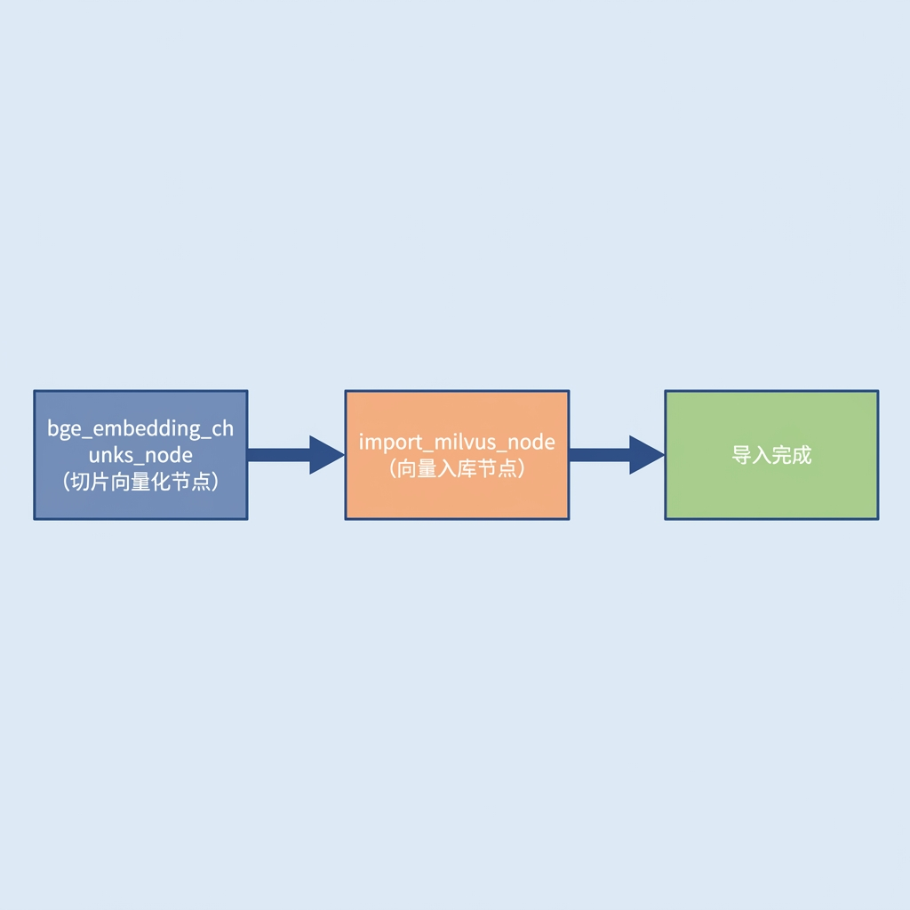
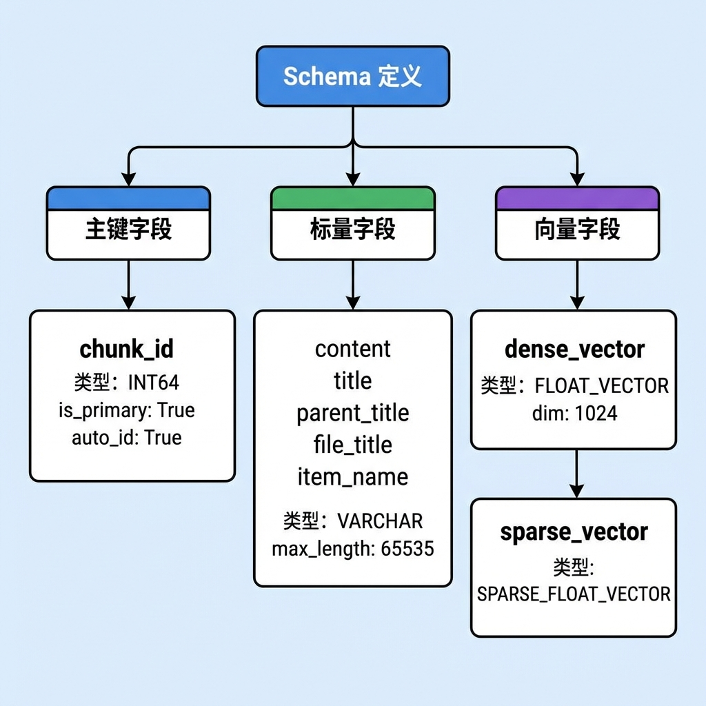
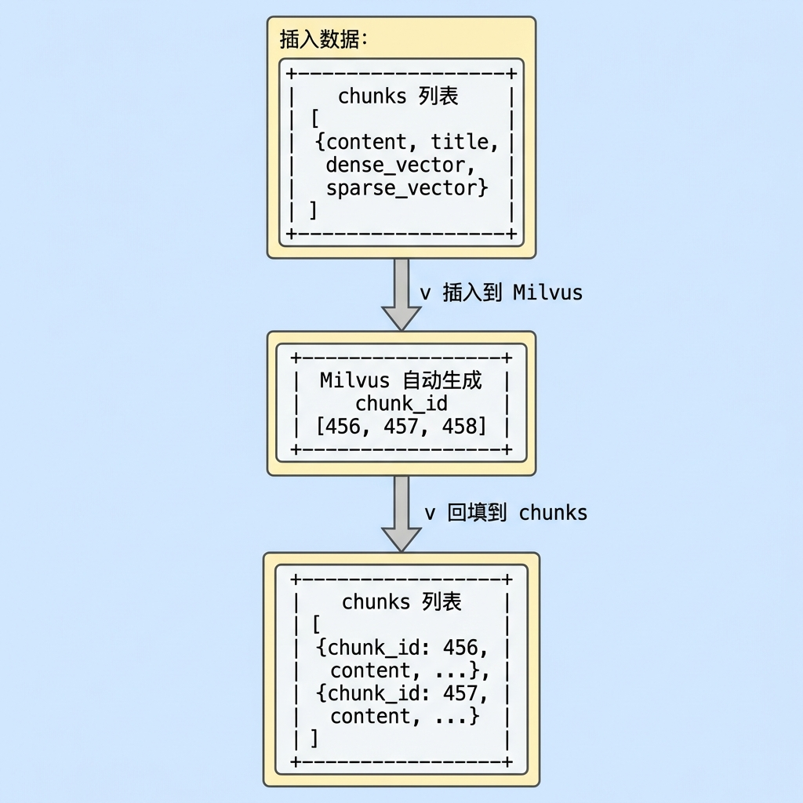
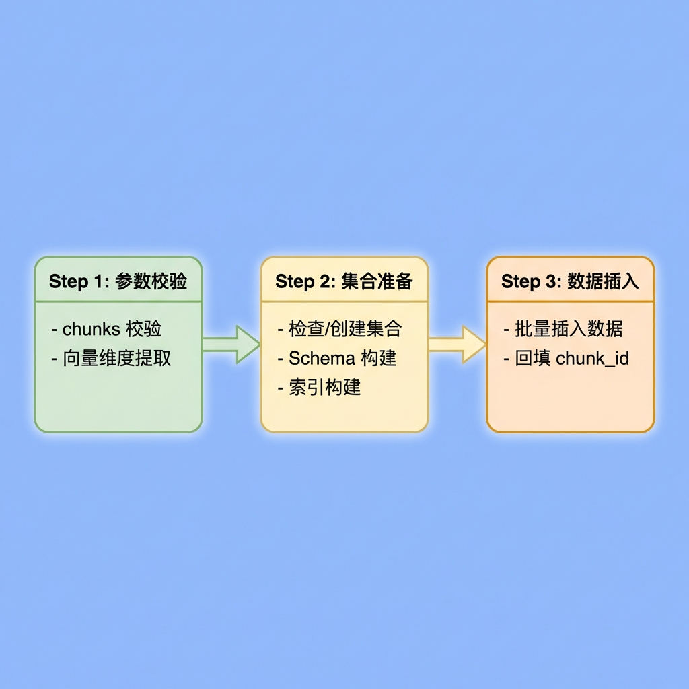
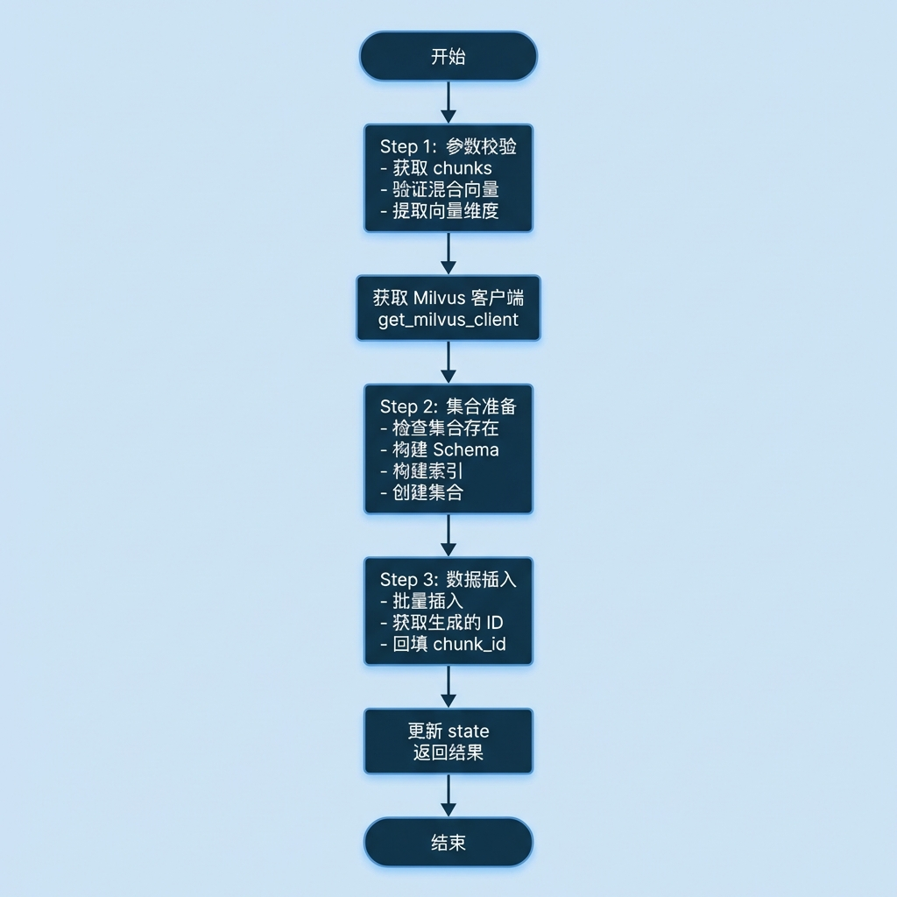

# 向量数据入库节点

> 本文档详细介绍知识库导入流程中的向量数据入库节点（ImportMilvusNode），该节点负责将向量化后的切片数据批量导入 Milvus 向量数据库，包括集合创建、Schema 定义、索引构建和数据插入等完整流程。

---

## 1. 任务目标

### 1.1 本章目标

通过本章学习，你将掌握： 

1. **Milvus 集合管理**：学会创建集合、定义 Schema、配置索引
2. **Schema 设计**：理解标量字段与向量字段的定义方式
3. **索引类型选择**：掌握 AUTOINDEX 和 SPARSE_INVERTED_INDEX 的适用场景
4. **设计模式应用**：理解门面模式和建造者模式在实际项目中的应用
5. **主键回填机制**：学会批量插入数据并获取自动生成的主键

### 1.2 涉及文件

```
knowledge/
├── processor/import_process/nodes/
│   └── import_milvus_node.py       # 向量数据入库节点（本章重点）
│
└── utils/
    └── milvus_util.py              # Milvus 连接管理
```

### 1.3 节点在流程中的位置



---

## 2. 核心概念扫盲

### 2.1 Milvus 集合（Collection）

Milvus 中的**集合（Collection）**类似于关系数据库中的表，是存储和检索向量数据的基本单位：


### 2.2 Schema 设计

**Schema** 定义了集合中的字段结构，包括字段名称、数据类型、约束等：



### 2.3 向量索引类型

索引是加速向量检索的关键，不同索引类型适用于不同场景：

```
+------------------+------------------+------------------+
|     索引类型      |      适用场景     |      特点        |
+------------------+------------------+------------------+
|   AUTOINDEX      |   稠密向量        | 自动选择最优算法  |
|                  |   语义检索        | (HNSW/IVF等)     |
+------------------+------------------+------------------+
| SPARSE_INVERTED_ |   稀疏向量        | 倒排索引         |
| INDEX            |   关键词检索      | 高效精确匹配      |
+------------------+------------------+------------------+
```

**本项目索引配置：**

```python
# 稠密向量索引
index.add_index(
    field_name="dense_vector",
    index_name="dense_vector_index",
    index_type="AUTOINDEX",
    metric_type="COSINE"      # 余弦相似度
)

# 稀疏向量索引
index.add_index(
    field_name="sparse_vector",
    index_name="sparse_vector_index",
    index_type="SPARSE_INVERTED_INDEX",
    metric_type="IP",         # 内积
)
```

### 2.4 度量类型（Metric Type）

度量类型决定了如何计算向量间的相似度：

```
+------------------+------------------+------------------+
|     度量类型      |      公式        |      适用场景     |
+------------------+------------------+------------------+
|   COSINE         |  cos(a,b)        |   语义相似度      |
|   (余弦相似度)    |  = a·b/|a||b|   |   归一化向量      |
+------------------+------------------+------------------+
|   IP             |  a·b             |   内积计算        |
|   (内积)         |  = Σaᵢbᵢ         |   稀疏向量        |
+------------------+------------------+------------------+
|   L2             |  |a-b|²          |   欧氏距离        |
|   (欧氏距离)      |  = Σ(aᵢ-bᵢ)²     |   图像检索        |
+------------------+------------------+------------------+
```

### 2.5 主键自动生成与回填

Milvus 支持自动生成主键，插入后需要将主键回填到业务数据中：



### 2.6 门面模式与建造者模式

本节点采用了**门面模式 + 建造者模式**的设计：


---

## 3. 向量数据入库业务处理流程（总）

### 3.1 整体流程概述



### 3.2 集合 Schema 结构

```
chunks 集合 Schema:

+------------------+------------------+------------------+
|     字段名        |      数据类型     |      约束        |
+------------------+------------------+------------------+
| chunk_id         | INT64            | 主键, 自增        |
+------------------+------------------+------------------+
| dense_vector     | FLOAT_VECTOR     | dim=1024         |
+------------------+------------------+------------------+
| sparse_vector    | SPARSE_FLOAT_    |                  |
|                  | VECTOR           |                  |
+------------------+------------------+------------------+
| content          | VARCHAR          | max_length=65535 |
+------------------+------------------+------------------+
| title            | VARCHAR          | max_length=65535 |
+------------------+------------------+------------------+
| parent_title     | VARCHAR          | max_length=65535 |
+------------------+------------------+------------------+
| file_title       | VARCHAR          | max_length=65535 |
+------------------+------------------+------------------+
| item_name        | VARCHAR          | max_length=65535 |
+------------------+------------------+------------------+
```

---

## 4. 向量数据入库业务处理流程（分）

### 4.1 目标

将向量化后的文档切片数据持久化存储到 Milvus 向量数据库，支持后续的混合检索（语义检索 + 关键词检索），并将 Milvus 自动生成的主键回填到业务数据中。

### 4.2 需求分析

| 需求项        | 说明                           | 解决方案                        |
| ------------- | ------------------------------ | ------------------------------- |
| 集合自动创建  | 首次导入时集合可能不存在       | 检测集合是否存在，不存在则创建  |
| Schema 灵活性 | 需要同时存储标量和向量数据     | 定义完整的 Schema，包含多个字段 |
| 混合检索支持  | 需要同时支持稠密和稀疏向量检索 | 为两种向量分别建立索引          |
| 主键唯一性    | 每条切片需要唯一标识           | 使用 auto_id 自动生成主键       |
| 主键可追溯    | 后续节点需要使用 chunk_id      | 插入后回填主键到业务数据        |
| 设计模式      | 代码结构清晰、职责分离         | 使用门面+建造者模式             |

### 4.3 实现流程

#### 4.3.1 实现流程图



#### 4.3.2 具体实现步骤

##### Step 1：参数校验

**功能描述：**
从状态中获取切片列表，验证数据有效性并提取向量维度。

**处理逻辑：**

1. 从 state 中获取 "chunks" 字段
2. 校验 chunks 是否为空
3. 遍历验证每个 chunk 是否包含混合向量
4. 提取向量维度

**代码片段：**

```python
def _validate_get_inputs(self, state: ImportGraphState):
    self.log_step("step1", "参数校验")

    config = get_config()

    # 1. 获取chunks
    chunks = state.get('chunks')

    # 2. 校验是否为空
    if not chunks:
        raise ValidationError("待入库的切块chunk不存在", self.name)

    # 3. 校验是否有混合向量
    validated_chunks = []
    for chunk in chunks:
        if chunk.get('dense_vector') and chunk.get('sparse_vector'):
            validated_chunks.append(chunk)
        else:
            self.logger.error("待入库的切块chunk的混合向量不存在")

    # 4. 判断有效集合
    if not validated_chunks:
        raise ValidationError("入库的chunk都无效", self.name)

    # 5. 获取向量维度
    dim = len(validated_chunks[0].get('dense_vector'))
    self.logger.info(f"导入Milvus向量数据库的有效块：{len(validated_chunks)},且chunk的向量维度{dim}")

    return validated_chunks, dim, config
```

---

##### Step 2：集合准备

**功能描述：**
检查目标集合是否存在，不存在则创建 Schema 和索引。

**处理逻辑：**

1. 检查集合是否存在
2. 如存在且需要重建，先删除旧集合
3. 构建 Schema（使用 _MilvusSchemaBuilder）
4. 构建索引（使用 _MilvusIndexBuilder）
5. 创建集合

**代码片段：**

```python
def _ensure_has_collection(self, milvus_client: MilvusClient, collection_name: str,
                           dim: int, delete_flag: bool = True):

    self.log_step("step2", f"准备集合 {collection_name} 创建")

    # 1. 判断是否要删除集合
    if delete_flag and milvus_client.has_collection(collection_name=collection_name):
        self.logger.info(f"Milvus中的集合 {collection_name}已被删除")
        milvus_client.drop_collection(collection_name=collection_name)

    # 2. 判断集合是否存在
    if milvus_client.has_collection(collection_name=collection_name):
        self.logger(f"{collection_name}集合已经存在")
        return

    # 3. 创建约束
    schema = _MilvusSchemaBuilder.build(milvus_client, dim)

    # 4. 创建索引
    index = _MilvusIndexBuilder.build(milvus_client, collection_name)

    # 5. 创建集合
    milvus_client.create_collection(
        collection_name=collection_name,
        schema=schema,
        index_params=index
    )
```

---

##### Step 3：Schema 构建（建造者）

**功能描述：**
使用建造者模式构建集合的 Schema。

**字段定义：**

```python
@dataclass(frozen=True)
class ScalarFieldSpec:
    field_name: str
    datatype: DataType
    max_length: Optional[int] = None


# 标量字段规范（复用）
_SCALAR_FIELDS: Sequence[ScalarFieldSpec] = (
    ScalarFieldSpec(field_name="content", datatype=DataType.VARCHAR, max_length=65535),
    ScalarFieldSpec(field_name="title", datatype=DataType.VARCHAR, max_length=65535),
    ScalarFieldSpec(field_name="parent_title", datatype=DataType.VARCHAR, max_length=65535),
    ScalarFieldSpec(field_name="file_title", datatype=DataType.VARCHAR, max_length=65535),
    ScalarFieldSpec(field_name="item_name", datatype=DataType.VARCHAR, max_length=65535),
)
```

**Schema 构建器：**

```python
class _MilvusSchemaBuilder:
    """职责：专门负责构建约束"""

    @staticmethod
    def build(client: MilvusClient, dim: int) -> CollectionSchema:

        logger.info("开始构建约束(schema)...")

        # 1. 构建约束对象(动态映射)
        schema = client.create_schema(enable_dynamic_field=True)

        # 2. 构建主键字段约束
        schema.add_field(
            field_name="chunk_id",
            datatype=DataType.INT64,
            is_primary=True,
            auto_id=True
        )

        # 3. 构建向量字段约束
        # 3.1 稠密向量字段
        schema.add_field(
            field_name="dense_vector",
            datatype=DataType.FLOAT_VECTOR,
            dim=dim
        )
        # 3.2 稀疏向量字段
        schema.add_field(
            field_name="sparse_vector",
            datatype=DataType.SPARSE_FLOAT_VECTOR,
        )

        # 4. 构建标量字段约束（复用规范）
        for scalar_field in _SCALAR_FIELDS:
            kwargs: Dict[str, Any] = {
                "field_name": scalar_field.field_name,
                "datatype": scalar_field.datatype
            }
            if scalar_field.max_length is not None:
                kwargs['max_length'] = scalar_field.max_length
            schema.add_field(**kwargs)

        logger.info(f"构建约束(schema)完成...")
        return schema
```

---

##### Step 4：索引构建（建造者）

**功能描述：**
使用建造者模式构建向量索引。

**代码片段：**

```python
class _MilvusIndexBuilder:
    """职责：负责处理Milvus的索引"""

    @staticmethod
    def build(client: MilvusClient, collection_name: str):
        logger.info(f"开始构建集合 {collection_name} 索引...")

        # 1. 创建索引对象
        index = client.prepare_index_params(collection_name=collection_name)

        # 2. 给向量字段添加索引
        # 2.1 稠密向量字段添加索引
        index.add_index(
            field_name="dense_vector",
            index_name="dense_vector_index",
            index_type="AUTOINDEX",
            metric_type="COSINE"
        )

        # 2.2 稀疏向量字段添加索引
        index.add_index(
            field_name="sparse_vector",
            index_name="sparse_vector_index",
            index_type="SPARSE_INVERTED_INDEX",
            metric_type="IP",
        )

        logger.info(f"构建集合 {collection_name} 索引完成...")
        return index
```

---

##### Step 5：数据插入与主键回填

**功能描述：**
批量插入数据并将 Milvus 返回的主键回填到每个 chunk。

**代码片段：**

```python
class _MilvusInserter:
    """职责：将数据插入到Milvus 以及 回填chunk_id"""

    def __init__(self, client: MilvusClient, collection_name: str):
        self._client = client
        self._collection_name = collection_name

    def insert(self, chunks: List[Dict[str, Any]]) -> List[dict[str, Any]]:
        logger.info(f"开始插入{len(chunks)}块到Milvus...")

        # 1. 插入
        inserted_result = self._client.insert(
            collection_name=self._collection_name,
            data=chunks
        )
        inserted_count = inserted_result.get('insert_count')
        ids = inserted_result.get('ids')

        # 2. 回填id
        self._fill_chunk_ids(chunks, ids)
        logger.info(f"完成插入{inserted_count}记录,并且回填chunk_id到chunk中")
        return chunks

    def _fill_chunk_ids(self, chunks: List[Dict[str, Any]], ids: List[Any]):
        for chunk, id in zip(chunks, ids):
            chunk["chunk_id"] = id
```

---

### 4.4 代码实现

```python
# knowledge/processor/import_process/nodes/import_milvus_node.py

"""
向量数据入库节点

采用门面+建造者设计模式：
- 门面角色：ImportMilvusNode 节点的 process()
- 建造者：_MilvusSchemaBuilder, _MilvusIndexBuilder, _MilvusInserter
"""

import logging
from typing import Sequence, List, Any, Dict, Optional
from dataclasses import dataclass
from pymilvus import DataType, MilvusClient
from pymilvus.orm.schema import CollectionSchema

from knowledge.processor.import_process.base import BaseNode, setup_logging
from knowledge.processor.import_process.state import ImportGraphState
from knowledge.processor.import_process.exceptions import ValidationError
from knowledge.processor.import_process.config import get_config
from knowledge.utils.milvus_util import get_milvus_client

logger = logging.getLogger(__name__)


# ================================================================== #
#                        标量字段规范                                   #
# ================================================================== #

@dataclass(frozen=True)
class ScalarFieldSpec:
    """标量字段规范"""
    field_name: str
    datatype: DataType
    max_length: Optional[int] = None


# 预定义的标量字段（复用）
_SCALAR_FIELDS: Sequence[ScalarFieldSpec] = (
    ScalarFieldSpec(field_name="content", datatype=DataType.VARCHAR, max_length=65535),
    ScalarFieldSpec(field_name="title", datatype=DataType.VARCHAR, max_length=65535),
    ScalarFieldSpec(field_name="parent_title", datatype=DataType.VARCHAR, max_length=65535),
    ScalarFieldSpec(field_name="file_title", datatype=DataType.VARCHAR, max_length=65535),
    ScalarFieldSpec(field_name="item_name", datatype=DataType.VARCHAR, max_length=65535),
)


# ================================================================== #
#                        建造者：Schema 构建                           #
# ================================================================== #

class _MilvusSchemaBuilder:
    """职责：专门负责构建约束"""

    @staticmethod
    def build(client: MilvusClient, dim: int) -> CollectionSchema:
        logger.info("开始构建约束(schema)...")

        # 1. 构建约束对象(动态映射)
        schema = client.create_schema(enable_dynamic_field=True)

        # 2. 构建主键字段约束
        schema.add_field(
            field_name="chunk_id",
            datatype=DataType.INT64,
            is_primary=True,
            auto_id=True
        )

        # 3. 构建向量字段约束
        schema.add_field(
            field_name="dense_vector",
            datatype=DataType.FLOAT_VECTOR,
            dim=dim
        )
        schema.add_field(
            field_name="sparse_vector",
            datatype=DataType.SPARSE_FLOAT_VECTOR,
        )

        # 4. 构建标量字段约束
        for scalar_field in _SCALAR_FIELDS:
            kwargs: Dict[str, Any] = {
                "field_name": scalar_field.field_name,
                "datatype": scalar_field.datatype
            }
            if scalar_field.max_length is not None:
                kwargs['max_length'] = scalar_field.max_length
            schema.add_field(**kwargs)

        logger.info(f"构建约束(schema)完成...")
        return schema


# ================================================================== #
#                        建造者：索引构建                               #
# ================================================================== #

class _MilvusIndexBuilder:
    """职责：负责处理Milvus的索引"""

    @staticmethod
    def build(client: MilvusClient, collection_name: str):
        logger.info(f"开始构建集合 {collection_name} 索引...")

        index = client.prepare_index_params(collection_name=collection_name)

        # 稠密向量索引
        index.add_index(
            field_name="dense_vector",
            index_name="dense_vector_index",
            index_type="AUTOINDEX",
            metric_type="COSINE"
        )

        # 稀疏向量索引
        index.add_index(
            field_name="sparse_vector",
            index_name="sparse_vector_index",
            index_type="SPARSE_INVERTED_INDEX",
            metric_type="IP",
        )

        logger.info(f"构建集合 {collection_name} 索引完成...")
        return index


# ================================================================== #
#                        插入器：数据插入与回填                          #
# ================================================================== #

class _MilvusInserter:
    """职责：将数据插入到Milvus 以及 回填chunk_id"""

    def __init__(self, client: MilvusClient, collection_name: str):
        self._client = client
        self._collection_name = collection_name

    def insert(self, chunks: List[Dict[str, Any]]) -> List[dict[str, Any]]:
        logger.info(f"开始插入{len(chunks)}块到Milvus...")

        inserted_result = self._client.insert(
            collection_name=self._collection_name,
            data=chunks
        )
        inserted_count = inserted_result.get('insert_count')
        ids = inserted_result.get('ids')

        self._fill_chunk_ids(chunks, ids)
        logger.info(f"完成插入{inserted_count}记录,并且回填chunk_id到chunk中")
        return chunks

    def _fill_chunk_ids(self, chunks: List[Dict[str, Any]], ids: List[Any]):
        for chunk, id in zip(chunks, ids):
            chunk["chunk_id"] = id


# ================================================================== #
#                        门面：主节点                                   #
# ================================================================== #

class ImportMilvusNode(BaseNode):
    """
    向量数据入库节点（门面角色）

    协调 Schema 构建、索引构建、数据插入
    """

    name = "import_milvus_node"

    def process(self, state: ImportGraphState) -> ImportGraphState:
        # 1. 参数校验
        validated_chunks, dim, config = self._validate_get_inputs(state)

        # 2. 获取milvus客户端
        milvus_client = get_milvus_client()

        if milvus_client is None:
            return state

        # 3. 获取集合名字
        collection = getattr(config, 'chunks_collection')

        # 4. 确保集合存在
        self._ensure_has_collection(milvus_client, collection, dim)

        # 5. 插入
        inserter = _MilvusInserter(client=milvus_client, collection_name=collection)
        final_chunks = inserter.insert(chunks=validated_chunks)

        # 6. 更新state
        state['chunks'] = final_chunks

        return state

    def _validate_get_inputs(self, state: ImportGraphState)-> Tuple[List,int,ImportConfig]:
        """参数校验"""
        self.log_step("step1", "参数校验")

        config = get_config()
        chunks = state.get('chunks')

        if not chunks:
            raise ValidationError("待入库的切块chunk不存在", self.name)

        validated_chunks = []
        for chunk in chunks:
            if chunk.get('dense_vector') and chunk.get('sparse_vector'):
                validated_chunks.append(chunk)
            else:
                self.logger.error("待入库的切块chunk的混合向量不存在")

        if not validated_chunks:
            raise ValidationError("入库的chunk都无效", self.name)

        dim = len(validated_chunks[0].get('dense_vector'))
        self.logger.info(f"导入Milvus向量数据库的有效块：{len(validated_chunks)},且chunk的向量维度{dim}")

        return validated_chunks, dim, config

    def _ensure_has_collection(self, milvus_client: MilvusClient, collection_name: str,
                               dim: int, delete_flag: bool = True):
        """确保集合存在"""
        self.log_step("step2", f"准备集合 {collection_name} 创建")

        if delete_flag and milvus_client.has_collection(collection_name=collection_name):
            self.logger.info(f"Milvus中的集合 {collection_name}已被删除")
            milvus_client.drop_collection(collection_name=collection_name)

        if milvus_client.has_collection(collection_name=collection_name):
            return

        schema = _MilvusSchemaBuilder.build(milvus_client, dim)
        index = _MilvusIndexBuilder.build(milvus_client, collection_name)

        milvus_client.create_collection(
            collection_name=collection_name,
            schema=schema,
            index_params=index
        )
```

**关键设计点：**

1. **门面模式**
   - ImportMilvusNode 作为门面，对外提供简洁的 process() 接口
   - 隐藏内部复杂的 Milvus 操作细节

2. **建造者模式**
   - _MilvusSchemaBuilder：专门负责构建 Schema
   - _MilvusIndexBuilder：专门负责构建索引
   - _MilvusInserter：专门负责数据插入和主键回填

3. **标量字段规范复用**
   - 使用 dataclass 定义字段规范
   - 避免重复代码

4. **主键自动回填**
   - 使用 auto_id=True 让 Milvus 自动生成主键
   - 插入后将 ids 回填到 chunks

---

## 5. 测试运行

### 5.1 测试代码

```python
from pathlib import Path
import json

def _cli_main() -> None:
    setup_logging()

    temp_dir = Path(r"D:\...\import_temp_dir\万用表的使用\hybrid_auto")

    input_path = temp_dir / "chunks_vector.json"
    output_path = temp_dir / "chunks_vector_ids.json"

    if not input_path.exists():
        logger.error(f"找不到输入文件: {input_path}")
        return

    with open(input_path, "r", encoding="utf-8") as fh:
        content = json.load(fh)

    state: ImportGraphState = {
        "chunks": content.get("chunks", [])
    }

    import_milvus = ImportMilvusNode()
    result_state = import_milvus.process(state)

    with open(output_path, "w", encoding="utf-8") as fh:
        json.dump(result_state, fh, ensure_ascii=False, indent=4)

    logger.info(f"备份临时文件{output_path}成功")


if __name__ == "__main__":
    _cli_main()
```

### 5.2 运行测试

```bash
# 进入项目目录
cd knowledge

# 激活虚拟环境
.venv\Scripts\activate

# 运行测试
python -m knowledge.processor.import_process.nodes.import_milvus_node
```

### 5.3 预期输出

```
2026-03-26 10:00:00 - import.import_milvus_node - INFO - --- import_milvus_node 开始 ---
2026-03-26 10:00:00 - import.import_milvus_node - INFO - [step1] 参数校验
2026-03-26 10:00:00 - import.import_milvus_node - INFO - 导入Milvus向量数据库的有效块：8,且chunk的向量维度1024
2026-03-26 10:00:00 - import.import_milvus_node - INFO - [step2] 准备集合 chunks_collection 创建
2026-03-26 10:00:00 - import.import_milvus_node - INFO - Milvus中的集合 chunks_collection已被删除
2026-03-26 10:00:00 - import.import_milvus_node - INFO - 开始构建约束(schema)...
2026-03-26 10:00:00 - import.import_milvus_node - INFO - 构建约束(schema)完成...
2026-03-26 10:00:00 - import.import_milvus_node - INFO - 开始构建集合 chunks_collection 索引...
2026-03-26 10:00:00 - import.import_milvus_node - INFO - 构建集合 chunks_collection 索引完成...
2026-03-26 10:00:00 - import.import_milvus_node - INFO - 开始插入8块到Milvus...
2026-03-26 10:00:00 - import.import_milvus_node - INFO - 完成插入8记录,并且回填chunk_id到chunk中
2026-03-26 10:00:00 - import.import_milvus_node - INFO - 备份临时文件 chunks_vector_ids.json 成功
```

---

## 6. 总结

### 6.1 节点功能概览

| 功能模块        | 说明                           |
| --------------- | ------------------------------ |
| **参数校验**    | 验证 chunks 和混合向量的有效性 |
| **Schema 构建** | 定义主键、标量字段、向量字段   |
| **索引构建**    | 配置稠密和稀疏向量索引         |
| **数据插入**    | 批量插入数据到 Milvus          |
| **主键回填**    | 将 chunk_id 写回业务数据       |

### 6.2 设计要点

1. **门面+建造者模式**
   - 门面：ImportMilvusNode 提供简洁接口
   - 建造者：Schema/Index/Inserter 各司其职
   - 职责分离，便于维护和测试

2. **标量字段规范复用**
   - 使用 dataclass 定义字段规范
   - 循环构建标量字段，避免重复代码

3. **双向量索引策略**
   - 稠密向量：AUTOINDEX + COSINE
   - 稀疏向量：SPARSE_INVERTED_INDEX + IP

4. **主键回填机制**
   - auto_id=True 自动生成主键
   - 插入后从返回结果提取 ids
   - zip() 逐一回填到对应 chunk

5. **动态字段支持**
   - enable_dynamic_field=True
   - 允许插入未在 Schema 中定义的字段