# 导入流程与前端对接

## 1. 任务目标

本节课将实现知识库系统 **文件导入流程** 的 Web API 层与前端页面对接。

该层是导入流程与用户交互的入口，负责：

- 接收前端上传的 PDF/MD 文件并路由到后台处理逻辑
- 通过 **后台任务（BackgroundTasks）** 异步执行长耗时的导入流水线
- 通过 **状态轮询** 实现前端实时进度展示
- 统计各节点耗时并反馈给前端

**学完本节你将掌握：**

- FastAPI 框架核心概念（路由、依赖注入、后台任务、Pydantic 模型）
- 文件上传与本地/MinIO 双写的实现方式
- 前后端状态轮询的交互模式 
- 导入流程中节点耗时统计的设计与实现
- 前端时间线风格的进度展示

---

## 2. 核心概念扫盲

### 2.1 FastAPI 核心概念

#### 2.1.1 路由定义

FastAPI 使用装饰器将 URL 路径映射到处理函数：import_router.py

```python
from fastapi import FastAPI

def register_router(app):
    @app.post("/upload")
    async def upload_file(file: UploadFile = File(...)):
        """POST 请求处理 —— 接收上传文件"""
        pass

    @app.get("/status/{task_id}")
    async def get_status(task_id: str):
        """GET 请求处理 —— 路径参数自动注入"""
        pass

def create_app() -> FastAPI:
    app = FastAPI(description="知识库导入",version="v1.0")
    register_router(app)
    return app

if __name__ == '__main__':
    # param1:fastapi实例
    # param2:启动的服务器地址
    # param3:启动的服务端口
    uvicorn.run(app=create_app(), host="0.0.0.0", port=8000, log_level="info")
```

请求流转过程：

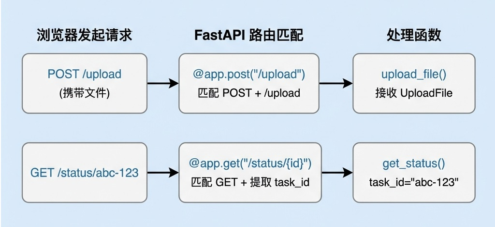

#### 2.1.2 后台任务

后台任务允许接口立即返回响应，将耗时操作放入后台线程执行：

```python
from fastapi import BackgroundTasks

    @app.post("/upload")
    async def upload_file(
        background_tasks: BackgroundTasks,
        file: UploadFile = File(...)
    ):
        # 1. 上传文件（本地 + MinIO）
        #task_id, file_dir, import_file_path = service.process_upload_file(file)

        # 2. 将耗时的图谱流程放入后台任务（不阻塞响应）
        #background_tasks.add_task(service.run_import_graph, task_id, file_dir, import_file_path)

        # 立即返回（用户不用等几分钟的 PDF 解析）
        return {"task_id": task_id,"message":"文件上传成功"}
```

执行时序对比：

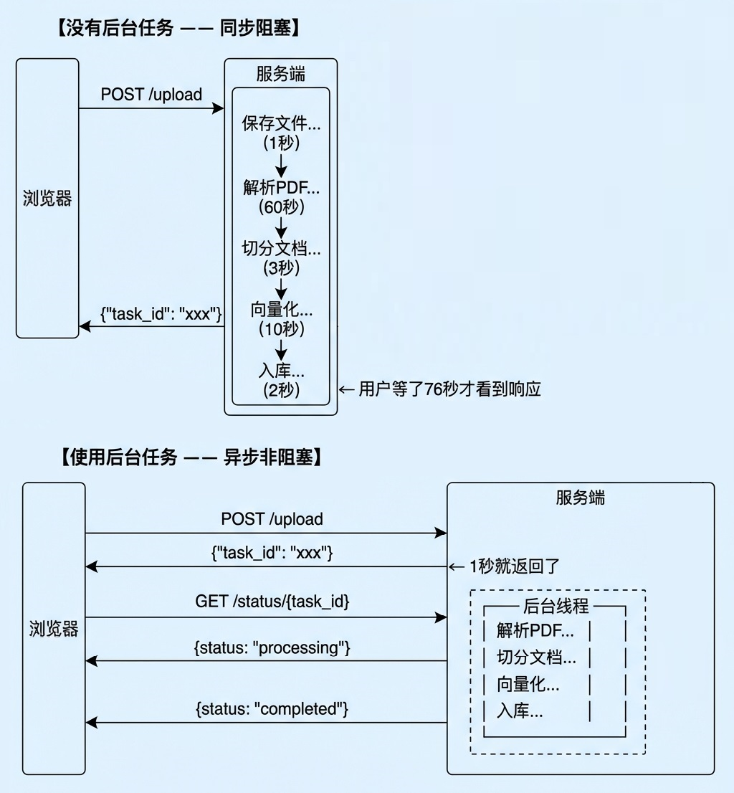

#### 2.1.3 依赖注入

FastAPI 的依赖注入机制自动创建并传入服务实例：

```python
from fastapi import Depends
from functools import lru_cache

    @lru_cache
    def get_import_file_service() -> ImportFileService:
        """工厂函数（单例模式）"""
        return ImportFileService()

    @app.post("/upload")
    async def upload_file(background_tasks: BackgroundTasks,
        file: UploadFile = File(...),
        service: ImportFileService = Depends(get_import_file_service),  # 自动注入
    ):
        # 1. 上传文件（本地 + MinIO）
        task_id, file_dir, import_file_path = service.process_upload_file(file)

        # 2. 将耗时的图谱流程放入后台任务（不阻塞响应）
        background_tasks.add_task(service.run_import_graph, task_id, file_dir, import_file_path)
        return {"task_id": task_id,"message"="文件上传成功"}
```

依赖注入流程：

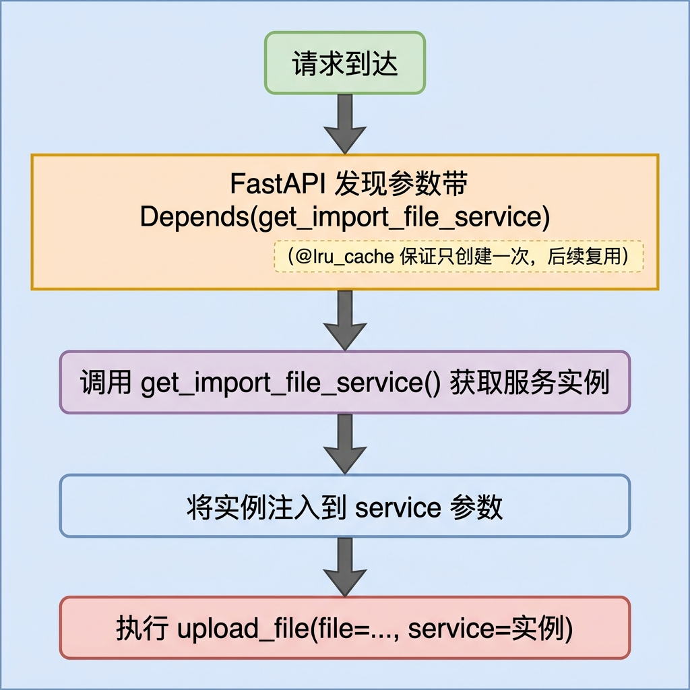

为什么不直接 创建一个实例，而要用 Depends？

**先看"不用 Depends"的写法：**

```python
# ❌ 方式一：在函数内部直接创建
@app.post("/upload")
async def upload_file(file: UploadFile = File(...)):
    service = ImportFileService()   # 每次请求都新建一个实例
    service.process_upload_file(file)

# ❌ 方式二：用全局变量
service = ImportFileService()       # 模块级别写死

@app.post("/upload")
async def upload_file(file: UploadFile = File(...)):
    service.process_upload_file(file)
```

这两种写法能跑，但存在问题：

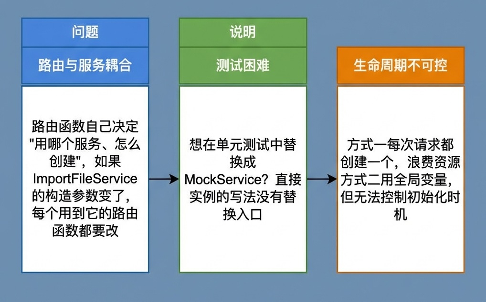


**使用 Depends 后：**

```python
# ✅ 依赖注入：路由函数只声明"我需要什么"，不关心"怎么创建"

@lru_cache
def get_import_file_service() -> ImportFileService:
    return ImportFileService()     # 创建逻辑集中在工厂函数

@app.post("/upload")
async def upload_file(
    file: UploadFile = File(...),
    service: ImportFileService = Depends(get_import_file_service),
):
    service.process_upload_file(file)   # 直接使用，不关心来源
```

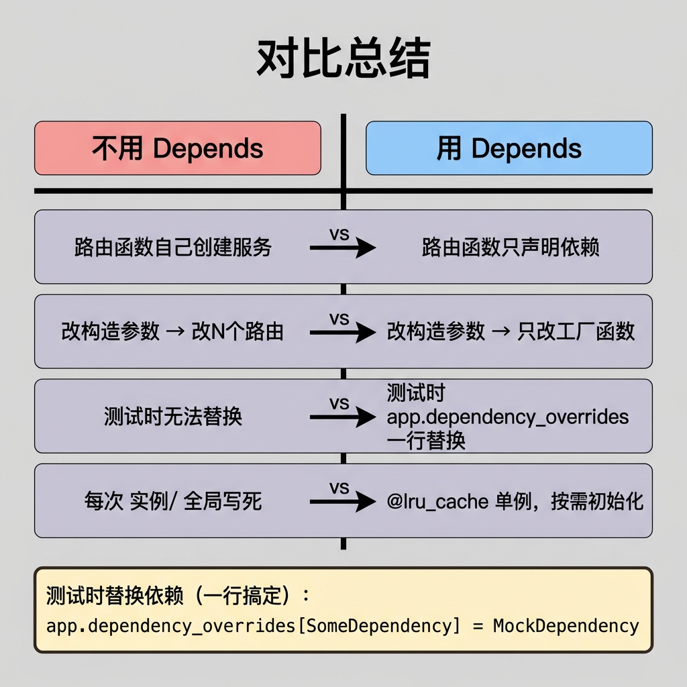

**测试时替换依赖（一行搞定）：**

```python
# 这一行的意思：
# 凡是路由里用 Depends(get_import_file_service) 的地方，
# 不要调用真正的工厂函数了，改用 lambda 返回 Mock 实例

app.dependency_overrides[get_import_file_service] = lambda: MockImportFileService()
```

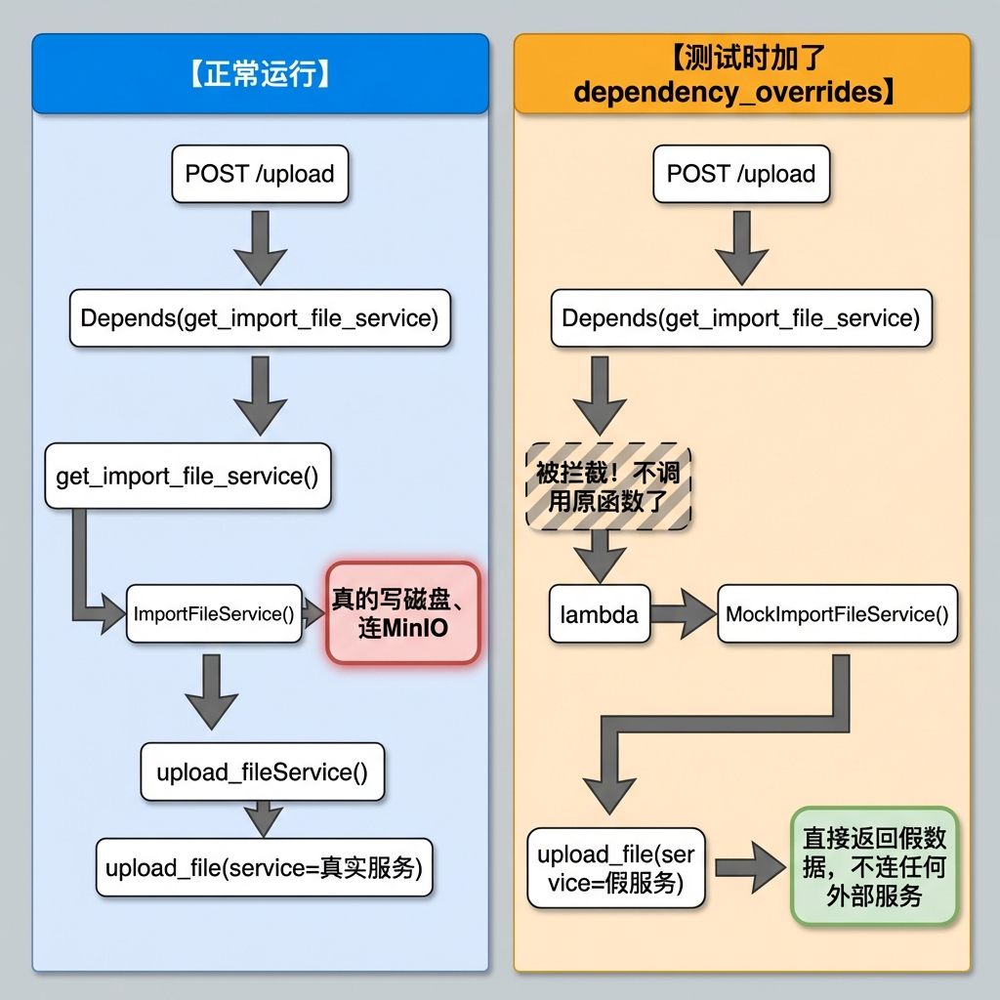

#### 2.1.4 Pydantic 数据模型

Pydantic 是一个数据校验和序列化库，简单说，它帮你做两件事：

​		**检查数据对不对** 和 **把数据转成标准格式**。

在 FastAPI 中充当前后端之间的 **数据契约**——后端保证"我返回的一定是这个格式"，前端可以放心按这个格式解析。

**Pydantic 的三个核心能力：**

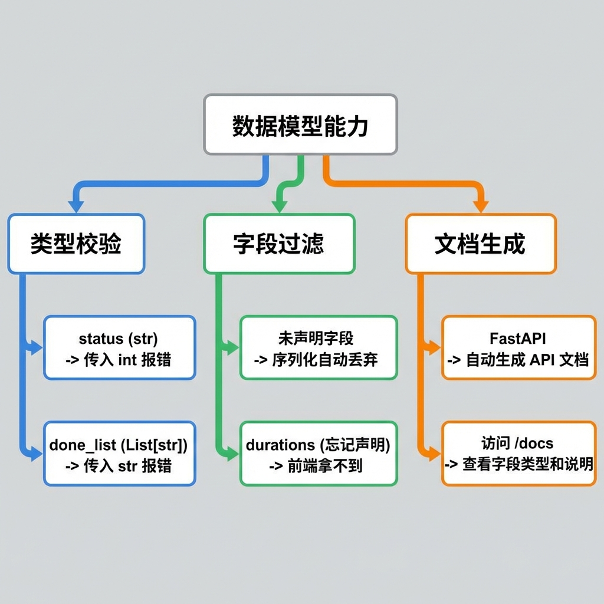


**基本用法：**

```python
from pydantic import BaseModel, Field, ValidationError

class Student(BaseModel):
    name: str = Field(..., description="姓名")          # 必填
    age: int = Field(..., description="年龄")            # 必填
    score: float = Field(default=0.0, description="成绩") # 选填，默认0.0

# 1. 正常创建 
s1 = Student(name="张三", age=18, score=95.5)
print(s1)
# name='张三' age=18 score=95.5

# 2. 转成字典
print(s1.model_dump())
# {'name': '张三', 'age': 18, 'score': 95.5}

# 3. 转成 JSON 字符串
print(s1.model_dump_json())
# {"name":"张三","age":18,"score":95.5}

# 4. 自动类型转换：字符串 "20" → int 20
s2 = Student(name="李四", age="20")
print(s2.age, type(s2.age))   # 20  <class 'int'>

# 5. 类型校验失败：直接报错
try:
    Student(name="王五", age="不是数字")
except ValidationError as e:
    print(e)  # age - Input should be a valid integer
    
# 6. 缺少必填字段 ───
try:
    s4 = Student(age=18)  # 缺少必填的 name
except ValidationError as e:
    print(e)
    # name - Field required
    
# 7. 多余字段自动丢弃
s3 = Student(name="赵六", age=22, hobby="篮球")
print(s3.model_dump())
# {'name': '赵六', 'age': 22, 'score': 0.0}   ← hobby 被丢弃了

# 8. 从字典创建（模拟后端返回数据)
data = {"name": "孙七", "age": 19, "score": 85, "email": "sun7@test.com"}
s6 = Student(**data)  # ** 解包字典，等价于 Student(name="孙七", age=19, ...)
print(s6)
```

**Field 参数说明：**

```python
class Student(BaseModel):
    name: str = Field(..., description="姓名")
    #           │       │         │
    #           │       │         └── description: 字段描述（生成API文档用）
    #           │       └── ... : 表示该字段必填，没有默认值
    #           └── Field(): Pydantic 提供的字段配置函数

    score: float = Field(default=0.0, description="成绩")
    #                    │
    #                    └── default=0.0 : 选填字段，不传时默认为 0.0
```

**在项目中的实际应用：**

upload_schema.py

```python
from typing import List, Dict
from pydantic import BaseModel, Field

class UploadResponse(BaseModel):
    """文件上传响应 —— POST /upload 返回"""
    message: str = Field(..., description="响应消息")
    task_id: str = Field(..., description="任务ID")

class TaskStatusResponse(BaseModel):
    """任务状态响应 —— GET /status/{task_id} 返回"""
    status: str = Field(..., description="任务状态")
    done_list: List[str] = Field(..., description="已完成节点列表")
    running_list: List[str] = Field(..., description="正在运行节点列表")
    durations: Dict[str, float] = Field(default={}, description="各节点耗时(秒)")
```

**不用 Pydantic vs 用 Pydantic：**

```python
# ❌ 不用 Pydantic —— 手动拼字典，没有任何约束
@app.get("/status/{task_id}")
async def get_status(task_id: str):
    return {
        "status": "processing",
        "done_list": ["上传文件"],
        "stauts": "拼错了也不知道",     # ← 字段名拼错，不报错
        "status": 12345,               # ← 类型给错，不报错
        "extra_field": "多余的字段",    # ← 多余字段，前端困惑
    }


# ✅ 用 Pydantic —— 有明确的数据契约
@app.get("/status/{task_id}", response_model=TaskStatusResponse)
async def get_status(task_id: str):
    task_info = get_task_info(task_id)
    return TaskStatusResponse(**task_info)
    #                        ▲
    #                        │
    #     ** 解包字典，等价于：
    #     TaskStatusResponse(
    #         status=task_info["status"],
    #         done_list=task_info["done_list"],
    #         running_list=task_info["running_list"],
    #         durations=task_info["durations"],
    #     )
```

Pydantic 在这个过程中做了什么：

```
get_task_info() 返回原始字典
    │
    ▼
TaskStatusResponse(**task_info)
    │
    ├── status 是 str 吗？            ✓ 通过
    ├── done_list 是 List[str] 吗？   ✓ 通过
    ├── running_list 是 List[str] 吗？ ✓ 通过
    ├── durations 是 Dict[str,float]？ ✓ 通过
    ├── 有没有多余的未声明字段？        → 自动丢弃
    │
    ▼
序列化成标准 JSON 返回给前端
{
  "status": "processing",
  "done_list": ["上传文件", "检查文件"],
  "running_list": ["PDF转Markdown"],
  "durations": {"检查文件": 0.01}
}
```


### 2.2 状态轮询模式

导入流程使用**前端轮询**（Polling）方式获取任务进度：前端每隔一段时间主动向后端发一次请求，询问"任务现在到哪一步了"。

#### 2.2.1 轮询的基本原理

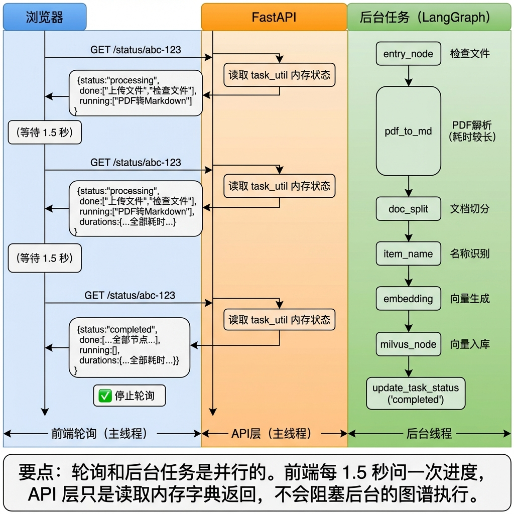

前端代码实现：

```javascript
function pollStatus(taskId, itemEl, totalNodes) {
    // setInterval：每隔 1500ms（1.5秒）执行一次回调函数
    const interval = setInterval(async () => {
        const res = await fetch(`/status/${taskId}`);
        const data = await res.json();

        // 根据状态决定是否停止
        if (data.status === 'completed' || data.status === 'failed') {
            clearInterval(interval);   // 停止轮询
        }
    }, 1500);   // 1500ms = 1.5秒
}
```

#### 2.2.2 为什么不是一直地轮询？

因为导入流程中状态变化的频率很低——最快的节点也要零点几秒，最慢的（如 PDF 解析）要几十秒甚至几分钟。不间隔地轮询，绝大多数请求拿到的是和上次一样的结果，纯属浪费。

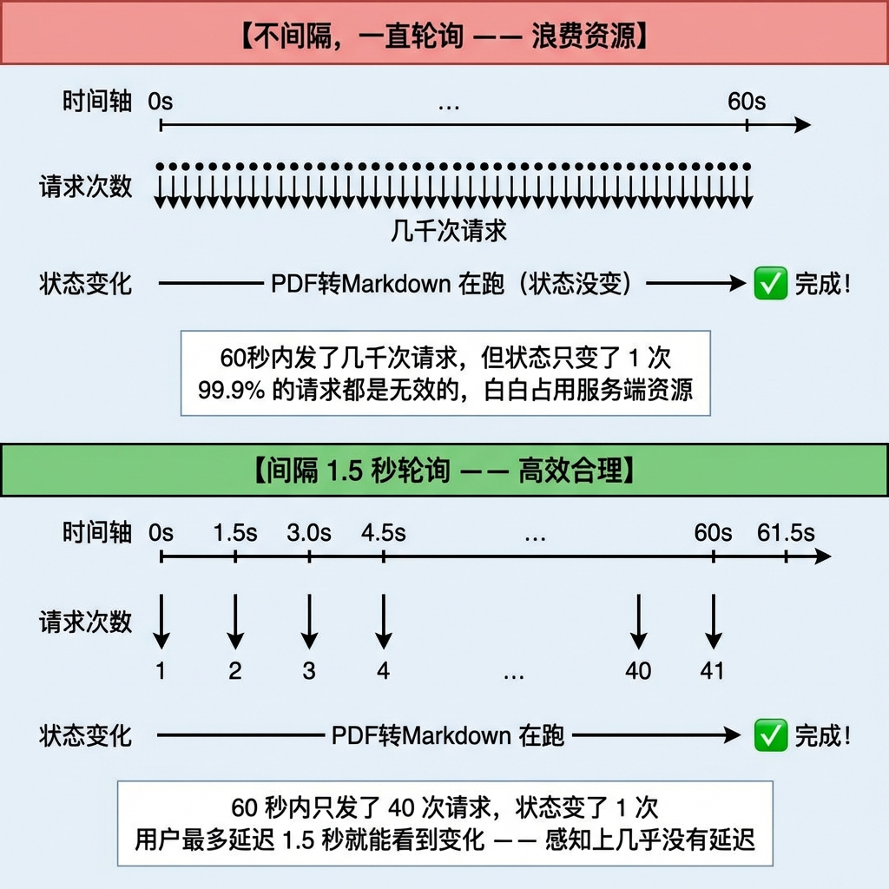


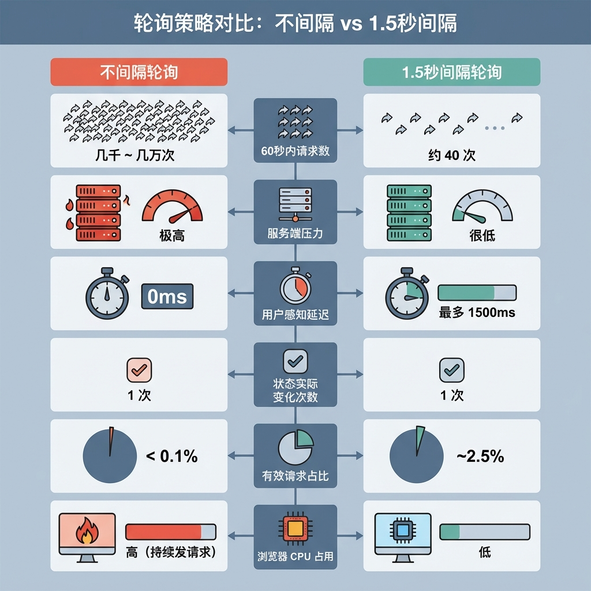


这是在 **用户体验** 和 **服务端压力** 之间取的平衡点：

- 间隔太短（如 100ms）：请求量大，服务端压力高，但用户感知更好
- 间隔太长（如 10 秒）：用户觉得进度条"很久不动"，体验差
- 1.5 秒：人几乎感觉不到延迟，但请求量比不间隔降低了几百倍

#### 2.2.3 轮询的三种结束条件

```javascript
if (data.status === 'completed') {
    // 情况1：任务完成 → 进度条跳到100%，停止轮询
    updateProgressUI(progressWrapper, 100);
    clearInterval(interval);

} else if (data.status === 'failed') {
    // 情况2：任务失败 → 显示错误信息，停止轮询
    statusBadge.textContent = '失败';
    clearInterval(interval);

} else if (data.status === 'processing') {
    // 情况3：还在处理 → 更新进度条，继续轮询
    updateProgressUI(progressWrapper, calculatedPercentage);
    // 不调用 clearInterval，下一个 1.5 秒会自动再次执行
}
```

```
任务状态流转与轮询行为：

  processing ──────────────────────────────▶ completed
      │               轮询继续                    │
      │                                          │ clearInterval()
      │                                          ▼
      │                                     停止轮询
      │
      └──────────────────────────────────▶ failed
                   出现异常                      │
                                                │ clearInterval()
                                                ▼
                                           停止轮询
```

#### 2.2.4 为什么导入流程用轮询而不用 SSE ？


导入流程的特点是：节点少（8个）、每个节点耗时长（几秒到几分钟）、状态变化频率低。这种场景下，轮询的 1~2 秒延迟完全可以接受，而且实现简单——只需要一个 GET 接口，不用维护长连接、不用处理断线重连。

如果是查询流程（LLM 逐字输出），每秒需要推送几十次内容片段，这时候就需要用 SSE 了，轮询跟不上这个频率。


### 2.3 任务状态管理

系统使用内存字典管理任务的生命周期：

```
任务状态字典结构：

_tasks_status     ──▶  {"task-123": "processing"}           任务总体状态
_tasks_running    ──▶  {"task-123": ["pdf_to_md_node"]}     当前运行中的节点
_tasks_done       ──▶  {"task-123": ["entry_node"]}         已完成的节点
_tasks_duration   ──▶  {"task-123": {"检查文件": 0.01}}      各节点耗时
_tasks_result     ──▶  {"task-123": {"answer": "..."}}      任务结果
```

节点状态流转：

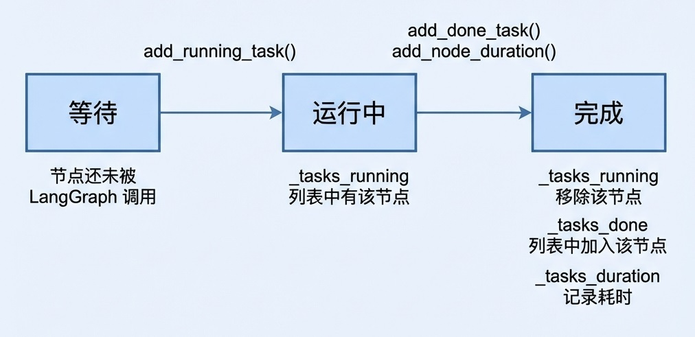

### 2.4 CORS 跨域配置

#### 2.4.1 什么是跨域？

先理解一个前提：浏览器地址栏里的地址，就是当前页面的**"源"（Origin）**。页面里的 JS 代码发起请求时，浏览器会拿请求目标的地址和这个"源"做对比。

"源"由三部分组成：

```
http://       127.0.0.1      :8000
  ──────        ─────────      ─────
  协议           域名           端口

这三部分合在一起就是"源"
```

浏览器的规则很简单：

```
协议、域名、端口 三个都一样  →  同源  →  放行，JS 正常拿到响应
任何一个不同                →  跨域  →  拦截，JS 拿不到响应
```

举个具体的例子。假设你在浏览器地址栏打开了 `http://127.0.0.1:8000/import`，页面加载后 JS 代码发起请求

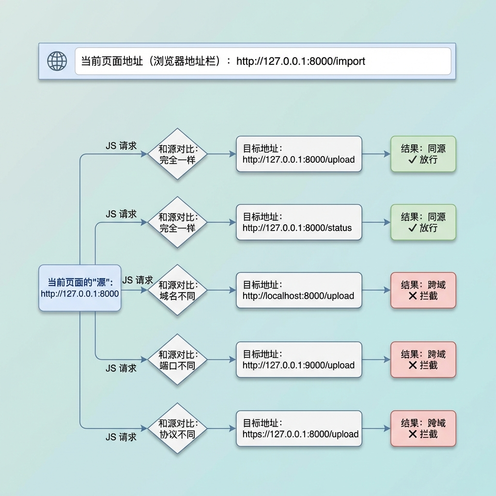

**注意：** `127.0.0.1` 和 `localhost` 虽然指向同一台机器，但浏览器把它们当作不同的域名，也会跨域。


#### 2.4.2 跨域是谁在拦截？

很多人以为跨域是服务端拒绝了请求，其实不是。**跨域拦截发生在浏览器端**，服务端根本不知道有跨域这回事：

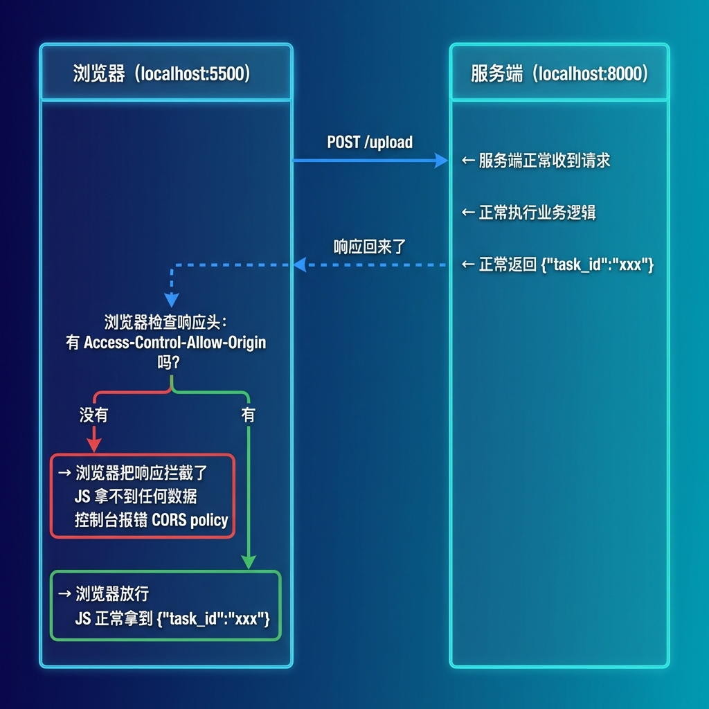

所以跨域问题的本质是：**服务端的响应头里缺少"允许跨域"的标记，浏览器看不到这个标记就不让 JS 读取响应。**

#### 2.4.3 当前项目会跨域吗？

**不会。** 因为页面和 API 都在同一个 FastAPI 服务上：

```
浏览器打开:  http://127.0.0.1:8000/import     ← FastAPI 返回 import.html
页面的源:    http://127.0.0.1:8000

JS 请求:     http://127.0.0.1:8000/upload      ← 和源一样 → 同源 ✓
JS 请求:     http://127.0.0.1:8000/status/xxx   ← 和源一样 → 同源 ✓

所有请求都是同源的 → 不存在跨域 → 不需要 CORS 配置也能正常工作
```

那什么时候才会跨域？如果前后端分离部署：

```
【前后端分离 —— 跨域】

前端（VS Code Live Server）:  http://localhost:5500/import.html
后端（FastAPI）:              http://localhost:8000/upload

端口不一样（5500 vs 8000）→ 跨域 → 浏览器拦截
```

#### 2.4.4 怎么解决跨域？

通过 FastAPI 的 `CORSMiddleware` 中间件，让服务端的响应头带上"允许跨域"的标记。

**默认行为：** `CORSMiddleware` 的默认参数非常保守——几乎什么都不允许。所以你需要显式地启用特定的源、方法或请求头，浏览器才能在跨域上下文中正常工作。

支持的核心参数：

​	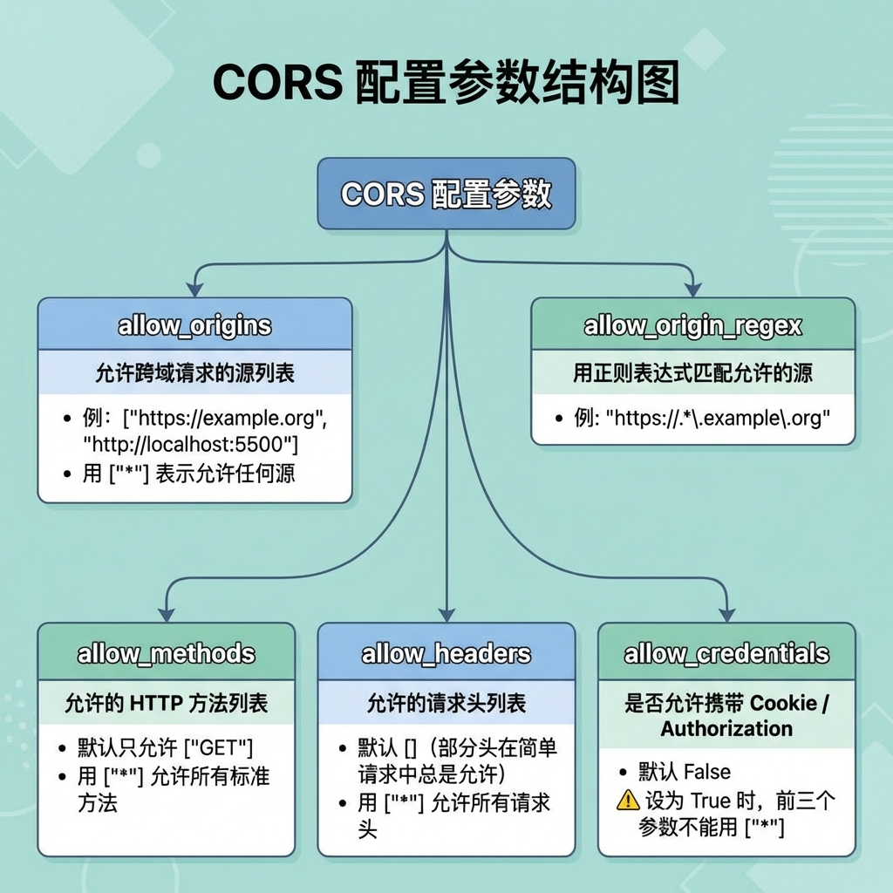


**⚠ 重要约束：`allow_credentials=True` 是不能用通配符 `\*`**

这是浏览器的安全规范，不是 FastAPI 的限制。当需要携带 Cookie 或 Authorization 头时，必须明确列出允许的源、方法和请求头：

```python
# ✕ 错误写法：credentials=True 和 * 不能同时用
app.add_middleware(
    CORSMiddleware,
    allow_origins=["*"],          # ← 和 credentials=True 冲突
    allow_credentials=True,
    allow_methods=["*"],          # ← 和 credentials=True 冲突
    allow_headers=["*"],          # ← 和 credentials=True 冲突
)

# ✓ 正确写法一：需要 credentials 时，明确指定
app.add_middleware(
    CORSMiddleware,
    allow_origins=["http://localhost:5500", "http://localhost:3000"],
    allow_credentials=True,
    allow_methods=["GET", "POST", "PUT", "DELETE"],
    allow_headers=["Content-Type", "Authorization"],
)

# ✓ 正确写法二：不需要 credentials 时，可以用 *
app.add_middleware(
    CORSMiddleware,
    allow_origins=["*"],
    allow_credentials=False,      # ← 默认值，可以省略
    allow_methods=["*"],
    allow_headers=["*"],
)
```


加上之后，服务端返回的每个响应都会多几个头：

```
加之前的响应头:
    Content-Type: application/json
    （没有任何跨域相关的头）

  加之后的响应头:
    Content-Type: application/json
    Access-Control-Allow-Origin: *          ← 新增：允许任意源
    Access-Control-Allow-Methods: *         ← 新增：允许任意方法
    Access-Control-Allow-Headers: *         ← 新增：允许任意请求头
```

浏览器看到 `Access-Control-Allow-Origin: *` 就会放行，JS 正常拿到响应数据。

配置前后对比：

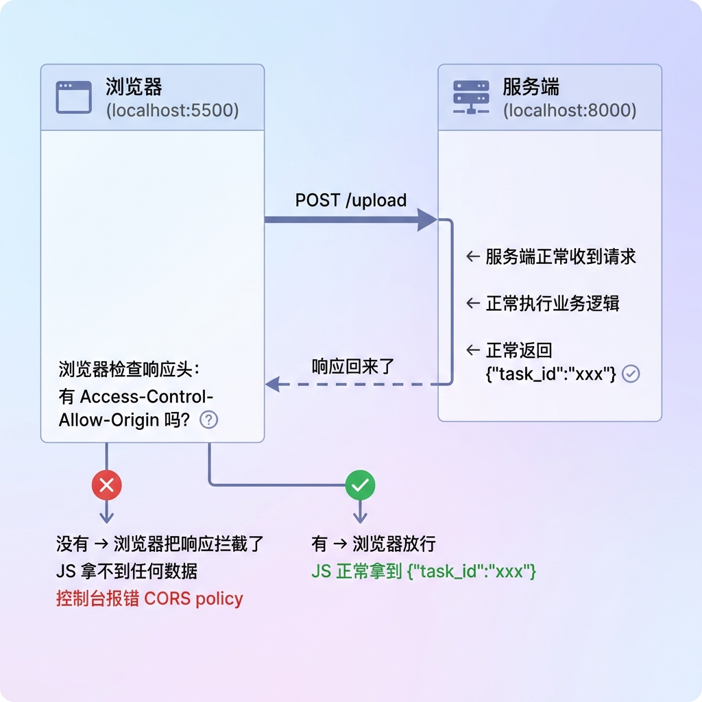


#### 2.4.5 当前项目不跨域，为什么还是加上了？

虽然当前不需要，但提前加上是一种**防御性编程**——花 5 行代码，避免未来踩坑：

```
┌───────────────────────────────┬──────┐
│  未来可能的场景                 │  不加 CORS 会怎样                    │
├───────────────────────────────┼──────┤
│  开发时用 VS Code Live Server  │  页面在 5500 端口，后端在 8000，     │
│  打开 HTML 单独调试前端         │  所有请求被拦截，调试不了            │
├───────────────────────────────┼──────┤
│  前后端分离部署                 │  前端在 Nginx(:80)，后端在(:8000)，  │
│  （前端交给专业前端团队）        │  用户访问直接报错                    │
├───────────────────────────────┼──────┤
│  同事/第三方系统调用你的 API     │  别人的页面无法调用你的接口          │
└───────────────────────────────┴──────┘
```

这几行代码对当前项目没有任何副作用（同源请求不受 CORS 配置影响），但在上述场景发生时可以直接用，不用再回来排查"为什么请求发了但前端拿不到数据"。

---

## 3. 系统架构总览


---

## 4. 导入流程交互时序

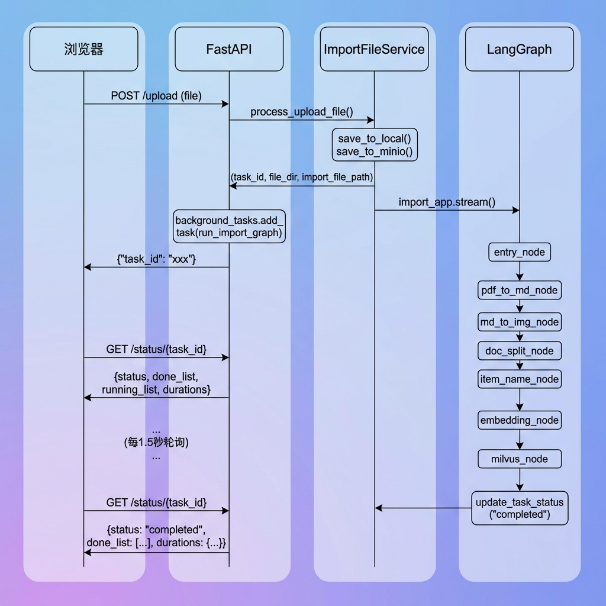

---

## 5. 项目目录结构

```
knowledge/
├── api/
│   └── import_router.py          # FastAPI 应用入口 + 路由注册
├── core/
│   ├── paths.py                  # 路径常量（本地存储、前端页面目录）
│   └── deps.py                   # 依赖注入工厂函数
├── schema/
│   └── upload_schema.py          # Pydantic 请求/响应模型
├── services/
│   └── import_file_service.py    # 文件上传 + 图谱运行的业务逻辑
├── processor/
│   └── import_processor/
│       ├── base.py               # BaseNode 基类（含计时逻辑）
│       ├── main_graph.py         # LangGraph 图谱编排
│       └── nodes/                # 各处理节点
├── utils/
│   └── task_util.py              # 任务状态管理（内存字典）
└── front/
    └── import.html               # 前端导入页面
```

---

## 6. 具体实现步骤

### Step 1: 路径配置

定义项目中文件存储和前端资源的路径常量：paths.py

```python
import os

# 项目根目录
KNOWLEDGE_ROOT = os.path.abspath(os.path.join(os.path.dirname(__file__), ".."))

# 本地文件存储基础目录
LOCAL_BASE_DIR = os.path.join(KNOWLEDGE_ROOT, "temp_data")

# 前端页面静态资源目录
FRONT_PAGE_DIR = os.path.join(KNOWLEDGE_ROOT, "front")

def get_local_base_dir() -> str:
    """获取本地文件存储基础目录"""
    return LOCAL_BASE_DIR

def get_front_page_dir() -> str:
    """获取前端静态页面目录"""
    return FRONT_PAGE_DIR
```

### Step 2: 定义请求/响应模型

使用 Pydantic 定义 API 的数据契约：upload_schema.py

```python
from typing import List, Dict
from pydantic import BaseModel, Field

class UploadResponse(BaseModel):
    """文件上传响应"""
    message: str = Field(..., description="响应消息")
    task_id: str = Field(..., description="任务ID")

class TaskStatusResponse(BaseModel):
    """任务状态响应"""
    status: str = Field(..., description="任务状态")
    done_list: List[str] = Field(..., description="已完成节点列表")
    running_list: List[str] = Field(..., description="正在运行节点列表")
    durations: Dict[str, float] = Field(default={}, description="各节点耗时(秒)")
```

**关键点：** `durations` 字段必须在 Pydantic 模型中声明，否则 FastAPI 序列化时会丢弃该字段，前端拿不到耗时数据。

### Step 3: 任务状态管理

使用内存字典管理任务的生命周期状态：

```python
from typing import Dict, List
from collections import defaultdict

# ─── 内存态任务追踪 ───
#defaultdict 是 collections 模块中的字典子类
#list 作为工厂函数传入（注意不加括号）
#当访问一个不存在的键时，会自动调用 list() 创建一个空列表作为默认值，而不是抛出 KeyError
_tasks_running_list: Dict[str, List[str]] = defaultdict(list)
_tasks_done_list: Dict[str, List[str]] = defaultdict(list)
_tasks_duration: Dict[str, Dict[str, float]] = defaultdict(dict)
_tasks_result: Dict[str, Dict[str, str]] = defaultdict(dict)
_tasks_status: Dict[str, str] = {}

# ─── 任务状态常量 ───
TASK_STATUS_PROCESSING = "processing"
TASK_STATUS_COMPLETED = "completed"
TASK_STATUS_FAILED = "failed"

# ─── 节点英文名 → 中文展示名 ───
_NODE_NAME_TO_CN: Dict[str, str] = {
    "upload_file": "上传文件",
    "entry_node": "检查文件",
    "pdf_to_md_node": "PDF转Markdown",
    "md_to_img_node": "Markdown图片处理",
    "document_split_node": "文档切分",
    "item_name_recognition_node": "主体名称识别",
    "embedding_chunk_node": "向量生成",
    "import_milvus_node": "导入向量数据库",
    "__end__": "处理完成",
}

def _to_cn(node_name: str) -> str:
    return _NODE_NAME_TO_CN.get(node_name, node_name)#不存在返回默认值
```

**核心函数：**

```python
def add_running_task(task_id: str, node_name: str) -> None:
    """将节点加入运行列表（去重）"""
    running = _tasks_running_list[task_id]
    if node_name not in running:
        running.append(node_name)

def add_done_task(task_id: str, node_name: str) -> None:
    """将节点从运行列表移到完成列表"""
    if node_name in _tasks_running_list[task_id]:
        _tasks_running_list[task_id].remove(node_name)
    done = _tasks_done_list[task_id]
    if node_name not in done:
        done.append(node_name)

def add_node_duration(task_id: str, node_name: str, duration: float) -> None:
    """记录节点耗时（秒），key 使用中文名"""
    cn_name = _to_cn(node_name)
    _tasks_duration[task_id][cn_name] = round(duration, 2)

def get_running_task_list(task_id: str) -> List[str]:
    """获取指定任务运行中的节点列表，并通过列表推导式统一转换为中文展示名返回"""
    return [_to_cn(n) for n in _tasks_running_list.get(task_id, [])]

def get_done_task_list(task_id: str) -> List[str]:
    """获取指定任务已完成的节点列表，并通过列表推导式统一转换为中文展示名返回"""
    return [_to_cn(n) for n in _tasks_done_list.get(task_id, [])]

def get_task_status(task_id: str) -> str:
    """根据任务ID 获取任务状态"""
    return _tasks_status.get(task_id, "")

def update_task_status(task_id: str, status_name: str) -> None:
    """更新指定任务的总体运行状态（如 processing 等）"""
    _tasks_status[task_id] = status_name

def get_task_info(task_id: str) -> Dict[str, any]:
    """获取任务全局信息（供 /status 接口使用）"""
    return {
        "status": get_task_status(task_id),
        "running_list": get_running_task_list(task_id),
        "done_list": get_done_task_list(task_id),
        "durations": get_node_durations(task_id),
    }
```

**数据流转示意：**

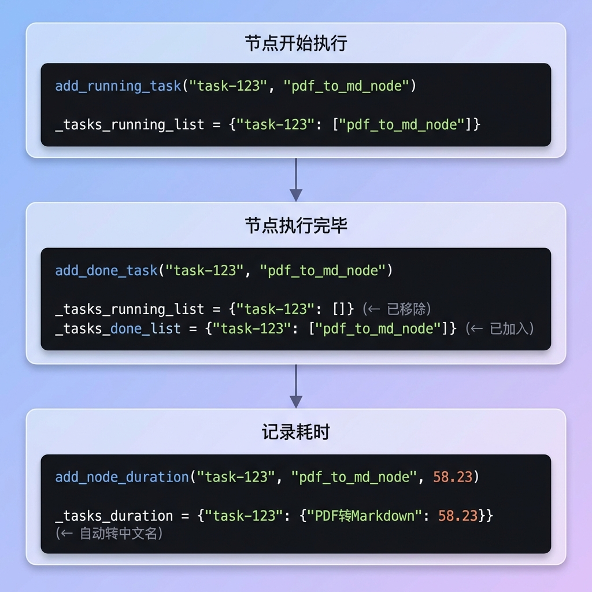

### Step 4: BaseNode 基类逻辑

BaseNode 的 `__call__` 方法是 LangGraph 调用每个节点的入口，在这里统一处理状态追踪和耗时统计：

```python
from knowledge.utils.task_util import add_running_task, add_done_task, add_node_duration

class BaseNode(ABC):
    name: str = "base_node"

    def __call__(self, state: T) -> T:
        task_id = state.get("task_id", "")
        try:
            self.logger.info(f"--- {self.name} 开始 ---")
            if task_id:
                add_running_task(task_id, self.name)

            import time
            start_time = time.time()
            result = self.process(state)
            duration = time.time() - start_time

            self.logger.info(f"--- {self.name} 完成, 耗时: {duration:.2f}s ---")
            if task_id:
                add_done_task(task_id, self.name)
                add_node_duration(task_id, self.name, duration)

            return result
        except Exception as e:
            self.logger.error(f"{self.name} 执行失败: {e}")
            raise ImportProcessError(message=str(e), node_name=self.name, cause=e)

    @abstractmethod
    def process(self, state: T) -> T:
        """子类实现具体处理逻辑"""
        pass
```

**设计要点：状态以及计时逻辑放在基类的 `__call__` 中，采用**模板方法模式**——父类定义固定流程（状态追踪、计时、异常处理），子类只需实现 `process` 方法填充业务逻辑。新增节点时无需修改基类代码，也符合开闭原则。

### Step 5: 导入业务服务

该服务负责两件事：处理文件上传 和 运行导入图谱。import_file_service.py

```python
import logging,os.path,shutil,uuid
from datetime import datetime
from typing import Tuple
from fastapi import UploadFile
from knowledge.core.paths import get_local_base_dir
from knowledge.utils.task_util import add_running_task, add_done_task
from knowledge.processor.import_processor.main_graph import kb_import_graph_app

logger = logging.getLogger(__name__)

class ImportFileService:
    
    def _get_date_dir(self) -> str:
        # %Y%m%d:年月日
        # %Y:四位 %y:两位
        return os.path.join(get_local_base_dir(), datetime.now().strftime("%Y%m%d"))
    
    def process_upload_file(self, file: UploadFile) -> Tuple[str, str, str]:
        """
        处理上传文件：
        1. 生成 task_id，构建归档目录
        2. 标记 upload_file 节点为运行中
        3. 保存文件到本地磁盘
        4. 同步上传到 MinIO
        5. 标记 upload_file 节点完成
        6. 返回 (task_id, file_dir, import_file_path)
        """
        date_dir = self._get_date_dir()
        task_id = str(uuid.uuid4().hex[:8])# 真正的随机 获取前8个随机数
        file_dir = os.path.join(date_dir, task_id)

        add_running_task(task_id, "upload_file")
        import_file_path = self._save_upload_file_to_local(file, file_dir)
        self._save_upload_file_to_minio(import_file_path, file.filename)
        add_done_task(task_id, "upload_file")

        return task_id, file_dir, import_file_path
    
    def _save_upload_file_to_local(self, file: UploadFile, file_dir: str) -> str:
        """
        保存文件到临时目录
        Args:
            file: 文件上传对象
            file_dir: 上传文件的目录
        Returns:
        """
        # 1. 创建文件的归属目录
        os.makedirs(file_dir, exist_ok=True)

        # 2. 构建导入文件的路径
        import_file_path = os.path.join(file_dir, file.filename)

        # 3. 写入
        try:
            with  open(import_file_path, "wb") as f:
                # 不同的操作系统以及不同python版本都可以分批次的写入（windows版本以及3.7以上的sdk版本:1m）
                shutil.copyfileobj(file.file, f)
        except IOError as e:
            logger.info(f"{file.filename}写入临时目录失败 原因:{str(e)}")
            raise FileProcessingError(message=f"{file.filename}写入临时目录失败 原因:{str(e)}")

        # 4. 返回导入的文件路径
        return import_file_path

    def _save_upload_file_to_minio(self, import_file_path: str, filename: str):
        """
        Args:
            import_file_path:  上传文件的地址
            filename: 上传文件的名字
        Returns:
        """

        # 1. 获取minio客户端
        try:
            minio_client = StorageClients.get_minio_client()
        except ConnectionError as e:
            logger.error(f"MinIO客户端获取失败 原因:{str(e)}")
            return

        # 2. 获取minio相关信息
        bucket_name = os.getenv('MINIO_BUCKET_NAME')
        object_name = f"origin_files/{datetime.now().strftime('%Y%m%d')}/{filename}"

        # 3. 上传
        try:
            minio_client.fput_object(bucket_name, object_name, import_file_path)
        except Exception as e:
            logger.error(f"{filename}上传到MinIO失败 原因：{str(e)}")
            
    def run_import_graph(self, task_id: str, file_dir: str, import_file_path: str):
        """ 运行导入 LangGraph 流水线（在后台任务中执行） """
        try:
            update_task_status(task_id, "processing")

            global_graph_init_status: ImportGraphState = {
                "task_id": task_id,
                "file_dir": file_dir,
                "import_file_path": import_file_path
            }

            for event in kb_import_graph_app.stream(global_graph_init_status):
                for node_name, state in event.items():
                    print(f"[{task_id}] Completed Node: {node_name}")

            update_task_status(task_id, "completed")
        except Exception as e:
            update_task_status(task_id, "failed")
            print(f"[{task_id}] Error: {e}")
```

**注意：** `upload_file` 节点不经过 LangGraph，而是在 `process_upload_file` 中手动调用 `add_running_task/add_done_task`。其余节点由 `BaseNode.__call__` 自动处理。

### Step 6: 依赖注入工厂

deps.py

```python
from functools import cache
from knowledge.services.import_file_service import ImportFileService

@cache
def get_import_file_service() -> ImportFileService:
    return ImportFileService()
```

使用 `@lru_cache` 保证服务类为单例，避免重复创建。

### Step 7: 创建 FastAPI 应用与路由注册

```python
import os.path
import uvicorn
from fastapi import FastAPI, File, UploadFile, Depends, BackgroundTasks
from fastapi.staticfiles import StaticFiles
from fastapi.middleware.cors import CORSMiddleware
from fastapi.responses import FileResponse
from knowledge.core.paths import get_front_page_dir
from knowledge.schema.upload_schema import UploadResponse, TaskStatusResponse
from knowledge.utils.task_util import get_task_info
from knowledge.core.deps import get_import_file_service
from knowledge.services.import_file_service import ImportFileService


def create_app() -> FastAPI:
    app = FastAPI(description="知识库导入",version="v1.0")

    # 跨域配置（允许前端跨域访问）
    app.add_middleware(
        CORSMiddleware,
        allow_origins=["*"],
        allow_credentials=True,
        allow_methods=["*"],
        allow_headers=["*"],
    )

    # 挂载前端静态资源
    front_page_dir = get_front_page_dir()
    if front_page_dir and os.path.exists(front_page_dir):
        app.mount("/front", StaticFiles(directory=front_page_dir))

    register_router(app)
    return app

if __name__ == '__main__':
    # param1:fastapi实例
    # param2:启动的服务器地址
    # param3:启动的服务端口
    uvicorn.run(app=create_app(), host="0.0.0.0", port=8000, log_level="info")
```

**路由注册：**

```python
def register_router(app: FastAPI):

    @app.get("/import")
    async def import_root():
        """返回导入页面"""
        return FileResponse(path=os.path.join(get_front_page_dir(), "import.html"))

    @app.post("/upload", response_model=UploadResponse)
    async def upload_file_endpoint(
        background_tasks: BackgroundTasks,
        file: UploadFile = File(...),
        service: ImportFileService = Depends(get_import_file_service)
    ):
        # 1. 上传文件（本地 + MinIO）
        task_id, file_dir, import_file_path = service.process_upload_file(file)

        # 2. 将耗时的图谱流程放入后台任务
        background_tasks.add_task(service.run_import_graph, task_id, file_dir, import_file_path)

        # 3. 立即返回 task_id，前端开始轮询
        return UploadResponse(message="文件上传成功", task_id=task_id)

    @app.get("/status/{task_id}", response_model=TaskStatusResponse)
    async def get_status_endpoint(task_id: str):
        """前端轮询此接口获取任务进度"""
        task_info = get_task_info(task_id)
        return TaskStatusResponse(**task_info)
```

**后台任务核心流程图：**

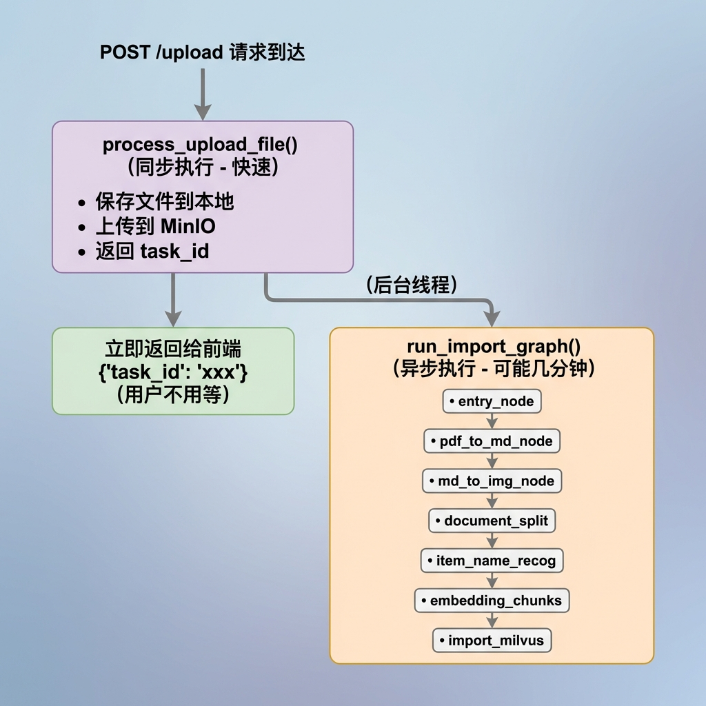

### Step 8: 前端页面

前端通过轮询 `/status/{task_id}` 接口展示实时进度，核心交互逻辑如下【参考】：

**上传流程：**

```javascript
async function uploadFile(file) {
    // 1. 根据文件类型判断总步数
    const isPDF = file.name.toLowerCase().endsWith('.pdf');
    const totalNodes = isPDF ? 8 : 7;

    // 2. 发起上传请求
    const formData = new FormData();
    formData.append('file', file);
    const response = await fetch(`${API_BASE}/upload`, { method: 'POST', body: formData });
    const result = await response.json();

    // 3. 开始轮询任务状态
    pollStatus(result.task_id, itemEl, totalNodes);
}
```

**轮询与进度渲染：**

```javascript
function pollStatus(taskId, itemEl, totalNodes) {
    const interval = setInterval(async () => {
        const res = await fetch(`${API_BASE}/status/${taskId}`);
        const data = await res.json();

        // 传入 durations 用于展示各节点耗时
        const percentage = renderLogsAndCalculateProgress(
            itemEl, data.done_list, data.running_list, totalNodes, data.durations
        );

        if (data.status === 'completed') {
            updateProgressUI(progressWrapper, 100);
            clearInterval(interval);
        } else if (data.status === 'processing') {
            updateProgressUI(progressWrapper, percentage);
        } else if (data.status === 'failed') {
            clearInterval(interval);
        }
    }, 1500);  // 每 1.5 秒轮询一次
}
```

**耗时展示：**

```javascript
function formatDuration(seconds) {
    if (seconds < 60) {
        return seconds.toFixed(1) + 's';
    }
    const mins = Math.floor(seconds / 60);
    const secs = (seconds % 60).toFixed(0);
    return `${mins}m${secs}s`;
}

// 在已完成节点旁边追加耗时标签
if (durationMap[item] !== undefined) {
    const durationSpan = document.createElement('span');
    durationSpan.className = 'log-duration';
    durationSpan.textContent = formatDuration(durationMap[item]);
    li.appendChild(durationSpan);
}
```

**前端进度界面结构：**

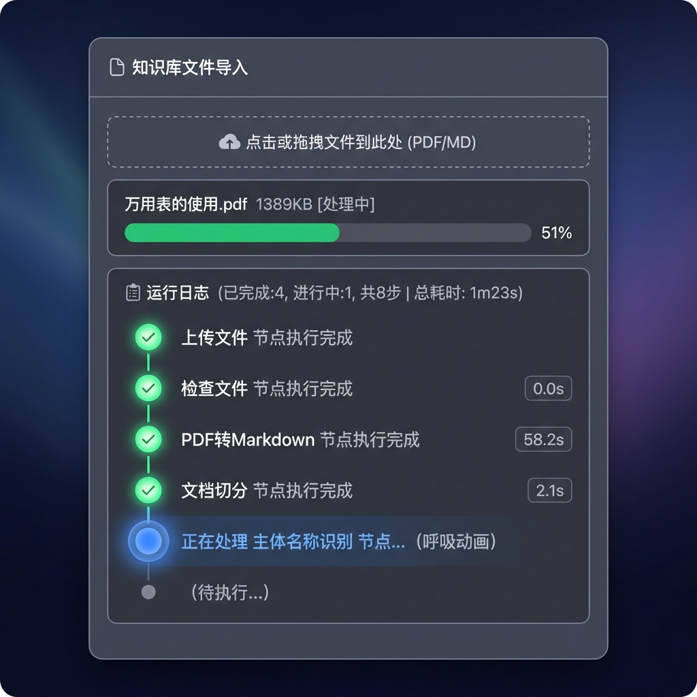

---

## 7. API 接口一览

| 方法 | 路径                | 功能               | 请求                  | 响应                 |
| ---- | ------------------- | ------------------ | --------------------- | -------------------- |
| GET  | `/import`           | 返回导入页面       | -                     | HTML                 |
| POST | `/upload`           | 上传文件并启动导入 | `multipart/form-data` | `UploadResponse`     |
| GET  | `/status/{task_id}` | 查询任务进度       | 路径参数              | `TaskStatusResponse` |

**`/status` 响应示例：**

```json
{
  "status": "processing",
  "done_list": ["上传文件", "检查文件", "PDF转Markdown"],
  "running_list": ["文档切分"],
  "durations": {
    "检查文件": 0.01,
    "PDF转Markdown": 58.23,
    "文档切分": 2.15
  }
}
```

---

## 8. 测试运行

### 8.1 启动服务

```bash
python -m knowledge.api.import_router
```

服务启动后访问 `http://127.0.0.1:8000/import` 即可打开导入页面。

### 8.2 测试代码

```python
import requests
import time

# 1. 上传文件
files = [('file', ('test.pdf', open('test.pdf', 'rb'), 'application/pdf'))]
response = requests.post('http://localhost:8000/upload', files=files)
result = response.json()
print(result)
# {"message": "文件上传成功", "task_id": "xxx-xxx-xxx"}

# 2. 轮询状态
task_id = result['task_id']
while True:
    status = requests.get(f'http://localhost:8000/status/{task_id}').json()
    print(f"状态: {status['status']}, 已完成: {status['done_list']}")
    print(f"耗时: {status['durations']}")
    if status['status'] in ('completed', 'failed'):
        break
    time.sleep(2)
```

### 8.3 预期输出

```
第 1 次轮询:
  状态: processing
  已完成: ["上传文件", "检查文件"]
  运行中: ["PDF转Markdown"]
  耗时: {"检查文件": 0.01}

第 2 次轮询:
  状态: processing
  已完成: ["上传文件", "检查文件", "PDF转Markdown", "文档切分"]
  运行中: ["主体名称识别"]
  耗时: {"检查文件": 0.01, "PDF转Markdown": 58.23, "文档切分": 2.15}

第 3 次轮询:
  状态: completed
  已完成: ["上传文件", "检查文件", "PDF转Markdown", "Markdown图片处理",
           "文档切分", "主体名称识别", "向量生成", "导入向量数据库"]
  运行中: []
  耗时: {"检查文件": 0.01, "PDF转Markdown": 58.23, ... "导入向量数据库": 1.82}
```

---

## 9. 总结

### 9.1 核心模块职责

```
┌──────────────────────────────────┐
│       模块          │              职责                       │
├──────────────────────────────────┤
│  import_router.py  │  创建 FastAPI 应用、注册路由、启动服务    │
│  upload_schema.py  │  定义 API 请求/响应的数据模型            │
│  import_file_      │  文件上传（本地+MinIO）、启动图谱流程     │
│   service.py       │                                         │
│  task_util.py      │  内存态任务追踪（状态、进度、耗时）       │
│  base.py           │  节点基类，统一计时和状态追踪             │
│  deps.py           │  依赖注入工厂，管理服务单例               │
│  import.html       │  前端页面，文件上传 + 进度轮询展示        │
└────────────────────┴─────────────┘
```

### 9.2 设计要点

**要点 1：后台任务异步处理**

上传接口立即返回 `task_id`，将耗时的图谱流程交给 `BackgroundTasks`。用户无需等待数分钟的 PDF 解析和向量化完成。

**要点 2：统一的节点生命周期管理**

所有节点的状态追踪和耗时统计集中在 `BaseNode.__call__` 中，子类只需实现 `process` 方法，零侵入式扩展。

**要点 3：前端时间线进度展示**

前端日志区域采用时间线布局，左侧竖线连接各节点圆点，已完成节点绿色发光，运行中节点蓝色呼吸动画，每个已完成节点右侧显示耗时标签，顶部 summary 显示总耗时。

**要点 4：节点名中英文映射**

后端通过 `_NODE_NAME_TO_CN` 字典将英文节点名统一转为中文，`done_list`、`running_list`、`durations` 的 key 均使用中文名，前端直接展示无需二次转换。