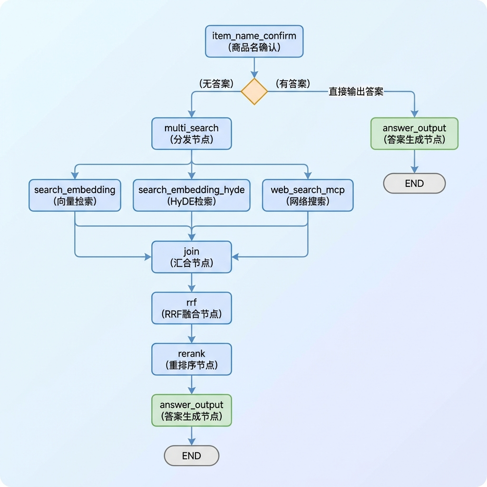
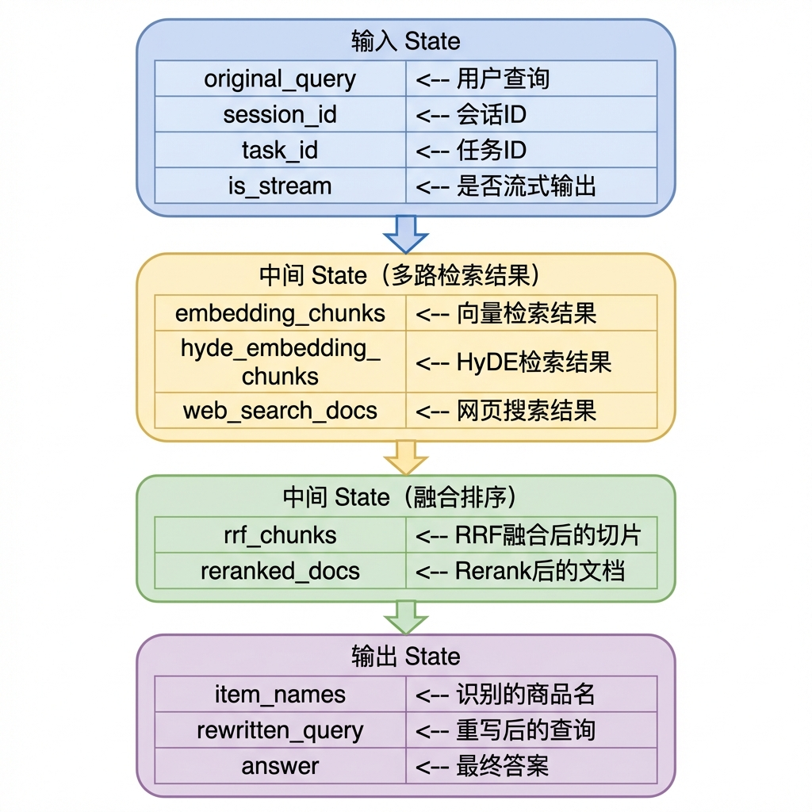

# 知识库查询 —— 骨架代码

> 本文档详细介绍知识库查询流程的骨架代码设计与实现，包括配置管理、异常处理、状态定义、节点基类和流程图构建。

---

## 1. 任务目标

### 1.1 本章目标

通过本章学习，你将掌握：

1. **理解查询流程架构**：掌握多路并行检索、RRF 融合、Rerank 重排序的核心概念
2. **设计可扩展的查询骨架**：学会使用基类、配置、异常等模式构建健壮的查询流程
3. **实现查询流程主图**：构建完整的知识库查询工作流
4. **编写可测试的代码**：通过 `if __name__ == "__main__"` 验证流程

### 1.2 涉及文件

```
knowledge/processor/query_process/
├── config.py        # 配置管理模块
├── exceptions.py    # 自定义异常类
├── state.py         # 图状态类型定义
├── base.py          # 节点基类
├── main_graph.py    # 主图定义与构建
└── __init__.py      # 模块导出
```

### 1.3 文件依赖关系

```
config.py ─────────────────────────┐
                                   │
exceptions.py ─────────────────────┼──> base.py ──> main_graph.py
                                   │
state.py ──────────────────────────┘
```

### 1.4 查询流程 vs 导入流程

| 对比项         | 导入流程               | 查询流程                   |
| -------------- | ---------------------- | -------------------------- |
| **目标**       | 将文档处理并存入向量库 | 根据用户问题检索并生成答案 |
| **流程特点**   | 顺序执行，单一路径     | 多路并行检索 + 融合        |
| **关键技术**   | PDF 转换、切片、向量化 | 多路检索、RRF、Rerank      |
| **状态复杂度** | 中等                   | 较高（多路结果合并）       |

---

## 2. 核心概念扫盲

### 2.1 查询流程核心概念

| 概念           | 说明                                                   | 作用         |
| -------------- | ------------------------------------------------------ | ------------ |
| **多路检索**   | 同时使用多种检索方式（向量、HyDE、网页）               | 提高召回率   |
| **HyDE**       | Hypothetical Document Embeddings，先生成假设答案再检索 | 提升语义匹配 |
| **RRF**        | Reciprocal Rank Fusion，倒数排名融合                   | 合并多路结果 |
| **Rerank**     | 重排序，使用精排模型对召回结果重新打分                 | 提高精度     |
| **商品名确认** | 从用户问题中识别具体产品名称                           | 精准定位知识 |

### 2.2 LangGraph 并行执行

LangGraph 支持多路并行执行节点：


**实现方式：**

```python
# 分发：一个节点连接到多个下游节点
workflow.add_edge("multi_search", "search_embedding")
workflow.add_edge("multi_search", "search_embedding_hyde")
workflow.add_edge("multi_search", "web_search_mcp")

# 汇合：多个节点连接到同一个下游节点
workflow.add_edge("search_embedding", "join")
workflow.add_edge("search_embedding_hyde", "join")
workflow.add_edge("web_search_mcp", "join")
```

### 2.3 RRF 融合算法

**Reciprocal Rank Fusion** 是一种简单有效的结果融合算法：

```
RRF_score(d) = Σ (1 / (k + rank_i(d)))

其中：
- d：文档
- k：平滑常数（通常取 60）
- rank_i(d)：文档在第 i 路检索中的排名
```

**直观理解：**

```
假设 k=60，有 3 路检索结果：

文档 A 的排名：路1 排第 2，路2 排第 1，路3 排第 3
RRF(A) = 1/(60+2) + 1/(60+1) + 1/(60+3)
       = 0.016 + 0.016 + 0.016
       = 0.048

文档 B 的排名：路1 排第 10，路2 未出现，路3 排第 5
RRF(B) = 1/(60+10) + 0 + 1/(60+5)
       = 0.014 + 0 + 0.015
       = 0.029

结论：文档 A 得分更高，因为多路排名都靠前
```

### 2.4 条件路由

查询流程中，如果商品名确认节点直接给出了答案（如闲聊回复），则跳过后续检索：

```
+-------------------+
| item_name_confirm |
+-------------------+
         |
    +----+----+
    |         |
    v         v
(无答案)    (有答案)
    |         |
    v         v
multi_search  answer_output
    |
    v
  ...检索流程...
```

```python
def route_after_item_confirm(state: QueryGraphState) -> bool:
    """根据是否已有答案决定路由"""
    if state.get("answer"):
        return True   # 直接到答案输出
    return False      # 继续检索流程
```

---

## 3. 知识库查询业务处理流程（总）

### 3.1 整体流程图



### 3.2 骨架模块职责

| 模块              | 职责                                     | 重要性         |
| ----------------- | ---------------------------------------- | -------------- |
| **config.py**     | 管理检索参数、LLM 配置、数据库连接等     | 配置与代码分离 |
| **exceptions.py** | 定义查询相关异常（搜索、重排序、LLM 等） | 错误可追踪     |
| **state.py**      | 定义查询状态结构，多路检索结果存储       | 数据契约       |
| **base.py**       | 定义查询节点基类，统一执行逻辑           | 代码复用       |
| **main_graph.py** | 构建查询工作流，编排并行检索和融合       | 流程编排       |

### 3.3 数据流向



---

## 4. 知识库查询业务处理流程（分）

### 4.1 配置管理模块

#### 4.1.1 目标

- 集中管理查询流程的所有配置项
- 支持环境变量覆盖
- 提供配置验证
- 实现单例模式

#### 4.1.2 需求分析

**配置分类：**

| 类别         | 配置项                      | 说明                 |
| ------------ | --------------------------- | -------------------- |
| **文本处理** | `max_context_chars`         | 上下文最大字符数     |
| **Rerank**   | `rerank_max_top_k`          | 重排序最大 TopK      |
|              | `rerank_min_top_k`          | 重排序最小 TopK      |
|              | `rerank_gap_ratio`          | 断崖检测阈值（相对） |
|              | `rerank_gap_abs`            | 断崖检测阈值（绝对） |
| **RRF**      | `rrf_k`                     | RRF 平滑常数         |
|              | `rrf_max_results`           | 最大返回结果数       |
| **检索**     | `embedding_search_limit`    | 向量搜索返回数量     |
|              | `hyde_search_limit`         | HyDE 搜索返回数量    |
| **商品确认** | `item_name_high_confidence` | 高置信度阈值         |
|              | `item_name_mid_confidence`  | 中置信度阈值         |
|              | `item_name_max_options`     | 最大候选数量         |
| **LLM**      | `openai_api_base`           | API 地址             |
|              | `default_model`             | 默认模型名           |
| **数据库**   | `milvus_url`                | Milvus 地址          |
|              | `chunks_collection`         | 切片集合名           |

#### 4.1.3 代码实现

```python
# knowledge/processor/query_process/config.py

"""查询流程配置管理模块

集中管理所有配置项，支持环境变量覆盖。所有属性均采用懒加载模式。
"""

from dataclasses import dataclass, field
from typing import Optional
import os

from dotenv import load_dotenv
load_dotenv()


@dataclass
class QueryConfig:
    """查询流程配置。"""

    # ==================== 文本处理配置 ====================
    max_context_chars: int = field(
        default_factory=lambda: int(os.getenv("MAX_CONTEXT_CHARS", "12000"))
    )

    # ==================== Rerank 配置 ====================
    rerank_max_top_k: int = field(
        default_factory=lambda: int(os.getenv("RERANK_MAX_TOP_K", "10"))
    )
    rerank_min_top_k: int = field(
        default_factory=lambda: int(os.getenv("RERANK_MIN_TOP_K", "3"))
    )
    rerank_gap_ratio: float = field(
        default_factory=lambda: float(os.getenv("RERANK_GAP_RATIO", "0.25"))
    )
    rerank_gap_abs: float = field(
        default_factory=lambda: float(os.getenv("RERANK_GAP_ABS", "0.5"))
    )

    # ==================== RRF 配置 ====================
    rrf_k: int = field(
        default_factory=lambda: int(os.getenv("RRF_K", "60"))
    )
    rrf_max_results: int = field(
        default_factory=lambda: int(os.getenv("RRF_MAX_RESULTS", "10"))
    )

    # ==================== 检索配置 ====================
    embedding_search_limit: int = field(
        default_factory=lambda: int(os.getenv("EMBEDDING_SEARCH_LIMIT", "10"))
    )
    hyde_search_limit: int = field(
        default_factory=lambda: int(os.getenv("HYDE_SEARCH_LIMIT", "5"))
    )

    # ==================== 商品确认节点配置 ====================
    item_name_high_confidence: float = field(
        default_factory=lambda: float(os.getenv("ITEM_NAME_HIGH_CONFIDENCE", "0.7"))
    )
    item_name_mid_confidence: float = field(
        default_factory=lambda: float(os.getenv("ITEM_NAME_MID_CONFIDENCE", "0.6"))
    )
    item_name_max_options: int = field(
        default_factory=lambda: int(os.getenv("ITEM_NAME_MAX_OPTIONS", "5"))
    )
    item_name_dense_weight: float = field(
        default_factory=lambda: float(os.getenv("ITEM_NAME_DENSE_WEIGHT", "0.5"))
    )
    item_name_sparse_weight: float = field(
        default_factory=lambda: float(os.getenv("ITEM_NAME_SPARSE_WEIGHT", "0.5"))
    )

    # ==================== LLM 配置 ====================
    openai_api_base: str = field(
        default_factory=lambda: os.getenv("OPENAI_API_BASE", "")
    )
    openai_api_key: str = field(
        default_factory=lambda: os.getenv("OPENAI_API_KEY", "")
    )
    default_model: str = field(
        default_factory=lambda: os.getenv("MODEL", "")
    )
    item_model: str = field(
        default_factory=lambda: os.getenv("ITEM_MODEL", "")
    )

    # ==================== Milvus 配置 ====================
    milvus_url: str = field(
        default_factory=lambda: os.getenv("MILVUS_URL", "")
    )
    chunks_collection: str = field(
        default_factory=lambda: os.getenv("CHUNKS_COLLECTION", "")
    )
    item_name_collection: str = field(
        default_factory=lambda: os.getenv("ITEM_NAME_COLLECTION", "")
    )
    entity_name_collection: str = field(
        default_factory=lambda: os.getenv("ENTITY_NAME_COLLECTION", "")
    )

    @classmethod
    def from_env(cls) -> "QueryConfig":
        """从环境变量加载配置。"""
        return cls()


# ==================== 全局单例 ====================

_config: Optional[QueryConfig] = None


def get_config() -> QueryConfig:
    """获取配置单例。"""
    global _config
    if _config is None:
        _config = QueryConfig.from_env()
    return _config
```

**关键设计点：**

1. **懒加载模式**
   - 使用 `field(default_factory=lambda: ...)` 延迟读取环境变量
   - 避免导入时就执行 `os.getenv()`

2. **单例模式**
   - `_config` 全局变量保存唯一实例
   - `get_config()` 返回全局实例

---

### 4.2 状态定义模块

#### 4.2.1 目标

- 定义查询流程的完整状态结构
- 支持多路检索结果存储
- 提供默认状态工厂函数

#### 4.2.2 需求分析

**状态字段分类：**

| 类别         | 字段                                                         | 说明     |
| ------------ | ------------------------------------------------------------ | -------- |
| **会话信息** | `session_id`, `task_id`, `message_id`                        | 会话追踪 |
| **输入数据** | `original_query`, `item_names`, `history`                    | 用户输入 |
| **检索结果** | `embedding_chunks`, `hyde_embedding_chunks`, `web_search_docs` | 多路召回 |
| **融合结果** | `rrf_chunks`, `reranked_docs`                                | 融合排序 |
| **输出数据** | `prompt`, `answer`, `rewritten_query`                        | 最终输出 |
| **控制标志** | `is_stream`                                                  | 流式输出 |

#### 4.2.3 代码实现

```python
# knowledge/processor/query_process/state.py

"""查询流程状态类型定义

定义完整的查询状态结构和辅助函数。
"""

from typing import TypedDict, List
import copy


class QueryGraphState(TypedDict):
    """查询流程图状态。

    包含整个查询流程中传递的所有数据。
    """
    session_id: str              # 会话ID
    task_id: str                  # 任务ID
    message_id: str               # 消息ID
    original_query: str           # 原始查询
    embedding_chunks: list        # 向量检索结果
    hyde_embedding_chunks: list   # HyDE检索结果
    rrf_chunks: list              # RRF融合后的切片
    web_search_docs: list         # 网页搜索结果
    reranked_docs: list           # 重排序后的文档
    prompt: str                   # 提示词
    answer: str                   # 答案
    item_names: List[str]         # 商品名称
    rewritten_query: str          # 重写查询
    history: list                 # 历史对话
    is_stream: bool               # 是否流式输出


# ==================== 默认状态 ====================

DEFAULT_STATE: QueryGraphState = {
    "session_id": "",
    "task_id": "",
    "message_id": "",
    "original_query": "",
    "embedding_chunks": [],
    "hyde_embedding_chunks": [],
    "rrf_chunks": [],
    "web_search_docs": [],
    "reranked_docs": [],
    "prompt": "",
    "answer": "",
    "item_names": [],
    "rewritten_query": "",
    "history": [],
    "is_stream": False,
}


def create_default_state(**overrides) -> QueryGraphState:
    """创建默认状态，支持字段覆盖。

    Args:
        **overrides: 要覆盖的字段键值对。

    Returns:
        新的状态实例，包含默认值和覆盖值。
    """
    state = copy.deepcopy(DEFAULT_STATE)
    state.update(overrides)
    return state


def get_default_state() -> QueryGraphState:
    """获取默认状态副本。"""
    return copy.deepcopy(DEFAULT_STATE)


# 兼容旧版变量名
graph_default_state = DEFAULT_STATE
```

**关键设计点：**

1. **多路结果字段**
   - `embedding_chunks`、`hyde_embedding_chunks`、`web_search_docs`
   - 每个检索节点写入独立字段，避免冲突

2. **融合结果字段**
   - `rrf_chunks`：RRF 融合后
   - `reranked_docs`：Rerank 后

3. **工厂函数**
   - `create_default_state()` 支持字段覆盖
   - 使用 `deepcopy` 避免修改默认值

---

### 4.3 主图构建模块

#### 4.3.1 目标

- 构建完整的查询工作流图
- 实现多路并行检索
- 支持条件路由（有答案时跳过检索）
- 提供便捷的测试入口

#### 4.3.2 需求分析

**流程结构：**

1. **入口节点**：`item_name_confirm` 商品名确认
2. **条件路由**：有答案 → `answer_output`；无答案 → `multi_search`
3. **并行检索**：`embedding`、`hyde`、`web` 三路并行
4. **结果汇合**：`join` 节点
5. **融合排序**：`rrf` → `rerank`
6. **答案生成**：`answer_output`
7. **结束节点**：`END`

#### 4.3.3 代码实现

```python
# knowledge/processor/query_process/main_graph.py

"""查询流程主图

使用 LangGraph 构建知识库查询工作流。
"""

from langgraph.graph import StateGraph, END
from langgraph.graph.state import CompiledStateGraph
from dotenv import load_dotenv

from knowledge.processor.query_process.state import QueryGraphState
from knowledge.processor.query_process.nodes.answer_output_node import AnswerOutputNode
from knowledge.processor.query_process.nodes.item_name_confirm_node import ItemNameConfirmNode
from knowledge.processor.query_process.nodes.vector_search_node import VectorSearchNode
from knowledge.processor.query_process.nodes.hyde_search_node import HyDeSearchNode
from knowledge.processor.query_process.nodes.mcp_search_node import McpSearchNode
from knowledge.processor.query_process.nodes.rrf_node import RrfNode
from knowledge.processor.query_process.nodes.rerank_node import RerankNode

# 加载环境变量
load_dotenv()


def route_after_item_confirm(state: QueryGraphState) -> bool:
    """商品名称确认后的路由逻辑。

    根据是否已有答案决定是否跳过搜索直接输出。

    Args:
        state: 查询图状态。

    Returns:
        True 表示已有答案需要跳过搜索，False 表示继续搜索流程。
    """
    if state.get("answer"):
        return True
    return False


def create_query_graph() -> CompiledStateGraph:
    """创建查询流程图。

    Returns:
        编译后的 StateGraph 实例。
    """
    # 1. 定义LangGraph工作流
    workflow = StateGraph(QueryGraphState)

    # 2. 实例化节点
    nodes = {
        "item_name_confirm": ItemNameConfirmNode(),
        "multi_search": lambda x: x,   # 虚拟节点（分发）
        "search_embedding": VectorSearchNode(),
        "search_embedding_hyde": HyDeSearchNode(),
        "web_search_mcp": McpSearchNode(),
        "join": lambda x: {},  # 虚拟节点（汇合）
        "rrf": RrfNode(),
        "rerank": RerankNode(),
        "answer_output": AnswerOutputNode()
    }

    # 3. 添加节点
    for name, node in nodes.items():
        workflow.add_node(name, node)

    # 4. 设置入口点
    workflow.set_entry_point("item_name_confirm")

    # 5. 添加条件边：商品名称确认后根据是否有答案路由
    workflow.add_conditional_edges(
        "item_name_confirm",
        route_after_item_confirm,
        {
            False: "multi_search",
            True: "answer_output"
        }
    )

    # 6. 多路搜索分发（并行执行）
    workflow.add_edge("multi_search", "search_embedding")
    workflow.add_edge("multi_search", "search_embedding_hyde")
    workflow.add_edge("multi_search", "web_search_mcp")

    # 7. 多路搜索汇合
    workflow.add_edge("search_embedding", "join")
    workflow.add_edge("search_embedding_hyde", "join")
    workflow.add_edge("web_search_mcp", "join")

    # 8. 顺序边
    workflow.add_edge("join", "rrf")
    workflow.add_edge("rrf", "rerank")
    workflow.add_edge("rerank", "answer_output")
    workflow.add_edge("answer_output", END)

    # 9. 返回可运行的状态
    return workflow.compile()


# 创建全局图实例
query_app = create_query_graph()
```

**关键设计点：**

1. **虚拟节点**
   - `multi_search`：分发节点，使用 `lambda x: x` 直接返回状态
   - `join`：汇合节点，使用 `lambda x: {}` 等待所有并行节点完成

2. **条件路由**
   - `add_conditional_edges` 实现分支逻辑
   - 根据是否有答案决定执行路径

3. **并行执行**
   - 多个 `add_edge` 从同一节点出发
   - LangGraph 自动并行执行

---

## 5. 测试运行

### 5.1 测试代码

```python
if __name__ == "__main__":
    from knowledge.processor.query_process.base import setup_logging

    setup_logging()

    print("=" * 60)
    print("开始测试: 查询流程主图 (main_graph)")
    print("=" * 60)

    # 测试场景：商品名明确，走完整 pipeline
    print("\n【场景】: 商品名明确，走完整 pipeline")
    print("-" * 60)

    mock_state_1 = {
        "original_query": "RS-12 数字万用表如何测量直流电压？",
        "session_id": "test_session_main_graph",
        "task_id": "test_task_001",
        "is_stream": False,
    }

    print(f"  查询: {mock_state_1['original_query']}")
    print(f"  session_id: {mock_state_1['session_id']}")

    result_1 = query_app.invoke(mock_state_1)

    print(f"\n  【结果】:")
    print(f"  商品名: {result_1.get('item_names')}")
    print(f"  重写查询: {result_1.get('rewritten_query')}")
    answer_1 = result_1.get("answer", "")
    print(f"  答案: {answer_1[:200]}..." if len(answer_1) > 200 else f"  答案: {answer_1}")
```

### 5.2 运行测试

```bash
# 进入项目目录
cd knowledge

# 激活虚拟环境
.venv\Scripts\activate

# 运行测试
python -m knowledge.processor.query_process.main_graph
```

### 5.3 预期输出

```
============================================================
开始测试: 查询流程主图 (main_graph)
============================================================

【场景】: 商品名明确，走完整 pipeline
------------------------------------------------------------
  查询: RS-12 数字万用表如何测量直流电压？
  session_id: test_session_main_graph

  【结果】:
  商品名: ['RS-12 数字万用表']
  重写查询: RS-12 数字万用表如何测量直流电压？
  答案: RS-12数字万用表测量直流电压的步骤如下：

1. 将黑表笔插入COM插孔，红表笔插入V/Ω插孔...
```

---

## 6. 总结

### 6.1 关键设计模式

| 模式         | 应用场景                 | 优势                       |
| ------------ | ------------------------ | -------------------------- |
| **单例模式** | `get_config()`           | 全局共享配置，避免重复创建 |
| **工厂模式** | `create_default_state()` | 灵活创建状态实例           |
| **虚节点**   | `multi_search`, `join`   | 实现分发/汇合语义          |
| **条件路由** | `add_conditional_edges`  | 动态决定执行路径           |

### 6.2 查询流程关键特性

| 特性             | 说明                                 |
| ---------------- | ------------------------------------ |
| **多路并行检索** | 向量、HyDE、Web 三路并行，提高召回率 |
| **条件路由**     | 有直接答案时跳过检索，节省资源       |
| **RRF 融合**     | 公平合并多路结果，避免单路主导       |
| **动态 Rerank**  | 断崖检测，自动确定返回数量           |
| **流式支持**     | `is_stream` 标志支持流式输出         |

### 6.3 扩展指南

**添加新的检索通道：**

1. 创建节点类，继承 `BaseNode`
2. 在状态中添加对应的结果字段
3. 在 `main_graph.py` 中注册节点
4. 添加分发边和汇合边
5. 在 RRF 节点中处理新通道的结果

```python
# 新检索节点示例
class NewSearchNode(BaseNode):
    name = "new_search"

    def process(self, state):
        query = state.get("original_query", "")
        # 执行检索逻辑
        results = self.search(query)
        # 更新状态
        state["new_search_chunks"] = results
        return state
```