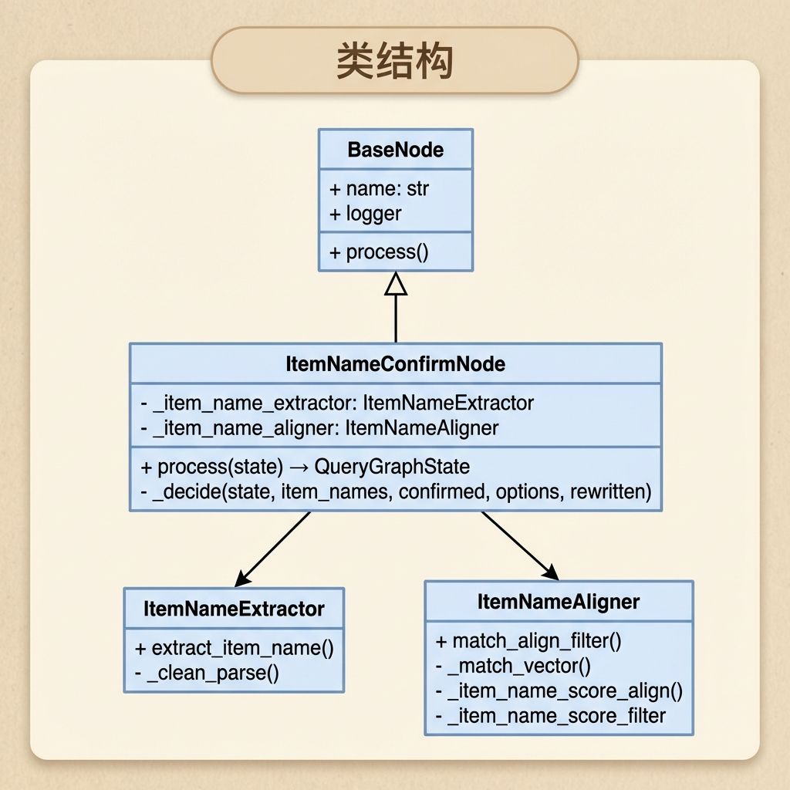

# 知识库查询 —— 商品名确认节点

> 本文档详细介绍商品名确认节点（item_name_confirm_node）的设计与实现，该节点是知识库查询流程的入口节点，负责从用户问题中提取并确认商品名称。

---

## 1. 任务目标

### 1.1 本章目标

通过本章学习，你将掌握：

1. **理解商品名确认的业务逻辑**：掌握从用户问题到商品确认的完整流程
2. **学会 LLM + 向量检索的联合使用**：先用 LLM 提取候选名称再用向量检索对齐数据库
3. **理解评分对齐与过滤策略**：掌握多阈值评分机制与分数差异过滤的设计思想
4. **掌握历史对话管理**：学会使用 MongoDB 管理多轮对话上下文
5. **实现可测试的节点代码**：通过 `if __name__ == "__main__"` 验证节点功能

### 1.2 涉及文件

```
knowledge/processor/query_process/
├── nodes/
│   └── item_name_confirm_node.py   # 商品名确认节点（本章重点）
├── state.py                        # 状态定义
└── base.py                         # 基类定义

knowledge/prompts/query/
└── query_prompt.py                 # 提示词模板

knowledge/utils/
├── llm_client_util.py              # LLM 客户端工具
├── mongo_history_util.py           # MongoDB 历史对话工具
├── bge_m3_embedding_util.py        # BGE-M3 嵌入工具
└── milvus_util.py                  # Milvus 向量数据库工具
```

### 1.3 节点在流程中的位置


---

## 2. 核心概念扫盲

### 2.1 为什么需要商品名确认？

在知识库问答场景中，用户的问题往往是模糊的：

| 用户问题                | 问题         | 解决方案             |
| ----------------------- | ------------ | -------------------- |
| "这个怎么用？"          | 指代不明     | 需要结合历史对话推断 |
| "万用表怎么测电压"      | 商品名不精确 | 需要对齐到具体型号   |
| "苏伯尔RS-12怎么换电池" | 可能有错别字 | 需要向量相似度匹配   |

**商品名确认的作用：**

1. **精准定位知识**：将模糊的商品名对齐到数据库中的精确名称
2. **支持多轮对话**：通过历史记录解决代词指代问题
3. **流程分流**：确认失败时直接返回提示，避免无效检索

### 2.2 LLM + 向量检索的两阶段策略


### 2.3 多阈值评分对齐机制

```python
# 评分阈值配置
HIGH_CONFIDENCE_THRESHOLD = 0.7   # 高置信阈值
MID_CONFIDENCE_THRESHOLD = 0.6    # 中置信阈值
```

| 分数区间              | 处理策略     | 说明                                  |
| --------------------- | ------------ | ------------------------------------- |
| **score ≥ 0.7**       | 直接确认     | 高置信度，放入 confirmed 列表         |
| **0.6 ≤ score < 0.7** | 作为候选选项 | 中置信度，放入 options 列表让用户选择 |
| **score < 0.6**       | 忽略         | 低置信度，匹配不可靠                  |

### 2.4 分数差异过滤

当 confirmed 列表中有多个商品名时，需要进一步过滤误判结果：

```
场景示例：
  item_name1: 0.90  (最相似，作为基准)
  item_name2: 0.88  (真实匹配)
  item_name3: 0.66  (可能误判)

分数差阈值: 0.15

过滤逻辑：
  max_score = 0.90
  item_name1: 0.90 - 0.90 = 0.00 ≤ 0.15 ✓ 保留
  item_name2: 0.90 - 0.88 = 0.02 ≤ 0.15 ✓ 保留
  item_name3: 0.90 - 0.66 = 0.24 > 0.15 ✗ 剔除
```

### 2.5 代词指代消解

LLM 能够根据历史对话解决代词指代问题：

```
历史对话:
  user: 万用表怎么测电压？
  assistant: 万用表测电压需要先选择...

当前问题:
  user: 那怎么换电池呢？
            ↓
LLM 提取:
  item_names: ["万用表"]
  rewritten_query: "万用表怎么换电池？"
```

### 2.6 JSON Mode

调用 LLM 时使用 `response_format=True`，确保输出是严格的 JSON 格式：

```python
client = get_llm_client(response_format=True)
```

**注意事项：**

- `json_object` 模式不支持返回 JSON 数组，需要用对象包装
- 提示词中需要明确告知期望的 JSON 结构

---

## 3. 商品名确认业务处理流程（总）

### 3.1 整体流程图


### 3.2 输入输出数据结构

**输入状态：**

```python
{
    "session_id": "abc123",           # 会话 ID（必需）
    "original_query": "万用表怎么用？", # 用户原始问题（必需）
    "item_names": [],                 # 初始为空或已有值
    "rewritten_query": "",            # 初始为空
    "answer": "",                     # 初始为空
    "history": [],                    # 初始为空，节点内部加载
}
```

**输出状态（确认成功）：**

```python
{
    "session_id": "abc123",
    "original_query": "万用表怎么用？",
    "item_names": ["苏伯尔RS-12数字万用表"],  # 确认的商品名
    "rewritten_query": "苏伯尔RS-12数字万用表怎么用？",  # 改写的问题
    "answer": "",                           # 空，继续检索流程
    "history": [...],                       # 历史对话记录
}
```

**输出状态（需要用户选择）：**

```python
{
    "session_id": "abc123",
    "original_query": "万用表怎么用？",
    "item_names": [],                       # 未确认
    "rewritten_query": "",
    "answer": "我不确定您指的是哪款产品。您是在询问以下产品吗：万用表A、万用表B？",
    "history": [...],
}
```

---

## 4. 商品名确认业务处理流程（分）

### 4.1 目标

实现一个能够：

1. 从用户问题中智能提取商品名称
2. 将提取的名称与数据库中的商品精确对齐
3. 根据对齐结果决定后续流程走向
4. 支持多轮对话的上下文理解

### 4.2 需求分析

#### 4.2.1 功能需求

1. **历史对话获取**：从 MongoDB 加载最近的对话记录
2. **商品名提取**：使用 LLM 从问题中提取候选商品名
3. **问题改写**：将代词替换为具体名称，形成独立完整的问题
4. **向量匹配**：使用混合检索在商品名集合中搜索
5. **评分对齐**：根据相似度分数决定确认、候选或忽略
6. **分数过滤**：多商品时剔除误判结果
7. **历史回填**：将确认的商品名回填到之前的对话记录

#### 4.2.2 技术依赖

- **LLM**：用于商品名提取和问题改写
- **MongoDB**：存储和查询历史对话
- **Milvus**：商品名向量集合，支持混合搜索
- **BGE-M3 模型**：生成稠密向量和稀疏向量

### 4.3 实现流程

#### 4.3.1 实现流程图


#### 4.3.2 具体实现步骤

##### Step1：获取历史对话

**目的：** 从 MongoDB 加载当前会话的历史对话记录，用于 LLM 理解上下文。

**实现逻辑：**

1. 根据 `session_id` 查询 MongoDB 的 `chat_message` 集合
2. 按时间戳升序排列，获取最近 10 条记录
3. 格式化为 `role: text\n` 形式的文本

**代码片段：**

```python
# 获取历史对话
chat_history = get_recent_messages(session_id, limit=10)

# 构建历史对话文本
history_text = ""
for msg in chat_history:
    role = msg.get("role")
    content = msg.get("text", "")
    history_text += f"{role}: {content}\n"
```

---

##### Step2：LLM 提取商品名

**目的：** 使用 LLM 从用户问题和历史对话中提取商品名称，并改写问题。

**提示词模板：**

```python
ITEM_NAME_EXTRACT_TEMPLATE = """
历史会话：
{history_text}

当前用户问题：{query}

请根据历史会话和当前问题，提取用户正在询问的商品名称（item_names）。
1. 如果用户明确提到了商品名称，请提取出来。可能有一个或多个，但不能重复。
2. 如果用户使用了代词（如"这个"、"它"），请结合历史会话指代消解，确定商品名称。
3. 如果无法确定商品名称，item_names 返回空列表。
4. 请重新改写用户的问题（rewritten_query），使其成为包含商品名称的独立完整问题。

请直接返回JSON格式结果，格式如下：
{{
    "item_names": ["商品A", "商品B"],
    "rewritten_query": "关于商品A和商品B，..."
}}"""
```

**代码实现：**

```python
class ItemNameExtractor:
    """商品名提取器：基于用户原始问题和历史对话提取商品名"""

    def extract_item_name(self, original_query: str, history_text: str) -> Dict[str, Any]:
        """
        LLM 根据用户原始问题提取商品名

        Args:
            original_query: 用户原始问题
            history_text: 格式化后的历史对话文本

        Returns:
            {"item_names": [...], "rewritten_query": "..."}
        """
        result: Dict[str, Any] = {"item_names": [], "rewritten_query": original_query}

        # 1. 获取 LLM 客户端
        llm_client = get_llm_client(response_format=True)
        if llm_client is None:
            return result

        # 2. 组装提示词
        human_prompt = ITEM_NAME_EXTRACT_TEMPLATE.format(
            history_text=history_text if history_text else "暂无上下文",
            query=original_query
        )
        system_prompt = "你是一个专业的客服助手，擅长理解用户意图和提取关键信息。"

        # 3. LLM 调用
        llm_response = llm_client.invoke([
            SystemMessage(content=system_prompt),
            HumanMessage(content=human_prompt)
        ])
        llm_content = llm_response.content.strip()

        # 4. 判断 LLM 的输出
        if not llm_content.strip():
            return result

        try:
            # 5. 清洗和解析
            parsed_result = self._clean_parse(llm_content)
            result["rewritten_query"] = parsed_result.get("rewritten_query") or original_query
            result["item_names"] = parsed_result.get("item_names")
        except Exception as e:
            logger.error(f"清洗以及解析LLM的输出失败: {str(e)}")

        return result

    def _clean_parse(self, llm_response: str) -> Dict[str, Any]:
        """清洗并解析 LLM 响应"""
        # 1. 清洗 json 代码块围栏
        cleaned = re.sub(r"^```(?:json)?\s*", "", llm_response.strip())
        content = re.sub(r"\s*```$", "", cleaned)

        # 2. 反序列化
        try:
            parsed_llm_result: Dict[str, Any] = json.loads(content)
            # 2.1 清洗 item_names
            rwa_item_names = parsed_llm_result.get('item_names')
            if not isinstance(rwa_item_names, list):
                clean_item_names = []
            else:
                clean_item_names = [raw_item for raw_item in rwa_item_names if raw_item.strip()]

            # 2.2 清洗 rewritten_query
            raw_rewritten_query = parsed_llm_result.get('rewritten_query')
            clean_rewritten_query = "" if not isinstance(raw_rewritten_query, str) else raw_rewritten_query.strip()

            return {"item_names": clean_item_names, "rewritten_query": clean_rewritten_query}
        except JSONDecodeError as e:
            raise ValueError(f"JSON反序列LLM的输出失败：{str(e)}")
```

---

##### Step3：向量匹配

**目的：** 将 LLM 提取的候选商品名与 Milvus 中的商品名集合进行向量匹配。

**实现逻辑：**

1. 获取 Milvus 客户端和嵌入模型
2. 对每个候选名生成稠密向量和稀疏向量（混合向量）
3. 构建混合检索请求
4. 执行混合检索
5. 整理结果

**代码实现：**

```python
def _match_vector(self, item_names: List[str]) -> List[Dict[str, Any]]:
    """
    根据 LLM 提取的商品名，查询向量数据库

    Args:
        item_names: LLM 提取的商品名列表

    Returns:
        每个 item_name 下的查询结果
        Dict 格式: {"extracted_name": "LLM提取的商品名",
                    "matches": [{"item_name": "向量库商品名", "score": 分数值}]}
    """
    # 1. 定义最终搜索结果
    search_results = []

    # 2. 获取 milvus_client
    milvus_client = get_milvus_client()
    if milvus_client is None:
        return []

    # 3. 获取嵌入模型
    embedding_model = get_beg_m3_embedding_model()
    if embedding_model is None:
        logger.error(f"获取嵌入模型失败")
        return search_results

    # 4. 嵌入 item_name 获取稠密、稀疏向量
    hybrid_embedding_result = generate_hybrid_embeddings(embedding_model, item_names)

    # 5. 遍历 LLM 提取的所有商品名
    for index, extract_item_name in enumerate(item_names):
        # 5.1 创建混合检索的请求
        hybrid_search_requests = create_hybrid_search_requests(
            dense_vector=hybrid_embedding_result['dense'][index],
            sparse_vector=hybrid_embedding_result['sparse'][index],
        )

        # 5.2 执行混合检索
        hybrid_search_result = execute_hybrid_search_query(
            milvus_client,
            collection_name="kb_item_names_v2",
            search_requests=hybrid_search_requests,
            ranker_weights=(0.5, 0.5),
            norm_score=True,
            output_fields=["item_name"]
        )

        # 5.3 解析混合检索请求的结果对象
        item_name_search_result = {
            "extracted_name": extract_item_name,
            "matches": [
                {"item_name": h["entity"]["item_name"], "score": h["distance"]}
                for h in (hybrid_search_result[0] if hybrid_search_result else [])
            ]
        }
        # 5.4 将构建好的查询结果放入最终搜索结果中
        search_results.append(item_name_search_result)

    return search_results
```

---

##### Step4：评分对齐

**目的：** 根据向量匹配的相似度分数，将结果分类到 confirmed 或 options 列表。

**评分规则：**


**代码实现：**

```python
def _item_name_score_align(self, search_results: List[Dict[str, Any]]) -> Tuple[List[str], List[str]]:
    """
    根据向量数据库检索到的商品名，分类到 confirmed 或 options

    Returns:
        confirmed: 确认的商品名列表，传给下游多路检索
        options: 候选商品名列表，用于询问用户
    """
    # 1. 定义两个容器
    confirmed = []
    options = []  # 最多只留下 3 个

    # 2. 遍历向量数据库查询到的所有结果
    for item_name_search_result in search_results:
        # 2.0 获取 LLM 提取的商品名
        extracted_name = item_name_search_result.get('extracted_name')

        # 2.1 对某一商品名下找到相似的 item_name 按分数值降序
        matches = sorted(
            item_name_search_result.get('matches'),
            key=lambda x: x['score'],
            reverse=True
        )

        # 2.2 获取 matches 中分数值能进入 confirmed 容器阈值的对象
        high = [m for m in matches if m.get('score') >= 0.7]

        # 3. 询问是否能进入 confirmed 中
        if high:
            # 3.1 准备找最精准的那一个
            extract = next(
                (h for h in high if str(h['item_name']) == extracted_name),
                None
            )

            # 场景 A: 找到了精确匹配
            if extract:
                picked = extract["item_name"]
                if picked not in confirmed:
                    confirmed.append(picked)
            # 场景 B: 只有一条高置信结果
            elif len(high) == 1:
                picked = high[0]["item_name"]
                if picked not in confirmed:
                    confirmed.append(picked)
            # 场景 C: 多条相似，加入 options 让用户选择
            else:
                for h in high[:3]:
                    picked = h.get('item_name')
                    if picked not in options and picked not in confirmed:
                        options.append(picked)

        # 4. 询问是否能进入 options 中
        else:
            mid = [
                m for m in matches
                if m['score'] >= 0.6
                and m.get('item_name') not in options
                and m.get('item_name') not in confirmed
            ]

            if mid:
                for m in mid[:3]:
                    picked = m.get('item_name')
                    options.append(picked)

    return confirmed, options[:3]
```

---

##### Step5：分数差异过滤

**目的：** 当 confirmed 列表中有多个商品名时，剔除可能的误判结果。

**实现逻辑：**

```
场景示例：
  用户问题: "RS-12和华为擎云L420的操作环境分别是什么？"
  LLM 提取: ["RS-12", "华为擎云L420", "RS-DDD"]  (其中 RS-DDD 是误判)

  向量匹配结果:
    RS-12:     0.90
    华为擎云L420: 0.88
    RS-DDD:    0.66

  分数差异过滤:
    max_score = 0.90
    分数差阈值 = 0.15

    RS-12:     0.90 - 0.90 = 0.00 ≤ 0.15 ✓ 保留
    华为擎云L420: 0.90 - 0.88 = 0.02 ≤ 0.15 ✓ 保留
    RS-DDD:    0.90 - 0.66 = 0.24 > 0.15 ✗ 剔除

  最终 confirmed: ["RS-12", "华为擎云L420"]
```

**代码实现：**

```python
def _item_name_score_filter(self, confirmed: List[str], search_results: List[Dict[str, Any]]):
    """
    将误判的 item_name 从 confirmed 中剔除

    Args:
        confirmed: 初步确认的商品名列表
        search_results: 向量检索结果

    Returns:
        过滤后的 confirmed 列表
    """
    # 1. 获取每个商品名在向量数据库中的最高分数
    item_name_score = {}
    for search_result in search_results:
        matches = search_result.get('matches')
        for m in matches:
            score = m.get('score')
            item_name = m.get('item_name')
            if item_name in confirmed:
                item_name_score[item_name] = max(item_name_score.get(item_name) or 0, score)

    # 2. 对 item_name_score 进行排序
    sorted_item_name_score = sorted(item_name_score.items(), key=lambda x: x[1], reverse=True)

    # 3. 取出分数值最大的（作为基准）
    max_item_name_score = sorted_item_name_score[0][1]

    # 4. 保留分数差在阈值内的商品名
    return [name for name, score in item_name_score.items() if max_item_name_score - score <= 0.15]
```

---

##### Step6：决策更新状态

**目的：** 根据对齐结果更新图状态，决定后续流程走向。

**代码实现：**

```python
def _decide(self, state: QueryGraphState, item_names: List[str],
            confirmed: List[str], options: List[str], rewritten_query: str):
    """根据对齐结果更新 state"""

    if confirmed:
        # 确认成功：更新状态，继续检索流程
        state['rewritten_query'] = rewritten_query
        state['item_names'] = confirmed

    elif options:
        # 有候选：设置选择提示，流程中断
        state['answer'] = (
            f"我不确定您指的是哪款产品。"
            f"您是在询问以下产品吗：{'、'.join(options)}？"
        )
    else:
        # 无法识别：设置提示，流程中断
        state['answer'] = "抱歉，我无法识别您询问的具体产品名称，请提供更准确的产品名称或型号。"
```

---

##### Step7：历史回填

**目的：** 当商品名首次被确认时，将其回填到之前缺少商品名的历史记录。

**实现逻辑：**

```
场景示例：
  第一轮对话:
    user: "万用表怎么用？"
    assistant: "请问您指的是哪款万用表？"
    (此时 item_names 为空)

  第二轮对话:
    user: "苏伯尔RS-12那款"
    确认商品名: ["苏伯尔RS-12数字万用表"]

  历史回填:
    将第一轮对话的 item_names 更新为 ["苏伯尔RS-12数字万用表"]
```

**代码实现：**

```python
if confirmed:
    # 找出历史中 item_names 为空的消息
    ids_to_update = [
        str(msg["_id"]) for msg in chat_history if not msg.get("item_names")
    ]
    if ids_to_update:
        try:
            # 批量更新 MongoDB
            update_message_item_names(ids_to_update, confirmed)
        except Exception as e:
            self.logger.warning(f"回填历史 item_names 失败: {e}")
```

### 4.4 代码实现

以下是完整的节点实现代码：

```python
# knowledge/processor/query_process/nodes/item_name_confirm_node.py

"""商品名称确认节点

从用户查询中提取商品名称，通过向量相似度匹配与数据库中已有商品对齐确认。
"""

import logging
import json
import re
from json import JSONDecodeError
from typing import Dict, Any, List, Tuple

from langchain_core.messages import HumanMessage, SystemMessage

from knowledge.processor.query_process.state import QueryGraphState
from knowledge.processor.query_process.base import BaseNode
from knowledge.utils.client.ai_clients import AIClients
from knowledge.utils.client.storage_clients import StorageClients
from knowledge.utils.milvus_util import (
    create_hybrid_search_requests,
    execute_hybrid_search_query
)
from knowledge.utils.embedding_util import (
    generate_bge_m3_hybrid_vectors
)
from knowledge.prompts.query.query_prompt import ITEM_NAME_EXTRACT_TEMPLATE
from knowledge.utils.mongo_history_util import (
    get_recent_messages,
    update_message_item_names
)


logging.basicConfig(level=logging.INFO)
logger = logging.getLogger(__name__)


class ItemNameAligner:
    """
    商品名对齐器
    主要职责：
    1. 查询向量数据库
    2. 评分对齐
    3. 分数差异过滤
    """

    def match_align_filter(self, item_names: List[str]) -> Tuple[List[str], List[str]]:
        """执行匹配、对齐、过滤三步流程"""
        # 1. 查询向量数据库
        search_result: List[Dict[str, Any]] = self._match_vector(item_names)

        # 2. 评分对齐
        confirmed, options = self._item_name_score_align(search_result)

        # 3. 分数差异过滤（仅当 confirmed 有多个时）
        if len(confirmed) > 1:
            confirmed = self._item_name_score_filter(confirmed, search_result)

        return confirmed, options

    def _match_vector(self, item_names: List[str]) -> List[Dict[str, Any]]:
        """根据 LLM 提取的商品名，查询向量数据库"""
        search_results = []

        milvus_client = StorageClients.get_milvus_client()
        if milvus_client is None:
            return search_results

        embedding_model = AIClients.get_bge_m3_client()
        if embedding_model is None:
            logger.error(f"获取嵌入模型失败")
            return search_results

        hybrid_embedding_result = generate_bge_m3_hybrid_vectors(embedding_model, item_names)

        for index, extract_item_name in enumerate(item_names):
            hybrid_search_requests = create_hybrid_search_requests(
                dense_vector=hybrid_embedding_result['dense'][index],
                sparse_vector=hybrid_embedding_result['sparse'][index],
            )

            hybrid_search_result = execute_hybrid_search_query(
                milvus_client,
                collection_name="kb_item_names_v2",
                search_requests=hybrid_search_requests,
                ranker_weights=(0.5, 0.5),
                norm_score=True,
                output_fields=["item_name"]
            )

            item_name_search_result = {
                "extracted_name": extract_item_name,
                "matches": [
                    {"item_name": h["entity"]["item_name"], "score": h["distance"]}
                    for h in (hybrid_search_result[0] if hybrid_search_result else [])
                ]
            }
            search_results.append(item_name_search_result)

        return search_results

    def _item_name_score_align(self, search_results: List[Dict[str, Any]]) -> Tuple[List[str], List[str]]:
        """根据评分对齐商品名称"""
        confirmed = []
        options = []

        for item_name_search_result in search_results:
            extracted_name = item_name_search_result.get('extracted_name')
            matches = sorted(item_name_search_result.get('matches'), key=lambda x: x['score'], reverse=True)
            #这段代码是商品名称评分对齐逻辑，根据向量搜索的分数决定商品名的确认或候选：
            #高分区（≥0.7）：
            #  若存在与提取名称完全匹配的 → 直接确认
            #  若仅1条高分结果 → 直接确认
            #  若多条高分 → 取前3条作为候选选项
            #中分区（0.6~0.7）：无高分时，取中分结果前3条作为候选选项
            #返回：confirmed（确认列表）和 options（候选列表，最多3个
            high = [m for m in matches if m.get('score') >= 0.7]

            if high:
                extract = next((h for h in high if str(h['item_name']) == extracted_name), None)

                if extract:
                    picked = extract["item_name"]
                    if picked not in confirmed:
                        confirmed.append(picked)
                elif len(high) == 1:
                    picked = high[0]["item_name"]
                    if picked not in confirmed:
                        confirmed.append(picked)
                else:
                    for h in high[:3]:
                        picked = h.get('item_name')
                        if picked not in options and picked not in confirmed:
                            options.append(picked)
            else:
                mid = [m for m in matches
                       if m['score'] >= 0.6 and m.get('item_name') not in options and m.get('item_name') not in confirmed]
                if mid:
                    for m in mid[:3]:
                        picked = m.get('item_name')
                        options.append(picked)

        return confirmed, options[:3]

    def _item_name_score_filter(self, confirmed: List[str], search_results: List[Dict[str, Any]]):
        """分数差异过滤，剔除误判"""
        item_name_score = {}
        for search_result in search_results:
            matches = search_result.get('matches')
            for m in matches:
                score = m.get('score')
                item_name = m.get('item_name')
                if item_name in confirmed:
                    item_name_score[item_name] = max(item_name_score.get(item_name) or 0, score)

        sorted_item_name_score = sorted(item_name_score.items(), key=lambda x: x[1], reverse=True)
        max_item_name_score = sorted_item_name_score[0][1]

        return [name for name, score in item_name_score.items() if max_item_name_score - score <= 0.15]


class ItemNameExtractor:
    """
    商品名提取器
    基于用户的原始问题和历史对话提取用户真正想问的商品名
    """

    def extract_item_name(self, original_query: str, history_text: str) -> Dict[str, Any]:
        """LLM 根据用户原始问题提取商品名"""
        result: Dict[str, Any] = {"item_names": [], "rewritten_query": original_query}

        llm_client = AIClients.get_llm_client(response_format=True)
        if llm_client is None:
            return result

        human_prompt = ITEM_NAME_EXTRACT_TEMPLATE.format(
            history_text=history_text if history_text else "暂无上下文",
            query=original_query
        )
        system_prompt = "你是一个专业的客服助手，擅长理解用户意图和提取关键信息。"

        llm_response = llm_client.invoke([
            SystemMessage(content=system_prompt),
            HumanMessage(content=human_prompt)
        ])
        llm_content = llm_response.content.strip()

        if not llm_content.strip():
            return result

        try:
            parsed_result = self._clean_parse(llm_content)
            result["rewritten_query"] = parsed_result.get("rewritten_query") or original_query
            result["item_names"] = parsed_result.get("item_names")
        except Exception as e:
            logger.error(f"清洗以及解析LLM的输出失败: {str(e)}")

        return result

    def _clean_parse(self, llm_response: str) -> Dict[str, Any]:
        """清洗并解析 LLM 响应"""
        cleaned = re.sub(r"^```(?:json)?\s*", "", llm_response.strip())
        content = re.sub(r"\s*```$", "", cleaned)

        try:
            parsed_llm_result: Dict[str, Any] = json.loads(content)
            raw_item_names = parsed_llm_result.get('item_names')
            if not isinstance(raw_item_names, list):
                clean_item_names = []
            else:
                clean_item_names = [raw_item for raw_item in raw_item_names if raw_item.strip()]

            raw_rewritten_query = parsed_llm_result.get('rewritten_query')
            clean_rewritten_query = "" if not isinstance(raw_rewritten_query, str) else raw_rewritten_query.strip()

            return {"item_names": clean_item_names, "rewritten_query": clean_rewritten_query}
        except JSONDecodeError as e:
            raise ValueError(f"JSON反序列LLM的输出失败：{str(e)}")


class ItemNameConfirmNode(BaseNode):
    """商品名称确认节点

    流程: 获取历史 → LLM提取商品名 → 向量匹配 → 评分对齐 → 更新状态 → 历史回填
    """
    name = "item_name_confirm_node"

    def __init__(self):
        super().__init__()
        self._item_name_extractor = ItemNameExtractor()
        self._item_name_aligner = ItemNameAligner()

    def process(self, state: QueryGraphState) -> QueryGraphState:
        # 1. 获取用户的原始问题
        original_query = state.get("original_query")
        session_id = state.get('session_id')

        # 2. 获取历史对话
        chat_history = get_recent_messages(session_id, limit=10)
        history_text = ""
        for msg in chat_history:
            role = msg.get("role")
            content = msg.get("text", "")
            history_text += f"{role}: {content}\n"

        # 3. 调用 LLM 提取商品名
        clean_llm_result = self._item_name_extractor.extract_item_name(original_query, history_text)
        item_names = clean_llm_result.get('item_names')
        rewritten_query = clean_llm_result.get('rewritten_query')

        # 4. 查询向量数据库 && 过滤
        if item_names:
            confirmed, options = self._item_name_aligner.match_align_filter(item_names)
        else:
            confirmed, options = [], []

        # 5. 决策分支，更新 state
        self._decide(state, item_names, confirmed, options, rewritten_query)

        # 6. 历史回填
        if confirmed:
            ids_to_update = [
                str(msg["_id"]) for msg in chat_history if not msg.get("item_names")
            ]
            if ids_to_update:
                try:
                    update_message_item_names(ids_to_update, confirmed)
                except Exception as e:
                    self.logger.warning(f"回填历史 item_names 失败: {e}")

        # 将历史对话写入 state，供下游使用
        state["history"] = chat_history

        return state

    def _decide(self, state: QueryGraphState, item_names: List[str],
                confirmed: List[str], options: List[str], rewritten_query: str):
        """根据对齐结果更新 state"""
        if confirmed:
            state['rewritten_query'] = rewritten_query
            state['item_names'] = confirmed
        elif options:
            state['answer'] = (
                f"我不确定您指的是哪款产品。"
                f"您是在询问以下产品吗：{'、'.join(options)}？"
            )
        else:
            state['answer'] = "抱歉，我无法识别您询问的具体产品名称，请提供更准确的产品名称或型号。"


# ================================================================== #
#                        测试入口                                   #
# ================================================================== #

if __name__ == "__main__":
    test_state: QueryGraphState = {
        "original_query": "RS-12 数字万用表怎么测试电阻？以及华为擎云L420 用户手册 中包含操作环境嘛？"
    }
    print(f"输入: {json.dumps(test_state, ensure_ascii=False, indent=2)}\n")

    node_item_name_confirm = ItemNameConfirmNode()
    result = node_item_name_confirm.process(test_state)
    print(f"确认商品: {result.get('item_names')}")
    print(f"改写查询: {result.get('rewritten_query')}")
    if result.get("answer"):
        print(f"拦截回复: {result.get('answer')}")
```

---

## 5. 测试入口

### 5.1 测试代码

```python
if __name__ == "__main__":
    test_state: QueryGraphState = {
        "original_query": "RS-12 数字万用表怎么测试电阻？以及华为擎云L420 用户手册 中包含操作环境嘛？"
    }
    print(f"输入: {json.dumps(test_state, ensure_ascii=False, indent=2)}\n")

    node_item_name_confirm = ItemNameConfirmNode()
    result = node_item_name_confirm.process(test_state)
    print(f"确认商品: {result.get('item_names')}")
    print(f"改写查询: {result.get('rewritten_query')}")
    if result.get("answer"):
        print(f"拦截回复: {result.get('answer')}")
```

### 5.2 运行测试

```bash
# 进入项目目录
cd knowledge

# 激活虚拟环境
source .venv/bin/activate  # Linux/Mac
# 或
.venv\Scripts\activate     # Windows

# 运行测试
python -m knowledge.processor.query_process.nodes.item_name_confirm_node
```

### 5.3 预期输出

```
输入: {
  "original_query": "RS-12 数字万用表怎么测试电阻？以及华为擎云L420 用户手册 中包含操作环境嘛？"
}

确认商品: ['RS-12 数字万用表', '华为擎云L420']
改写查询: RS-12 数字万用表怎么测试电阻？以及华为擎云L420 用户手册 中包含操作环境嘛？
```

---

## 6. 总结

### 6.1 节点功能概览

| 功能             | 说明                                             |
| ---------------- | ------------------------------------------------ |
| **商品名提取**   | 使用 LLM 从用户问题中提取候选商品名称            |
| **代词指代消解** | 结合历史对话，将"这个"、"它"等代词替换为具体名称 |
| **问题改写**     | 生成包含商品名的独立完整问题                     |
| **向量匹配**     | 使用混合检索（稠密+稀疏）在商品库中搜索          |
| **评分对齐**     | 根据相似度分数确定确认、候选或忽略               |
| **分数差异过滤** | 多商品时剔除误判结果                             |
| **历史回填**     | 将确认的商品名回填到之前的对话记录               |
| **流程分流**     | 确认失败时设置 answer，中断检索流程              |

### 6.2 节点设计要点

**1. 两阶段处理策略**

```
LLM 提取（语义理解）→ 向量匹配（容错对齐）
```

- LLM 擅长理解语义、处理代词
- 向量检索擅长模糊匹配、容忍错别字

**2. 多阈值评分机制**

```
高置信 (≥0.7) → 直接确认
中置信 (0.6~0.7) → 用户选择
低置信 (<0.6) → 忽略
```

- 避免错误匹配导致的检索偏差
- 保留用户选择的余地

**3. 分数差异过滤**

```
多商品确认时:
  计算 max_score
  保留分数差 ≤ 0.15 的商品名
  剔除误判结果
```

**4. 类职责分离**

```
ItemNameExtractor  ──→ LLM 语义提取
ItemNameAligner    ──→ 向量匹配对齐
ItemNameConfirmNode ──→ 流程编排
```

- 单一职责原则
- 便于测试和维护

### 6.3 类图

