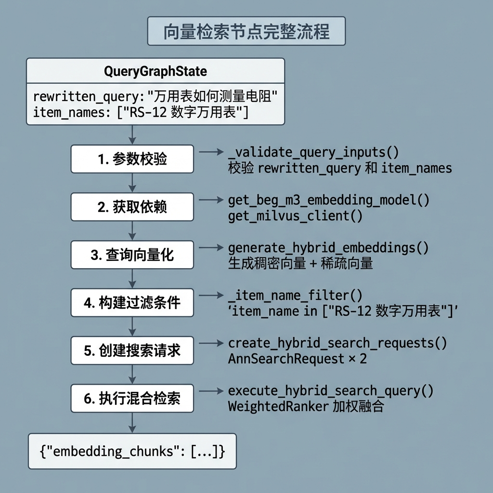
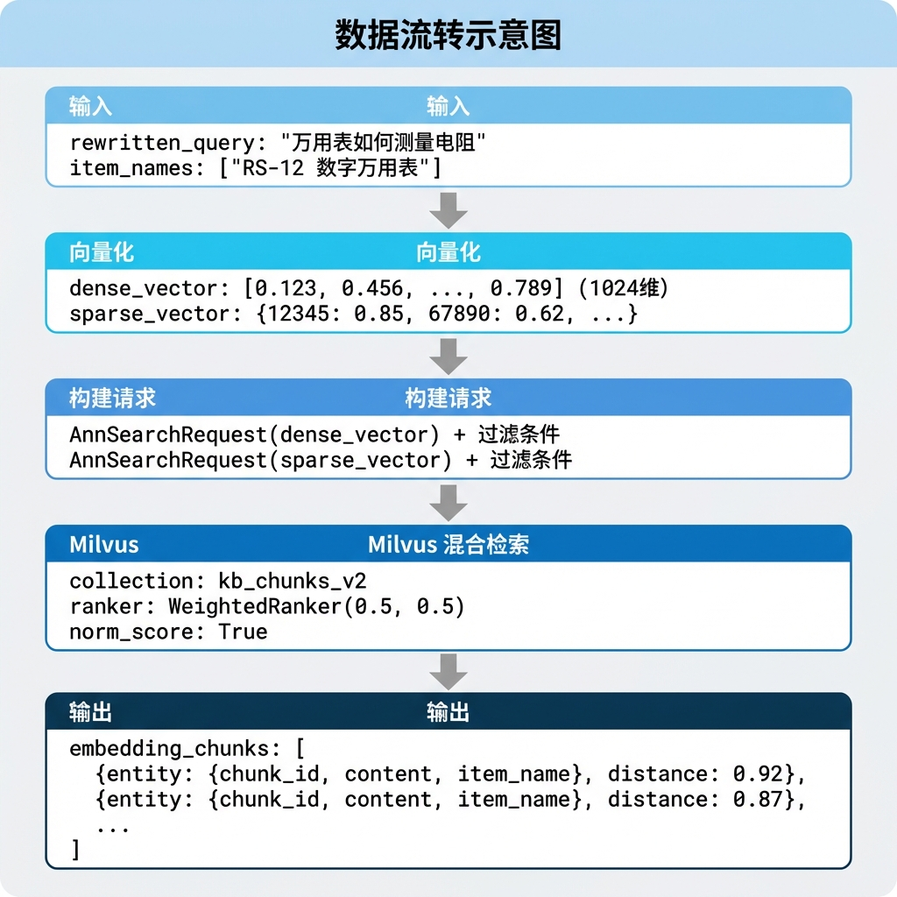
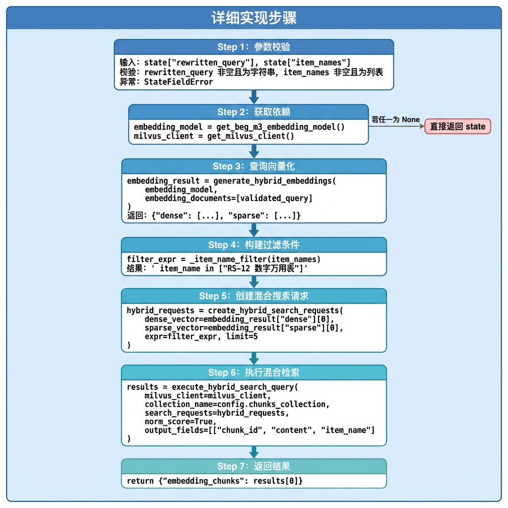

# 知识库查询 —— 向量检索节点

> 本文档详细介绍向量检索节点（vector_search_node）的设计与实现，该节点是多路并行检索中的核心检索通道，负责将用户查询向量化并在 Milvus 中执行混合搜索。

---

## 1. 任务目标

### 1.1 本章目标

通过本章学习，你将掌握：

1. **理解混合向量检索原理**：掌握稠密向量 + 稀疏向量的混合检索策略
2. **学会 BGE-M3 模型的使用**：生成同时包含稠密和稀疏表示的嵌入向量
3. **掌握 Milvus 混合搜索 API**：使用 AnnSearchRequest 和 WeightedRanker
4. **理解过滤表达式构建**：基于商品名称精准过滤检索结果
5. **实现可测试的检索节点**：通过 `if __name__ == "__main__"` 验证节点功能

### 1.2 涉及文件

```
knowledge/processor/query_process/
├── nodes/
│   └── vector_search_node.py   # 向量检索节点（本章重点）
├── state.py                    # 状态定义
├── base.py                     # 基类定义
└── exceptions.py               # 自定义异常

knowledge/utils/
├── embedding_util.py    # BGE-M3 嵌入工具
└── milvus_util.py       # Milvus 向量数据库工具
```

### 1.3 节点在流程中的位置


---

## 2. 核心概念扫盲

### 2.1 为什么需要混合检索？

传统的向量检索方式各有优缺点：

| 检索方式     | 优点                       | 缺点                           |
| ------------ | -------------------------- | ------------------------------ |
| **稠密向量** | 语义理解强，支持同义词匹配 | 对专业术语、型号等精确匹配较弱 |
| **稀疏向量** | 精确匹配强，对关键词敏感   | 语义理解弱，无法处理同义词     |
| **混合检索** | 兼具两者优点               | 需要额外的融合策略             |

**示例对比：**

```
查询: "万用表怎么测电压"

稠密向量检索:
  ✓ "数字万用表电压测量方法"     (语义相似)
  ✓ "使用多用电表测量电势差"     (同义词匹配)
  ✗ "RS-12型万用表"             (缺少语义关联)

稀疏向量检索:
  ✓ "万用表测量电压的步骤"       (关键词匹配)
  ✓ "RS-12万用表电压档位说明"   (包含关键词)
  ✗ "数字仪表电势测定"           (无共同词汇)

混合检索:
  ✓ 同时召回以上所有相关结果
  ✓ 通过加权融合得到最优排序
```

### 2.2 BGE-M3 模型

**BGE-M3** 是北京智源人工智能研究院（BAAI）开发的多功能嵌入模型：

| 特性                    | 说明                   |
| ----------------------- | ---------------------- |
| **Multi-Linguality**    | 支持 100+ 语言         |
| **Multi-Functionality** | 同时生成稠密和稀疏向量 |
| **Multi-Granularity**   | 支持短文本和长文档     |

**输出结构：**

```python
embeddings = bge_m3_model(["查询文本"])
# embeddings = {
#     "dense": [[0.123, 0.456, ...]],      # 1024 维稠密向量
#     "sparse": <CSR 稀疏矩阵>              # 词汇表 ID → 权重
# }
```

### 2.3 稀疏向量表示

稀疏向量使用字典格式存储非零元素：

```python
sparse_vector = {
    12345: 0.85,   # 词汇表中第 12345 个词，权重 0.85
    67890: 0.62,   # 词汇表中第 67890 个词，权重 0.62
    ...
}
```

**特点：**

- 大部分维度为 0，只存储非零项
- 词汇表通常有 25 万+ 个词
- 需要归一化以保证检索效果

### 2.4 Milvus 混合搜索 API

Milvus 提供了原生的混合搜索支持：

```python
from pymilvus import AnnSearchRequest, WeightedRanker

# 1. 构建两路搜索请求
dense_req = AnnSearchRequest(
    data=[dense_vector],
    anns_field="dense_vector",
    param={"metric_type": "IP"},
    limit=10,
)

sparse_req = AnnSearchRequest(
    data=[sparse_vector],
    anns_field="sparse_vector",
    param={"metric_type": "IP"},
    limit=10,
)

# 2. 使用加权融合器
ranker = WeightedRanker(0.5, 0.5)  # 稠密:稀疏 = 0.5:0.5

# 3. 执行混合搜索
results = client.hybrid_search(
    collection_name="chunks",
    reqs=[dense_req, sparse_req],
    ranker=ranker,
    limit=5,
)
```

### 2.5 过滤表达式

Milvus 支持在向量检索时添加标量过滤条件：

```python
# 单值过滤
filter_expr = 'item_name == "万用表RS-12"'

# 多值过滤（IN 语法）
filter_expr = 'item_name in ["万用表RS-12", "示波器DS-100"]'

# 组合过滤
filter_expr = 'item_name == "万用表RS-12" and category == "电子仪器"'
```

---

## 3. 向量检索业务处理流程（总）

### 3.1 整体流程图



### 3.2 数据流转



---

## 4. 向量检索业务处理流程（分）

### 4.1 目标

实现一个能够：

1. 将用户查询转换为混合向量表示（稠密 + 稀疏）
2. 根据已确认的商品名称构建过滤条件
3. 在 Milvus 中执行高效的混合检索
4. 返回相关度最高的文档切片

### 4.2 需求分析

#### 4.2.1 功能需求

1. **参数校验**：验证 rewritten_query 和 item_names 的有效性
2. **查询向量化**：使用 BGE-M3 模型生成稠密和稀疏向量
3. **过滤表达式构建**：将商品名称列表转换为 Milvus 过滤语法
4. **混合搜索请求构建**：创建稠密和稀疏两路 AnnSearchRequest
5. **混合检索执行**：调用 Milvus hybrid_search API
6. **结果返回**：返回包含 chunk_id、content、item_name 的结果列表

#### 4.2.2 技术依赖

| 依赖         | 用途                        |
| ------------ | --------------------------- |
| **BGE-M3**   | 生成混合向量（稠密 + 稀疏） |
| **Milvus**   | 向量数据库，支持混合检索    |
| **pymilvus** | Milvus Python SDK           |

#### 4.2.3 配置参数

```python
# 检索配置
LIMIT = 5                              # 返回结果数
RANKER_WEIGHTS = (0.5, 0.5)           # 稠密:稀疏权重（默认）
OUTPUT_FIELDS = ["chunk_id", "content", "item_name"]  # 返回字段
COLLECTION_NAME = config.chunks_collection  # 向量集合名称
```

### 4.3 实现流程

#### 4.3.1 实现流程图



#### 4.3.2 具体实现步骤

##### Step 1: 参数校验

**目的：** 确保输入参数的有效性，避免后续处理出错。

**实现逻辑：**

1. 获取 `rewritten_query` 和 `item_names`
2. 检查 rewritten_query 是否为非空字符串
3. 检查 item_names 是否为非空列表
4. 校验失败时抛出自定义异常 `StateFieldError`

**代码片段：**

```python
def _validate_query_inputs(self, state: QueryGraphState) -> Tuple[str, List[str]]:
    """校验输入参数"""

    # 1. 获取 state 的 rewritten_query
    rewritten_query = state.get('rewritten_query', "")

    # 2. 获取 state 的 item_names
    item_names = state.get('item_names', "")

    # 3. 校验
    if not rewritten_query or not isinstance(rewritten_query, str):
        raise StateFieldError(
            node_name=self.name,
            field_name="rewritten_query",
            expected_type=str
        )

    if not item_names or not isinstance(item_names, list):
        raise StateFieldError(
            node_name=self.name,
            field_name="item_names",
            expected_type=list
        )

    # 4. 返回
    return rewritten_query, item_names
```

**StateFieldError 异常：**

```python
# knowledge/processor/query_process/exceptions.py

class StateFieldError(Exception):
    """状态字段错误异常"""

    def __init__(self, node_name: str, field_name: str, expected_type):
        self.node_name = node_name
        self.field_name = field_name
        self.expected_type = expected_type
        super().__init__(
            f"[{node_name}] 状态字段 '{field_name}' 错误，期望类型: {expected_type}"
        )
```

---

##### Step 2: 获取依赖

**目的：** 获取嵌入模型和 Milvus 客户端单例。

**代码片段：**

```python
# 获取milvus客户端
        try:
            milvus_client = StorageClients.get_milvus_client()
        except ConnectionError as e:
            self.logger.error(f"Milvus客户端获取失败 原因:{str(e)}")
            return state

#  对问题嵌入
        try:
            embed_query = generate_bge_m3_hybrid_vectors(model=embedding_molde, embedding_documents=[validated_query])
        except Exception as e:
            self.logger.error(f"问题{validated_query}嵌入失败")
            return state
```

---

##### Step 3: 查询向量化

**目的：** 使用 BGE-M3 模型将查询文本转换为稠密向量和稀疏向量。

**代码片段：**

```python
# 3. 对问题向量化(稀疏向量做了字典的处理)
embedding_result = generate_hybrid_embeddings(
    embedding_model,
    embedding_documents=[validated_query]
)

if not embedding_result:
    return state
```

**工具函数详解：**

```python
# knowledge/utils/embedding_util.py

def generate_hybrid_embeddings(
    embedding_model,
    embedding_documents: List[str]
) -> Dict[str, Any]:
    """
    为一组文本生成混合嵌入（稠密向量 + 稀疏向量）

    Args:
        embedding_model: BGE-M3 模型实例
        embedding_documents: 待嵌入的文本列表

    Returns:
        {
            "dense": [[...], ...],      # 稠密向量列表
            "sparse": [{...}, ...]      # 稀疏向量字典列表
        }
    """
    # 1. 调用模型推理
    raw_embeddings = embedding_model(embedding_documents)

    # 2. 转换稠密向量
    dense_vectors = [emb.tolist() for emb in raw_embeddings["dense"]]

    # 3. 提取并归一化稀疏向量
    sparse_vectors = _extract_sparse_vectors(raw_embeddings, len(embedding_documents))

    return {
        "dense": dense_vectors,
        "sparse": sparse_vectors,
    }


def _extract_sparse_vectors(raw_embeddings, text_count) -> List[Dict[int, float]]:
    """从 CSR 稀疏矩阵中提取稀疏向量"""

    sparse_matrix = raw_embeddings["sparse"]
    sparse_vectors = []

    for i in range(text_count):
        # CSR 矩阵按行存储，通过 indptr 定位每行的起止位置
        row_start = sparse_matrix.indptr[i]
        row_end = sparse_matrix.indptr[i + 1]

        # 提取该行的非零元素：{token_id: weight}
        sparse_dict = dict(zip(
            sparse_matrix.indices[row_start:row_end].tolist(),
            sparse_matrix.data[row_start:row_end].tolist(),
        ))

        # 归一化
        sparse_vectors.append(normalize_sparse_vector(sparse_dict))

    return sparse_vectors
```

---

##### Step 4: 构建过滤条件

**目的：** 将商品名称列表转换为 Milvus 的过滤表达式语法。

**代码片段：**

```python
def item_name_filter(self, validate_item_names: List[str]) -> Tuple[str, dict]:
    # 使用过滤表达式模板，将动态值从表达式中分离，优化中日韩字符的查询性能
    expr = "item_name in {item_names}"
    filter_params = {"item_names": validate_item_names}
    return expr, filter_params
```


---

##### Step 5: 创建混合搜索请求

**目的：** 为稠密向量和稀疏向量分别创建 AnnSearchRequest 对象。

**代码片段：**

```python
# 5. 创建混合搜索请求
hybrid_requests = create_hybrid_search_requests(
    dense_vector=embedding_result['dense'][0],
    sparse_vector=embedding_result['sparse'][0],
    expr=item_name_filter_expr,
    limit=5
)
```

**工具函数详解：**

```python
# knowledge/utils/milvus_util.py

def create_hybrid_search_requests(
    dense_vector: List[float],
    sparse_vector: Dict[int, float],
    expr: str = None,
    limit: int = 5
) -> List[AnnSearchRequest]:
    """
    创建混合检索请求

    Args:
        dense_vector: 稠密向量
        sparse_vector: 稀疏向量字典
        expr: 过滤表达式
        limit: 返回结果数

    Returns:
        [dense_request, sparse_request]
    """
    # 稠密向量搜索请求
    dense_request = AnnSearchRequest(
        data=[dense_vector],
        anns_field="dense_vector",
        param={"metric_type": "IP"},
        expr=expr,
        limit=limit,
    )

    # 稀疏向量搜索请求
    sparse_request = AnnSearchRequest(
        data=[sparse_vector],
        anns_field="sparse_vector",
        param={"metric_type": "IP"},
        expr=expr,
        limit=limit,
    )

    return [dense_request, sparse_request]
```

---

##### Step 6: 执行混合检索

**目的：** 调用 Milvus 的 hybrid_search API，融合两路检索结果。

**代码片段：**

```python
# 6. 执行混合搜索请求
reps = execute_hybrid_search_query(
    milvus_client=milvus_client,
    collection_name=self.config.chunks_collection,
    search_requests=hybrid_requests,
    norm_score=True,
    output_fields=["chunk_id", "content", "item_name"]
)

if not reps or not reps[0]:
    return state
```

**工具函数详解：**

```
milvus_util.py
```

```python
import os
import logging

logger = logging.getLogger(__name__)
logging.basicConfig(level=logging.INFO)

from typing import Tuple
from dotenv import load_dotenv

load_dotenv()

from typing import Optional, List
from pymilvus import MilvusClient, WeightedRanker, AnnSearchRequest

milvus_client: Optional[MilvusClient] = None


# ------------------------------------------------------------------
# 创建混合检索请求
# ------------------------------------------------------------------
def create_hybrid_search_requests(dense_vector,
                                  sparse_vector,
                                  dense_params=None,
                                  sparse_params=None,
                                  expr=None,
                                  filter_expr_params=None,
                                  limit=5) -> List[AnnSearchRequest]:
    """
    创建混合搜索请求

    :param dense_vector: 稠密向量
    :param sparse_vector: 稀疏向量
    :param dense_params: 稠密向量搜索参数，默认为None
    :param sparse_params: 稀疏向量搜索参数，默认为None
    :param expr: 查询表达式，默认为None
    :param filter_expr_params: 过滤表达式模板参数，用于优化中日韩字符查询性能，默认为None
    :param limit: 返回结果数量限制，默认为5
    :return: 包含稠密和稀疏搜索请求的列表
    :raises ValueError: 向量参数无效
    :raises RuntimeError: 创建请求失败
    """
    if dense_vector is None or sparse_vector is None:
        raise ValueError("dense_vector 和 sparse_vector 不能为 None")

    try:
        # 默认参数
        if dense_params is None:
            dense_params = {"metric_type": "COSINE"}
        if sparse_params is None:
            sparse_params = {"metric_type": "IP"}

        # 创建稠密向量搜索请求
        dense_req = AnnSearchRequest(
            data=[dense_vector],
            anns_field="dense_vector",
            param=dense_params,
            expr=expr,
            expr_params=filter_expr_params,
            limit=limit
        )

        # 创建稀疏向量搜索请求
        sparse_req = AnnSearchRequest(
            data=[sparse_vector],
            anns_field="sparse_vector",
            param=sparse_params,
            expr=expr,
            expr_params=filter_expr_params,
            limit=limit
        )

        return [dense_req, sparse_req]
    except Exception as e:
        raise RuntimeError(f"创建混合搜索请求失败: {e}") from e


# ------------------------------------------------------------------
# 执行混合检索请求
# ------------------------------------------------------------------
def execute_hybrid_search_query(milvus_client: MilvusClient,
                                collection_name,
                                search_requests,
                                ranker_weights=(0.5, 0.5),
                                norm_score=True,
                                limit=5,
                                output_fields=None,
                                search_params=None):
    """
    执行混合搜索

    :param milvus_client: Milvus客户端
    :param collection_name: 集合名称
    :param search_requests: 搜索请求列表，通常是[dense_req, sparse_req]
    :param ranker_weights: 权重排名器的权重，默认为(0.5, 0.5)
    :param norm_score: 是否对分数进行归一化，默认为True
    :param limit: 返回结果数量限制，默认为5
    :param output_fields: 要返回的字段列表，默认为None
    :param search_params: 搜索参数，默认为None
    :return: 搜索结果
    :raises ValueError: 参数无效
    :raises RuntimeError: 搜索执行失败
    """
    if milvus_client is None:
        raise ValueError("milvus_client 不能为 None")
    if search_requests is None or len(search_requests) == 0:
        raise ValueError("search_requests 不能为 None 或空列表")

    try:
        # 创建权重融合排序器
        rerank = WeightedRanker(ranker_weights[0], ranker_weights[1], norm_score=norm_score)

        # 默认输出字段
        if output_fields is None:
            output_fields = ["item_name"]

        # 执行搜索
        res = milvus_client.hybrid_search(
            collection_name=collection_name,
            reqs=search_requests,
            ranker=rerank,
            limit=limit,
            output_fields=output_fields,
            search_params=search_params
        )

        # 动态计算所有查询返回的结果总数
        total_hits = sum(len(hits) for hits in res) if res else 0
        logger.info(f"Milvus 混合搜索完成，共处理 {len(res) if res else 0} 个查询，总计找到 {total_hits} 个结果")
        return res
    except Exception as e:
        raise RuntimeError(f"执行Milvus混合搜索失败 (collection={collection_name}): {e}") from e


def item_name_filter(self, validate_item_names: List[str]) -> Tuple[str, dict]:
    # 使用过滤表达式模板，将动态值从表达式中分离，优化中日韩字符的查询性能
    expr = "item_name in {item_names}"
    filter_params = {"item_names": validate_item_names}
    return expr, filter_params

```

**WeightedRanker 工作原理：**

```
稠密检索结果:          稀疏检索结果:
Doc A: 0.9             Doc A: 0.7
Doc B: 0.8             Doc C: 0.9
Doc C: 0.6             Doc B: 0.5

融合公式（norm_score=True 时先归一化）:
final_score = 0.5 * dense_score + 0.5 * sparse_score

融合结果:
Doc A: 0.5 * 0.9 + 0.5 * 0.7 = 0.80
Doc C: 0.5 * 0.6 + 0.5 * 0.9 = 0.75
Doc B: 0.5 * 0.8 + 0.5 * 0.5 = 0.65

最终排序: Doc A > Doc C > Doc B
```

---

##### Step 7: 返回结果

**目的：** 将检索结果写入图状态，供后续节点使用。

**代码片段：**

```python
# 7. 更新 state 的 embedding_chunks
return {"embedding_chunks": reps[0]}
```

**返回数据结构：**

```python
{
    "embedding_chunks": [
        {
            "entity": {
                "chunk_id": 12345,
                "content": "万用表测量电压时，首先将旋钮转到...",
                "item_name": "RS-12 数字万用表"
            },
            "distance": 0.9234
        },
        {
            "entity": {
                "chunk_id": 12346,
                "content": "使用直流电压档测量时，需要注意...",
                "item_name": "RS-12 数字万用表"
            },
            "distance": 0.8756
        },
        # ...
    ]
}
```

### 4.4 代码实现

以下是完整的节点实现代码：

```python
# knowledge/processor/query_process/nodes/vector_search_node.py

"""向量检索节点

对用户查询进行向量化，在 Milvus 中执行混合搜索（稠密 + 稀疏），返回相关切片。
"""

import json
import logging

logging.basicConfig(level=logging.INFO)
logger = logging.getLogger(__name__)

from typing import Dict, Any, List, Tuple, Union
from knowledge.processor.query_processor.state import QueryGraphState
from knowledge.processor.query_processor.base import BaseNode, T
from knowledge.processor.query_processor.exceptions import StateFieldError
from knowledge.utils.client.ai_clients import AIClients
from knowledge.utils.client.storage_clients import StorageClients
from knowledge.utils.embedding_util import generate_bge_m3_hybrid_vectors
from knowledge.utils.milvus_util import create_hybrid_search_requests, execute_hybrid_search_query, item_name_filter


class VectorSearchNode(BaseNode):
    name = "vector_search_node"

    def process(self, state: QueryGraphState) -> Union[QueryGraphState, Dict[str, Any]]:
        # 1. 参数校验
        validated_query, validate_item_names = self._validate_state(state)

        # 2. 获取嵌入模型
        try:
            embedding_molde = AIClients.get_bge_m3_client()
        except ConnectionError as e:
            self.logger.error(f"BGE-M3嵌入模型获取失败 原因:{str(e)}")
            return state

        # 3. 获取milvus客户端
        try:
            milvus_client = StorageClients.get_milvus_client()
        except ConnectionError as e:
            self.logger.error(f"Milvus客户端获取失败 原因:{str(e)}")
            return state

        # 4. 对问题嵌入
        try:
            embed_query = generate_bge_m3_hybrid_vectors(model=embedding_molde, embedding_documents=[validated_query])
        except Exception as e:
            self.logger.error(f"问题{validated_query}嵌入失败")
            return state

        # 5. 构建过滤表达式以及表达式参数
        filter_expr, filter_expr_param = item_name_filter(validate_item_names)

        try:
            # 6. 创建混合请求
            hybrid_search_request = create_hybrid_search_requests(dense_vector=embed_query['dense'][0],
 sparse_vector=embed_query['sparse'][0],expr=filter_expr,
 filter_expr_params=filter_expr_param)

            # 7. 执行混合搜索请求
            hybrid_search_reps = execute_hybrid_search_query(milvus_client=milvus_client,
collection_name=self.config.chunks_collection,
search_requests=hybrid_search_request,output_fields=['chunk_id', 'content', 'item_name','title'])

            # 8. 获取搜索结果
            if not hybrid_search_reps or not hybrid_search_reps[0]:
                return state

            # 9. 更新state
            state['embedding_chunks'] = hybrid_search_reps[0]

            # 10. 返回
            return state
        except Exception as e:
            self.logger.error(f"混合检索失败 原因:{str(e)}")
            return state

    def _validate_state(self, state: QueryGraphState)->Tuple[str,List[str]]:
        """
        校验输入参数
        Args:
            state:

        Returns:

        """
        # 1. 获取参数
        rewritten_query = state.get('rewritten_query')
        item_names = state.get('item_names')

        # 2. 校验
        if not rewritten_query or not isinstance(rewritten_query, str):
            raise StateFieldError(node_name=self.name, field_name='rewritten_query', expected_type=str)

        if not item_names or not isinstance(item_names, list):
            raise StateFieldError(node_name=self.name, field_name='item_names', expected_type=list)

        # 3. 返回
        return rewritten_query, item_names


# ================================================================== #
#                        测试入口                                   #
# ================================================================== #

if __name__ == '__main__':
    state = {
        "rewritten_query": "万用表如何测量电阻",
        "item_names": ["RS-12 数字万用表"]
    }

    vector_search = VectorSearchNode()
    result = vector_search.process(state)

    for r in result.get('embedding_chunks',[]):
        print(json.dumps(r, ensure_ascii=False, indent=2))
```

---

## 5. 测试入口

### 5.1 测试代码

```python
if __name__ == '__main__':
    state = {
        "rewritten_query": "万用表如何测量电阻",
        "item_names": ["RS-12 数字万用表"]
    }

    vector_search = VectorSearchNode()
    result = vector_search.process(state)

    for r in result.get('embedding_chunks'):
        print(json.dumps(r, ensure_ascii=False, indent=2))
```

### 5.2 运行测试

```bash
# 进入项目目录
cd knowledge

# 激活虚拟环境
source .venv/bin/activate  # Linux/Mac
# 或
.venv\Scripts\activate     # Windows

# 运行测试
python -m knowledge.processor.query_process.nodes.vector_search_node
```

### 5.3 预期输出

```json
{
  "entity": {
    "chunk_id": 12345,
    "content": "万用表测量电阻时，首先将旋钮转到电阻档（Ω），然后...",
    "item_name": "RS-12 数字万用表"
  },
  "distance": 0.9234
}
{
  "entity": {
    "chunk_id": 12346,
    "content": "使用万用表测量电阻前，需要确保被测电路断电...",
    "item_name": "RS-12 数字万用表"
  },
  "distance": 0.8756
}
...
```

---

## 6. 总结

### 6.1 节点功能概览

| 功能               | 说明                                          |
| ------------------ | --------------------------------------------- |
| **参数校验**       | 验证 rewritten_query 和 item_names 的有效性   |
| **查询向量化**     | 使用 BGE-M3 生成稠密向量（1024 维）和稀疏向量 |
| **过滤表达式构建** | 将商品名称列表转换为 Milvus IN 语法           |
| **混合搜索请求**   | 同时构建稠密和稀疏两路 AnnSearchRequest       |
| **加权融合**       | 使用 WeightedRanker 融合两路结果              |
| **结果返回**       | 返回 chunk_id、content、item_name、distance   |

