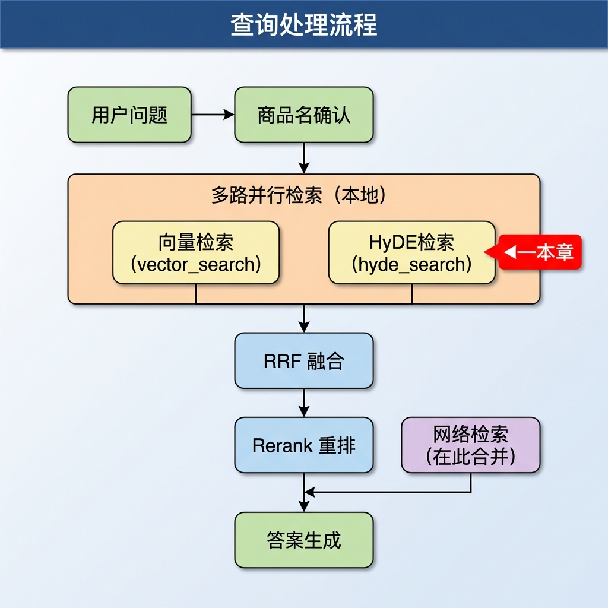
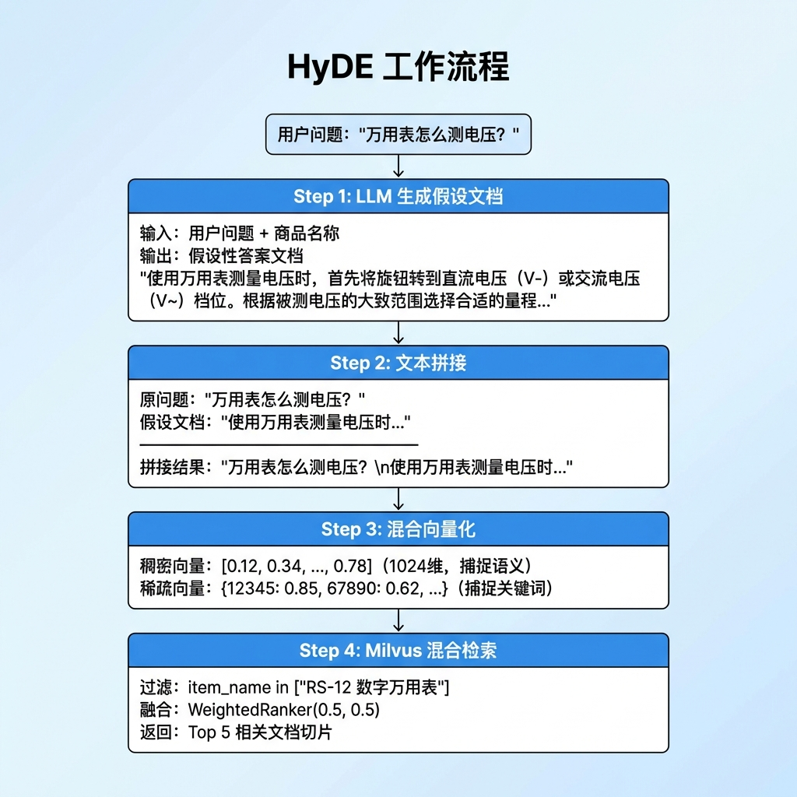
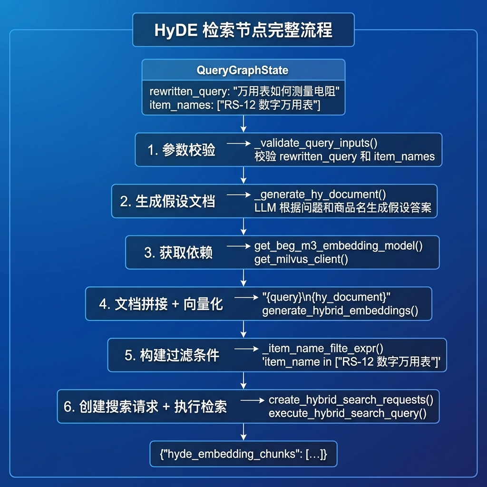
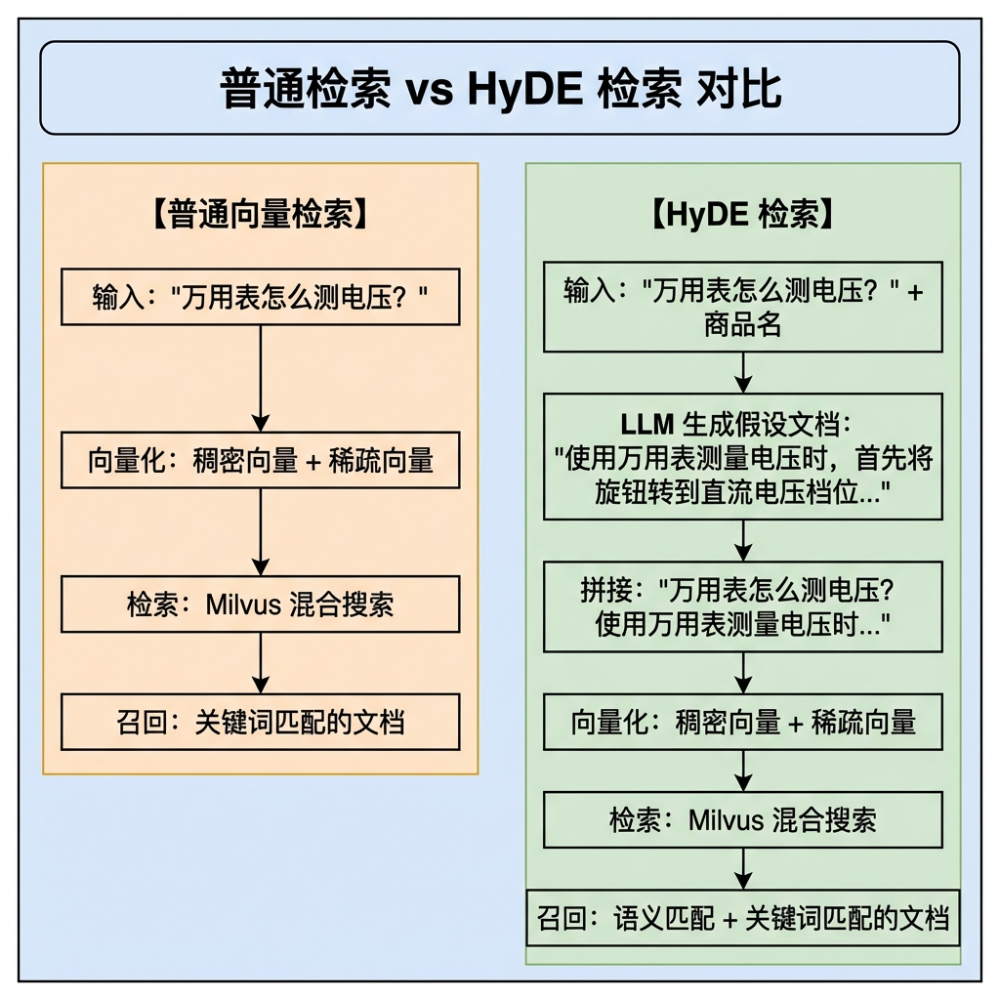
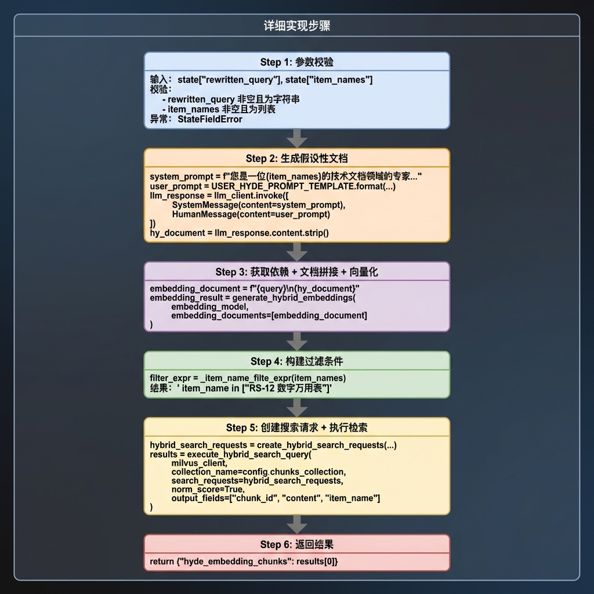
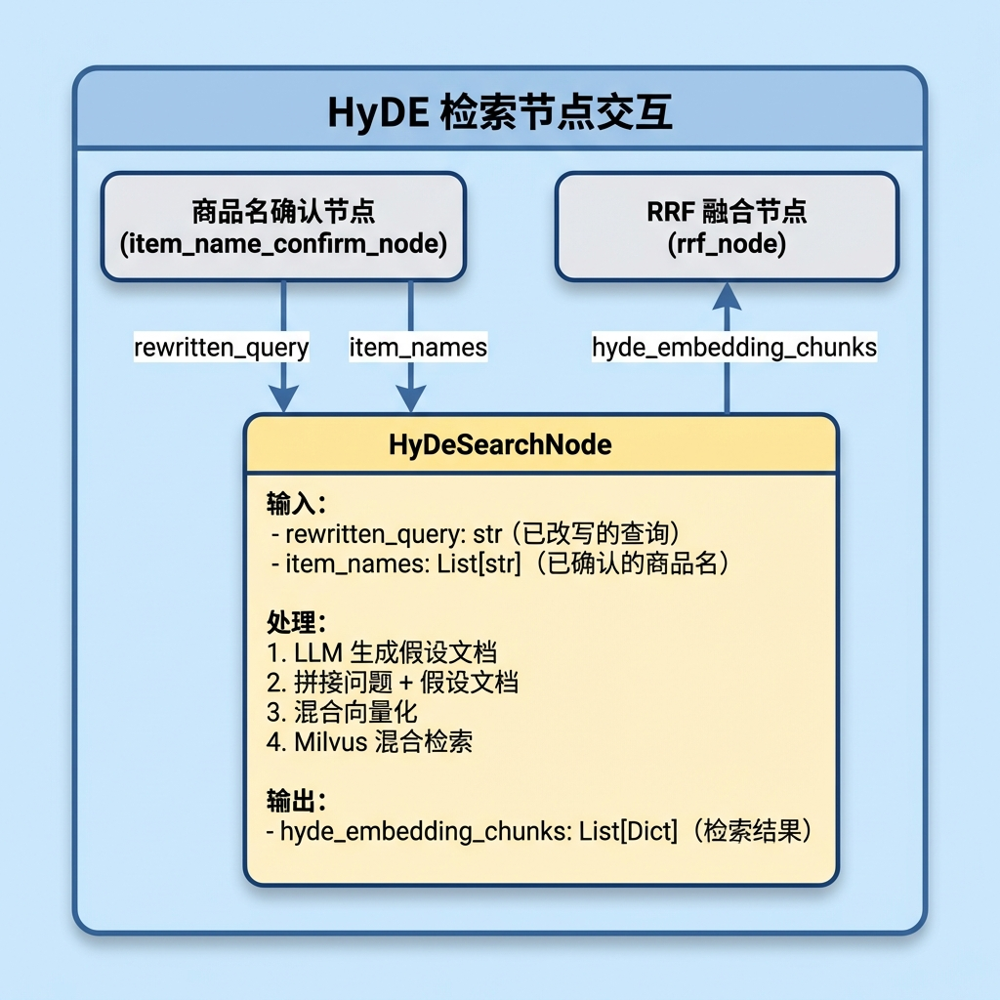

# 知识库查询 —— HyDE 检索节点

> 本文档详细介绍 HyDE 检索节点（hyde_search_node）的设计与实现，该节点使用假设性文档嵌入技术，通过 LLM 生成假设答案来增强检索效果。

---

## 1. 任务目标

### 1.1 本章目标

通过本章学习，你将掌握：

1. **理解 HyDE 技术原理**：掌握 Hypothetical Document Embedding 的核心思想
2. **学会 LLM 生成假设文档**：使用提示词模板引导 LLM 生成高质量假设答案
3. **掌握查询增强策略**：将原查询与假设文档拼接以提升检索效果
4. **对比普通检索与 HyDE 检索**：理解两种方式的互补性
5. **实现可测试的 HyDE 节点**：通过 `if __name__ == "__main__"` 验证节点功能

### 1.2 涉及文件

```
knowledge/processor/query_process/
├── nodes/
│   └── hyde_search_node.py        # HyDE 检索节点（本章重点）
├── state.py                       # 状态定义
├── base.py                        # 基类定义
└── exceptions.py                  # 自定义异常

knowledge/prompts/query/
└── query_prompt.py                # 提示词模板（含 USER_HYDE_PROMPT_TEMPLATE）

knowledge/utils/
├── llm_client_util.py             # LLM 客户端工具
├── bge_m3_embedding_util.py       # BGE-M3 嵌入工具
└── milvus_util.py                 # Milvus 向量数据库工具
```

### 1.3 节点在流程中的位置



---

## 2. 核心概念扫盲

### 2.1 什么是 HyDE？

**HyDE**（Hypothetical Document Embedding）是一种查询增强检索技术：

```
传统检索:
  用户问题 → 向量化 → 检索

HyDE 检索:
  用户问题 → LLM生成假设答案 → 拼接 → 向量化 → 检索
```

**核心思想：** 用户的问题通常是简短的、信息不完整的，而知识库中的文档是详细的、信息丰富的。HyDE 通过生成一个假设性的答案文档，让检索向量更接近目标文档的语义空间。

### 2.2 HyDE 解决了什么问题？

| 问题场景         | 传统检索                       | HyDE 检索                     |
| ---------------- | ------------------------------ | ----------------------------- |
| **问题过于简短** | "怎么换电池" → 向量偏向疑问句  | 生成假设答案 → 向量偏向说明文 |
| **术语表述不同** | 用户说"电量"，文档写"电池容量" | LLM 在假设答案中使用专业术语  |
| **缺少上下文**   | 问题孤立，无背景信息           | LLM 补充相关背景知识          |

### 2.3 HyDE 工作流程图解



### 2.4 HyDE 提示词模板

```python
USER_HYDE_PROMPT_TEMPLATE = """
请根据用户的问题，编写一段技术文档片段作为回答参考。
商品名称：{item_hint}
用户问题：{rewritten_query}

要求：
1. 文档片段应当专业、准确，使用技术文档的正式风格
2. 内容应紧扣用户问题，提供具体操作步骤或技术说明
3. 适当使用专业术语，但避免过于晦涩
4. 篇幅控制在 200-300 字左右
"""
```

**系统提示词动态生成：**

```python
system_prompt = f"您是一位{validate_item_names}的技术文档领域的专家，主要擅长编写技术文档、操作手册、文档规格说明"
```

**设计要点：**

- **专家视角**：根据商品名动态设定专家身份
- **技术文档风格**：引导 LLM 生成类似知识库文档的内容
- **篇幅控制**：200-300 字，避免过长影响向量质量

### 2.5 HyDE vs 普通向量检索

| 特性             | 普通向量检索 | HyDE 检索             |
| ---------------- | ------------ | --------------------- |
| **检索向量来源** | 原始问题     | 问题 + 假设答案       |
| **语义丰富度**   | 较低（问句） | 较高（包含答案要点）  |
| **LLM 调用**     | 无           | 需要 1 次 LLM 调用    |
| **延迟**         | 低           | 稍高（+LLM 生成时间） |
| **召回特点**     | 关键词匹配强 | 语义匹配强            |

**互补关系：**

- 普通检索：捕捉关键词精确匹配的文档
- HyDE 检索：捕捉语义相似但用词不同的文档
- RRF 融合：结合两者优势

---

## 3. HyDE 检索业务处理流程（总）

### 3.1 整体流程图



### 3.2 数据流转对比



---

## 4. HyDE 检索业务处理流程（分）

### 4.1 目标

实现一个能够：

1. 使用 LLM 生成与用户问题相关的假设性答案文档
2. 将原问题与假设文档拼接，形成增强查询
3. 对增强查询执行混合向量检索
4. 返回语义匹配度更高的文档切片

### 4.2 需求分析

#### 4.2.1 功能需求

1. **参数校验**：验证 rewritten_query 和 item_names 的有效性
2. **假设文档生成**：调用 LLM 生成简洁的假设答案
3. **文本拼接**：将原查询和假设文档组合（换行符分隔）
4. **混合向量化**：使用 BGE-M3 生成稠密和稀疏向量
5. **过滤检索**：根据商品名称精准过滤
6. **结果返回**：返回检索结果

#### 4.2.2 技术依赖

| 依赖          | 用途           |
| ------------- | -------------- |
| **LLM**       | 生成假设性文档 |
| **BGE-M3**    | 混合向量生成   |
| **Milvus**    | 向量检索       |
| **LangChain** | LLM 调用封装   |

### 4.3 实现流程

#### 4.3.1 实现流程图



#### 4.3.2 具体实现步骤

##### Step 1: 参数校验

**目的：** 确保输入参数的有效性，避免后续处理出错。

**代码片段：**

```python
def _validate_query_inputs(self, state: QueryGraphState) -> Tuple[str, List[str]]:
    """校验输入参数"""

    # 1. 获取 state 的 rewritten_query
    rewritten_query = state.get('rewritten_query', "")

    # 2. 获取 state 的 item_names
    item_names = state.get('item_names', "")

    # 3. 校验
    if not rewritten_query or not isinstance(rewritten_query, str):
        raise StateFieldError(
            node_name=self.name,
            field_name="rewritten_query",
            expected_type=str
        )

    if not item_names or not isinstance(item_names, list):
        raise StateFieldError(
            node_name=self.name,
            field_name="item_names",
            expected_type=list
        )

    # 4. 返回
    return rewritten_query, item_names
```

---

##### Step 2: 生成假设性文档

**目的：** 使用 LLM 根据用户问题和商品名生成一个假设性的答案文档。

**代码片段：**

```python
def _generate_hy_document(self, validated_query: str, validate_item_names: List[str]) -> str:
    """使用 LLM 生成假设性文档"""

    # 1. 获取 LLM 客户端
    llm_client = AIClients.get_llm_client(Fal)

    # 2. 判断
    if llm_client is None:
        return ""

    # 3. 获取系统提示词以及用户提示词
    user_prompt = USER_HYDE_PROMPT_TEMPLATE.format(
        item_hint=validate_item_names,
        rewritten_query=validated_query
    )
    system_prompt = f"您是一位{validate_item_names}的技术文档领域的专家，主要擅长编写技术文档、操作手册、文档规格说明"

    try:
        # 4. 获取 AIMessage
        llm_response = llm_client.invoke([
            SystemMessage(content=system_prompt),
            HumanMessage(content=user_prompt)
        ])

        # 5. 获取内容
        llm_response_content = getattr(llm_response, 'content', "").strip()

        # 6. 判断是否存在
        if not llm_response_content:
            return ""

        return llm_response_content

    except Exception as e:
        self.logger.error(f"LLM调用失败:{str(e)}")
        return ""
```

**LLM 生成示例：**

```
输入查询: "万用表怎么测电压？"
商品名称: ["RS-12 数字万用表"]

生成的假设文档:
"使用 RS-12 数字万用表测量电压时，首先将功能旋钮转到直流电压（V-）或交流电压（V~）
档位。根据被测电压的大致范围选择合适的量程，如果不确定可以先选最大量程。将红表笔
接触被测电路的正极，黑表笔接触负极。读取显示屏上的数值即为电压值..."
```

---

##### Step 3: 文档拼接与向量化

**目的：** 将原问题和假设文档组合，并进行混合向量化。

**代码片段：**

```python
# 3. 获取嵌入模型 & milvus 客户端
embedding_model = get_beg_m3_embedding_model()
milvus_client = get_milvus_client()
if not embedding_model or not milvus_client:
    return state

# 4. 假设性文档嵌入(注入问题+假设性文档)
embedding_document = f"{validated_query}\n{hy_document}"
embedding_result = generate_hybrid_embeddings(
    embedding_model,
    embedding_documents=[embedding_document]
)

if not embedding_result:
    return state
```

**拼接效果示例：**

```
原问题: "万用表怎么测电压？"
假设文档: "使用万用表测量电压时，首先将旋钮转到直流电压档位..."

拼接结果:
"万用表怎么测电压？
使用万用表测量电压时，首先将旋钮转到直流电压档位..."
```

**设计考量：**

- 保留原问题：确保原始关键词被捕获
- 换行符分隔：清晰区分问题和假设文档
- 假设文档补充语义信息

---

##### Step 4: 构建过滤条件

**目的：** 将商品名称列表转换为 Milvus 的过滤表达式语法。

**代码片段：**

```python
def _item_name_filte_expr(self, validate_item_names: List[str]) -> str:
    """构建商品名过滤表达式"""
    quoted = ", ".join(f'"{v}"' for v in validate_item_names)
    return f" item_name in [{quoted}]"
```

**示例：**

```python
item_names = ["RS-12 数字万用表", "华为擎云L420"]
filter_expr = _item_name_filte_expr(item_names)
# 结果: ' item_name in ["RS-12 数字万用表", "华为擎云L420"]'
```

---

##### Step 5: 创建搜索请求并执行检索

**目的：** 在 Milvus 中执行混合向量检索。

**代码片段：**

```python
# 6. 创建混合搜索请求
hybrid_search_requests = create_hybrid_search_requests(
    dense_vector=embedding_result['dense'][0],
    sparse_vector=embedding_result['sparse'][0],
    expr=item_name_filtered_expr
)

# 7. 执行混合搜索请求
reps = execute_hybrid_search_query(
    milvus_client,
    collection_name=self.config.chunks_collection,
    search_requests=hybrid_search_requests,
    norm_score=True,
    output_fields=["chunk_id", "content", "item_name",'title']
)

if not reps or not reps[0]:
    return state
```

---

##### Step 6: 返回结果

**目的：** 将检索结果写入图状态。

**代码片段：**

```python
# 8. 只更新 hyde_embedding_chunks
return {"hyde_embedding_chunks": reps[0]}
```

**返回数据结构：**

```python
{
    "hyde_embedding_chunks": [
        {
            "entity": {
                "chunk_id": 12345,
                "content": "万用表测量电压时...",
                "item_name": "RS-12 数字万用表"
            },
            "distance": 0.9456
        },
        ...
    ]
}
```

### 4.4 代码实现

以下是完整的节点实现代码：

```python
# knowledge/processor/query_process/nodes/hyde_search_node.py

"""HyDE 检索节点

使用 Hypothetical Document Embedding 技术：
先让 LLM 生成假设性文档，再将其与原查询拼接后向量化检索，提升召回质量。
"""

import json
import logging
from typing import List, Tuple, Union, Any, Dict

from langchain_core.messages import SystemMessage, HumanMessage

from knowledge.processor.query_process.state import QueryGraphState
from knowledge.processor.query_process.base import BaseNode
from knowledge.processor.query_process.exceptions import StateFieldError
from knowledge.utils.llm_client_util import get_llm_client
from knowledge.prompts.query.query_prompt import USER_HYDE_PROMPT_TEMPLATE
from knowledge.utils.milvus_util import (
    get_milvus_client,
    create_hybrid_search_requests,
    execute_hybrid_search_query
)
from knowledge.utils.bge_m3_embedding_util import (
    generate_hybrid_embeddings,
    get_bge_m3_embedding_model
)

logging.basicConfig(level=logging.INFO)
logger = logging.getLogger(__name__)


class HyDeSearchNode(BaseNode):
    """HyDE 检索节点

    流程: 参数校验 → LLM 生成假设文档 → 拼接原查询 → 向量化 → 混合检索
    """
    name = "hyde_search_node"

    def process(self, state: QueryGraphState) -> Union[QueryGraphState, Dict[str, Any]]:
        """执行 HyDE 检索

        Args:
            state: 需包含 rewritten_query 和 item_names

        Returns:
            {"hyde_embedding_chunks": [...]} 搜索结果列表
        """
        # 1. 参数校验
        validated_query, validate_item_names = self._validate_query_inputs(state)

        # 2. 生成假设性文档
        hy_document = self._generate_hy_document(validated_query, validate_item_names)

        # 3. 获取嵌入模型 & milvus 客户端
        embedding_model = get_bge_m3_embedding_model()
        milvus_client = get_milvus_client()
        if not embedding_model or not milvus_client:
            return state

        # 4. 假设性文档嵌入(注入问题+假设性文档)
        embedding_document = f"{validated_query}\n{hy_document}"
        embedding_result = generate_hybrid_embeddings(
            embedding_model,
            embedding_documents=[embedding_document]
        )

        if not embedding_result:
            return state

        # 5. 获取 item_name 的过滤表达式
        item_name_filtered_expr = self._item_name_filte_expr(validate_item_names)

        # 6. 创建混合搜索请求
        hybrid_search_requests = create_hybrid_search_requests(
            dense_vector=embedding_result['dense'][0],
            sparse_vector=embedding_result['sparse'][0],
            expr=item_name_filtered_expr
        )

        # 7. 执行混合搜索请求
        reps = execute_hybrid_search_query(
            milvus_client,
            collection_name=self.config.chunks_collection,
            search_requests=hybrid_search_requests,
            norm_score=True,
            output_fields=["chunk_id", "content", "item_name",'title']
        )

        if not reps or not reps[0]:
            return state

        # 8. 只更新 hyde_embedding_chunks
        return {"hyde_embedding_chunks": reps[0]}

    def _validate_query_inputs(self, state: QueryGraphState) -> Tuple[str, List[str]]:
        """校验输入参数"""
        rewritten_query = state.get('rewritten_query', "")
        item_names = state.get('item_names', "")

        if not rewritten_query or not isinstance(rewritten_query, str):
            raise StateFieldError(
                node_name=self.name,
                field_name="rewritten_query",
                expected_type=str
            )

        if not item_names or not isinstance(item_names, list):
            raise StateFieldError(
                node_name=self.name,
                field_name="item_names",
                expected_type=list
            )

        return rewritten_query, item_names

  

    def _item_name_filte_expr(self, validate_item_names: List[str]) -> str:
        """构建商品名过滤表达式"""
        quoted = ", ".join(f'"{v}"' for v in validate_item_names)
        return f" item_name in [{quoted}]"


# ================================================================== #
#                        测试入口                                   #
# ================================================================== #

if __name__ == "__main__":
    from knowledge.processor.query_process.base import setup_logging

    setup_logging()

    print("=" * 60)
    print("开始测试: HyDE 检索节点 (HydeSearchNode)")
    print("=" * 60)

    mock_state = {
        "rewritten_query": "RS-12 数字万用表如何测量直流电压？",
        "item_names": ["RS-12 数字万用表"],
    }

    print("【输入状态】:")
    print(f"  查询: {mock_state['rewritten_query']}")
    print(f"  商品: {mock_state['item_names']}")
    print("-" * 60)

    node = HyDeSearchNode()
    result = node.process(mock_state)

    chunks = result.get("hyde_embedding_chunks", [])
    print(f"\n【HyDE 检索结果】: {len(chunks)} 条")
    for i, chunk in enumerate(chunks, 1):
        entity = chunk.get("entity", {})
        print(f"  [{i}] chunk_id={entity.get('chunk_id')} "
              f"item_name={entity.get('item_name')} "
              f"distance={chunk.get('distance', 'N/A')}")
        content = entity.get("content", "")
        print(f"      内容: {content[:80]}...")

    print("-" * 60)
    print("测试完成")
```

---

## 5. 测试运行

### 5.1 运行 HyDE 检索节点测试

```bash
# 进入项目目录
cd knowledge

# 激活虚拟环境
source .venv/bin/activate  # Linux/Mac
# 或
.venv\Scripts\activate     # Windows

# 运行测试
python -m knowledge.processor.query_process.nodes.hyde_search_node
```

### 5.2 预期输出

```
============================================================
开始测试: HyDE 检索节点 (HydeSearchNode)
============================================================
【输入状态】:
  查询: RS-12 数字万用表如何测量直流电压？
  商品: ['RS-12 数字万用表']
------------------------------------------------------------

【HyDE 检索结果】: 5 条
  [1] chunk_id=12345 item_name=RS-12 数字万用表 distance=0.9456
      内容: 电压测量是万用表最常用的功能之一。测量直流电压时，将旋钮转到V-档位...
  [2] chunk_id=12346 item_name=RS-12 数字万用表 distance=0.9123
      内容: 使用本万用表测量交流电压时，将功能旋钮转到V~档位，选择适当量程...
  [3] chunk_id=12347 item_name=RS-12 数字万用表 distance=0.8876
      内容: 注意事项：测量高压时请确保量程足够，超量程测量可能损坏仪表...
  [4] chunk_id=12348 item_name=RS-12 数字万用表 distance=0.8654
      内容: 直流电压测量的精度取决于量程选择，小信号测量建议使用小量程...
  [5] chunk_id=12349 item_name=RS-12 数字万用表 distance=0.8421
      内容: 测量完成后，建议将旋钮转到OFF位置或非测量档位...
------------------------------------------------------------
测试完成
```

### 5.3 处理前后对比

| 对比项                    | 处理前（输入）                       | 处理后（输出）                     |
| ------------------------- | ------------------------------------ | ---------------------------------- |
| **查询文本**              | "RS-12 数字万用表如何测量直流电压？" | 原问题 + 假设文档（约 200-300 字） |
| **检索向量**              | 无                                   | 拼接文本的混合向量                 |
| **hyde_embedding_chunks** | 无                                   | 5 条相关切片                       |
| **语义丰富度**            | 单一问句                             | 问句 + 专业答案描述                |

**效果对比示例：**

```
【普通检索可能召回】
- "万用表使用说明" (关键词匹配)
- "电压测量注意事项" (部分匹配)

【HyDE 检索额外召回】
- "直流电压档位操作步骤" (语义匹配 - 因为假设文档提到了"直流电压档位")
- "表笔接线极性说明" (语义匹配 - 因为假设文档提到了"红表笔接正极")
- "量程选择指南" (语义匹配 - 因为假设文档提到了"选择合适量程")
```

---

## 6. 总结

### 6.1 节点功能概览

| 功能             | 说明                                        |
| ---------------- | ------------------------------------------- |
| **参数校验**     | 验证 rewritten_query 和 item_names 的有效性 |
| **假设文档生成** | 使用 LLM 生成与问题相关的假设性答案         |
| **查询增强**     | 将原问题与假设文档拼接，丰富语义信息        |
| **混合向量化**   | 使用 BGE-M3 生成稠密和稀疏向量              |
| **过滤检索**     | 根据商品名称精准过滤                        |
| **结果输出**     | 返回检索结果                                |

### 6.2 节点设计要点

**1. HyDE 的核心价值**

```
问题: 用户问题简短，与知识库文档表述差异大
解决: 用 LLM 生成假设答案，拉近问题向量与文档向量的距离

用户问题向量 ──────────────────────────────────> 知识库文档向量
     ↑                                                ↑
     └─── 语义鸿沟（表述方式不同） ────────────────────┘

用户问题 + 假设答案向量 ───────────────────────> 知识库文档向量
     ↑                                                ↑
     └─── 语义距离缩短（假设答案使用类似表述） ────────┘
```

**2. 与普通检索的互补性**

```
普通检索: 精确匹配用户问题中的关键词
HyDE 检索: 捕捉语义相似但用词不同的文档

两者通过 RRF 融合，实现优势互补
```

**3. 动态系统提示词**

```python
system_prompt = f"您是一位{validate_item_names}的技术文档领域的专家..."
```

- 根据商品名动态设定专家身份
- 提高假设文档的专业性和相关性

**4. 错误处理策略**

```python
try:
    llm_response = llm_client.invoke([...])
    return llm_response.content.strip()
except Exception as e:
    self.logger.error(f"LLM调用失败:{str(e)}")
    return ""  # 返回空字符串，不影响后续流程
```

- LLM 调用失败时返回空字符串
- 不抛出异常，避免阻塞整个查询流程
- 其他并行检索通道（普通向量、Web）可正常工作

**5. 返回值设计**

```python
return {"hyde_embedding_chunks": reps[0]}
```

- 只返回需要更新的字段
- LangGraph 会自动合并到完整状态中

### 6.3 节点交互图

