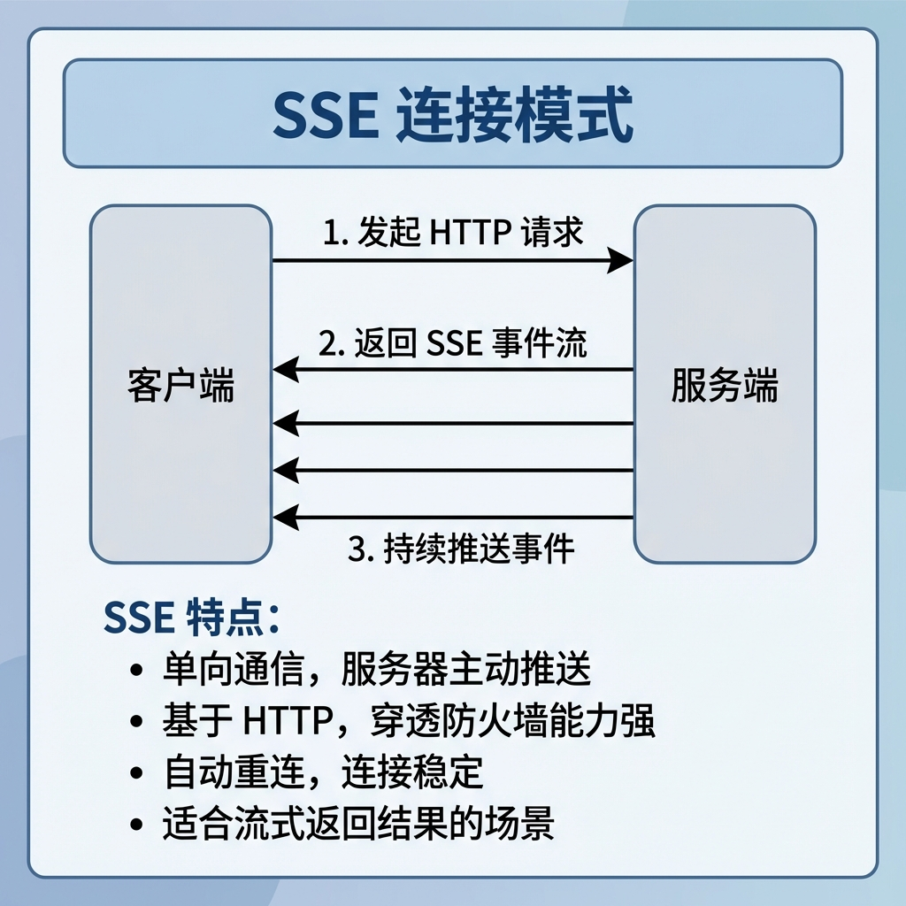
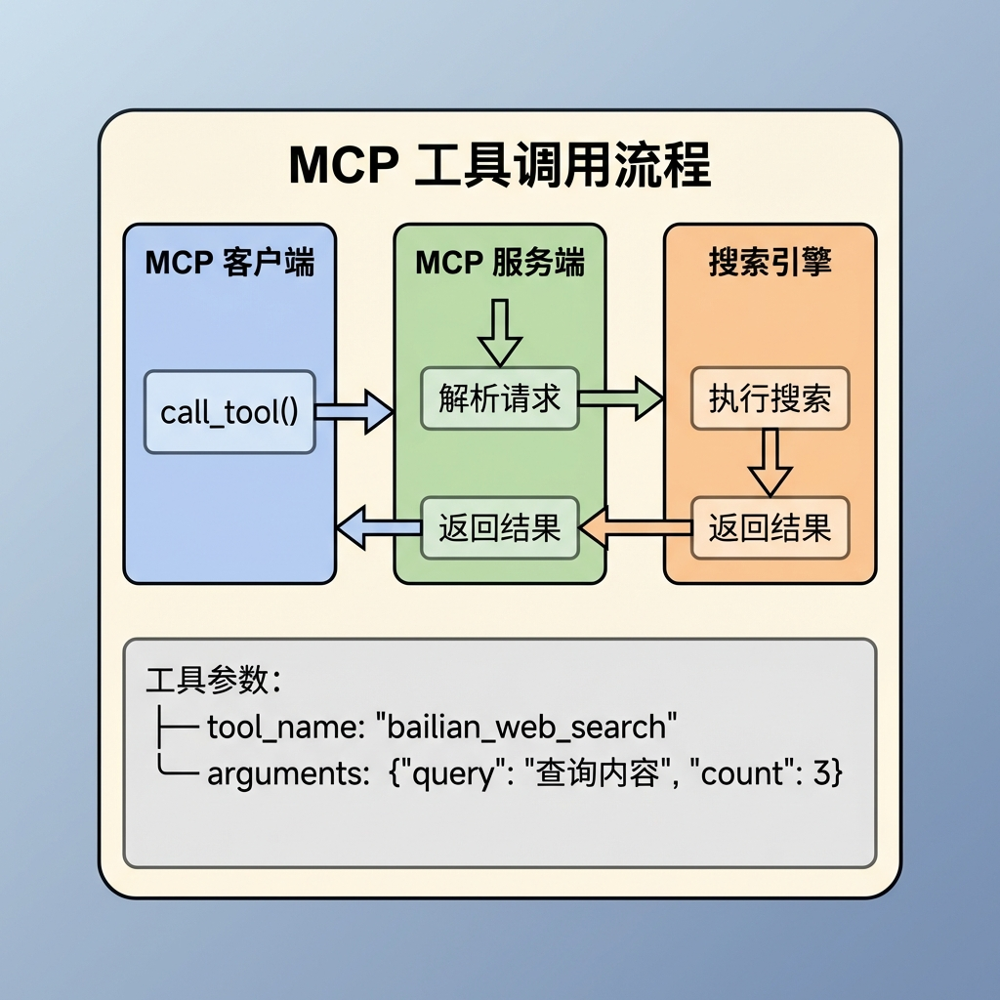

# 知识库查询 —— 网络搜索节点

## 1. 任务目标

本节课将实现知识库查询流程中的 **网络搜索节点**（`McpSearchNode`）。

该节点通过 **MCP 协议**（Model Context Protocol）调用外部网络搜索服务，获取实时的互联网搜索结果，作为本地知识库的补充信息源。

**学完本节你将掌握：**

- MCP 协议的基本概念与工作原理
- SSE（Server-Sent Events）连接模式
- Python 异步编程（async/await）在节点中的应用
- 如何将外部搜索服务集成到 LangGraph 工作流

---

## 2. 核心概念扫盲

### 2.1 为什么需要网络搜索？

本地知识库有以下局限性：

| 局限性   | 说明                                       |
| -------- | ------------------------------------------ |
| 时效性   | 知识库内容可能过时，无法回答最新问题       |
| 覆盖面   | 知识库只包含已导入的文档，无法覆盖所有领域 |
| 边界问题 | 用户可能提出超出知识库范围的问题           |

网络搜索作为"兜底"机制，可以：

- 补充知识库未覆盖的内容
- 提供最新的时效性信息
- 增加答案的多样性和可信度

### 2.2 MCP 协议是什么？

**MCP（Model Context Protocol）** 是一种标准化协议，用于 AI 模型与外部工具/服务之间的通信。


### 2.3 SSE 连接模式

**SSE（Server-Sent Events）** 是一种服务器向客户端推送事件的技术。



### 2.4 Python 异步编程基础

网络搜索涉及 I/O 等待，使用异步编程可以提高效率：

```python
# 同步方式（阻塞）
def sync_search(query):
    result = call_api(query)  # 等待期间线程被阻塞
    return result

# 异步方式（非阻塞）
async def async_search(query):
    result = await call_api(query)  # 等待期间可执行其他任务
    return result

# 在同步代码中调用异步函数
result = asyncio.run(async_search(query))
```

**关键概念：**

- `async def`：定义异步函数（协程）
- `await`：等待异步操作完成
- `asyncio.run()`：在同步环境中运行异步代码

---

## 3. 网络搜索业务处理流程（总）

### 3.1 节点在流程中的位置、节点输入输出


---

## 4. 网络搜索业务处理流程（分）

### 4.1 目标

实现一个通过 MCP 协议调用外部搜索服务的节点，获取与用户查询相关的网络搜索结果。

### 4.2 需求分析

| 需求项   | 说明                         |
| -------- | ---------------------------- |
| MCP 连接 | 使用 SSE 模式连接到搜索服务  |
| 认证授权 | 通过 Header 传递 API Key     |
| 工具调用 | 调用 bailian_web_search 工具 |
| 结果解析 | 从 JSON 响应中提取有效字段   |
| 错误处理 | 网络异常时不影响整体流程     |
| 资源释放 | 确保连接正确关闭             |

### 4.3 实现流程

#### 4.3.1 实现流程图


#### 4.3.2 具体实现步骤

##### Step 1: 参数校验

从状态中获取必要的参数并校验：

```python
def _validate_query_inputs(self, state: QueryGraphState) -> Tuple[str, List[str]]:
    # 1. 获取state的rewritten_query
    rewritten_query = state.get('rewritten_query', "")

    # 2. 获取state的item_names
    item_names = state.get('item_names', "")

    # 3. 校验
    if not rewritten_query or not isinstance(rewritten_query, str):
        raise StateFieldError(node_name=self.name, field_name="rewritten_query", expected_type=str)

    if not item_names or not isinstance(item_names, list):
        raise StateFieldError(node_name=self.name, field_name="item_names", expected_type=list)

    # 4. 返回
    return rewritten_query, item_names
```

**要点：**

- 使用 `rewritten_query` 而非 `original_query`，因为重写后的查询更适合搜索
- 必须同时校验 `item_names`，确保商品名列表有效

##### Step 2: 创建 MCP 客户端

配置 SSE 连接参数并创建客户端实例：

```python
from agents.mcp import MCPServerSse

mcp_client = MCPServerSse(
    name="通用搜索",
    params={
        "url": self.config.mcp_dashscope_base_url,  # MCP 服务端点
        "headers": {"Authorization": self.config.openai_api_key}  # 认证头
    },
    cache_tools_list=True,  # 缓存工具列表
)
```

**配置说明：**

| 参数               | 说明                          |
| ------------------ | ----------------------------- |
| `url`              | MCP 服务的 SSE 端点地址       |
| `headers`          | HTTP 请求头，用于传递认证信息 |
| `cache_tools_list` | 是否缓存服务端工具列表        |

##### Step 3: 建立 MCP 连接

使用异步方式建立连接：

```python
await mcp_client.connect()
```

**连接过程：**

1. 向 MCP 服务发起 HTTP 请求
2. 服务端返回 SSE 事件流
3. 客户端保持长连接，准备接收事件

##### Step 4: 调用搜索工具

通过 MCP 协议调用搜索工具：

```python
execute_tool_result = await mcp_client.call_tool(
    tool_name="bailian_web_search",
    arguments={"query": validated_rewritten_query, "count": 3}
)
```

**MCP 工具调用流程：**



##### Step 5: 解析搜索结果

从 MCP 响应中提取搜索结果：

```python
# 1. 获取 TextContent 的 text
text_content_text: str = execute_tool_result.content[0].text

# 2. 反序列化 JSON
text_content_text: Dict[str, Any] = json.loads(text_content_text)

# 3. 获取 pages 列表
pages = text_content_text.get('pages', "")

# 4. 遍历提取有效字段
search_result = []
for page in pages:
    snippet = page.get('snippet', "").strip()
    title = page.get('title', "").strip()
    url = page.get('url', "").strip()
    search_result.append({"snippet": snippet, "title": title, "url": url})
```

**响应结构示例：**

```json
{
  "pages": [
    {
      "title": "数字万用表使用指南",
      "url": "https://example.com/guide",
      "snippet": "数字万用表测量电压时，首先将旋钮转到V档位..."
    },
    {
      "title": "万用表入门教程",
      "url": "https://example.com/tutorial",
      "snippet": "测量直流电压的步骤如下：1. 选择合适的量程..."
    }
  ]
}
```

##### Step 6: 清理资源并返回

确保 MCP 连接正确关闭：

```python
try:
    await mcp_client.connect()
    execute_tool_result = await mcp_client.call_tool(...)
    # 处理结果...
finally:
    await mcp_client.cleanup()  # 关闭连接
```

返回搜索结果到状态：

```python
# 只更新 state 的 web_search_docs
return {"web_search_docs": mcp_result}
```

### 4.4 完整代码实现

```python
"""MCP 网络搜索节点

通过 MCP 协议调用网络搜索服务获取外部信息。
"""

import asyncio
import json
import logging

logging.basicConfig(level=logging.INFO)
logger = logging.getLogger(__name__)

from typing import Dict, Any, List, Tuple, Union
from agents.mcp import MCPServerSse
from knowledge.processor.query_process.state import QueryGraphState
from knowledge.processor.query_process.base import BaseNode, T
from knowledge.processor.query_process.exceptions import StateFieldError


class McpSearchNode(BaseNode):
    """MCP 网络搜索节点。

    负责从网络查询当前的问题【整个知识库没有找到该问题，兜底的网络结果】
    MCP 形式调用第三方的各种通用的搜索工具。
    """

    name = "mcp_search_node"

    def process(self, state: QueryGraphState) -> Union[QueryGraphState, Dict[str, Any]]:
        """执行网络搜索。

        Args:
            state: 查询图状态，需包含 rewritten_query 和 item_names。

        Returns:
            更新后的状态，包含 web_search_docs 搜索结果。
        """
        # 1. 参数校验
        validated_rewritten_query, validated_item_names = self._validate_query_inputs(state)

        # 2. 创建mcp_client 并且让客户端执行工具 bailian_web_search
        mcp_result = asyncio.run(self._create_execute_web_search(validated_rewritten_query))

        if not mcp_result:
            return state

        # 3. 只更新 state 的 web_search_docs
        return {"web_search_docs": mcp_result}

    def _validate_query_inputs(self, state: QueryGraphState) -> Tuple[str, List[str]]:
        """校验输入参数。

        Args:
            state: 查询图状态。

        Returns:
            校验后的 rewritten_query 和 item_names。

        Raises:
            StateFieldError: 参数校验失败时抛出。
        """
        # 1. 获取 state 的 rewritten_query
        rewritten_query = state.get('rewritten_query', "")

        # 2. 获取 state 的 item_names
        item_names = state.get('item_names', "")

        # 3. 校验
        if not rewritten_query or not isinstance(rewritten_query, str):
            raise StateFieldError(node_name=self.name, field_name="rewritten_query", expected_type=str)

        if not item_names or not isinstance(item_names, list):
            raise StateFieldError(node_name=self.name, field_name="item_names", expected_type=list)

        # 4. 返回
        return rewritten_query, item_names

    async def _create_execute_web_search(self, validated_rewritten_query: str) -> List[Dict[str, Any]]:
        """异步执行 MCP 网络搜索。

        Args:
            validated_rewritten_query: 校验后的查询文本。

        Returns:
            搜索结果列表，每项包含 title、url、snippet。
        """
        # 1. 创建 MCP 客户端（SSE 模式）
        mcp_client = MCPServerSse(
            name="通用搜索",
            params={
                "url": self.config.mcp_dashscope_base_url,  # 服务端的端点
                "headers": {"Authorization": self.config.openai_api_key}  # 认证权限 api_key
            },
            cache_tools_list=True,  # 缓存工具列表
        )

        try:
            # 2. 建立 MCP 连接
            await mcp_client.connect()

            # 3. 执行工具
            execute_tool_result = await mcp_client.call_tool(
                tool_name="bailian_web_search",
                arguments={"query": validated_rewritten_query, "count": 3}
            )

            # 4. 解析工具执行完的结果
            if not execute_tool_result:
                return []
            if not execute_tool_result.content[0]:
                return []

            # 4.1 获取 TextContent 对象的 text
            text_content_text: str = execute_tool_result.content[0].text
            if not text_content_text:
                return []

            # 4.2 反序列化
            try:
                text_content_text: Dict[str, Any] = json.loads(text_content_text)

                # a) 获取 pages
                pages = text_content_text.get('pages', "")
                if not pages:
                    return []

                search_result = []
                # b) 遍历得到每一个结果
                for page in pages:
                    snippet = page.get('snippet', "").strip()
                    title = page.get('title', "").strip()
                    url = page.get('url', "").strip()
                    search_result.append({"snippet": snippet, "title": title, "url": url})

                # c) 最终返回
                return search_result

            except Exception as e:
                self.logger.error("反序列MCP结果失败")
                return []

        finally:
            await mcp_client.cleanup()  # 关闭连接
```

---

## 5. 测试运行

### 5.1 测试代码

```python
if __name__ == '__main__':
    state = {
        "rewritten_query": "今天的小米汽车的股价是多少",
        "item_names": ["RS-12 数字万用表"]
    }

    mcp_search = McpSearchNode()
    result = mcp_search.process(state)

    for r in result.get('web_search_docs'):
        print(json.dumps(r, ensure_ascii=False, indent=2))
```

### 5.2 预期输出

```
{
  "snippet": "小米汽车今日股价最新消息...",
  "title": "小米汽车股价实时行情",
  "url": "https://example.com/xiaomi-stock"
}
{
  "snippet": "小米SU7销量持续攀升，股价受到影响...",
  "title": "小米汽车最新动态",
  "url": "https://example.com/xiaomi-news"
}
{
  "snippet": "分析师对小米汽车前景的评估...",
  "title": "小米汽车投资分析",
  "url": "https://example.com/analysis"
}
```

### 5.3 处理前后对比

| 对比项            | 处理前                       | 处理后                  |
| ----------------- | ---------------------------- | ----------------------- |
| `rewritten_query` | "今天的小米汽车的股价是多少" | 不变                    |
| `web_search_docs` | `[]` 或不存在                | 包含 3 条搜索结果       |
| 每条结果结构      | -                            | `{title, url, snippet}` |

**数据结构变化：**

```python
# 处理前
state = {
    "rewritten_query": "今天的小米汽车的股价是多少",
    "item_names": ["RS-12 数字万用表"],
    # web_search_docs 不存在
}

# 处理后
state = {
    "rewritten_query": "今天的小米汽车的股价是多少",
    "item_names": ["RS-12 数字万用表"],
    "web_search_docs": [
        {
            "title": "小米汽车股价实时行情",
            "url": "https://example.com/xiaomi-stock",
            "snippet": "小米汽车今日股价最新消息..."
        },
        # ... 更多结果
    ]
}
```

---

## 6. 总结

### 6.1 节点功能概览


### 6.2 节点设计要点

#### 要点 1：MCP 协议的使用

```python
# MCP 客户端配置
mcp_client = MCPServerSse(
    name="通用搜索",
    params={
        "url": self.config.mcp_dashscope_base_url,  # 服务端点
        "headers": {"Authorization": self.config.openai_api_key},  # 认证信息
    },
    cache_tools_list=True,  # 缓存工具列表
)

# 调用工具
result = await mcp_client.call_tool(
    tool_name="bailian_web_search",
    arguments={"query": query, "count": 3}
)
```

#### 要点 2：同步节点中调用异步代码

```python
def process(self, state):
    # 同步方法
    ...
    # 使用 asyncio.run() 桥接异步调用
    result = asyncio.run(self._create_execute_web_search(query))
    ...

async def _create_execute_web_search(self, query):
    # 异步方法
    await mcp_client.connect()
    result = await mcp_client.call_tool(...)
    return result
```

#### 要点 3：资源清理模式

```python
try:
    await mcp_client.connect()
    result = await mcp_client.call_tool(...)
    return result
finally:
    # 确保连接被关闭，避免资源泄漏
    await mcp_client.cleanup()
```

#### 要点 4：容错设计

```python
# 多层空值检查
if not execute_tool_result:
    return []
if not execute_tool_result.content[0]:
    return []

# 异常捕获
try:
    text_content_text: Dict[str, Any] = json.loads(text_content_text)
except Exception as e:
    self.logger.error("反序列MCP结果失败")
    return []
```

#### 要点 5：参数校验

```python
def _validate_query_inputs(self, state: QueryGraphState) -> Tuple[str, List[str]]:
    rewritten_query = state.get('rewritten_query', "")
    item_names = state.get('item_names', "")

    if not rewritten_query or not isinstance(rewritten_query, str):
        raise StateFieldError(node_name=self.name, field_name="rewritten_query", expected_type=str)

    if not item_names or not isinstance(item_names, list):
        raise StateFieldError(node_name=self.name, field_name="item_names", expected_type=list)

    return rewritten_query, item_names
```