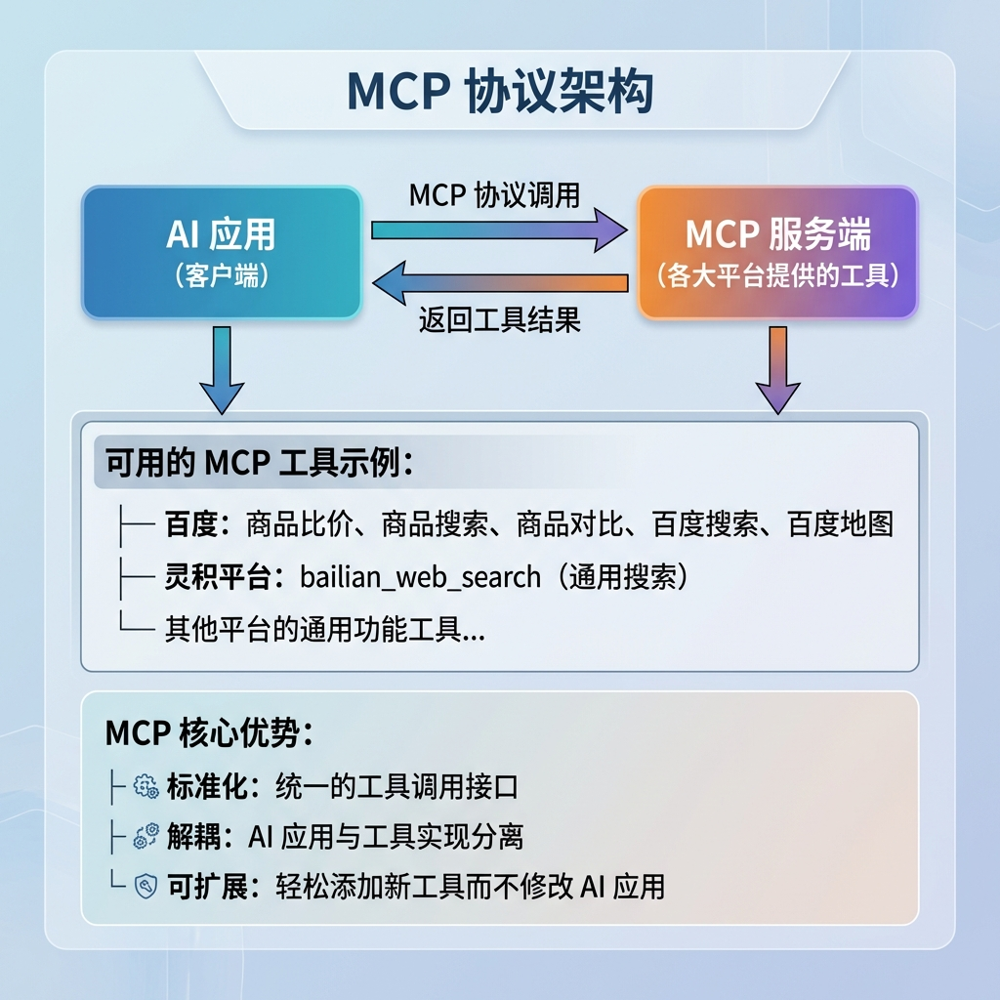
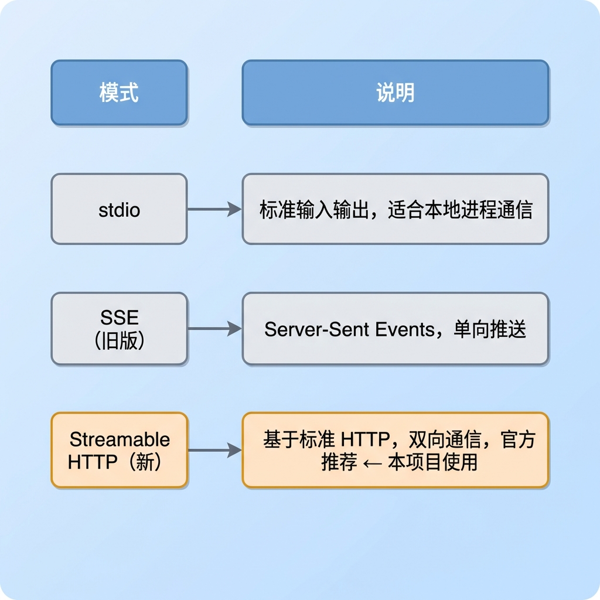
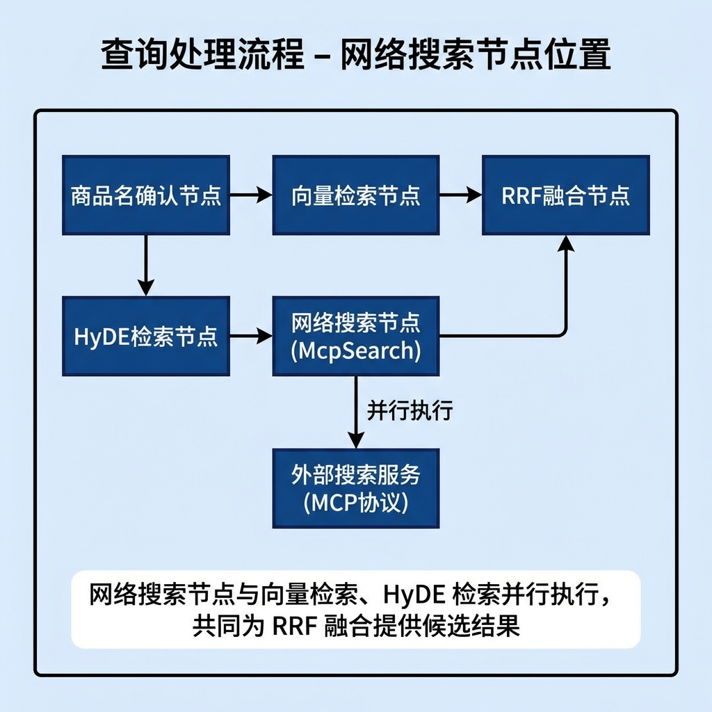
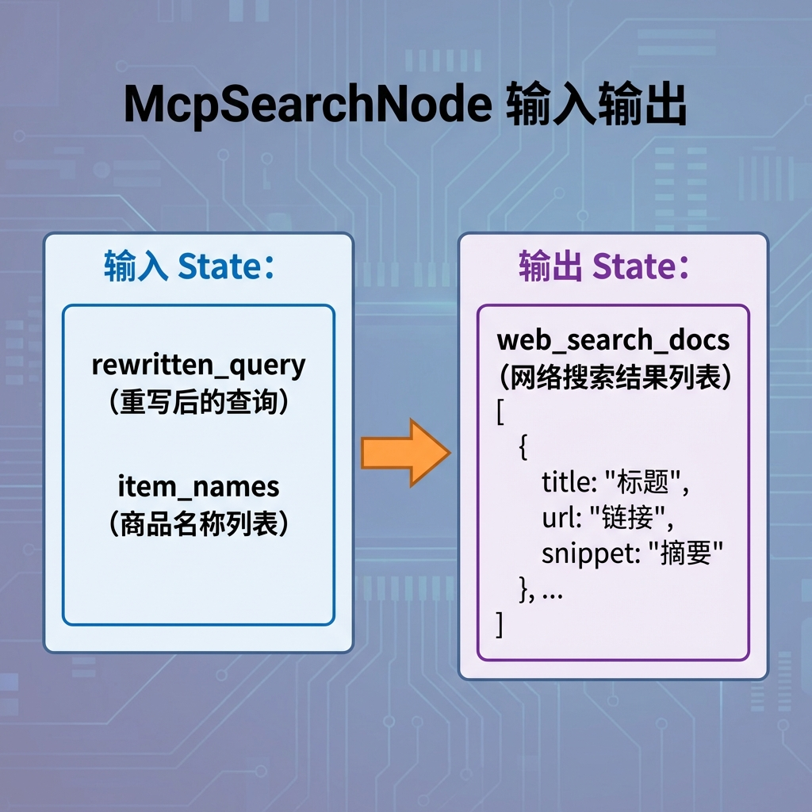
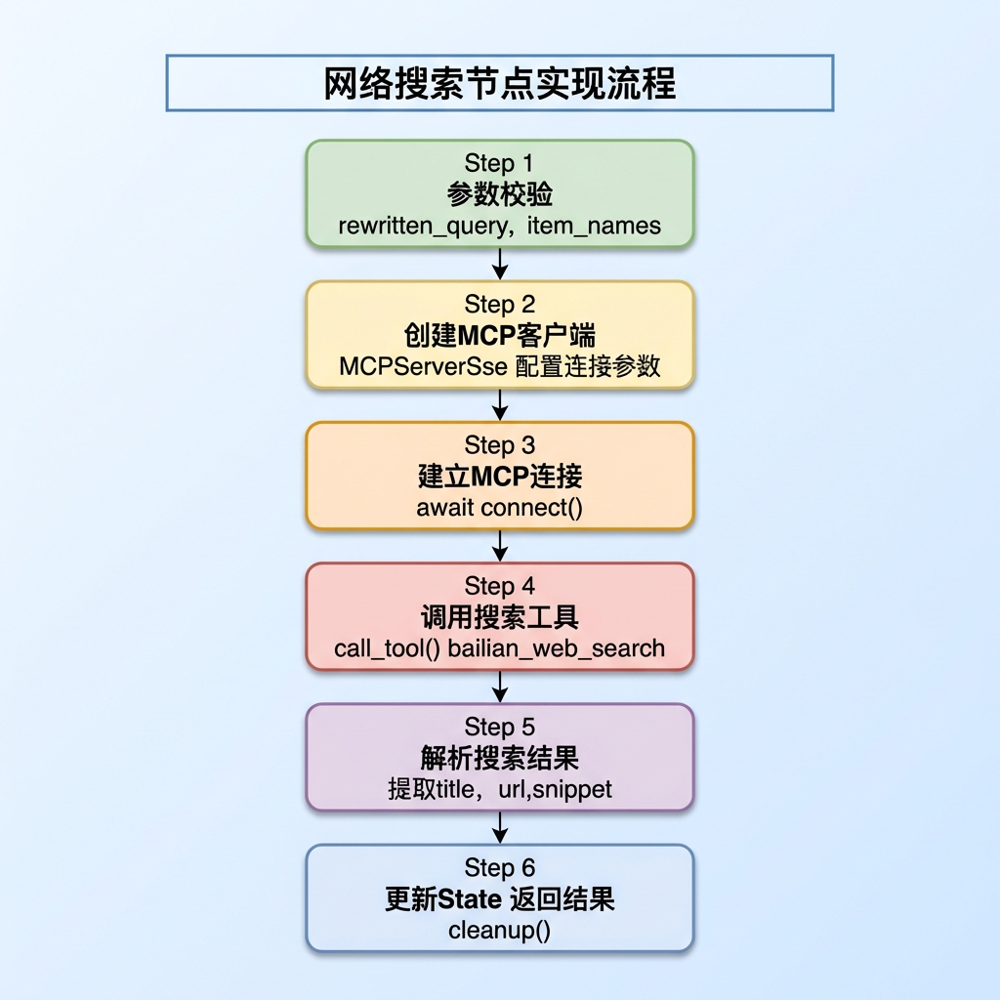
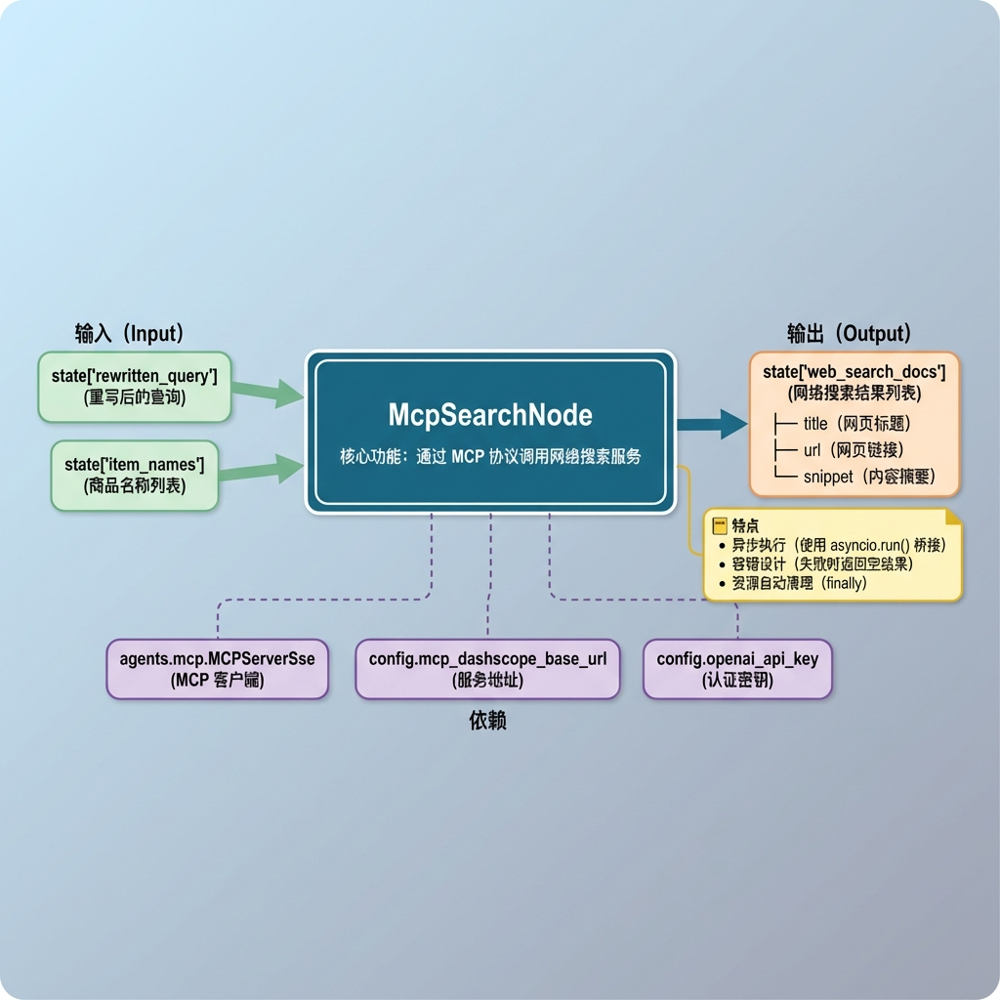

# 知识库查询 —— 网络搜索节点

## 1. 任务目标

本节课将实现知识库查询流程中的 **网络搜索节点**（`WebMcpSearchNode`）。

该节点通过 **MCP 协议**（Model Context Protocol）调用外部网络搜索服务，获取实时的互联网搜索结果，作为本地知识库的补充信息源。

**学完本节你将掌握：**

- MCP 协议的基本概念与工作原理
- SSE 与 Streamable HTTP 连接模式的区别与选择
- Python 异步编程（async/await）在节点中的应用
- `async with` 上下文管理器自动管理 MCP 连接
- 如何将外部搜索服务集成到 LangGraph 工作流

---

## 2. 核心概念扫盲

### 2.1 为什么需要网络搜索？

本地知识库有以下局限性：

| 局限性   | 说明                                       |
| -------- | ------------------------------------------ |
| 时效性   | 知识库内容可能过时，无法回答最新问题       |
| 覆盖面   | 知识库只包含已导入的文档，无法覆盖所有领域 |
| 边界问题 | 用户可能提出超出知识库范围的问题           |

网络搜索作为"兜底"机制，可以：

- 补充知识库未覆盖的内容
- 提供最新的时效性信息
- 增加答案的多样性和可信度

### 2.2 MCP 协议是什么？

**MCP（Model Context Protocol）** 是一种标准化协议，用于 AI 模型与外部工具/服务之间的通信。



### 2.3 MCP 连接模式

MCP 支持三种连接模式，本项目使用 **Streamable HTTP** 模式（MCP 官方推荐）：

#### 2.3.1 三种模式概览



#### 2.3.2 SSE 模式

**SSE（Server-Sent Events）** 是一种基于 HTTP 的单向推送技术，服务端可以持续向客户端推送事件。


```
通道1：SSE 长连接（只能接收，不能发送）
  客户端 ──GET /sse──→ 服务端
  之后这条连接就变成了"单行道"：
  服务端 ──推送事件──→ 客户端  ✓
  客户端 ──发送请求──→ 服务端  ✗  ← SSE 协议不支持反向发送

通道2：普通 HTTP POST（用来发送请求）
  客户端 ──POST /messages──→ 服务端  ✓
  这是另一个独立的 HTTP 请求，和 SSE 连接没有关系

特点：
├── 需要两个通道：SSE 长连接（接收） + HTTP POST（发送）
├── 连接建立后一直保持，服务端可随时推送
└── 广泛支持，大多数 MCP 服务端都兼容
```

```python
# SSE 模式客户端
from agents.mcp import MCPServerSse

async with MCPServerSse(
    name="search_mcp",
    params={
        "url": "https://dashscope.aliyuncs.com/api/v1/mcps/WebSearch/sse",
        "headers": {"Authorization": "your-api-key"},
    },
    client_session_timeout_seconds=300,
    cache_tools_list=True,
) as client:
    result = await client.call_tool(...)
```

#### 2.3.3 Streamable HTTP 模式（MCP 官方推荐）

**Streamable HTTP** 是 MCP 协议 最新推出的标准，用标准的 HTTP POST 请求替代 SSE 的双通道设计。


```
普通请求（数据量小）：
  客户端 ──POST──→ 服务端
  客户端 ←── 200 OK ──── 服务端
              │
              └→ 普通 JSON 响应，一次性返回
              Content-Type: application/json


大数据量请求（自动切换流式）：
  客户端 ──POST──→ 服务端
  客户端 ←── 200 OK ──── 服务端
              │
              └→ SSE 流式响应，分块逐步推送
              Content-Type: text/event-stream
              data: {"chunk": 1, ...}
              data: {"chunk": 2, ...}
              data: {"chunk": 3, ...}


所以叫 Streamable（可流式的）而不是 Streaming（流式的）：
  Streaming HTTP   = 永远是流式       （不是这个）
  Streamable HTTP  = 需要时才流式      （是这个）
  
  小数据 → 普通 JSON 响应（快）
  大数据 → 自动切换 SSE 流式（不会超时、不会内存爆炸）
  
这也是它比纯 SSE 模式更灵活的地方：SSE 模式不管数据大小都维持长连接推送，而 Streamable HTTP 在简单场景下就是普通的请求-响应，只在需要时才"升级"为流式  
  
```

```python
# Streamable HTTP 模式客户端（本项目使用）
from agents.mcp import MCPServerStreamableHttp

async with MCPServerStreamableHttp(
    name="search_mcp",
    params={
        "url": "https://dashscope.aliyuncs.com/api/v1/mcps/WebSearch/mcp",
        "headers": {"Authorization": "your-api-key"},
        "timeout": 300,
        "terminate_on_close": True,
    },
    max_retry_attempts=2,
    cache_tools_list=True,
) as client:
    result = await client.call_tool(...)
```

#### 2.3.4 三种模式详细对比

```
┌──────────────┬────────────────────┬──── ────────┐
│  对比维度     │  stdio              │  SSE                │  Streamable HTTP      │
├──────────────┼────────────────────┼─────────────┤
│  通信方式     │  标准输入/输出       │  SSE长连接 + POST   │  纯 HTTP POST           │
│  连接模型     │  本地进程管道        │  持久长连接          │  无状态请求-响应         │
│  适用场景     │  本地工具/CLI        │  远程服务（当前主流） │  云原生/Serverless      │
│  基础设施     │  无需网络            │  需要保持长连接      │  标准 HTTP 即可         │
│  负载均衡     │  不涉及              │  困难（有状态连接）  │  容易（无状态）          │
│  服务端支持   │  所有本地工具        │  大多数平台支持      │  新平台逐步支持中         │
│  官方推荐     │  本地场景            │  兼容性好            │  ✅ 官方推荐新标准      │
│  Python 类    │  MCPServerStdio     │  MCPServerSse       │  MCPServerStreamable │
│              │                    │                     │  Http                  │
└──────────────┴────────────────────┴─────────────┘
```

#### 2.3.5 本项目为什么用 Streamable HTTP？

```
选择依据：
  1. MCP 官方推荐的新标准，更简洁高效
  2. 灵积平台的 MCP 服务端支持 Streamable HTTP
  3. 无需维持长连接，每次请求独立，更稳定
  4. 适合无状态部署，方便未来扩展

注意事项：
  不是所有 MCP 服务端都支持 Streamable HTTP
  如果遇到 405 Method Not Allowed → 说明该服务端只支持 SSE
  此时需要将 MCPServerStreamableHttp 换为 MCPServerSse
  两种模式的 async with 写法和 call_tool 调用完全一致，只需换类名
```

### 2.4 Python 异步编程基础

网络搜索涉及 I/O 等待，使用异步编程可以提高效率：

```python
# 同步方式（阻塞）
def sync_search(query):
    result = call_api(query)  # 等待期间线程被阻塞
    return result

# 异步方式（非阻塞）
async def async_search(query):
    result = await call_api(query)  # 等待期间可执行其他任务
    return result

# 在同步代码中调用异步函数
result = asyncio.run(async_search(query))
```

**关键概念：**

- `async def`：定义异步函数（协程），返回的是协程对象而非直接结果
- `await`：等待异步操作完成，只能在 `async def` 内部使用
- `asyncio.run()`：在同步环境中运行异步代码（会阻塞当前线程直到协程完成）

**`asyncio.run()` 的本质**：

```
两种调用异步方法的方式：

方式一：调用方也是 async，直接 await（async 链条向上传染）
  async def process():
      result = await self._execute_web_mcp_search(query)

方式二：调用方是同步的，用 asyncio.run() 桥接（本项目使用）
  def process():
      result = asyncio.run(self._execute_web_mcp_search(query))

  asyncio.run() = "临时创建异步环境，把协程丢进去跑完，把结果拿出来给同步事件"
  对 process() 来说，这一行和调用普通同步函数没有区别——必须等结果回来才往下走
```

### 2.5 上下文管理器管理 MCP 连接

MCP 客户端支持 `async with` 上下文管理器，可以自动管理连接的建立和关闭：

```python
# ❌ 旧版：手动管理连接（容易忘记 cleanup）
mcp_client = MCPServerSse(...)
try:
    await mcp_client.connect()       # 手动建立连接
    result = await mcp_client.call_tool(...)
finally:
    await mcp_client.cleanup()       # 手动关闭连接（容易忘写）

# ✅ 新版：上下文管理器自动管理（本项目使用）
async with MCPServerStreamableHttp(...) as client:
    result = await client.call_tool(...)
# 退出 with 块时自动关闭连接，即使中间抛异常也会执行

# 底层等价于：
# __aenter__()  → 自动调用 connect()
# __aexit__()   → 自动调用 cleanup()
```

---

## 3. 网络搜索业务处理流程（总）

### 3.1 节点在流程中的位置



### 3.2 节点输入输出



---

## 4. 网络搜索业务处理流程（分）

### 4.1 目标

实现一个通过 MCP 协议调用外部搜索服务的节点，获取与用户查询相关的网络搜索结果。

### 4.2 需求分析

| 需求项   | 说明                                       |
| -------- | ------------------------------------------ |
| MCP 连接 | 使用 Streamable HTTP 模式连接到搜索服务    |
| 认证授权 | 通过 Header 传递 API Key                   |
| 工具调用 | 调用 bailian_web_search 工具               |
| 结果解析 | 从 JSON 响应中提取 title、url、snippet     |
| 错误处理 | 网络异常、JSON 解析失败时不影响整体流程    |
| 资源释放 | 使用 `async with` 上下文管理器自动关闭连接 |
| 超时控制 | 配置请求超时和 SSE 读取超时，避免无限等待  |
| 重试机制 | 配置最大重试次数，应对网络抖动             |

### 4.3 实现流程

#### 4.3.1 实现流程图




#### 4.3.2 具体实现步骤

##### Step 1: 参数校验

从状态中获取必要的参数并校验：

```python
def _validate_state(self, state: QueryGraphState):
    # 1. 获取参数
    rewritten_query = state.get('rewritten_query')
    item_names = state.get('item_names')

    # 2. 校验
    if not rewritten_query or not isinstance(rewritten_query, str):
        raise StateFieldError(node_name=self.name, field_name='rewritten_query', expected_type=str)

    if not item_names or not isinstance(item_names, list):
        raise StateFieldError(node_name=self.name, field_name='item_names', expected_type=list)

    # 3. 返回
    return rewritten_query, item_names
```

**要点：**

- 使用 `rewritten_query` 而非 `original_query`，因为重写后的查询更适合搜索
- 必须同时校验 `item_names`，确保商品名列表有效

##### Step 2: 创建 MCP 客户端并建立连接

使用 `async with` 上下文管理器创建客户端，自动管理连接生命周期：

```python
from agents.mcp import MCPServerStreamableHttp

async with MCPServerStreamableHttp(
    name="search_mcp",
    params={
        "url": self.config.mcp_dashscope_base_url,   # MCP 服务端点
        "headers": {"Authorization": f"Bearer {self.config.openai_api_key}"},  # 认证头
        "timeout": 300,              # 请求超时时间（秒）
        "terminate_on_close": True,  # 关闭时终止连接
    },
    max_retry_attempts=2,    # 最大重试次数
    cache_tools_list=True,   # 缓存工具列表，避免重复请求
) as client:
    # 进入 with 块时自动建立连接
    # ...业务逻辑...
# 退出 with 块时自动关闭连接
```

**配置参数说明：**

| 参数                 | 说明                                     |
| -------------------- | ---------------------------------------- |
| `url`                | MCP 服务的 Streamable HTTP 端点地址      |
| `headers`            | HTTP 请求头，传递 API Key 认证信息       |
| `timeout`            | 整个请求的超时时间，避免无限等待         |
| `terminate_on_close` | 关闭连接时是否终止底层 HTTP 连接         |
| `max_retry_attempts` | 网络失败时的最大重试次数，应对网络抖动   |
| `cache_tools_list`   | 是否缓存服务端工具列表，减少重复请求开销 |

##### Step 3: 调用搜索工具

通过 MCP 协议调用搜索工具：

```python
execute_tool_result = await client.call_tool(
    tool_name="bailian_web_search",
    arguments={"query": validated_query, "count": 3}
)
```

**MCP 工具调用流程：**


##### Step 4: 解析搜索结果

从 MCP 响应中提取搜索结果，包含多层空值检查：

```python
# 1. 检查最外层对象
if not execute_tool_result:
    return []

# 2. 检查 content 列表
if not execute_tool_result.content[0]:
    return []

# 3. 获取 TextContent 的 text
text_content_text: str = execute_tool_result.content[0].text
if not text_content_text:
    return []

# 4. JSON 反序列化
try:
    text_content_text: Dict[str, Any] = json.loads(text_content_text)

    # 获取 pages 列表
    pages = text_content_text.get('pages', "")
    if not pages:
        return []

    # 遍历提取有效字段
    search_result = []
    for page in pages:
        snippet = page.get('snippet', "").strip()
        title = page.get('title', "").strip()
        url = page.get('url', "").strip()
        search_result.append({"snippet": snippet, "title": title, "url": url})

    return search_result

except JSONDecodeError as e:
    self.logger.error(f"反序列MCP结果失败信息 {str(e.msg)} 原文{e.doc} 位置{e.pos}")
    return []
```

**响应结构示例：**

```json
{
  "pages": [
    {
      "title": "数字万用表使用指南",
      "url": "https://example.com/guide",
      "snippet": "数字万用表测量电压时，首先将旋钮转到V档位..."
    },
    {
      "title": "万用表入门教程",
      "url": "https://example.com/tutorial",
      "snippet": "测量直流电压的步骤如下：1. 选择合适的量程..."
    }
  ]
}
```

##### Step 5: 更新 state 并返回

```python
# 搜索失败时返回原 state（不影响整体流程）
if not mcp_result:
    return state

# 搜索成功时更新 state
state['web_search_docs'] = mcp_result
return state
```

### 4.4 完整代码实现

```python
"""MCP 网络搜索节点

通过 MCP 协议（Streamable HTTP 模式）调用网络搜索服务获取外部信息。
使用 async with 上下文管理器自动管理 MCP 连接生命周期。
"""

import asyncio
import json
from json import JSONDecodeError
from typing import Dict, Any
from knowledge.processor.query_processor.state import QueryGraphState
from knowledge.processor.query_processor.base import BaseNode, T
from knowledge.processor.query_processor.exceptions import StateFieldError

from agents.mcp import MCPServerStreamableHttp


class WebMcpSearchNode(BaseNode):
    """MCP 网络搜索节点。

    负责从网络查询当前的问题【整个知识库没有找到该问题，兜底的网络结果】
    通过 MCP 协议调用灵积平台的通用搜索工具（bailian_web_search）。
    """

    node = "web_mcp_search_node"

    def process(self, state: QueryGraphState) -> QueryGraphState:
        """执行网络搜索。

        Args:
            state: 查询图状态，需包含 rewritten_query 和 item_names。

        Returns:
            更新后的状态，包含 web_search_docs 搜索结果。
        """
        # 1. 参数校验
        validated_query, validate_item_names = self._validate_state(state)

        # 2. 执行 web_mcp_search（asyncio.run 桥接同步→异步）
        mcp_result = asyncio.run(self._execute_web_mcp_search(validated_query))

        if not mcp_result:
            return state

        # 3. 更新 state web_search_docs
        state['web_search_docs'] = mcp_result

        return state

    def _validate_state(self, state: QueryGraphState)-> Tuple[str,List[str]]:
        """校验输入参数。

        Args:
            state: 查询图状态。

        Returns:
            校验后的 rewritten_query 和 item_names。

        Raises:
            StateFieldError: 参数校验失败时抛出。
        """
        # 1. 获取参数
        rewritten_query = state.get('rewritten_query')
        item_names = state.get('item_names')

        # 2. 校验
        if not rewritten_query or not isinstance(rewritten_query, str):
            raise StateFieldError(node_name=self.name, field_name='rewritten_query', expected_type=str)

        if not item_names or not isinstance(item_names, list):
            raise StateFieldError(node_name=self.name, field_name='item_names', expected_type=list)

        # 3. 返回
        return rewritten_query, item_names

    async def _execute_web_mcp_search(self, validated_query: str):
        """异步执行 MCP 网络搜索。

        使用 async with 上下文管理器自动管理连接生命周期：
        - 进入 with 块时自动建立连接（connect）
        - 退出 with 块时自动关闭连接（cleanup），即使抛异常也会执行

        Args:
            validated_query: 校验后的查询文本。

        Returns:
            搜索结果列表，每项包含 title、url、snippet。
        """
        # 1. 定义 MCP 客户端（Streamable HTTP 模式，自动管理连接）
        async with MCPServerStreamableHttp(
            name="search_mcp",
            params={
                "url": self.config.mcp_dashscope_base_url,
                "headers": {"Authorization": f"Bearer {self.config.openai_api_key}"},
                "timeout": 300,
                "terminate_on_close": True,
            },
            max_retry_attempts=2,
            cache_tools_list=True,
        ) as client:

            # 2. 调用工具
            execute_tool_result = await client.call_tool(
                tool_name="bailian_web_search",
                arguments={"query": validated_query, "count": 3}
            )

            # 3. 解析工具执行完的结果
            # 3.1 获取最外层的对象
            if not execute_tool_result:
                return []
            # 3.2 获取对象的 content 属性
            if not execute_tool_result.content[0]:
                return []
            # 3.3 获取 TextContent 对象的 text
            text_content_text: str = execute_tool_result.content[0].text
            if not text_content_text:
                return []
            # 3.4 反序列化
            try:
                text_content_text: Dict[str, Any] = json.loads(text_content_text)

                # a) 获取 pages
                pages = text_content_text.get('pages', "")
                if not pages:
                    return []
                search_result = []
                # b) 遍历得到每一个结果
                for page in pages:
                    snippet = page.get('snippet', "").strip()
                    title = page.get('title', "").strip()
                    url = page.get('url', "").strip()
                    search_result.append({"snippet": snippet, "title": title, "url": url})
                # c) 最终返回
                return search_result
            except JSONDecodeError as e:
                self.logger.error(
                    f"反序列MCP结果失败信息 {str(e.msg)} 原文{e.doc} 位置{e.pos}"
                )
                return []
```

## 6. 测试运行

### 6.1 测试代码

```python
if __name__ == '__main__':
    import json

    state = {
        "rewritten_query": "今天的小米汽车的股价是多少",
        "item_names": ["RS-12 数字万用表"]
    }

    web_mcp_search = WebMcpSearchNode()
    result = web_mcp_search.process(state)

    for r in result.get('web_search_docs', []):
        print(json.dumps(r, ensure_ascii=False, indent=2))
```

### 6.2 预期输出

```
{
  "snippet": "小米汽车今日股价最新消息...",
  "title": "小米汽车股价实时行情",
  "url": "https://example.com/xiaomi-stock"
}
{
  "snippet": "小米SU7销量持续攀升，股价受到影响...",
  "title": "小米汽车最新动态",
  "url": "https://example.com/xiaomi-news"
}
{
  "snippet": "分析师对小米汽车前景的评估...",
  "title": "小米汽车投资分析",
  "url": "https://example.com/analysis"
}
```

### 6.3 处理前后对比

```python
# 处理前
state = {
    "rewritten_query": "今天的小米汽车的股价是多少",
    "item_names": ["RS-12 数字万用表"],
    # web_search_docs 不存在
}

# 处理后
state = {
    "rewritten_query": "今天的小米汽车的股价是多少",
    "item_names": ["RS-12 数字万用表"],
    "web_search_docs": [                              # ← 新增
        {
            "title": "小米汽车股价实时行情",
            "url": "https://example.com/xiaomi-stock",
            "snippet": "小米汽车今日股价最新消息..."
        },
        # ... 更多结果
    ]
}
```

---

## 7. 总结

### 7.1 节点功能概览



### 7.2 节点设计要点

#### 要点 1：Streamable HTTP 模式 + 上下文管理器

```python
# 自动管理 MCP 连接生命周期，进入时 connect，退出时 cleanup
async with MCPServerStreamableHttp(
    name="search_mcp",
    params={
        "url": self.config.mcp_dashscope_base_url,
        "headers": {"Authorization": f"Bearer {self.config.openai_api_key}"},
        "timeout": 300,#超时时间
        "terminate_on_close": True,
    },
    max_retry_attempts=2, # 重试次数
    cache_tools_list=True,# 缓存MCP服务下的工具列表,提速
) as client:
    result = await client.call_tool(
        tool_name="bailian_web_search",
        arguments={"query": query, "count": 3}
    )
```

#### 要点 2：同步节点中调用异步代码

```python
def process(self, state):
    # process 是 BaseNode 定义的同步接口，不能改成 async
    # 使用 asyncio.run() 在同步世界和异步世界之间搭桥
    result = asyncio.run(self._execute_web_mcp_search(query))

    # asyncio.run() 会阻塞当前线程，等协程跑完才往下走
    # 对 process() 来说，和调用普通同步函数没有区别

async def _execute_web_mcp_search(self, query):
    async with MCPServerStreamableHttp(...) as client:
        result = await client.call_tool(...)
        return result
```

#### 要点 3：精确异常捕获

```python
# 只捕获 JSONDecodeError，不吞掉其他异常
try:
    data = json.loads(text_content_text)
except JSONDecodeError as e:
    # 记录详细的错误信息：原因 + 原文 + 出错位置
    self.logger.error(
        f"反序列MCP结果失败信息 {str(e.msg)} 原文{e.doc} 位置{e.pos}"
    )
    return []
```


