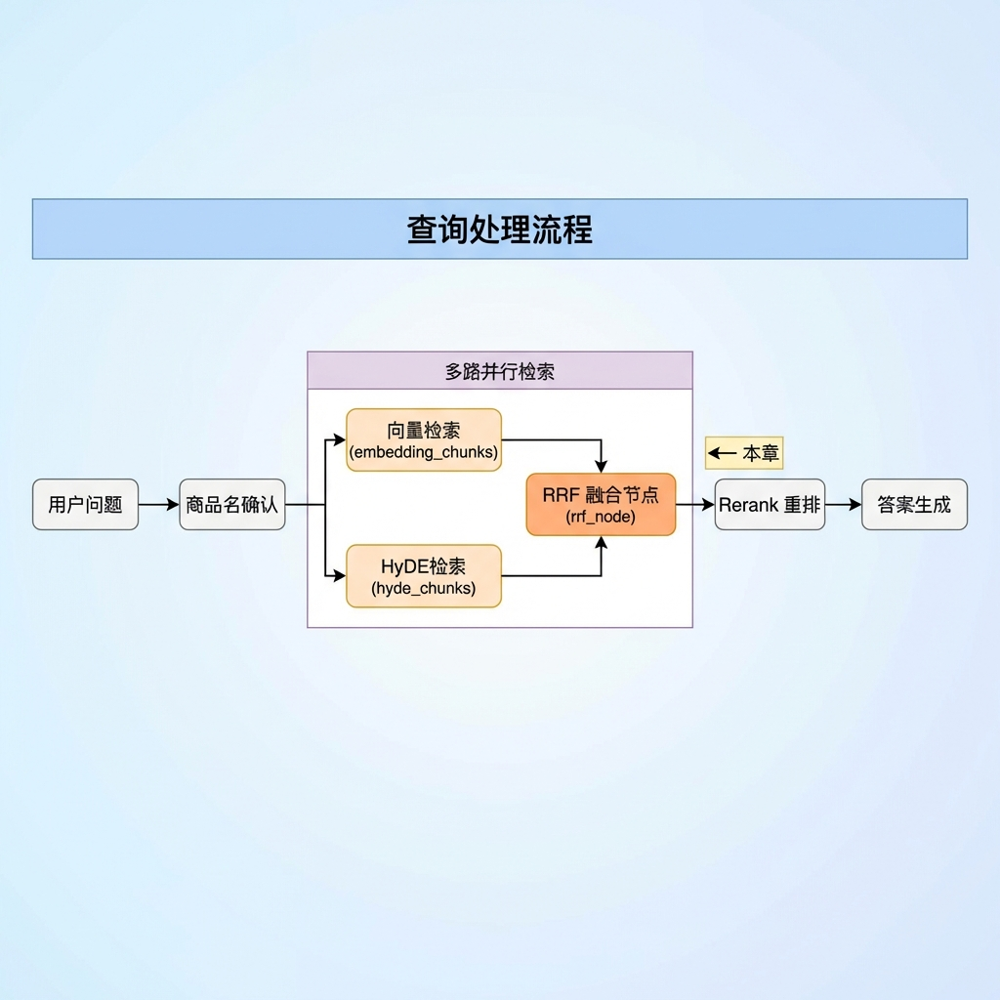
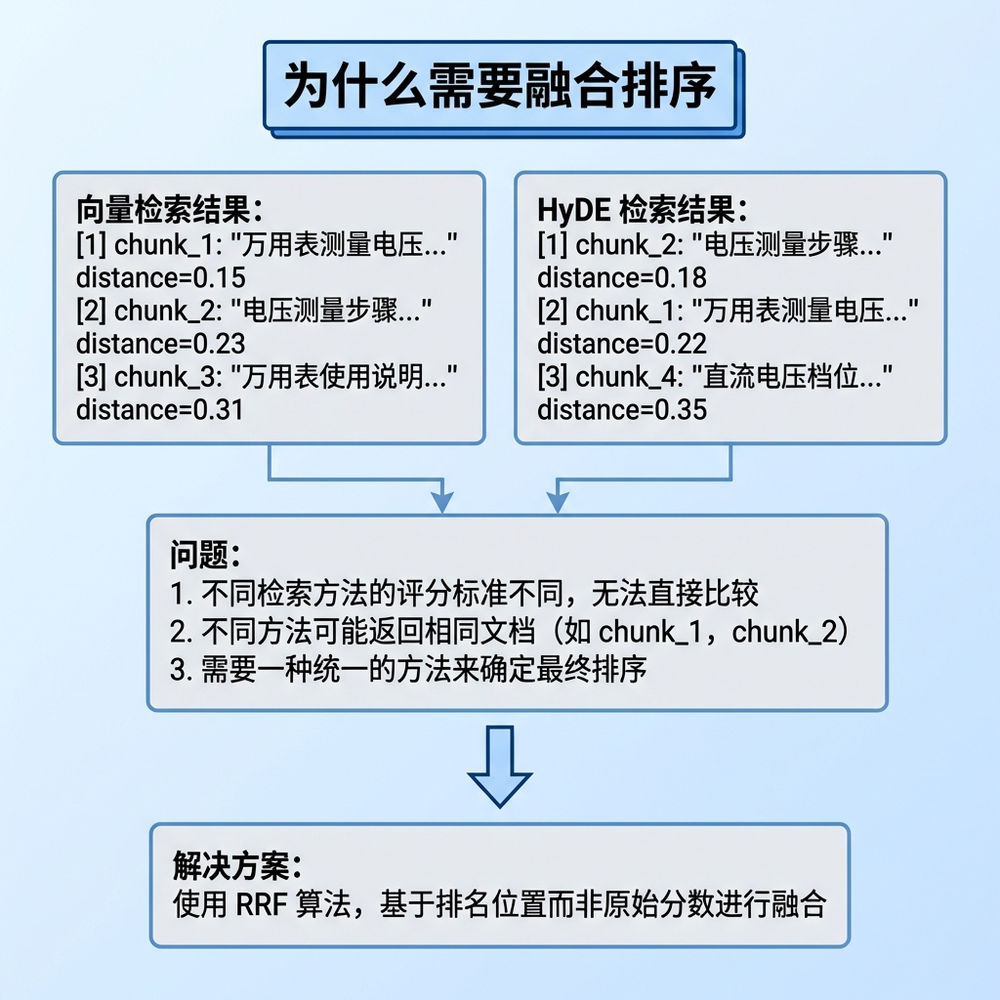
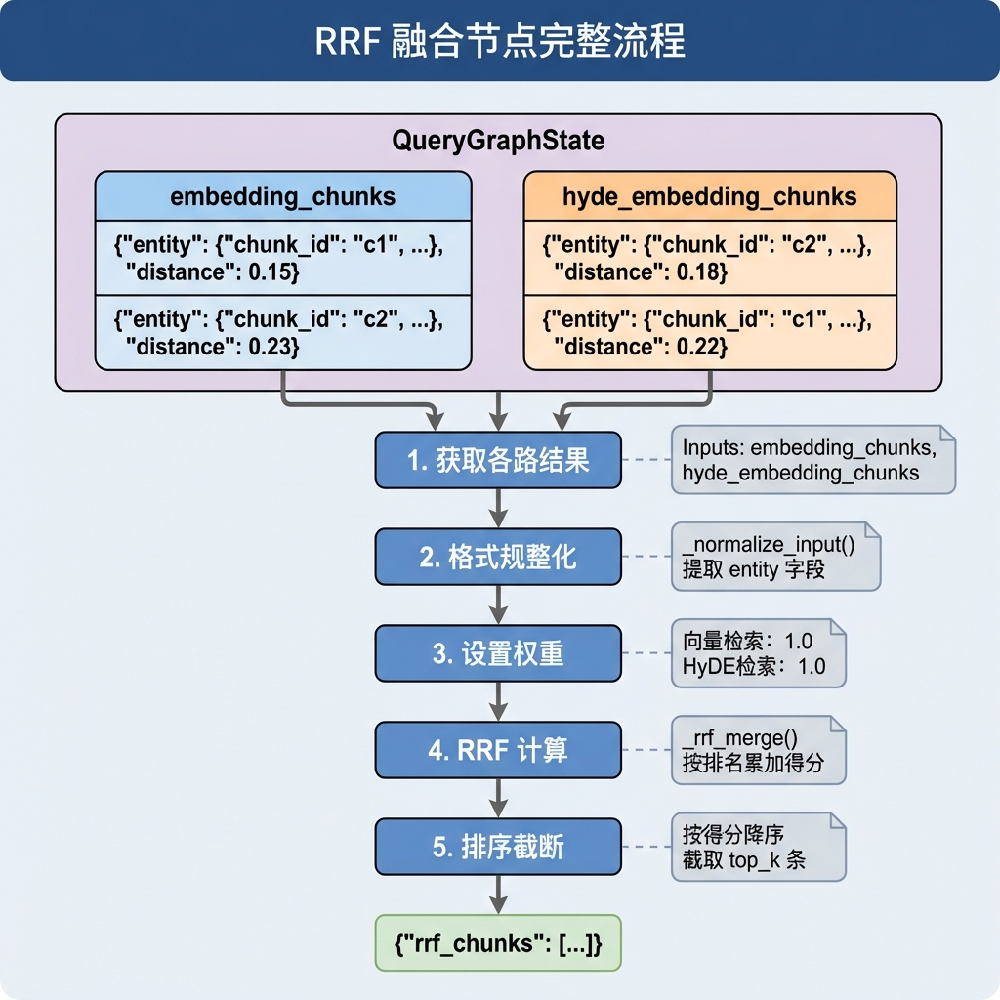
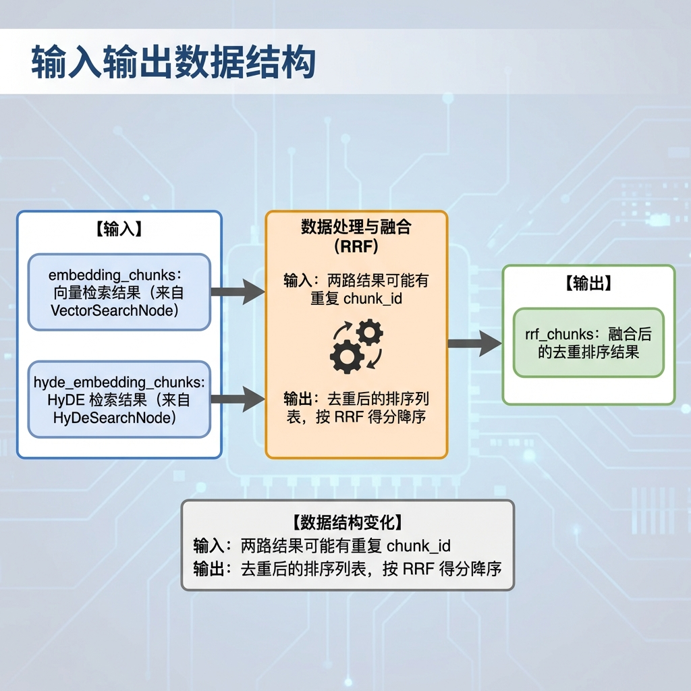
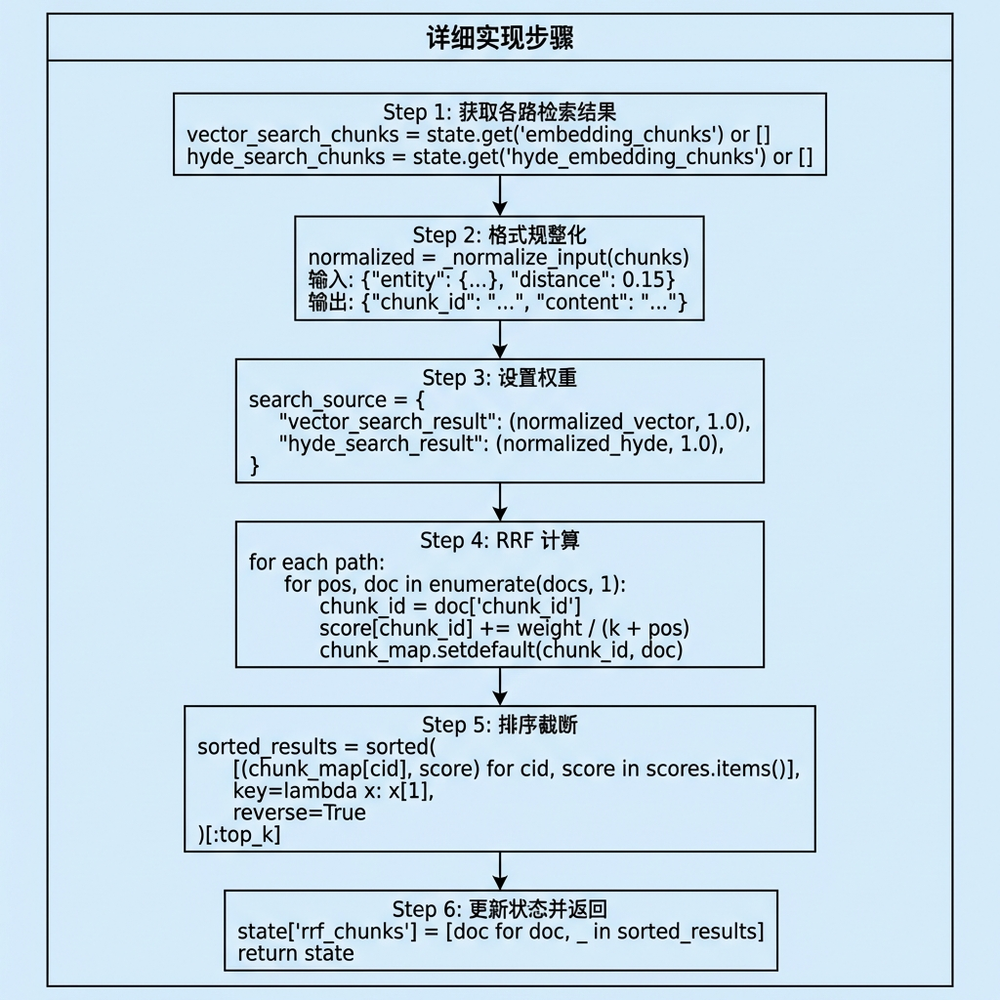
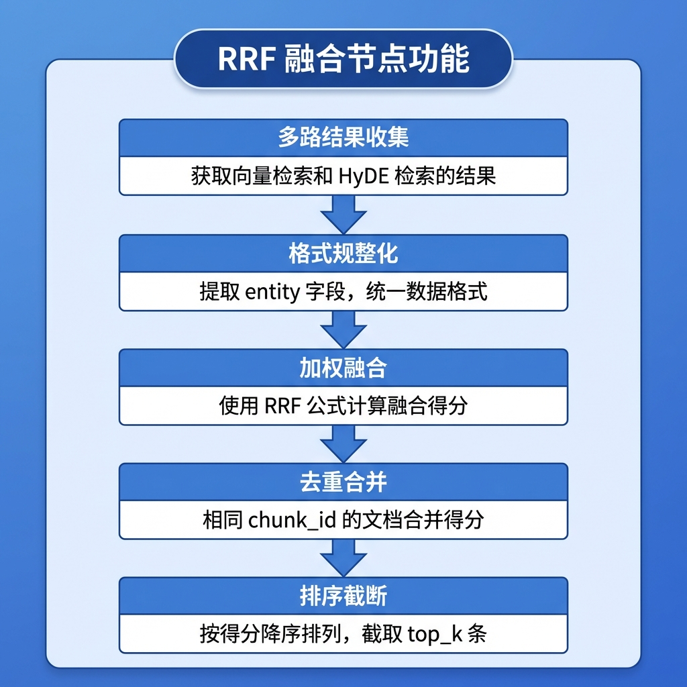
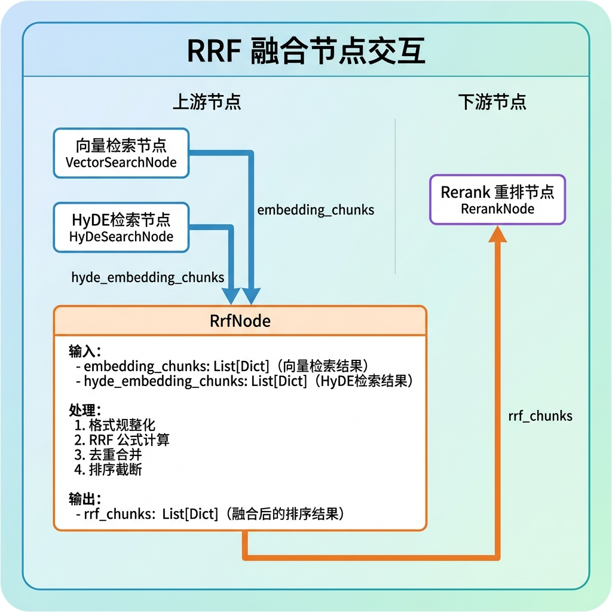

# 知识库查询 —— RRF 融合节点

> 本文档详细介绍 RRF 融合节点（rrf_node）设计与实现，该节点负责将多路检索结果通过 **Reciprocal Rank Fusion（倒数排名融合）** 算法进行融合，生成统一的排序结果。

---

## 1. 任务目标

### 1.1 本章目标

通过本章学习，你将掌握：

1. **理解 RRF 算法原理**：掌握倒数排融合的数学公式与直觉理解
2. **学会多路结果融合**：将向量检索和 HyDE 检索结果合并
3. **理解加权融合策略**：为不同检索路径配置不同权重
4. **理解常数 k 的作用**：深入理解 k 值如何影响排名差异
5. **掌握去重与排序**：相同 chunk_id 的文档合并得分并排序
6. **实现可测试的融合节点**：通过 `if __name__ == "__main__"` 验证节点功能

### 1.2 涉及文件

```
knowledge/processor/query_process/
├── nodes/
│   └── rrf_node.py               # RRF 融合节点（本章重点）
├── state.py                       # 状态定义
├── base.py                        # 基类定义
└── config.py                      # 配置参数
```

### 1.3 节点在流程中的位置



---

## 2. 核心概念扫盲

### 2.1 为什么需要融合排序？

在多路检索阶段，我们并行执行了多路检索：



**融合的核心价值：**

1. **去重**：同一文档可能在多路中被召回
2. **共识放大**：多路都命中的文档应该排在前面
3. **互补性**：不同检索方式捕获不同语义维度的相关性

### 2.2 RRF 算法原理

**Reciprocal Rank Fusion（倒数排名融合）** 是一种经典的排名融合算法。

#### 核心公式

$$
RRF\_score(d) = \sum_{i=1}^{n} \frac{weight_i}{k + rank_i(d)}
$$

**参数说明：**

| 参数      | 说明                                      |
| --------- | ----------------------------------------- |
| d         | 待评分的文档                              |
| n         | 检索路数                                  |
| weight_i  | 第 i 路的权重                             |
| rank_i(d) | 文档 d 在第 i 路中的排名位置（从 1 开始） |
| k         | 平滑常数（通常取 60）                     |

#### 直觉理解

```
假设有文档 A，在两路检索中的排名为：

路径           排名      贡献分数 (k=60, weight=1.0)
────────────────────────────────────────────
向量检索        1        1.0/(60+1) = 0.0164
HyDE 检索       3        1.0/(60+3) = 0.0159
────────────────────────────────────────────
                         总分 = 0.0323
```

**RRF 的优势：**

| 特点           | 说明                            |
| -------------- | ------------------------------- |
| **无需标准化** | 只看排名，不看原始分数          |
| **抗噪声**     | 平滑常数 k 防止头部排名过度主导 |
| **鼓励共识**   | 多路命中的文档得分更高          |
| **惩罚离散**   | 只在少数路径命中的文档得分较低  |

### 2.3 常数 k 的作用（深入理解）

k 值决定了排名差异对得分的影响程度。这是 RRF 算法中最关键的参数。

#### k 值如何影响得分

```
排名位置对得分的影响（k=60）：

排名 1:  1/(60+1)  = 0.0164
排名 2:  1/(60+2)  = 0.0161  (仅下降 1.8%)
排名 10: 1/(60+10) = 0.0143  (下降 13%)
排名 50: 1/(60+50) = 0.0091  (下降 45%)


排名 1:  1/(10+1)  = 0.0909
排名 2:  1/(10+2)  = 0.0833  (下降 8.3%)
排名 10: 1/(10+10) = 0.05    (下降 45%)
排名 50: 1/(10+50) = 0.0166  (下降 82%)
```

#### k 值的选择原则

**k 较小（如 10）：头部排名差异影响大，适合高精度场景**

什么情况下选择小 k？

- 你非常信任每一路检索自身的排序质量
- 认为它排第 1 的文档确实比第 2 的好很多
- 希望保留这个排序信号
- 单路检索场景，需要拉开头部差距

**k 较大（如 60）：排名差异影响平滑，适合多路融合**

什么情况下选择大 k？

- 多路融合时，各路的排序标准不同（向量距离 vs HyDE 相似度）
- 单路的排名位置不一定可靠
- 希望把位置差异抹平，让"多路命中"成为主导因素
- 这是更稳定的选择

#### 实践建议

k=60 是经过验证的经典选择，原因：

1. **排名 1 和排名 2 几乎没差别**（才 1.6%）
2. **最终决定总分高低的主要因素**变成了"你被几路检索同时命中"
3. 而不是"你在某一路排第几"

```
多路命中示例（k=60）：

文档 A：向量检索排第 1，HyDE 检索排第 1
  得分 = 1/(60+1) + 1/(60+1) = 0.0328

文档 B：向量检索排第 1，HyDE 检索未命中
  得分 = 1/(60+1) + 0 = 0.0164

文档 A 的得分是文档 B 的 2 倍！
因为 A 被 2 路都命中了，而 B 只被 1 路命中。
```

### 2.4 加权 RRF 与权重设置

#### 权重的意义

不同检索路径的可靠性可能不同，通过权重调节：

```python
search_source = {
    "vector_search_result": (docs, 1.0),   # 向量检索，权重 1.0
    "hyde_search_result": (docs, 1.0),     # HyDE 检索，权重 1.0
}
```

#### 向量检索 vs HyDE 检索：权重如何设置？

既然去掉了知识图谱这一路，只剩 **Vector Search** 和 **HyDE Search** 两路，权重设置可以从以下角度考虑：

**推荐起点：Vector 1.0，HyDE 1.0（等权）**

两路等权是最稳妥的起点，原因是：

| 检索方式      | 擅长场景                 | 特点                                       |
| ------------- | ------------------------ | ------------------------------------------ |
| **向量检索**  | 语义相似的直接匹配       | 擅长捕捉用户查询和文档之间的直接语义相似性 |
| **HyDE 检索** | 用户表述和文档表述不一致 | 通过假设性文档扩展了查询的语义空间         |

**两者的互补性：**

1. 向量检索：擅长"精准匹配"场景
2. HyDE 检索：擅长"表述差异"场景

**RRF 的核心优势在于"多路都命中的文档排名更高"**，等权让这个机制自然发挥作用。

#### 什么时候调整权重？

```
场景 1：文档库是规范的技术手册，用户提问也比较直接
→ HyDE 生成的假设性文档可能引入噪声
→ 可以适当降低 HyDE 权重（比如 0.8）

场景 2：用户经常用口语化的方式提问，和文档措辞差距大
→ HyDE 的贡献可能更大
→ 可以适当提高 HyDE 权重（比如 1.2）
```

#### 实际建议

1. **先用等权上线**，然后拿一批真实 query 做对比测试
2. **RRF 中权重的影响其实不如 rrf_k 参数那么敏感**——因为 RRF 公式里权重只是一个线性系数，而排名位置的倒数才是主要的打分因子
3. **不必在权重上过度纠结**，把精力放在每一路的召回质量本身更有价值

---

## 3. RRF 融合业务处理流程（总）

### 3.1 整体流程图



### 3.2 节点输入输出



---

## 4. RRF 融合业务处理流程（分）

### 4.1 目标

实现一个 RRF 融合节点，将多路检索结果合并为统一的排序列表，为后续重排序提供候选集。

### 4.2 需求分析

| 需求项       | 说明                              |
| ------------ | --------------------------------- |
| **多源输入** | 支持向量检索、HyDE 检索等多路输入 |
| **格式兼容** | 兼容不同上游节点的输出格式        |
| **加权融合** | 支持为不同路径配置不同权重        |
| **去重合并** | 相同 chunk_id 的文档合并得分      |
| **可配置**   | k 值、最大结果数可配置            |
| **容错**     | 某路为空时不影响整体流程          |

### 4.3 实现流程

#### 4.3.1 实现流程图



#### 4.3.2 具体实现步骤

##### Step 1: 获取各路检索结果

**目的：** 从状态中获取各路检索结果。

**代码片段：**

```python
def process(self, state: QueryGraphState) -> QueryGraphState:
    # 1.1 获取向量检索路的结果
    vector_search_chunks = state.get('embedding_chunks') or []
    # 1.2 获取 hyde 向量检索路的结果
    hyde_search_chunks = state.get('hyde_embedding_chunks') or []
```

---

##### Step 2: 格式规整化

**目的：** 将上游节点输出统一规整为标准格式。

**代码片段：**

```python
def _normalize_input(self, rrf_input: List[Dict[str, Any]]) -> List[Dict[str, Any]]:
    """
    统一处理各路检索到的结果

    Args:
        rrf_input: 各路不同数据结构的检索结果

    Returns:
        统一处理后的标准数据结构的检索结果
    """
    diff_path_result = []

    # 1. 遍历各路搜索结果
    if not rrf_input:
        return []

    # 2. 遍历该路的所有结果
    for doc in rrf_input:
        # 2.1 判断是否有效
        if not isinstance(doc, dict):
            continue

        # 2.2 获取 entity
        entity = doc.get('entity')
        if not entity:
            continue

        diff_path_result.append(entity)

    return diff_path_result
```

**格式转换示例：**

```
输入格式（向量检索/HyDE检索）:
{"entity": {"chunk_id": "c1", "content": "..."}, "distance": 0.15}
                    ↓
输出: {"chunk_id": "c1", "content": "..."}
```

---

##### Step 3: 设置权重

**目的：** 为不同检索路径设置权重。

**代码片段：**

```python
# 2. 为不同路的搜索结果设置不同的权重
search_source = {
    "vector_search_result": (self._normalize_input(vector_search_chunks), 1.0),
    "hyde_search_result": (self._normalize_input(hyde_search_chunks), 1.0),
}

# 3. 构建 rrf_inputs
rrf_inputs = list(search_source.values())
```

---

##### Step 4: RRF 计算

**目的：** 利用 RRF 公式计算每个文档的总得分。

**代码片段：**

```python
def _rrf_merge(self, rrf_inputs, _rrf_k, _top_k) -> List[Tuple[Dict[str, Any], float]]:
    """
    利用 RRF 公式计算每一个文档的总得分

    Args:
        rrf_inputs: 各路的搜索结果 + 权重
        _rrf_k: 平滑参数，通常取 60
        _top_k: 合并完之后返回的文档数

    Returns:
        合并以及排序后的文档列表 [(doc, score), ...]
    """
    chunk_scores = {}  # 存放所有 chunk 的 RRF 计算后的分数值
    chunk_data = {}    # 存放所有 chunk 的文档数据

    for rrf_input, weight in rrf_inputs:
        for i, doc in enumerate(rrf_input, 1):
            chunk_id = doc.get('chunk_id')
            if not chunk_id:
                continue

            # RRF 公式: score += weight / (k + rank)
            chunk_scores[chunk_id] = chunk_scores.get(chunk_id, 0.0) + weight / (_rrf_k + i)

            # 使用 setdefault 保留首次遇到的文档版本
            chunk_data.setdefault(chunk_id, doc)

    # 按得分降序排序，截取前 top_k 条
    sorted_results = sorted(
        [(chunk_data[cid], score) for cid, score in chunk_scores.items()],
        key=lambda x: x[1],
        reverse=True
    )

    return sorted_results[:_top_k] if _top_k else sorted_results
```

**计算过程示例：**

```
假设 k=60，两路检索结果，权重均为 1.0：

文档 chunk_1 的得分计算：
────────────────────────────────────────────
路径            排名    权重    贡献分数
────────────────────────────────────────────
向量检索        1       1.0     1.0/(60+1) = 0.01639
HyDE检索        2       1.0     1.0/(60+2) = 0.01613
────────────────────────────────────────────
                              总分 = 0.03252

文档 chunk_2 的得分计算：
────────────────────────────────────────────
路径            排名    权重    贡献分数
────────────────────────────────────────────
向量检索        2       1.0     1.0/(60+2) = 0.01613
HyDE检索        1       1.0     1.0/(60+1) = 0.01639
────────────────────────────────────────────
                              总分 = 0.03252

文档 chunk_3 的得分计算：
────────────────────────────────────────────
路径            排名    权重    贡献分数
────────────────────────────────────────────
向量检索        3       1.0     1.0/(60+3) = 0.01587
HyDE检索        -       -       0（未命中）
────────────────────────────────────────────
                              总分 = 0.01587
```

---

##### Step 5: 排序截断

**目的：** 将得分映射转换为排序列表并截断。

**排序结果示例：**

```
排序前（按 chunk_id 遍历顺序）：
[
    (chunk_1_doc, 0.03252),
    (chunk_2_doc, 0.03252),
    (chunk_3_doc, 0.01587),
    ...
]

排序后（按得分降序）：
[
    (chunk_1_doc, 0.03252),  # 最高分（多路命中）
    (chunk_2_doc, 0.03252),  # 同分
    (chunk_3_doc, 0.01587),
    ...
]

截断后（top_k=10）：
[前 10 条结果]
```

---

##### Step 6: 更新状态并返回

**目的：** 将融合结果写入状态。

**代码片段：**

```python
# 5. 获取 rrf_chunks（只取文档，不要分数）
rrf_chunks = [doc for doc, _ in rrf_merge_results]
self.logger.info(f"RRF 融合完成，返回 {len(rrf_chunks)} 条结果")

# 6. 记录分数范围（便于调试）
if rrf_merge_results:
    scores = [s for _, s in rrf_merge_results]
    self.logger.info(f"分数范围: [{min(scores):.6f}, {max(scores):.6f}]")

# 7. 更新 state
state['rrf_chunks'] = rrf_chunks

# 8. 返回 state
return state
```

### 4.4 代码实现

以下是完整的节点实现代码：

```python
# knowledge/processor/query_process/nodes/rrf_node.py

"""RRF 融合排序节点

使用 Reciprocal Rank Fusion 算法融合多路检索结果。
"""

from typing import Dict, Any, List, Tuple

from knowledge.processor.query_process.state import QueryGraphState
from knowledge.processor.query_process.base import BaseNode, setup_logging


class RrfNode(BaseNode):
    """RRF 融合排序节点

    流程: 收集多路检索结果 → 带权重 RRF 融合 → 按得分降序返回
    """
    name = "rrf_node"

    def __init__(self):
        super().__init__()
        self._top_k = self.config.rrf_max_results
        self._rrf_k = self.config.rrf_k

    def process(self, state: QueryGraphState) -> QueryGraphState:
        """执行 RRF 融合

        Args:
            state: 需包含 embedding_chunks 和 hyde_embedding_chunks

        Returns:
            更新后的 state，包含 rrf_chunks
        """
        # 1. 各路搜索的结果
        # 1.1 获取向量检索路的结果
        vector_search_chunks = state.get('embedding_chunks') or []
        # 1.2 获取 hyde 向量检索路的结果
        hyde_search_chunks = state.get('hyde_embedding_chunks') or []

        # 2. 为不同路的搜索结果设置不同的权重
        search_source = {
            "vector_search_result": (self._normalize_input(vector_search_chunks), 1.0),
            "hyde_search_result": (self._normalize_input(hyde_search_chunks), 1.0),
        }

        # 3. 构建 rrf_inputs
        rrf_inputs = list(search_source.values())

        # 4. 利用 RRF 的计算公式去获取到所有路查询到的所有 chunk 对应的 score
        rrf_merge_results: List[Tuple[Dict[str, Any], float]] = self._rrf_merge(
            rrf_inputs, self._rrf_k, self._top_k
        )

        # 5. 获取 rrf_chunks（只取文档，不要分数）
        rrf_chunks = [doc for doc, _ in rrf_merge_results]
        self.logger.info(f"RRF 融合完成，返回 {len(rrf_chunks)} 条结果")

        # 6. 记录分数范围（便于调试）
        if rrf_merge_results:
            scores = [s for _, s in rrf_merge_results]
            self.logger.info(f"分数范围: [{min(scores):.6f}, {max(scores):.6f}]")

        # 7. 更新 state
        state['rrf_chunks'] = rrf_chunks

        # 8. 返回 state
        return state

    def _normalize_input(self, rrf_input: List[Dict[str, Any]]) -> List[Dict[str, Any]]:
        """
        统一处理各路检索到的结果

        Args:
            rrf_input: 各路不同数据结构的检索结果

        Returns:
            统一处理后的标准数据结构的检索结果
        """
        diff_path_result = []

        # 1. 遍历各路搜索结果
        if not rrf_input:
            return []

        # 2. 遍历该路的所有结果
        for doc in rrf_input:
            # 2.1 判断是否有效
            if not isinstance(doc, dict):
                continue

            # 2.2 获取 entity
            entity = doc.get('entity')
            if not entity:
                continue

            diff_path_result.append(entity)

        return diff_path_result

    def _rrf_merge(self, rrf_inputs, _rrf_k, _top_k) -> List[Tuple[Dict[str, Any], float]]:
        """
        利用 RRF 公式计算每一个文档的总得分

        Args:
            rrf_inputs: 各路的搜索结果 + 权重
            _rrf_k: 平滑参数，通常取 60
            _top_k: 合并完之后返回的文档数

        Returns:
            合并以及排序后的文档列表
        """
        chunk_scores = {}  # 存放所有 chunk 的 RRF 计算后的分数值
        chunk_data = {}    # 存放所有 chunk 的文档数据

        for rrf_input, weight in rrf_inputs:
            for i, doc in enumerate(rrf_input, 1):
                chunk_id = doc.get('chunk_id')
                if not chunk_id:
                    continue

                # RRF 公式: score += weight / (k + rank)
                chunk_scores[chunk_id] = chunk_scores.get(chunk_id, 0.0) + weight / (_rrf_k + i)

                # 使用 setdefault 保留首次遇到的文档版本
                chunk_data.setdefault(chunk_id, doc)

        # 按得分降序排序动态截取前 top_k 条
        sorted_results = sorted(
            [(chunk_data[chunk_id], score) for chunk_id, score in chunk_scores.items()],
            key=lambda x: x[1],#根据score进行排序
            reverse=True
        )

        return sorted_results[:_top_k] if _top_k else sorted_results


# ================================================================== #
#                        测试入口                                   #
# ================================================================== #

if __name__ == "__main__":
    print("=" * 60)
    print("开始测试: RRF 融合节点")
    print("=" * 60)

    # 模拟两路检索结果
    # chunk_1 命中 2 路（预期最高分）
    # chunk_2 命中 2 路
    # chunk_3, chunk_4 各命中 1 路
    mock_state = {
        "embedding_chunks": [
            {"entity": {"chunk_id": "chunk_1", "content": "向量搜索结果#1"}},
            {"entity": {"chunk_id": "chunk_2", "content": "向量搜索结果#2"}},
            {"entity": {"chunk_id": "chunk_3", "content": "向量搜索结果#3"}},
        ],
        "hyde_embedding_chunks": [
            {"entity": {"chunk_id": "chunk_2", "content": "HyDE搜索结果#1"}},
            {"entity": {"chunk_id": "chunk_1", "content": "HyDE搜索结果#2"}},
            {"entity": {"chunk_id": "chunk_4", "content": "HyDE搜索结果#3"}},
        ],
    }

    print("【输入状态】:")
    print(f"  embedding_chunks: {len(mock_state['embedding_chunks'])} 条")
    print(f"  hyde_embedding_chunks: {len(mock_state['hyde_embedding_chunks'])} 条")
    print("-" * 60)

    rrf_node = RrfNode()
    result = rrf_node.process(mock_state)

    print("\n【融合结果】:")
    for i, chunk in enumerate(result["rrf_chunks"], 1):
        print(f"[{i}] {chunk.get('chunk_id')} - {chunk.get('content')}")

    print("-" * 60)
    print("测试完成")
```

---

## 5. 测试运行

### 5.1 运行 RRF 融合节点测试

```bash
# 进入项目目录
cd knowledge

# 激活虚拟环境
source .venv/bin/activate  # Linux/Mac
# 或
.venv\Scripts\activate     # Windows

# 运行测试
python -m knowledge.processor.query_process.nodes.rrf_node
```

### 5.2 预期输出

```
============================================================
开始测试: RRF 融合节点
============================================================
【输入状态】:
  embedding_chunks: 3 条
  hyde_embedding_chunks: 3 条
------------------------------------------------------------
[rrf_node] RRF 融合完成，返回 4 条结果
[rrf_node] 分数范围: [0.015873, 0.032526]

【融合结果】:
[1] chunk_1 - 向量搜索结果#1
[2] chunk_2 - 向量搜索结果#2
[3] chunk_3 - 向量搜索结果#3
[4] chunk_4 - HyDE搜索结果#3
------------------------------------------------------------
测试完成
```

**分数计算验证（k=60）：**

```
chunk_1: 命中 向量检索(1), HyDE检索(2)
  = 1.0/(60+1) + 1.0/(60+2)
  = 0.01639 + 0.01613
  = 0.03252  ← 最高分（多路命中）

chunk_2: 命中 向量检索(2), HyDE检索(1)
  = 1.0/(60+2) + 1.0/(60+1)
  = 0.01613 + 0.01639
  = 0.03252

chunk_3: 仅命中 向量检索(3)
  = 1.0/(60+3)
  = 0.01587

chunk_4: 仅命中 HyDE检索(3)
  = 1.0/(60+3)
  = 0.01587
```

### 5.3 处理前后对比

| 对比项                  | 处理前   | 处理后           |
| ----------------------- | -------- | ---------------- |
| `embedding_chunks`      | 3 条结果 | 不变             |
| `hyde_embedding_chunks` | 3 条结果 | 不变             |
| `rrf_chunks`            | 不存在   | 4 条去重融合结果 |

**数据结构变化：**

```python
# 处理前
state = {
    "embedding_chunks": [
        {"entity": {"chunk_id": "chunk_1", ...}},
        {"entity": {"chunk_id": "chunk_2", ...}},
        {"entity": {"chunk_id": "chunk_3", ...}},
    ],
    "hyde_embedding_chunks": [
        {"entity": {"chunk_id": "chunk_2", ...}},  # 与上面重复
        {"entity": {"chunk_id": "chunk_1", ...}},  # 与上面重复
        {"entity": {"chunk_id": "chunk_4", ...}},
    ],
    # rrf_chunks 不存在
}

# 处理后
state = {
    # 原有字段不变...
    "rrf_chunks": [
        {"chunk_id": "chunk_1", "content": "..."},  # 得分最高
        {"chunk_id": "chunk_2", "content": "..."},
        {"chunk_id": "chunk_3", "content": "..."},
        {"chunk_id": "chunk_4", "content": "..."},  # 去重后共 4 条
    ]
}
```

---

## 6. 总结

### 6.1 节点功能概览



### 6.2 节点设计要点

**1. RRF 核心公式实现**

```python
# 公式: score(d) = Σ weight_i / (k + rank_i(d))
chunk_scores[chunk_id] = chunk_scores.get(chunk_id, 0.0) + weight / (_rrf_k + i)
```

关键细节：

- `i` 从 1 开始（不是 0），符合排名语义
- 使用 `get(..., 0.0)` 实现累加
- k 取 60 是经过验证的经典值

**2. 格式兼容处理**

```python
def _normalize_input(self, rrf_input):
    for doc in rrf_input:
        if not isinstance(doc, dict):
            continue
        entity = doc.get('entity')
        if not entity:
            continue
        diff_path_result.append(entity)
    return diff_path_result
```

设计考量：

- 向量检索返回 `{"entity": {...}, "distance": ...}`
- 提取 entity 字段获取统一的文档格式

**3. 去重策略**

```python
# 使用 setdefault 保留首次遇到的文档版本
chunk_data.setdefault(chunk_id, doc)
```

为什么这样设计：

- 同一文档可能在多路中出现
- 不同路径返回的元数据可能略有不同
- 保留第一次遇到的版本，保持结果一致性

**4. 配置从配置类读取**

```python
def __init__(self):
    super().__init__()
    self._top_k = self.config.rrf_max_results
    self._rrf_k = self.config.rrf_k
```

设计优势：

- 参数从配置类读取，支持动态调整
- 便于不同环境使用不同参数

### 6.3 配置参数说明

```python
# knowledge/processor/query_process/config.py

class QueryConfig:
    # RRF 相关配置
    rrf_k: int = 60              # RRF 平滑常数
    rrf_max_results: int = 10    # RRF 融合后最大返回数
```

| 参数              | 默认值 | 说明                                   |
| ----------------- | ------ | -------------------------------------- |
| `rrf_k`           | 60     | RRF 平滑常数，值越大排名差异影响越平滑 |
| `rrf_max_results` | 10     | 融合后返回的最大文档数                 |

### 6.4 权重设置建议

| 场景                    | Vector Search | HyDE Search | 说明                          |
| ----------------------- | ------------- | ----------- | ----------------------------- |
| **默认起点**            | 1.0           | 1.0         | 等权，让 RRF 机制自然发挥作用 |
| **规范文档 + 直接提问** | 1.2           | 0.8         | 向量检索更可靠                |
| **口语化提问**          | 0.8           | 1.2         | HyDE 更擅长理解用户意图       |

**调试建议：** 用真实 query 做对比测试，观察哪一路的召回质量更好，然后微调权重。

### 6.5 节点交互图

