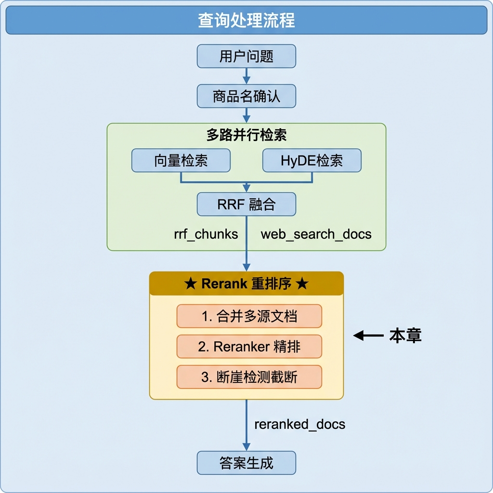
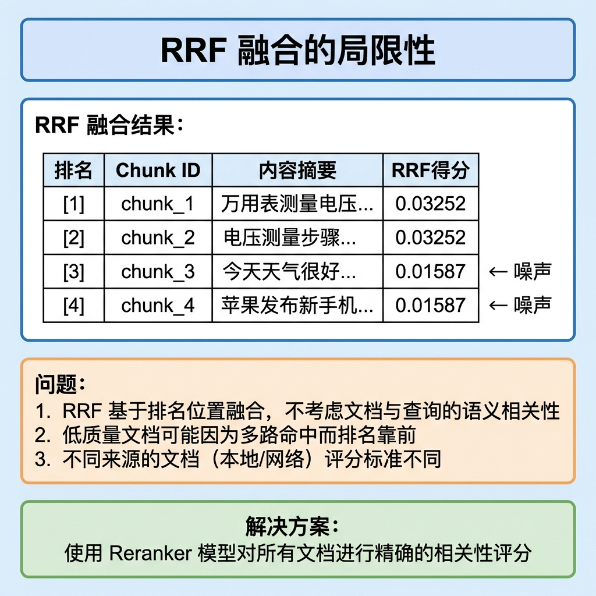
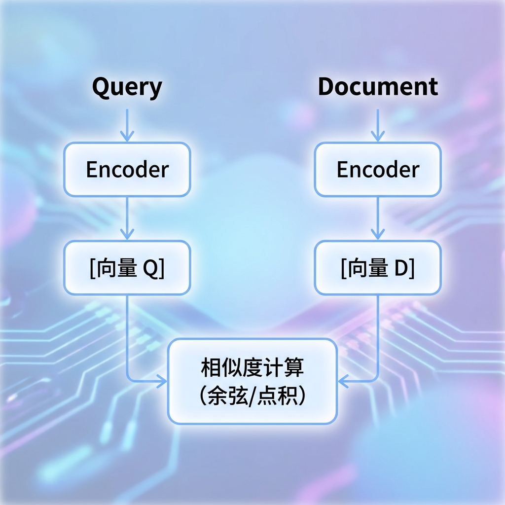
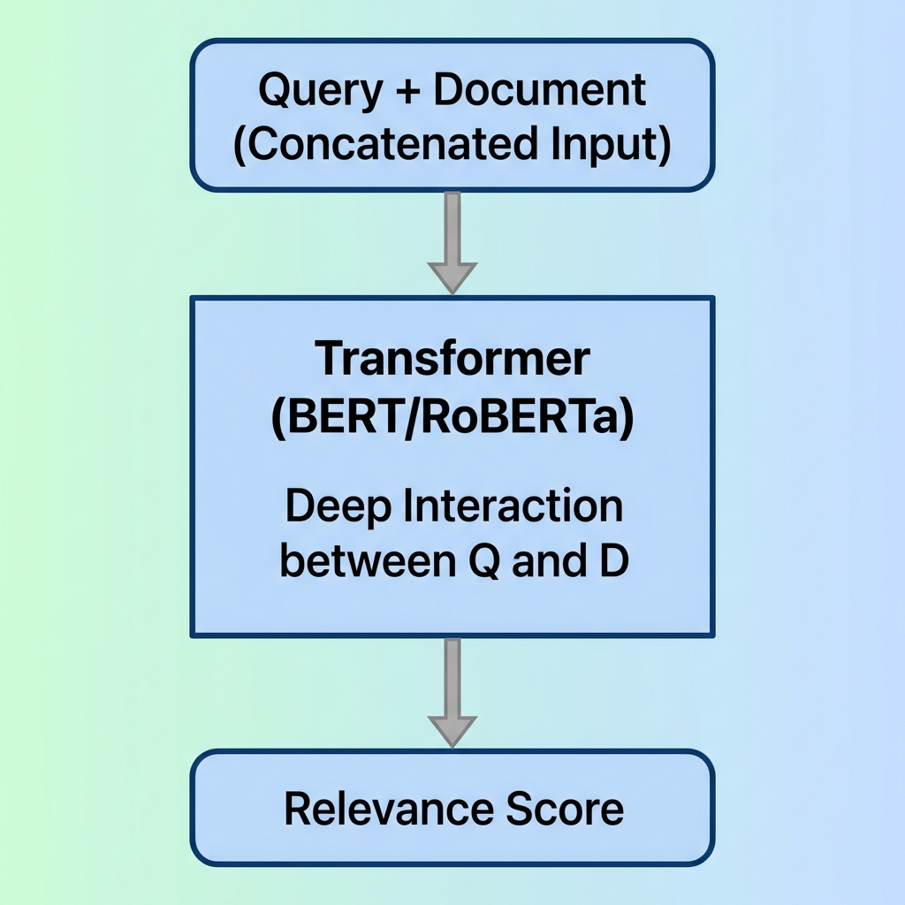
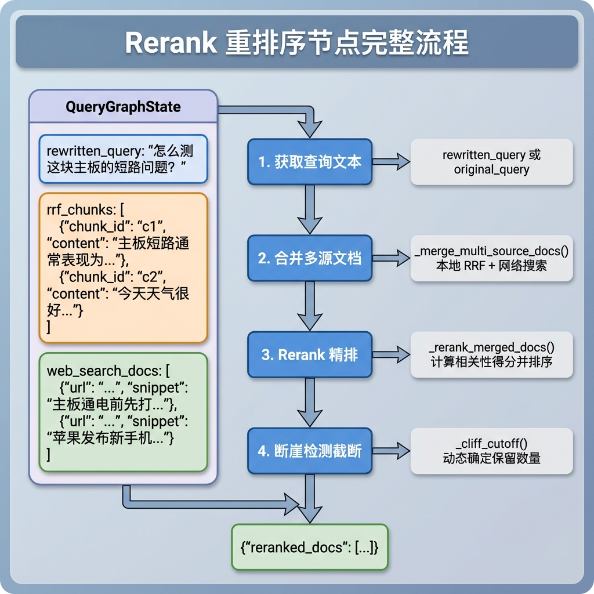
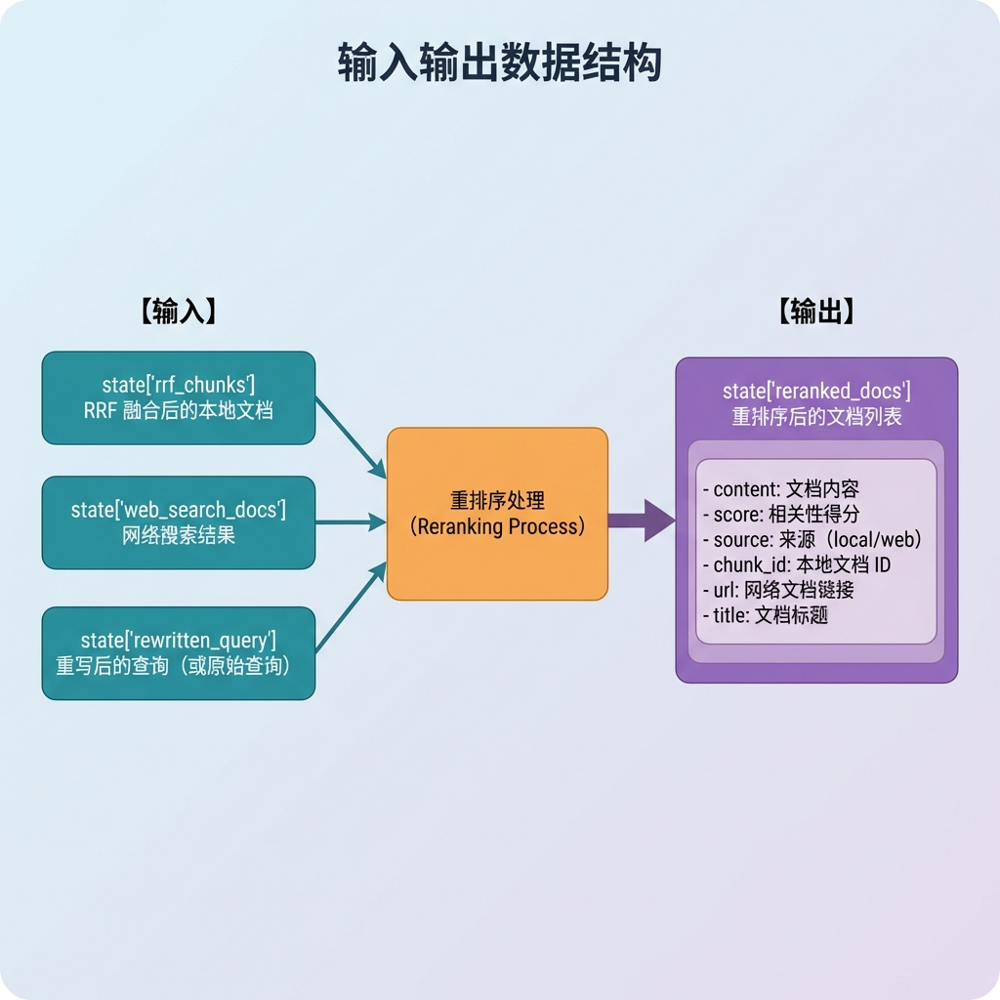
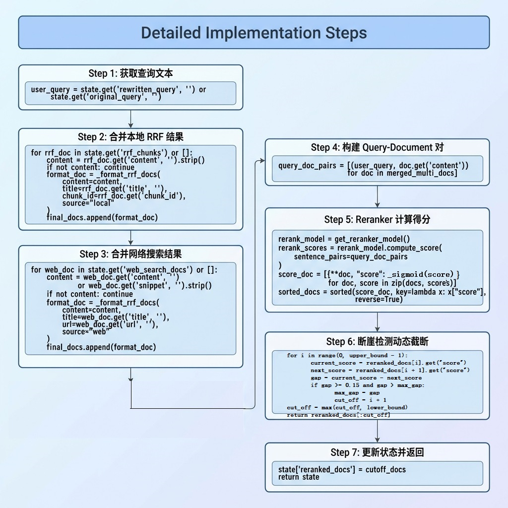
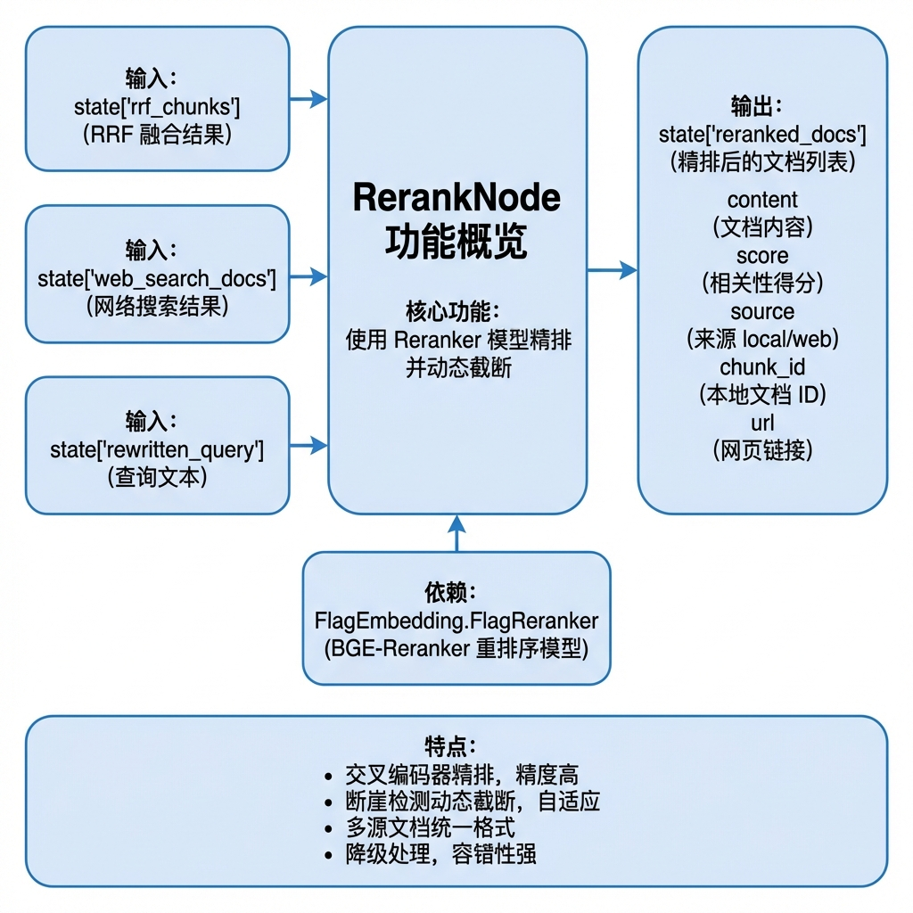
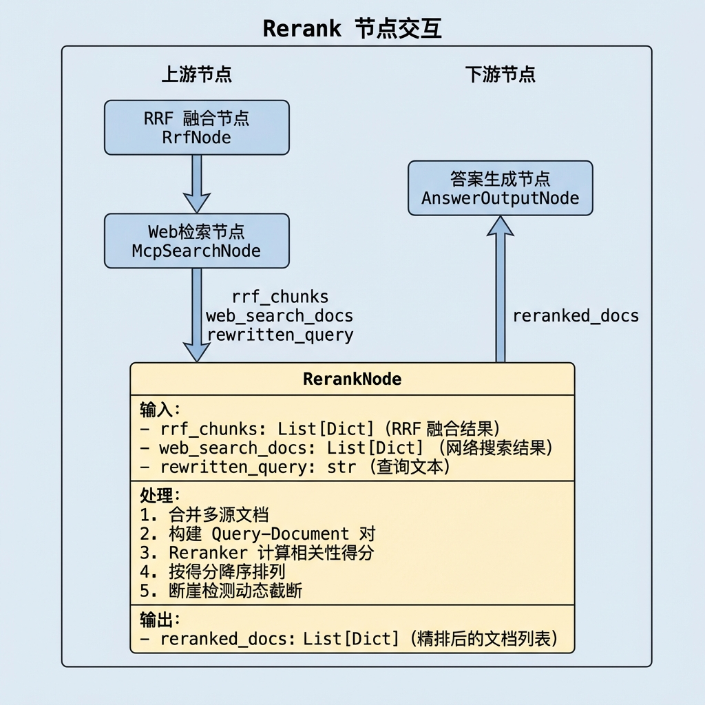

# 知识库查询 —— Rerank 重排序节点

> 本文档详细介绍 Rerank 重排序节点（rerank_node）的设计与实现，该节点使用 Reranker 模型对 RRF 融合结果和网络搜索结果进行精排，并通过**断崖检测算法**实现动态 TopK 截断。

---

## 1. 任务目标

### 1.1 本章目标

通过本章学习，你将掌握：

1. **理解 Reranker 模型原理**：掌握交叉编码器与双塔模型的区别
2. **学会 BGE-Reranker 模型的使用**：使用 FlagReranker 计算相关性得分
3. **理解断崖检测算法**：理解为什么要进行断崖检测
4. **掌握断崖检测的优化**：最大断崖检测、绝对分数底线、单文档防护
5. **掌握多源文档格式统一**：合并本地 RRF 结果和网络搜索结果
6. **实现可测试的重排序节点**：通过 `if __name__ == "__main__"` 验证节点功能

### 1.2 涉及文件

```
knowledge/processor/query_process/
├── nodes/
│   └── rerank_node.py            # Rerank 重排序节点（本章重点）
├── state.py                       # 状态定义
├── base.py                        # 基类定义
└── config.py                      # 配置参数

knowledge/utils/
└── bge_rerank_util.py             # BGE-Reranker 模型工具
```

### 1.3 节点在流程中的位置



---

## 2. 核心概念扫盲

### 2.1 为什么需要重排序？

RRF 融合虽然合并了多路检索结果，但存在局限性：

```
RRF 的局限：
─────────────────────────────────────────────
1. RRF 只看排名不看语义，无法判断文档是否真正回答了问题
2. 网络搜索结果没有经过 RRF，需要和本地结果统一评估
3. RRF 输出可能混杂相关与不相关的文档，需要进一步筛选
```

**为什么网络搜索结果不参与 RRF，而是在 Rerank 阶段才加入？**

RRF 的前提是多路结果之间可以通过 `chunk_id` 去重和投票。二路本地检索（向量、HyDE）查的都是同一个 Milvus 切片库，同一个 `chunk_id` 可能被多路同时命中，RRF 就是靠这个"多路共识"来排序的。而网络搜索结果来自外部网页，每条都是独立的 URL，跟本地切片没有任何重叠，放进 RRF 永远只有单路命中，拿不到多路投票的加分，排名会被压到最后，等于白加。

而 Reranker 不看排名也不看 `chunk_id`，它是把问题和每篇文档拼在一起过 Transformer，逐篇独立打分。不管文档来自本地还是网络，只要内容跟问题相关，就能拿到高分。所以网络搜索结果在 Reranker 阶段加入是合适的，能和本地文档站在同一个评分体系下公平竞争。

一句话总结：**RRF 靠 chunk_id 投票，网络结果没法投；Reranker 靠语义打分，网络结果能参与。**




**重排序的作用：**

- 使用专门的相关性模型进行精排
- 统一评估所有来源的文档（本地 + 网络）
- 过滤低质量文档，提高答案生成质量

### 2.2 双塔模型 vs 交叉编码器

检索系统中有两种主流的文本匹配架构：

#### 双塔模型（Bi-Encoder）



**特点：**

- Query 和 Document 独立编码
- Document 向量可预计算存储
- 速度快，适合召回阶段
- 交互信息有限，精度一般

#### 交叉编码器（Cross-Encoder）



**特点：**

- Query 和 Document 联合编码
- 充分捕获交互信息
- 精度高，适合精排阶段
- 速度慢，无法预计算

> **为什么叫"交叉"？** 不是因为 Q 和 D 成对输入，而是因为它们在 Transformer 内部的 Attention 层**互相交叉注意**。Q 和 D 被拼成一个序列 `[CLS] Q [SEP] D [SEP]` 一起喂进 Transformer，在每一层 Self-Attention 中，Q 的每个 token 都能 attend 到 D 的每个 token，D 也能 attend 到 Q 的每个 token，Q 和 D 的信息在每一层都在交叉流动。双塔模型中 Q 和 D 各编各的，最后才见面算相似度；交叉编码器中 Q 和 D 从第一层开始就在双向交互，所以精度更高。

> **`[CLS]` 和 `[SEP]` 是什么？** 它们是 BERT 系列模型预定义的特殊标记符。`[CLS]`（Classification）放在序列开头，它对应的输出向量被当作整个序列的"汇总表示"，Reranker 最终的相关性分数就是从这个位置算出来的。`[SEP]`（Separator）是分隔符，告诉模型"这里是两段文本的边界"，模型看到 `[SEP]` 就知道前面是 Q、后面是 D。
>
> ```
> [CLS] 怎么 测 主板 短路 [SEP] 主板 短路 用 蜂鸣 档 测量 [SEP]
> ↑                       ↑                                ↑
> 汇总位                Q和D的分界                        序列结束
> ↓
> 最终从这里输出相关性分数
> ```
>
> 简单理解：`[CLS]` 是"给我一个总分"的占位符，`[SEP]` 是"问题到这里结束，文档从这里开始"的分隔线。

**Reranker 模型就是交叉编码器！** 它把问题和文档拼在一起输入 Transformer，让模型充分理解两者之间的语义关系，输出一个相关性分数。

### 2.3 BGE-Reranker 模型

我们使用的 **BGE-Reranker-Large** 是智源研究院开源的中英双语重排序模型：

下载模型：

```python
#test_bge_rerank_model.py
from modelscope import snapshot_download

local_dir = snapshot_download(model_id="BAAI/bge-reranker-large",
              local_dir="D:\\ai_models\\modelscope_cache\\models\\BAAI\\bge-reranker-large")

print(local_dir)
```

模型测试：

```python
from FlagEmbedding import FlagReranker

reranker = FlagReranker(
    model_name_or_path="BAAI/bge-reranker-large",
    #model_name_or_path="D:\\ai_models\\modelscope_cache\\models\\BAAI\\bge-reranker-large",
    device="cuda",      # GPU 加速
    use_fp16=True       # 半精度推理
)

# 计算相关性得分
pairs = [
    ["什么是万用表？", "万用表是一种测量电压、电流、电阻的仪器"],
    ["什么是万用表？", "今天天气很好"]
]
scores = reranker.compute_score(pairs)
# 输出: [0.9234, 0.0156]  高分 = 高相关
```

**模型特性：**

| 特性     | 说明                     |
| -------- | ------------------------ |
| 基座模型 | XLM-RoBERTa-Large        |
| 参数量   | 560M                     |
| 输入长度 | 最大 512 tokens          |
| 输出     | 相关性分数（越高越相关） |
| 支持语言 | 中英双语                 |

### 2.4 断崖检测算法（深入理解）

#### 2.4.1 为什么要进行断崖检测？

重排序后需要决定保留多少文档。传统做法是固定 TopK，但这不够灵活。

**固定 TopK=5 的问题：**

```
情况 1：前 3 篇高度相关，后 2 篇噪声
得分: [0.95, 0.92, 0.88, 0.12, 0.08]
                        ↑
                  应该在这里截断

固定取 5 篇就把 2 篇垃圾文档也塞给了 LLM，这些噪声会干扰生成质量。

────────────────────────────────────────────

情况 2：前 7 篇都相关
得分: [0.95, 0.91, 0.87, 0.83, 0.79, 0.75, 0.71]
                              ↑
                        固定截断会丢失有价值内容

固定取 5 篇就丢掉了 2 篇同样有价值的文档。
```

**断崖检测的核心目的：**

自动决定保留多少篇文档送给 LLM 生成答案，而不是用一个固定的 top_k 一刀切。

#### 2.4.2 断崖检测的思路

**寻找得分"断崖式下跌"的位置，在那里截断。**

```
断崖检测示例：

得分: [0.95, 0.92, 0.88, 0.12, 0.08]
差值:      0.03   0.04   0.76   0.04
                         ↑
                   断崖！在此截断

结果: 保留前 3 篇
```

#### 2.4.3 断崖检测公式

```python
# 相邻得分差（绝对差距）
gap = current_score - next_score

# 满足两个条件即为断崖
if gap >= self.config.rerank_gap_abs and gap > max_gap:
    max_gap = gap
    cutoff_pos = i + 1
```

**参数说明：**

- `gap`：分数差值
- `rerank_gap_abs`：分数差值阈值（默认 0.15  适当调节）
- `min_top_k`：最少保留数量（默认 3）
- `max_top_k`：最多保留数量（默认 10）
- `max_gap`：最大断崖差值

---

## 3. 断崖检测的核心

断崖检测存在几个问题，我们进行了优化：

### 3.1 最大断崖检测

**问题：**找到第一个满足条件的断崖就停止，但可能不是最优位置。我们是找到最大断崖处。讨论：哪种更合理？

```
得分: [6.0, 5.8, 5.7, 3.2, 3.0, 0.1]
位置: [1]   [2]  [3]  [4]  [5]  [6]

从位置 0 开始扫描：
位置 3→4: abs_gap = 5.7 - 3.2 = 2.5，满足条件，立即截断

但实际上位置 5→6 的断崖更明显：
位置 5→6: abs_gap = 3.0 - 0.1 = 2.9（更大的断崖！）
```

**优化方案：** 遍历整个扫描范围，找到**跌幅最大**的位置截断。

```python
# 遍历整个扫描范围，找到最大跌幅的位置
cut_off = upper_bound
max_gap = 0.0

for i in range(0, upper_bound - 1):
    current_score = reranked_docs[i].get("score")
    next_score = reranked_docs[i + 1].get("score")

    if current_score is None or next_score is None:
        continue

    # 分数差值
   gap = current_score - next_score

   if gap >= self.config.rerank_gap_abs and gap > max_gap:
      max_gap = gap
      cut_off = i + 1
```

### 3.2 compute_score 单文档防护

**问题：** 部分 reranker 模型在只有一篇文档时返回 `float` 而非 `list`。

```python
# 多篇文档时
reranker.compute_score([(Q, D1), (Q, D2)])  # 返回 [0.95, 0.87]

# 单篇文档时
reranker.compute_score([(Q, D1)])          # 返回 6.255（float！）
```

如果不处理，后续 `zip(merged_multi_docs, rerank_scores)` 会报错。

**优化方案：** 统一处理为 `list`。

```python
# 计算相关性得分
rerank_scores = rerank_model.compute_score(sentence_pairs=query_doc_content_pairs)

# 单文档防护：统一处理为 list
if isinstance(rerank_scores, (float, int)):
    rerank_scores = [rerank_scores]

# 后续可以安全使用 zip
# _sigmoid(score)  做归一化处理
score_doc = [{**doc, "score": self._sigmoid(score)} for doc, score in zip(merged_multi_docs, rerank_scores)]
```

### 3.3 分数归一化处理,更好排序，断崖处理

```python
@staticmethod #避免实例方法调用时第一个参数传入self
def _sigmoid(score: float) -> float:
    """sigmoid归一化，将( -∞ , +∞ )   映射到 （0,1）
        exp(x) 就是以自然常数 e=2.71828 为底的指数函数
        exp(10) ≈ 22026  →  1 / (1 + 22026) ≈ 0.0000454  ≈ 0
        exp(-10) ≈ 0.0000454  →  1 / (1 + 0.0000454) ≈ 0.99995  ≈ 1
    """
    return 1.0 / (1.0 + math.exp(-score))
```

### 3.4完整逻辑

```python
def _cliff_catoff(self, reranked_docs: List[Dict[str, Any]]) -> List[
    Dict[str, Any]]:
    """断崖检测动态截断
    扫描所有相邻文档分数差，找到最大落差位置进行截断，
    同时保证至少返回 lower_bound 个文档。

    参数:
        reranked_docs: 按分数降序排列的文档列表
        rerank_min_top_k: 最少返回文档数
        rerank_max_top_k: 最多返回文档数

    返回值:
        截断后的文档列表
    """
    upper_bound = min(self.config.rerank_max_top_k, len(reranked_docs))
    lower_bound = min(self.config.rerank_min_top_k, upper_bound)

    if upper_bound <= 1:
        return reranked_docs[:upper_bound]

    cut_off = upper_bound
    max_gap = 0.0

    for i in range(0, upper_bound - 1):
        current_score = reranked_docs[i].get("score")
        next_score = reranked_docs[i + 1].get("score")

        if current_score is None or next_score is None:
            continue

        # 分数差值
        gap = current_score - next_score

        if gap >= self.config.rerank_gap_abs and gap > max_gap:
            max_gap = gap
            cut_off = i + 1
            self.logger.info(f"位置{cut_off}发生断崖，gap={gap:.4f}")
    # 兜底：不管断崖在哪，至少保留lower_bound个
    cut_off = max(cut_off, lower_bound)
    return reranked_docs[:cut_off] #左闭开区间：包含起始位置，不包含结束位置
```

---

## 4. 重排序业务处理流程（总）

### 4.1 整体流程图



### 4.2 节点输入输出



---

## 5. 重排序业务处理流程（分）

### 5.1 目标

实现一个重排序节点，将 RRF 融合结果和网络搜索结果统一精排，并通过**断崖检测**动态筛选最相关的文档。

### 5.2 需求分析

| 需求项       | 说明                                     |
| ------------ | ---------------------------------------- |
| **多源合并** | 合并本地 RRF 结果和网络搜索结果          |
| **格式统一** | 不同来源的文档统一为相同结构             |
| **精确排序** | 使用 Reranker 模型计算相关性得分         |
| **动态截断** | 通过优化版断崖检测自动确定保留数量       |
| **降级处理** | Reranker 失败时返回原序，score 设为 None |
| **来源追溯** | 保留文档来源标识（local/web）            |

### 5.3 实现流程

#### 5.3.1 实现流程图



#### 5.3.2 具体实现步骤

##### Step 1: 获取查询文本

**目的：** 从状态中获取用于重排序的查询文本。

**代码片段：**

```python
def process(self, state: QueryGraphState) -> QueryGraphState:
    # 1. 获取 query
    user_query = state.get('rewritten_query', '') or state.get('original_query', '')
```

**为什么优先使用 rewritten_query？**

```
原始查询: "这块主板怎么修？"
重写查询: "主板维修方法和常见故障排查步骤"

重写后的查询更完整，与文档的匹配效果更好。
```

---

##### Step 2: 合并多源文档

**目的：** 遍历 RRF 融合结果和网络搜索结果，转换为统一格式。

**代码片段：**

```python
def _merge_multi_source_docs(self, state: QueryGraphState) -> List[Dict[str, Any]]:
    """
    合并本地 RRF 文档和 Web 搜索文档，统一格式
    """
    final_docs = []

    # 1. 获取本地 RRF 的文档
    for rrf_doc in (state.get('rrf_chunks') or []):
        if not isinstance(rrf_doc, dict):
            continue

        content = rrf_doc.get('content', '').strip()
        if not content:
            continue

        title = rrf_doc.get('title', '').strip()
        chunk_id = rrf_doc.get('chunk_id')

        format_rrf_doc = self._format_rrf_docs(
            content=content, title=title, chunk_id=chunk_id, source="local"
        )
        final_docs.append(format_rrf_doc)

    # 2. 获取 web 远程的文档
    for web_doc in (state.get('web_search_docs') or []):
        if not isinstance(web_doc, dict):
            continue

        content = web_doc.get('content', '') or web_doc.get('snippet', '').strip()
        if not content:
            continue

        title = web_doc.get('title', '').strip()
        url = web_doc.get('url', '').strip()

        format_web_doc = self._format_rrf_docs(
            content=content, title=title, url=url, source="web"
        )
        final_docs.append(format_web_doc)

    self.logger.info(f"收集到准备进行 Rerank 精排的文档 {len(final_docs)}")
    return final_docs
```

**统一文档结构：**

```python
def _format_rrf_docs(self, content: str, title: str = "", chunk_id=None,
                     url: str = "", source: str = "") -> Dict[str, Any]:
    """构建统一的文档结构"""
    return {
        "content": content,      # 文档内容（必填）
        "title": title,          # 标题
        "chunk_id": chunk_id,    # 本地文档 ID
        "url": url,              # 网页链接（仅 web）
        "source": source         # 来源: local / web
    }
```

---

##### Step 3: Reranker 计算得分

**目的：** 构建 Query-Document 对，调用 Reranker 模型计算相关性得分。

**代码片段：**

增加客户端：

```python
    #AIClients.py
    """
    BGE-M3重排序模型客户端：
    """
    _bge_m3_rerank_client: Optional[FlagReranker] = None
    _bge_m3_rerank_lock = threading.Lock()

    @classmethod
    def get_bge_m3_rerank_client(cls) -> FlagReranker:
        return cls._get_or_create("_bge_m3_rerank_client", cls._bge_m3_rerank_lock, cls._create_bge_m3_rerank_client)

    @classmethod
    def _create_bge_m3_rerank_client(cls) -> FlagReranker:
        try:
            model_name_or_path = cls._require_env("BGE_RERANKER_LARGE")
            device = cls._require_env("BGE_DEVICE")
            fp16_str = cls._require_env("BGE_FP16")
            fp16 = fp16_str.lower() in ("true","1")

            reranker = FlagReranker(
                model_name_or_path=model_name_or_path,
                #model_name_or_path="D:\\ai_models\\modelscope_cache\\models\\BAAI\\bge-reranker-large",
                device=device,  # GPU 加速
                use_fp16=fp16  # 半精度推理
            )
            logger.info(f"bge_m3_rerank客户端初始化成功")
            return reranker
        except EnvironmentError:
            raise
        except Exception as e:
            logger.error(f"bge_m3_rerank客户端初始化失败:{e}")
            raise ConnectionError(f"bge_m3_rerank客户端创建失败:{e}") from e

```

Rerank精排：

```python
def _rerank_merged_docs(self, user_query: str, merged_multi_docs: List[Dict[str, Any]]) -> List[Dict[str, Any]]:
    """
    对合并后的多源文档进行 Rerank 精排

    Args:
        user_query: 用户输入的查询问题
        merged_multi_docs: 不同来源合并之后的文档

    Returns:
        按 rerank 分数降序排列的文档列表
    """
    # 1. 判断合并后的多源文档是否存在
    if not merged_multi_docs:
        return []

    # 2. 获取 reranker 模型
    rerank_model = AIClients.get_bge_m3_rerank_client()
    if rerank_model is None:
        self.logger.error("重排序模型获取失败")
        return []

    # 3. 构建 Q->D 的 pair 对
    query_doc_content_pairs = [(user_query, doc.get('content')) for doc in merged_multi_docs]

    try:
        # 4. 计算 rerank 分数
        rerank_scores = rerank_model.compute_score(sentence_pairs=query_doc_content_pairs)

        # ===== compute_score 单文档防护 =====
        if isinstance(rerank_scores, (float, int)):
            rerank_scores = [rerank_scores]

        # 5. 映射分数和文档
        score_doc = [{**doc, "score": self._sigmoid(score)} for doc, score in zip(merged_multi_docs, rerank_scores)]

        # 6. 排序并返回
        sorted_score_docs = sorted(score_doc, key=lambda x: x["score"], reverse=True)
        return sorted_score_docs

    except Exception as e:
        self.logger.error(f"Rerank 重排序失败: {str(e)}")
        return [{**doc, "score": None} for doc in merged_multi_docs]
```

**得分计算过程：**

```
Query: "怎么测这块主板的短路问题？"

文档 1: "主板短路通常表现为通电后风扇转一下就停..."
        → score = 0.9156 (高度相关)

文档 2: "主板通电前先打各主供电电感的对地阻值..."
        → score = 0.8823 (相关)

文档 3: "测量电压时，将旋钮转到V档位..."
        → score = 0.4521 (部分相关)

文档 4: "苹果发布新款手机..."
        → score = 0.0234 (不相关)
```

---

##### Step 4: 断崖检测动态截断

**目的：** 从 0 位置开始检测得分断崖，动态确定保留数量。

**完整代码片段：**

```python
def _cliff_catoff(self, reranked_docs: List[Dict[str, Any]]) -> List[
    Dict[str, Any]]:
    """断崖检测动态截断
    扫描所有相邻文档分数差，找到最大落差位置进行截断，
    同时保证至少返回 lower_bound 个文档。

    参数:
        reranked_docs: 按分数降序排列的文档列表
        rerank_min_top_k: 最少返回文档数
        rerank_max_top_k: 最多返回文档数

    返回值:
        截断后的文档列表
    """
    upper_bound = min(self.config.rerank_max_top_k, len(reranked_docs))
    lower_bound = min(self.config.rerank_min_top_k, upper_bound)

    if upper_bound <= 1:
        return reranked_docs[:upper_bound]

    cut_off = upper_bound
    max_gap = 0.0

    for i in range(0, upper_bound - 1):
        current_score = reranked_docs[i].get("score")
        next_score = reranked_docs[i + 1].get("score")

        if current_score is None or next_score is None:
            continue

        # 分数差值
        gap = current_score - next_score

        if gap >= self.config.rerank_gap_abs and gap > max_gap:
            max_gap = gap
            cut_off = i + 1
            self.logger.info(f"位置{cut_off}发生断崖，gap={gap:.4f}")
    # 兜底：不管断崖在哪，至少保留lower_bound个
    cut_off = max(cut_off, lower_bound)
    return reranked_docs[:cut_off] #左闭开区间：包含起始位置，不包含结束位置
```

---

##### Step 5: 更新状态并返回

**目的：** 将最终结果写入状态。

**代码片段：**

```python
# 4. 动态 Top_K 截取(断崖检测 + 绝对分数底线过滤)
cutoff_docs = self._cliff_cutoff(reranked_docs)

state['reranked_docs'] = cutoff_docs

return state
```

### 5.4 完整代码实现

```python
# knowledge/processor/query_process/nodes/rerank_node.py

"""Rerank 重排序节点

使用 Reranker 模型对 RRF 融合结果和网络搜索结果进行重排序，
并通过优化版断崖检测实现动态 TopK 截断。
"""

from typing import Dict, Any, List, Tuple
from knowledge.processor.query_process.state import QueryGraphState
from knowledge.processor.query_process.base import BaseNode, setup_logging, T
from knowledge.utils.client.ai_clients import AIClients


class RerankNode(BaseNode):
    """Rerank 重排序节点

    流程: 合并多源文档 → Reranker 计算相关性 → 断崖检测动态截断
    """
    name = "rerank_node"

    def process(self, state: QueryGraphState) -> QueryGraphState:
        """执行重排序"""
        # 1. 获取 query
        user_query = state.get('rewritten_query', '') or state.get('original_query', '')

        # 2. 合并多源文档
        merged_multi_docs: List[Dict[str, Any]] = self._merge_multi_source_docs(state)

        # 3. Rerank 精排
        reranked_docs: List[Dict[str, Any]] = self._rerank_merged_docs(user_query, merged_multi_docs)

        # 4. 动态 Top_K 截取(断崖检测 + 绝对分数底线过滤)
        cutoff_docs = self._cliff_cutoff(reranked_docs)

        state['reranked_docs'] = cutoff_docs
        return state

    def _cliff_catoff(self, reranked_docs: List[Dict[str, Any]]) -> List[
        Dict[str, Any]]:
        """断崖检测动态截断
        扫描所有相邻文档分数差，找到最大落差位置进行截断，
        同时保证至少返回 lower_bound 个文档。

        参数:
            reranked_docs: 按分数降序排列的文档列表
            rerank_min_top_k: 最少返回文档数
            rerank_max_top_k: 最多返回文档数

        返回值:
            截断后的文档列表
        """
        upper_bound = min(self.config.rerank_max_top_k, len(reranked_docs))
        lower_bound = min(self.config.rerank_min_top_k, upper_bound)

        if upper_bound <= 1:
            return reranked_docs[:upper_bound]

        cut_off = upper_bound
        max_gap = 0.0

        for i in range(0, upper_bound - 1):
            current_score = reranked_docs[i].get("score")
            next_score = reranked_docs[i + 1].get("score")

            if current_score is None or next_score is None:
                continue

            # 分数差值
            gap = current_score - next_score

            if gap >= self.config.rerank_gap_abs and gap > max_gap:
                max_gap = gap
                cut_off = i + 1
                self.logger.info(f"位置{cut_off}发生断崖，gap={gap:.4f}")
        # 兜底：不管断崖在哪，至少保留lower_bound个
        cut_off = max(cut_off, lower_bound)
        return reranked_docs[:cut_off] #左闭开区间：包含起始位置，不包含结束位置
    
    def _merge_multi_source_docs(self, state: QueryGraphState) -> List[Dict[str, Any]]:
        """合并本地 RRF 文档和 Web 搜索文档"""
        final_docs = []

        for rrf_doc in (state.get('rrf_chunks') or []):
            if not isinstance(rrf_doc, dict):
                continue
            content = rrf_doc.get('content', '').strip()
            if not content:
                continue
            title = rrf_doc.get('title', '').strip()
            chunk_id = rrf_doc.get('chunk_id')
            format_rrf_doc = self._format_rrf_docs(
                content=content, title=title, chunk_id=chunk_id, source="local"
            )
            final_docs.append(format_rrf_doc)

        for web_doc in (state.get('web_search_docs') or []):
            if not isinstance(web_doc, dict):
                continue
            content = web_doc.get('content', '') or web_doc.get('snippet', '').strip()
            if not content:
                continue
            title = web_doc.get('title', '').strip()
            url = web_doc.get('url', '').strip()
            format_web_doc = self._format_rrf_docs(
                content=content, title=title, url=url, source="web"
            )
            final_docs.append(format_web_doc)

        self.logger.info(f"收集到准备进行 Rerank 精排的文档 {len(final_docs)}")
        return final_docs

    def _format_rrf_docs(self, content: str, title: str = "", chunk_id=None,
                        url: str = "", source: str = "") -> Dict[str, Any]:
        return {
            "content": content,
            "title": title,
            "chunk_id": chunk_id,
            "url": url,
            "source": source
        }

    @staticmethod #避免实例方法调用时第一个参数传入self
    def _sigmoid(score: float) -> float:
        """归一化，将( -∞ , +∞ )   映射到 （0,1）
            exp(x) 就是以自然常数 e=2.71828 为底的指数函数
            exp(10) ≈ 22026  →  1 / (1 + 22026) ≈ 0.0000454  ≈ 0
            exp(-10) ≈ 0.0000454  →  1 / (1 + 0.0000454) ≈ 0.99995  ≈ 1
        """
        return 1.0 / (1.0 + math.exp(-score))
    
    def _rerank_merged_docs(self, user_query: str, merged_multi_docs: List[Dict[str, Any]]) -> List[Dict[str, Any]]:
        """使用 Reranker 模型对文档进行精排"""
        if not merged_multi_docs:
            return []

        rerank_client = AIClients.get_bge_m3_rerank_client()
        if rerank_client is None:
            self.logger.error("重排序模型获取失败")
            return []

        query_doc_content_pairs = [(user_query, doc.get('content')) for doc in merged_multi_docs]

        try:
            rerank_scores = rerank_client.compute_score(sentence_pairs=query_doc_content_pairs)

            # 单文档防护
            if isinstance(rerank_scores, (float, int)):
                rerank_scores = [rerank_scores]
            print(rerank_scores)  # [5.06640625, -4.7421875, 3.962890625, -9.4765625]

            # 没做归一化处理,用于测试比较
            score_docs1 = [{**doc, "score": score} for doc, score in zip(merged_multi_docs, rerank_scores)]
            print(f"没做归一化处理:{score_docs1}")

            # 归一化处理
            score_docs = [{**doc, "score": self._sigmoid(score)} for doc, score in
                          zip(merged_multi_docs, rerank_scores)]
            print(f"归一化处理:{score_docs}")

            sorted_score_docs = sorted(score_docs, key=lambda x: x["score"], reverse=True)
            print(f"排序后结果返回:{sorted_score_docs}")
            return sorted_score_docs

        except Exception as e:
            self.logger.error(f"Rerank 重排序失败: {str(e)}")
            return [{**doc, "score": None} for doc in merged_multi_docs]


# ================================================================== #
#                        测试入口                                   #
# ================================================================== #

if __name__ == "__main__":
    from dotenv import load_dotenv

    load_dotenv()
    setup_logging()

    print("=" * 60)
    print("开始测试: 重排序节点 (RerankNode)")
    print("=" * 60)

    mock_state = {
        "rewritten_query": "怎么测这块主板的短路问题？",
        "rrf_chunks": [
            {"chunk_id": "local_1", "title": "主板维修手册",
             "content": "主板短路通常表现为通电后风扇转一下就停，可以使用万用表的蜂鸣档测量。"},
            {"chunk_id": "local_2", "title": "闲聊",
             "content": "今天中午去吃猪脚饭吧，这块主板外观很漂亮。"},
        ],
        "web_search_docs": [
            {"url": "https://example.com/repair", "title": "短路查修指南",
             "snippet": "主板通电前先打各主供电电感的对地阻值，阻值偏低就是短路。"},
            {"url": "https://example.com/news", "title": "科技新闻",
             "snippet": "苹果发布新款手机，A系列芯片性能提升20%。"},
        ],
    }

    print("【输入状态】:")
    print(f"  查询: {mock_state['rewritten_query']}")
    print(f"  本地文档: {len(mock_state['rrf_chunks'])} 篇")
    print(f"  网络文档: {len(mock_state['web_search_docs'])} 篇")
    print("-" * 60)

    node = RerankNode()
    result = node.process(mock_state)

    print("\n【重排序结果】:")
    for i, doc in enumerate(result["reranked_docs"], 1):
        score = doc.get('score')
        score_str = f"{score:.4f}" if score is not None else "N/A"
        print(f"[{i}] score={score_str} | {doc['source']:5} | {doc['content'][:50]}...")

    print("-" * 60)
    print("测试完成")
```

---

## 6. 测试运行

### 6.1 运行重排序节点测试

```bash
# 进入项目目录
cd knowledge

# 激活虚拟环境
source .venv/bin/activate  # Linux/Mac
# 或
.venv\Scripts\activate     # Windows

# 运行测试
python -m knowledge.processor.query_process.nodes.rerank_node
```

### 6.2 预期输出

```
============================================================
开始测试: 重排序节点 (RerankNode)
============================================================
【输入状态】:
  查询: 怎么测这块主板的短路问题？
  本地文档: 2 篇
  网络文档: 2 篇
------------------------------------------------------------
2026-06-30 23:51:32 - query.rerank_node - INFO - 收集到准备Rerank精排的文档数量:4
2026-06-30 23:51:32 - query.rerank_node - INFO - 收集到准备Rerank精排的文档集合:[{'content': '主板短路通常表现为通电后风扇转一下就停，可以使用万用表的蜂鸣档测量。', 'title': '主板维修手册', 'chunk_id': 'local_1', 'url': <class 'str'>, 'source': 'local'}, {'content': '今天中午去吃猪脚饭吧，这块主板外观很漂亮。', 'title': '闲聊', 'chunk_id': 'local_2', 'url': <class 'str'>, 'source': 'local'}, {'content': '主板通电前先打各主供电电感的对地阻值，阻值偏低就是短路。', 'title': '短路查修指南', 'chunk_id': None, 'url': 'https://example.com/repair', 'source': 'web'}, {'content': '苹果发布新款手机，A系列芯片性能提升20%。', 'title': '科技新闻', 'chunk_id': None, 'url': 'https://example.com/news', 'source': 'web'}]
2026-06-30 23:51:34 - knowledge.utils.client.base - INFO - bge_m3_rerank客户端初始化成功
You're using a XLMRobertaTokenizerFast tokenizer. Please note that with a fast tokenizer, using the `__call__` method is faster than using a method to encode the text followed by a call to the `pad` method to get a padded encoding.

[5.06640625, -4.7421875, 3.962890625, -9.4765625]

没做归一化处理:[{'content': '主板短路通常表现为通电后风扇转一下就停，可以使用万用表的蜂鸣档测量。', 'title': '主板维修手册', 'chunk_id': 'local_1', 'url': <class 'str'>, 'source': 'local', 'score': 5.06640625}, 
{'content': '今天中午去吃猪脚饭吧，这块主板外观很漂亮。', 'title': '闲聊', 'chunk_id': 'local_2', 'url': <class 'str'>, 'source': 'local', 'score': -4.7421875}, 
{'content': '主板通电前先打各主供电电感的对地阻值，阻值偏低就是短路。', 'title': '短路查修指南', 'chunk_id': None, 'url': 'https://example.com/repair', 'source': 'web', 'score': 3.962890625}, 
{'content': '苹果发布新款手机，A系列芯片性能提升20%。', 'title': '科技新闻', 'chunk_id': None, 'url': 'https://example.com/news', 'source': 'web', 'score': -9.4765625}]

归一化处理:[{'content': '主板短路通常表现为通电后风扇转一下就停，可以使用万用表的蜂鸣档测量。', 'title': '主板维修手册', 'chunk_id': 'local_1', 'url': <class 'str'>, 'source': 'local', 'score': 0.993734466224161}, 
{'content': '今天中午去吃猪脚饭吧，这块主板外观很漂亮。', 'title': '闲聊', 'chunk_id': 'local_2', 'url': <class 'str'>, 'source': 'local', 'score': 0.008644177936723585}, 
{'content': '主板通电前先打各主供电电感的对地阻值，阻值偏低就是短路。', 'title': '短路查修指南', 'chunk_id': None, 'url': 'https://example.com/repair', 'source': 'web', 'score': 0.9813464782682386}, 
{'content': '苹果发布新款手机，A系列芯片性能提升20%。', 'title': '科技新闻', 'chunk_id': None, 'url': 'https://example.com/news', 'source': 'web', 'score': 7.662101864956481e-05}]

排序后结果返回:[{'content': '主板短路通常表现为通电后风扇转一下就停，可以使用万用表的蜂鸣档测量。', 'title': '主板维修手册', 'chunk_id': 'local_1', 'url': <class 'str'>, 'source': 'local', 'score': 0.993734466224161}, 
{'content': '主板通电前先打各主供电电感的对地阻值，阻值偏低就是短路。', 'title': '短路查修指南', 'chunk_id': None, 'url': 'https://example.com/repair', 'source': 'web', 'score': 0.9813464782682386}, 
{'content': '今天中午去吃猪脚饭吧，这块主板外观很漂亮。', 'title': '闲聊', 'chunk_id': 'local_2', 'url': <class 'str'>, 'source': 'local', 'score': 0.008644177936723585}, 
{'content': '苹果发布新款手机，A系列芯片性能提升20%。', 'title': '科技新闻', 'chunk_id': None, 'url': 'https://example.com/news', 'source': 'web', 'score': 7.662101864956481e-05}]

【重排序结果】:
[1] score=0.9937 | local | 主板短路通常表现为通电后风扇转一下就停，可以使用万用表的蜂鸣档测量。...
[2] score=0.9813 | web   | 主板通电前先打各主供电电感的对地阻值，阻值偏低就是短路。...
[3] score=0.0086 | local | 今天中午去吃猪脚饭吧，这块主板外观很漂亮。...
------------------------------------------------------------
测试完成
Disconnected from server
2026-06-30 23:51:39 - query.rerank_node - INFO - 位置2发生断崖，gap=0.9727
```

### 6.3 处理前后对比

| 对比项       | 处理前                | 处理后              |
| ------------ | --------------------- | ------------------- |
| **文档数量** | 4 篇（rrf 2 + web 2） | 2 篇（断崖截断）    |
| **排序依据** | RRF 位置 / 搜索顺序   | Reranker 相关性得分 |
| **文档格式** | 不统一                | 统一结构            |
| **来源标识** | 无                    | source: local/web   |
| **相关性**   | 混杂相关与不相关      | 仅保留高相关文档    |

**数据结构变化：**

```python
# 处理前
state = {
    "rrf_chunks": [
        {"chunk_id": "local_1", "content": "主板短路..."},
        {"chunk_id": "local_2", "content": "今天中午..."},
    ],
    "web_search_docs": [
        {"url": "...", "snippet": "主板通电前..."},
        {"url": "...", "snippet": "苹果发布..."},
    ]
}

# 处理后
state = {
    ...,
    "reranked_docs": [
        {
            "content": "主板短路通常表现为...",
            "score": 0.993734466224161,
            "source": "local",
            "chunk_id": "local_1",
            "title": "主板维修手册",
            "url": ""
        },
        {
            "content": "主板通电前先打各主供电...",
            "score": 0.9813464782682386,
            "source": "web",
            "chunk_id": None,
            "title": "短路查修指南",
            "url": "https://example.com/repair"
        }
    ]
}
```

---

## 7. 总结

### 7.1 节点功能概览



### 7.2 断崖检测优化总结

| 优化项                  | 问题                              | 解决方案                             |
| ----------------------- | --------------------------------- | ------------------------------------ |
| **优化1：最大断崖检测** | 第一个断崖不一定是最优位置        | 遍历整个扫描范围，找到跌幅最大的位置 |
| **优化2：单文档防护**   | 单文档时 compute_score 返回 float | 统一处理为 list                      |

### 7.3 配置参数说明

```python
# knowledge/processor/query_process/config.py

class QueryConfig:
    # Rerank 相关配置
    rerank_max_top_k: int = 10     # 最多保留文档数
    rerank_min_top_k: int = 3      # 最少保留文档数
    rerank_gap_abs: float = 0.15    # 断崖检测绝对阈值
```

| 参数               | 默认值 | 说明                 |
| ------------------ | ------ | -------------------- |
| `rerank_max_top_k` | 10     | 最多保留的文档数量   |
| `rerank_min_top_k` | 3      | 最少保留的文档数量   |
| `rerank_gap_abs`   | 0.15   | 断崖检测绝对差值阈值 |

### 7.5 节点交互图

