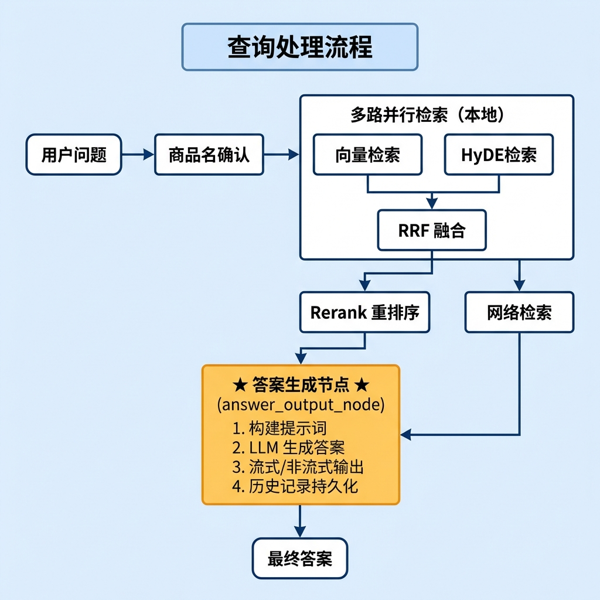
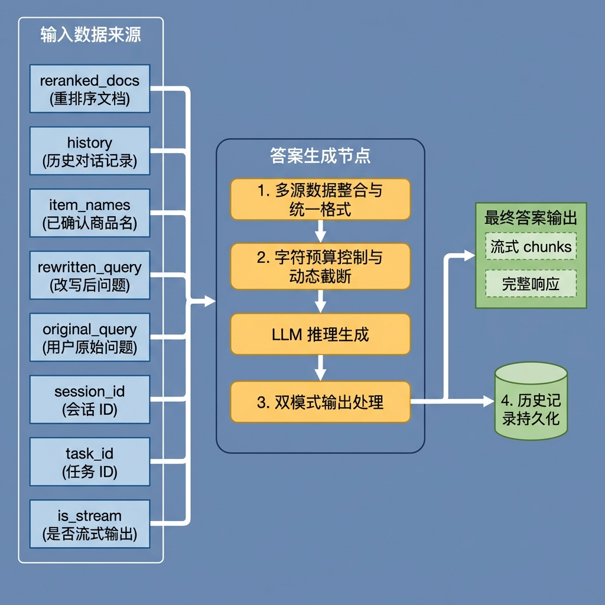
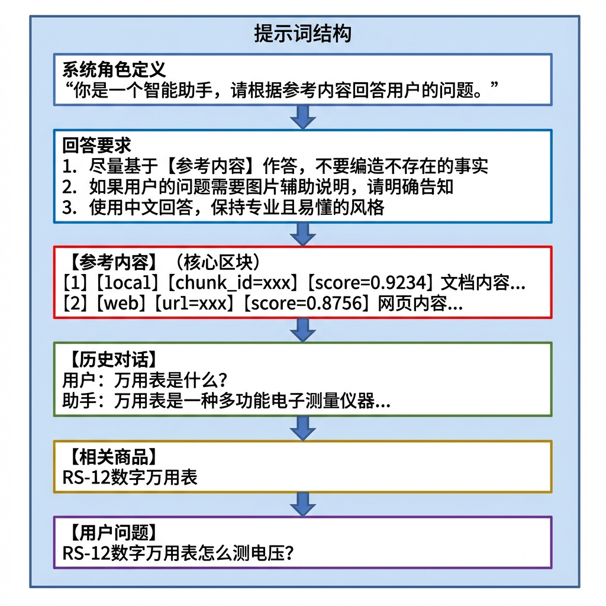
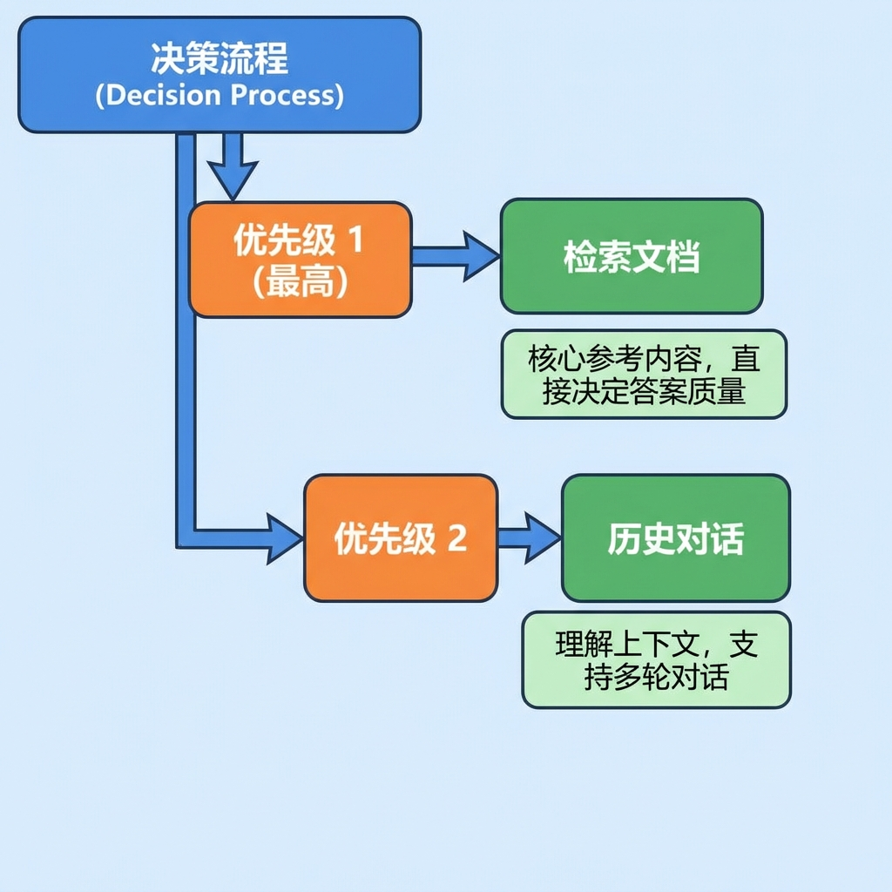
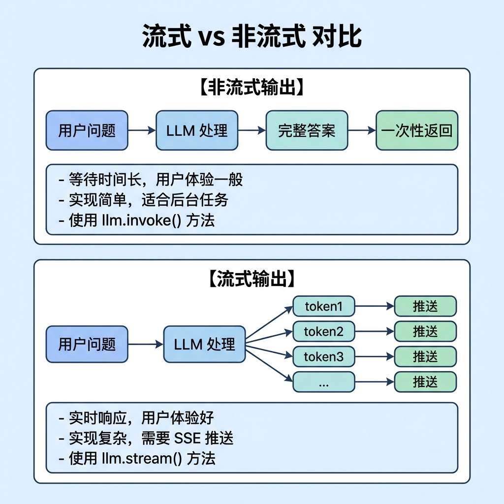
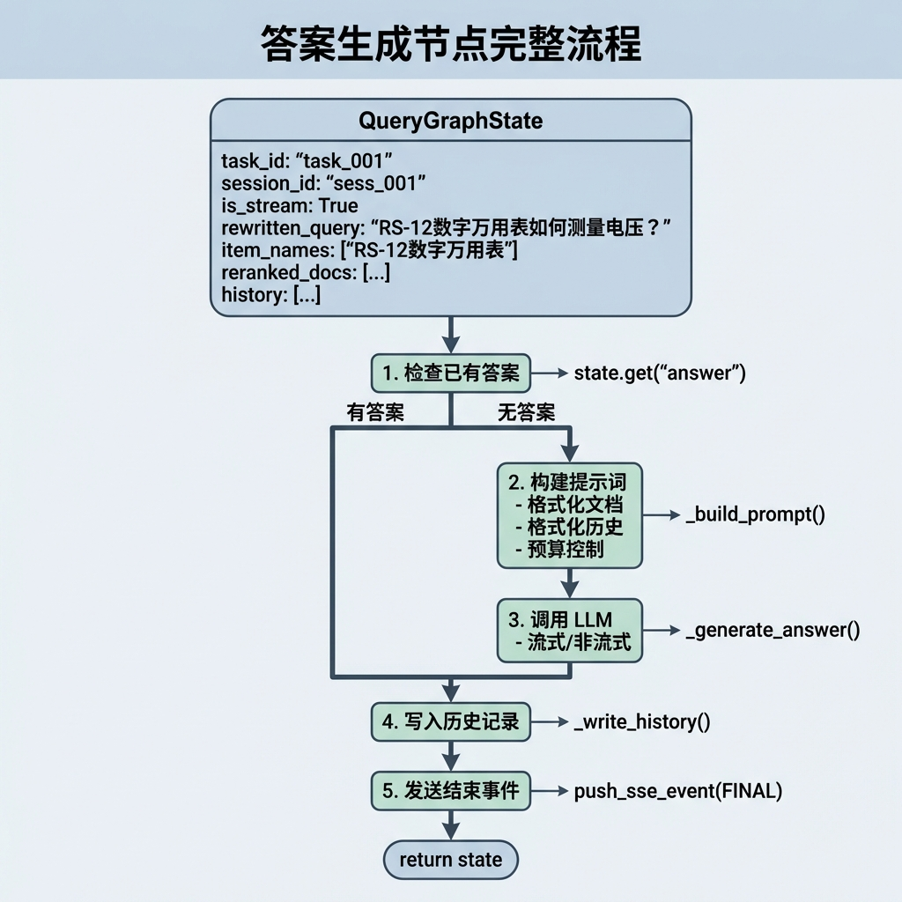
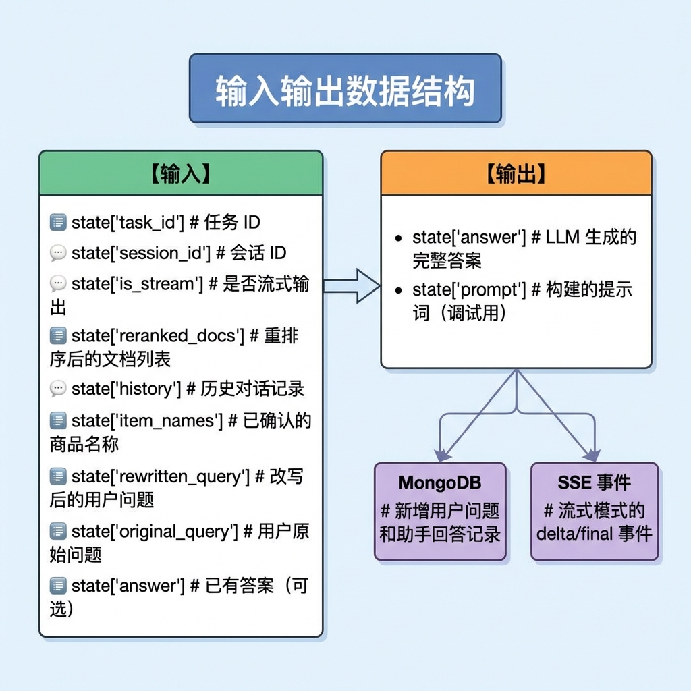
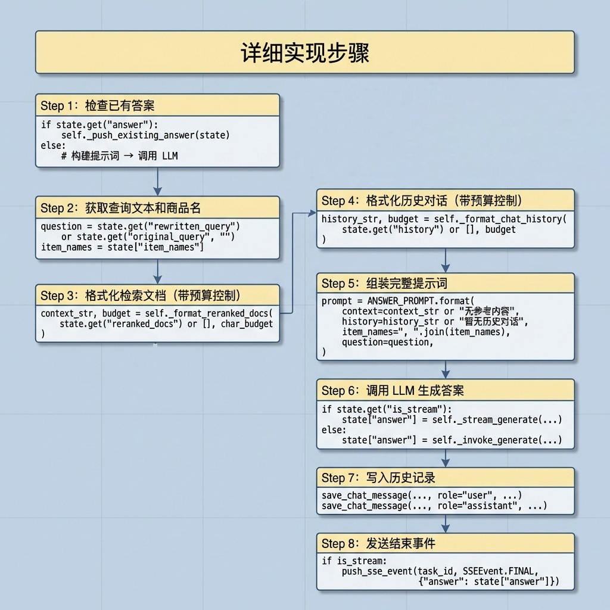
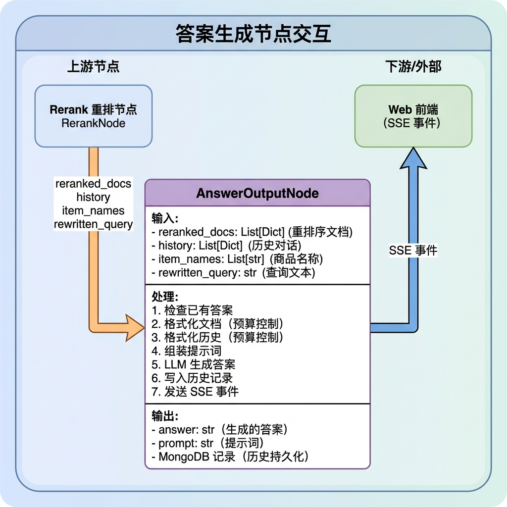

# 知识库查询 —— 答案生成节点

> 本文档详细介绍答案生成节点（answer_output_node）的设计与实现，该节点是整个查询流程的终点，负责将检索到的上下文、历史对话组装成提示词，调用 LLM 生成最终答案，并支持流式输出和历史记录持久化。

---

## 1. 任务目标

### 1.1 本章目标

通过本章学习，你将掌握：

1. **理解答案生成的复杂度**：掌握多源信息整合的设计思路
2. **学会提示词工程**：使用模板组装结构化提示词
3. **掌握字符预算控制**：实现 Context Budget 技术
4. **理解流式输出实现**：SSE（Server-Sent Events）事件推送
5. **实现可测试的答案生成节点**：通过 `if __name__ == "__main__"` 验证节点功能

### 1.2 涉及文件

```
knowledge/processor/query_process/
├── nodes/
│   └── answer_output_node.py     # 答案生成节点（本章重点）
├── state.py                       # 状态定义
├── base.py                        # 基类定义
└── config.py                      # 配置参数

knowledge/prompts/query/
└── query_prompt.py                # 提示词模板（ANSWER_PROMPT）

knowledge/utils/
├── client/ai_clients.py           # LLM 客户端工具
├── sse_util.py                    # SSE 事件推送工具
├── task_util.py                   # 任务结果管理工具
└── mongo_history_util.py          # MongoDB 历史对话工具
```

### 1.3 节点在流程中的位置



---

## 2. 核心概念扫盲

### 2.1 为什么答案生成是最复杂的节点？

答案生成节点需要整合整个查询流程的所有结果：



### 2.2 提示词工程要点

提示词的质量直接决定答案的质量。本系统的提示词包含以下几个区块：



### 2.3 字符预算控制

LLM 有输入长度限制，需要控制提示词总长度：

```python
# 总字符预算
budget = config.max_context_chars  # 默认 12000

# 依次分配给各区块
context_str, budget = self._format_reranked_docs(docs, budget)     # 文档优先
history_str, budget = self._format_chat_history(history, budget)   # 历史次之
```

**预算分配策略：**



### 2.4 流式输出 vs 非流式输出



### 2.5 SSE 事件类型

```python
class SSEEvent:
    READY = "ready"         # 连接建立
    PROGRESS = "progress"   # 任务节点进度
    DELTA = "delta"         # LLM 流式输出增量
    FINAL = "final"         # 最终完整答案
    ERROR = "error"         # 错误信息
```

**事件流示例：**

```
event: ready
data: {}

event: delta
data: {"delta": "根据"}

event: delta
data: {"delta": "参考内容"}

event: delta
data: {"delta": "，万用表"}

... (更多增量)

event: final
data: {"answer": "根据参考内容，万用表测量电压的步骤...", "status": "completed"}
```

---

## 3. 答案生成业务处理流程（总）

### 3.1 整体流程图



### 3.2 节点输入输出



---

## 4. 答案生成业务处理流程（分）

### 4.1 目标

实现一个答案生成节点，将检索结果组装成提示词，调用 LLM 生成答案，支持流式输出并持久化历史记录。

### 4.2 需求分析

| 需求项         | 说明                                |
| -------------- | ----------------------------------- |
| **多源整合**   | 整合文档、历史、商品名等多种上下文  |
| **预算控制**   | 控制提示词总长度，避免超出 LLM 限制 |
| **流式支持**   | 支持边生成边推送，提升用户体验      |
| **降级处理**   | LLM 调用失败时返回友好错误信息      |
| **历史持久化** | 将答案写入 MongoDB 供后续对话使用   |
| **已有答案**   | 支持跳过生成直接输出已有答案        |

### 4.3 实现流程

#### 4.3.1 实现流程图



#### 4.3.2 具体实现步骤

##### Step 1: 检查已有答案

**目的：** 某些情况下（如商品确认提示），答案已在前置节点生成，直接推送即可。

**代码片段：**

```python
def process(self, state: QueryGraphState) -> QueryGraphState:
    task_id = state.get("task_id")
    is_stream = state.get("is_stream")

    # 1. 已有答案 → 直接返回
    if state.get("answer"):
        self._push_existing_answer(state)

    # 2. 构建提示词 → 调用 LLM 生成答案
    else:
        prompt = self._build_prompt(state)
        state["prompt"] = prompt
        self._generate_answer(state, prompt)

    # ...
```

**已有答案的推送逻辑：**

```python
def _push_existing_answer(self, state: QueryGraphState):
    """非流式模式：存入任务结果；流式模式：让 FINAL 统一推送。"""
    if not state.get("is_stream"):
        set_task_result(state["task_id"], "answer", state["answer"])
```

---

##### Step 2: 获取查询文本和商品名

**目的：** 从状态中提取用于提示词的查询文本和商品名称。

**代码片段：**

```python
def _build_prompt(self, state: QueryGraphState) -> str:
    char_budget = self.config.max_context_chars

    # 1. 获取问题和商品名
    question = state.get("rewritten_query") or state.get("original_query", "")
    item_names = state["item_names"]
```

**优先级说明：**

- `rewritten_query`：经过商品名确认节点重写的完整查询
- `original_query`：用户原始输入（降级选项）

---

##### Step 3: 格式化检索文档

**目的：** 将重排序后的文档格式化为提示词文本，带字符预算控制。

**代码片段：**

```python
def _format_reranked_docs(self, reranked_docs: List[Dict], char_budget: int) -> Tuple[str, int]:
    """格式化重排序文档，带字符预算控制"""
    formatted_lines = []
    used_chars = 0

    for idx, doc in enumerate(reranked_docs, 1):
        content = doc.get("content", "").strip()
        if not content:
            continue

        # 构建元信息标签
        meta_tags = [f"[{idx}]"]
        for field, template in [
            ("source", "[source={}]"),
            ("chunk_id", "[chunk_id={}]"),
            ("url", "[url={}]"),
            ("title", "[title={}]"),
        ]:
            field_value = str(doc.get(field, "")).strip()
            if field_value:
                meta_tags.append(template.format(field_value))

        # 添加相关性得分
        relevance_score = doc.get("score")
        if relevance_score is not None:
            meta_tags.append(f"[score={float(relevance_score):.4f}]")

        # 组合元信息和内容
        doc_entry = " ".join(meta_tags) + "\n" + content

        # 检查预算
        if used_chars + len(doc_entry) > char_budget:
            break

        formatted_lines.append(doc_entry)
        used_chars += len(doc_entry) + 2

    return "\n\n".join(formatted_lines), char_budget - used_chars
```

**格式化结果示例：**

```
[1] [source=local] [chunk_id=chunk_001] [title=万用表使用手册] [score=0.9234]
数字万用表测量电压的步骤：首先将旋钮转到V档位，然后将黑色表笔插入COM孔...

[2] [source=web] [url=https://example.com/guide] [title=电压测量指南] [score=0.8756]
使用万用表测量直流电压时，需要注意选择合适的量程...
```

---

##### Step 4: 格式化历史对话

**目的：** 将历史对话格式化为提示词文本。

**代码片段：**

```python
def _format_chat_history(self, chat_history: List[Dict], char_budget: int) -> Tuple[str, int]:
    """格式化历史对话"""
    formatted_lines = []
    used_chars = 0

    role_label_map = {"user": "用户", "assistant": "助手"}

    for message in chat_history:
        role = message.get("role", "")
        text = message.get("text", "")
        if not text or role not in role_label_map:
            continue

        formatted_line = f"{role_label_map[role]}: {text}"

        # 检查预算
        if used_chars+len(formatted_line) > char_budget:
            return break

        formatted_lines.append(formatted_line)
        used_chars += len(formatted_line) + 1
    return "\n".join(formatted_lines), char_budget - used_chars
```

**格式化结果示例：**

```
用户: 万用表怎么测电压？
助手: 测量电压时，首先需要选择合适的档位...
用户: 如果量程选错了会怎样？
助手: 如果量程选择过小，可能会损坏万用表...
```

---

##### Step 5: 组装完整提示词

**目的：** 使用模板组装完整的 LLM 提示词。

**代码片段：**

```python
def _build_prompt(self, state: QueryGraphState) -> str:
    char_budget = self.config.max_context_chars

    question = state.get("rewritten_query") or state.get("original_query", "")
    item_names = state["item_names"]

    # 格式化各部分内容
    context_str, char_budget = self._format_reranked_docs(
        state.get("reranked_docs") or [], char_budget
    )
    history_str, char_budget = self._format_chat_history(
        state.get("history") or [], char_budget
    )

    # 组装提示词
    return ANSWER_PROMPT.format(
        context=context_str or "无参考内容",
        history=history_str if history_str else "暂无历史对话",
        item_names=", ".join(item_names),
        question=question,
    )
```

**完整提示词示例：**

```
你是一个智能助手，请根据参考内容回答用户的问题。
要求：
1 尽量基于【参考内容】作答，不要编造不存在的事实。
2 如果用户的问题需要通过图片来辅助说明...

【参考内容】
[1] [source=local] [chunk_id=chunk_001] [score=0.9234]
数字万用表测量电压的步骤...

[2] [source=web] [url=https://example.com] [score=0.8756]
使用万用表测量直流电压时...

【历史对话】
用户: 万用表是什么？
助手: 万用表是一种多功能电子测量仪器...

【相关商品】
RS-12数字万用表

【用户问题】
RS-12数字万用表怎么测电压？

请回答：
```

---

##### Step 6: 调用 LLM 生成答案

**目的：** 根据模式选择流式或非流式生成。

**代码片段：**

```python
def _generate_answer(self, state, prompt):
    """调用 LLM 生成答案（流式/非流式）"""
    self.log_step("generate", "生成答案")
    llm_client = AIClients.get_llm_openai()
    if llm_client is None:
        raise ValueError("LLM 客户端初始化失败")

    task_id = state["task_id"]

    if state.get("is_stream"):
        state["answer"] = self._stream_generate(llm_client, prompt, task_id)
    else:
        state["answer"] = self._invoke_generate(prompt)
        set_task_result(task_id, "answer", state["answer"])
```

**非流式生成实现：**

```python
def _invoke_generate(self, prompt: str) -> str:
    """非流式生成"""
    self.log_step("generate", "生成答案")
    llm_client = AIClients.get_llm_openai()
    if llm_client is None:
        raise ValueError("LLM 客户端初始化失败")

    try:
        response = llm_client.invoke(prompt)
        return response.content
    except Exception as e:
        self.logger.error(f"生成回答出错: {e}")
        return "抱歉，生成回答时出现错误。"
```

**流式生成实现：**

```python
def _stream_generate(self, llm_client, prompt, task_id):
    """流式生成，逐 chunk 推送 delta 事件"""
    accumulated_answer = ""
    try:
        for chunk in llm_client.stream(prompt):
            delta_text = getattr(chunk, "content", "") or ""
            if delta_text:
                accumulated_answer += delta_text
                push_sse_event(task_id, "delta", {"delta": delta_text})
    except Exception as e:
        self.logger.error(f"流式生成出错: {e}")
    return accumulated_answer
```

---

##### Step 7: 写入历史记录

**目的：** 将用户问题和助手回答持久化到 MongoDB。

**代码片段：**

```python
def _write_history(self, state: QueryGraphState):
    """将用户问题和助手回答写入 MongoDB 历史记录"""
    session_id = state["session_id"]
    rewritten_query = state.get("rewritten_query", "") or state.get("original_query", "")
    item_names = state.get("item_names") or []

    try:
        # 1. 写用户问题
        save_chat_message(
            session_id=session_id,
            role="user",
            text=state["original_query"],
            rewritten_query=rewritten_query,
            item_names=item_names,
        )

        # 2. 写助手回复
        if state.get("answer"):
            save_chat_message(
                session_id=session_id,
                role="assistant",
                text=state["answer"],
                rewritten_query=rewritten_query,
                item_names=item_names,
            )
    except Exception as e:
        self.logger.warning(f"写入历史记录失败: {e}")
```

**MongoDB 记录结构：**

```json
{
    "session_id": "sess_001",
    "role": "assistant",
    "text": "根据参考内容，RS-12数字万用表测量电压的步骤如下...",
    "item_names": ["RS-12数字万用表"],
    "timestamp": "2024-01-15T10:30:00Z"
}
```

---

##### Step 8: 发送结束事件

**目的：** 流式模式下发送最终完成事件。

**代码片段：**

```python
# 流式模式发送结束事件
if is_stream:
    push_sse_event(
        task_id,
        SSEEvent.FINAL,
        {"answer": state.get("answer", "")}
    )

return state
```

### 4.4 代码实现

以下是完整的节点实现代码：

```python
# knowledge/processor/query_process/nodes/answer_output_node.py

"""答案输出节点

组装提示词、调用 LLM 生成答案，支持流式/非流式输出，写入历史记录。
"""

from typing import List, Dict, Any, Tuple

from knowledge.processor.query_process.base import BaseNode
from knowledge.processor.query_process.state import QueryGraphState
from knowledge.prompts.query.query_prompt import ANSWER_PROMPT
from knowledge.utils.client.ai_clients import AIClients
from knowledge.utils.task_util import set_task_result
from knowledge.utils.sse_util import push_sse_event, SSEEvent
from knowledge.utils.mongo_history_util import save_chat_message


class AnswerOutputNode(BaseNode):
    """答案输出节点

    流程: 检查已有答案 → 构建提示词 → LLM 生成 → 写入历史 → 发送结束事件
    """
    name = "answer_output_node"

    def process(self, state: QueryGraphState) -> QueryGraphState:
        """执行答案生成

        Args:
            state: 需包含 task_id、session_id、reranked_docs 等

        Returns:
            更新后的 state，包含 answer 和 prompt
        """
        task_id = state.get("task_id")
        is_stream = state.get("is_stream")

        # 1. 已有答案 → 直接返回
        if state.get("answer"):
            self._push_existing_answer(state)

        # 2. 构建提示词 → 调用 LLM 生成答案
        else:
            prompt = self._build_prompt(state)
            state["prompt"] = prompt
            self._generate_answer(state, prompt)

        # 3. 写入历史记录
        self._write_history(state)

        # 4. 流式模式发送结束事件
        if is_stream:
            push_sse_event(task_id, SSEEvent.FINAL,
                           {"answer": state.get("answer", "")})
        return state

    # ================================================================== #
    #                    已有答案推送                                       #
    # ================================================================== #

    def _push_existing_answer(self, state: QueryGraphState):
        """非流式模式：存入任务结果；流式模式：让 FINAL 统一推送。"""
        if not state.get("is_stream"):
            set_task_result(state["task_id"], "answer", state["answer"])

    # ================================================================== #
    #                    提示词构建                                         #
    # ================================================================== #

    def _build_prompt(self, state: QueryGraphState) -> str:
        """根据检索结果、历史对话组装 LLM 提示词"""
        char_budget = self.config.max_context_chars

        # 1. 获取问题和商品名
        question = state.get("rewritten_query") or state.get("original_query", "")
        item_names = state["item_names"]

        # 2. 格式化上下文文档
        context_str, char_budget = self._format_reranked_docs(
            state.get("reranked_docs") or [], char_budget
        )

        # 3. 格式化历史对话
        history_str, char_budget = self._format_chat_history(
            state.get("history") or [], char_budget
        )

        # 5. 组装提示词
        return ANSWER_PROMPT.format(
            context=context_str or "无参考内容",
            history=history_str if history_str else "暂无历史对话",
            item_names=", ".join(item_names),
            question=question,
        )

    def _format_reranked_docs(self, reranked_docs: List[Dict], char_budget: int) -> Tuple[str, int]:
        """格式化重排序文档，带字符预算控制"""
        formatted_lines = []
        used_chars = 0

        for idx, doc in enumerate(reranked_docs, 1):
            content = doc.get("content", "").strip()
            if not content:
                continue

            meta_tags = [f"[{idx}]"]
            for field, template in [
                ("source", "[source={}]"),
                ("chunk_id", "[chunk_id={}]"),
                ("url", "[url={}]"),
                ("title", "[title={}]"),
            ]:
                field_value = str(doc.get(field, "")).strip()
                if field_value:
                    meta_tags.append(template.format(field_value))

            relevance_score = doc.get("score")
            if relevance_score is not None:
                meta_tags.append(f"[score={float(relevance_score):.4f}]")

            doc_entry = " ".join(meta_tags) + "\n" + content

            if used_chars + len(doc_entry) > char_budget:
                break

            formatted_lines.append(doc_entry)
            used_chars += len(doc_entry) + 2

        return "\n\n".join(formatted_lines), char_budget - used_chars

    def _format_chat_history(self, chat_history: List[Dict], char_budget: int) -> Tuple[str, int]:
        """格式化历史对话"""
        formatted_lines = []
        used_chars = 0

        role_label_map = {"user": "用户", "assistant": "助手"}

        for message in chat_history:
            role = message.get("role", "")
            text = message.get("text", "")
            if not text or role not in role_label_map:
                continue

            formatted_line = f"{role_label_map[role]}: {text}"

            if used_chars+len(formatted_line) > char_budget:
                return break

            formatted_lines.append(formatted_line)
            used_chars += len(formatted_line) + 1
            
        return "\n".join(formatted_lines), char_budget - used_chars

    # ================================================================== #
    #                    LLM 生成                                         #
    # ================================================================== #

    def _generate_answer(self, state, prompt):
        """调用 LLM 生成答案（流式/非流式）"""
        self.log_step("generate", "生成答案")
        llm_client = AIClients.get_llm_openai(False)
        if llm_client is None:
            raise ValueError("LLM 客户端初始化失败")

        task_id = state["task_id"]

        if state.get("is_stream"):
            state["answer"] = self._stream_generate(llm_client, prompt, task_id)
        else:
            state["answer"] = self._invoke_generate(llm_client, prompt)
            set_task_result(task_id, "answer", state["answer"])

    def _invoke_generate(self, llm_client, prompt: str) -> str:
        """非流式生成"""
        self.log_step("generate", "生成答案")

        try:
            response = llm_client.invoke(prompt)
            return response.content
        except Exception as e:
            self.logger.error(f"生成回答出错: {e}")
            return "抱歉，生成回答时出现错误。"

    def _stream_generate(self, llm_client, prompt, task_id):
        """流式生成，逐 chunk 推送 delta 事件"""
        accumulated_answer = ""
        try:
            for chunk in llm_client.stream(prompt):
                delta_text = getattr(chunk, "content", "") or ""
                if delta_text:
                    accumulated_answer += delta_text
                    push_sse_event(task_id, "delta", {"delta": delta_text})
        except Exception as e:
            self.logger.error(f"流式生成出错: {e}")
        return accumulated_answer

    # ================================================================== #
    #                    历史记录                                           #
    # ================================================================== #

    def _write_history(self, state: QueryGraphState):
        """将用户问题和助手回答写入 MongoDB 历史记录"""
        session_id = state["session_id"]
        rewritten_query = state.get("rewritten_query", "") or state.get("original_query", "")
        item_names = state.get("item_names") or []

        try:
            # 1. 写用户问题
            save_chat_message(
                session_id=session_id,
                role="user",
                text=state["original_query"],
                rewritten_query=rewritten_query,
                item_names=item_names,
            )
            # 2. 写助手回复
            if state.get("answer"):
                save_chat_message(
                    session_id=session_id,
                    role="assistant",
                    text=state["answer"],
                    rewritten_query=rewritten_query,
                    item_names=item_names,
                )
        except Exception as e:
            self.logger.warning(f"写入历史记录失败: {e}")
```

---

## 5. 测试运行

### 5.1 运行答案生成节点测试

```bash
# 进入项目目录
cd knowledge

# 激活虚拟环境
source .venv/bin/activate  # Linux/Mac
# 或
.venv\Scripts\activate     # Windows

# 运行测试
python -m knowledge.processor.query_process.nodes.answer_output_node
```

### 5.2 测试代码

```python
if __name__ == "__main__":
    from dotenv import load_dotenv
    import json

    load_dotenv()

    from knowledge.processor.query_process.base import setup_logging
    setup_logging()

    print("=" * 60)
    print("开始测试: 答案生成节点 (AnswerOutputNode)")
    print("=" * 60)

    # 构造模拟状态
    mock_state = {
        "task_id": "test_task_001",
        "session_id": "test_session_001",
        "is_stream": False,
        "original_query": "万用表怎么测电压？",
        "rewritten_query": "RS-12数字万用表如何测量电压？",
        "item_names": ["RS-12数字万用表"],
        "reranked_docs": [
            {
                "content": "数字万用表测量电压步骤：1. 将旋钮转到V档位；2. 黑表笔插COM孔，红表笔插V孔；3. 将表笔并联到被测点两端。",
                "source": "local",
                "chunk_id": "chunk_001",
                "title": "万用表使用手册",
                "score": 0.9234
            },
            {
                "content": "测量直流电压时需注意正负极性，红表笔接正极，黑表笔接负极。",
                "source": "web",
                "url": "https://example.com/guide",
                "title": "电压测量指南",
                "score": 0.8756
            }
        ],
        "history": [
            {"role": "user", "text": "万用表是什么？"},
            {"role": "assistant", "text": "万用表是一种多功能电子测量仪器..."}
        ],
    }

    print("【输入状态】:")
    print(f"  query: {mock_state['rewritten_query']}")
    print(f"  item_names: {mock_state['item_names']}")
    print(f"  reranked_docs: {len(mock_state['reranked_docs'])} 篇")
    print("-" * 60)

    # 执行答案生成
    node = AnswerOutputNode()
    result = node.process(mock_state)

    # 打印结果
    print("\n【生成结果】:")
    print("-" * 60)
    print(result.get("answer", "无答案"))
    print("-" * 60)

    print("\n测试完成")
```

### 5.3 预期输出

```
============================================================
开始测试: 答案生成节点 (AnswerOutputNode)
============================================================
【输入状态】:
  query: RS-12数字万用表如何测量电压？
  item_names: ['RS-12数字万用表']
  reranked_docs: 2 篇
------------------------------------------------------------
[answer_output_node] [generate] 生成答案

【生成结果】:
------------------------------------------------------------
根据参考内容，RS-12数字万用表测量电压的步骤如下：

1. **选择档位**：将旋钮转到V档位（直流电压选DCV，交流电压选ACV）

2. **连接表笔**：
   - 黑色表笔插入COM孔
   - 红色表笔插入V孔

3. **进行测量**：将两只表笔并联到被测点两端

4. **注意事项**：
   - 测量直流电压时注意正负极性
   - 红表笔接正极，黑表笔接负极
------------------------------------------------------------

测试完成
```

### 5.4 处理前后对比

| 对比项      | 处理前       | 处理后                     |
| ----------- | ------------ | -------------------------- |
| `answer`    | 不存在或为空 | LLM 生成的完整答案         |
| `prompt`    | 不存在       | 组装好的完整提示词         |
| MongoDB     | 无记录       | 新增用户问题和助手回答记录 |
| SSE（流式） | 无事件       | DELTA + FINAL 事件         |

---

## 6. 总结

### 6.1 节点功能概览

```
┌────────────────────────────────────────┐
│                      AnswerOutputNode 功能概览                           │
├───────────────────────────────────────┤
│                                                                         │
│   核心功能: 组装提示词、调用 LLM 生成答案、支持流式输出                    │
│                                                                         │
│   输入:                                                                  │
│     ├── task_id              任务 ID                                   │
│     ├── session_id           会话 ID                                   │
│     ├── is_stream            是否流式输出                               │
│     ├── reranked_docs        重排序后的文档列表                          │
│     ├── history              历史对话记录                               │
│     ├── item_names           已确认的商品名称                            │
│     └── rewritten_query      改写后的用户问题                            │
│                                                                         │
│   输出:                                                                 │
│     ├── answer               LLM 生成的完整答案                         │
│     ├── prompt               构建的提示词（调试用）                      │
│     ├── MongoDB              历史记录持久化                             │
│     └── SSE 事件             流式模式的事件推送                          │
│                                                                         │
│   特点:                                                                 │
│     ├── 多源信息整合                                                   │
│     ├── 字符预算控制                                                   │
│     ├── 流式/非流式双模式支持                                           │
│     └── 历史记录持久化                                                 │
│                                                                        │
└─────────────────────────────────────────┘
```

### 6.2 节点设计要点

**1. 字符预算控制**

```python
budget = config.max_context_chars  # 12000

# 依次分配，优先级递减
context_str, budget = self._format_reranked_docs(docs, budget)
history_str, budget = self._format_chat_history(history, budget)
```

**设计思路：**

- 检索文档是核心参考，优先级最高
- 历史对话提供上下文理解，优先级次之
- 预算用尽后自动截断，保证不超限

**2. 流式与非流式统一处理**

```python
if state.get("is_stream"):
    state["answer"] = self._stream_generate(llm_client, prompt, task_id)
else:
    state["answer"] = self._invoke_generate(prompt)
```

**两种模式的差异：**

| 模式   | API          | 输出方式          | 适用场景     |
| ------ | ------------ | ----------------- | ------------ |
| 流式   | llm.stream() | SSE 逐 chunk 推送 | Web 实时交互 |
| 非流式 | llm.invoke() | 任务结果一次返回  | 后台任务/API |

**3. 已有答案的处理**

```python
# 商品确认节点可能已生成提示答案
if state.get("answer"):
    self._push_existing_answer(state)  # 直接推送，跳过 LLM
else:
    prompt = self._build_prompt(state)
    self._generate_answer(state, prompt)  # 正常生成流程
```

**场景示例：**

- 用户问题中有多个可能的商品名
- 商品确认节点生成澄清提示："请问您是指 A 还是 B？"
- 答案生成节点直接推送此提示，无需调用 LLM

**4. 降级与容错**

```python
def _invoke_generate(self, prompt: str) -> str:
    try:
        response = llm_client.invoke(prompt)
        return response.content
    except Exception as e:
        self.logger.error(f"生成回答出错: {e}")
        return "抱歉，生成回答时出现错误。"  # 友好错误信息
```

### 6.3 配置参数说明

```python
# knowledge/processor/query_process/config.py

class QueryConfig:
    # 答案生成相关配置
    max_context_chars: int = 12000  # 提示词最大字符数
```

| 参数                | 默认值 | 说明                 |
| ------------------- | ------ | -------------------- |
| `max_context_chars` | 12000  | 提示词最大字符数限制 |

### 6.4 节点交互图

