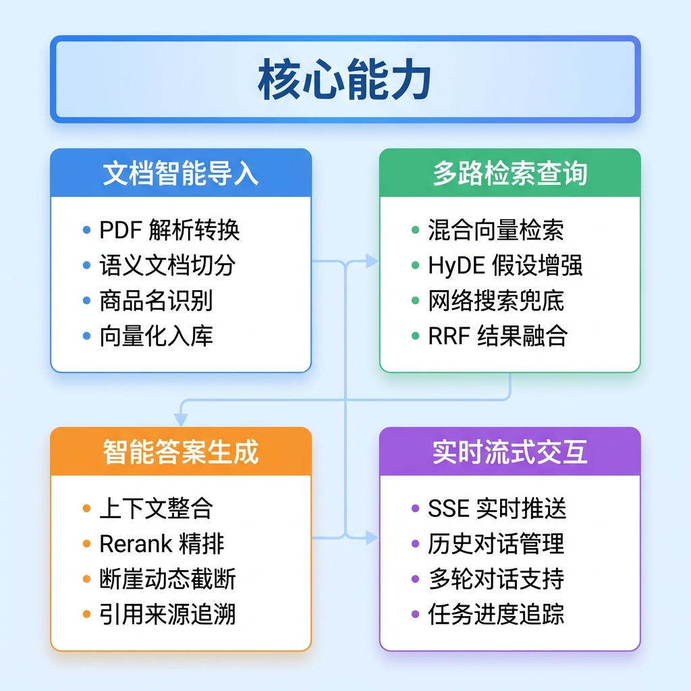
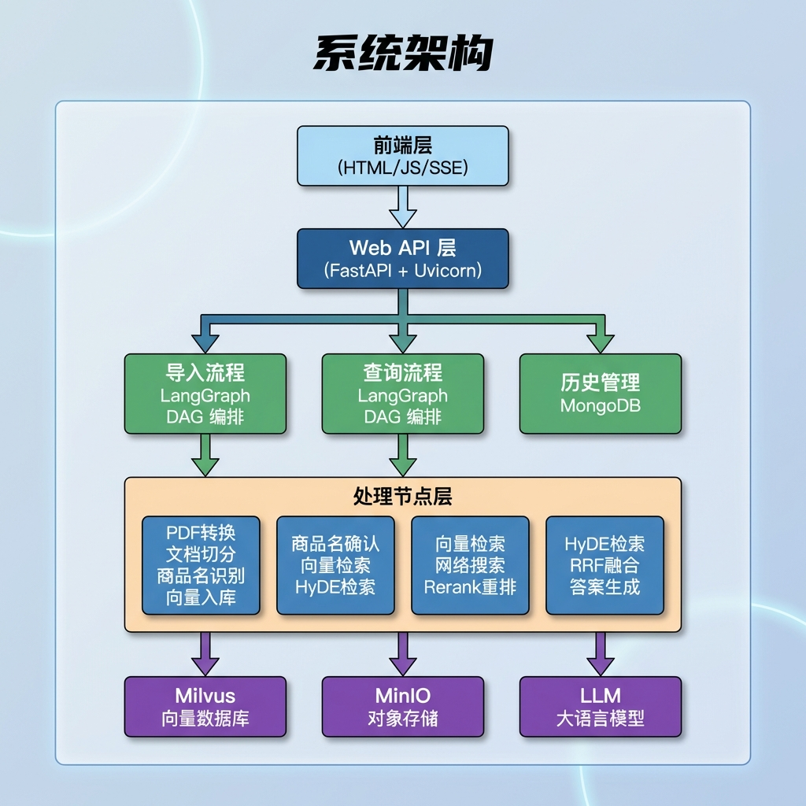
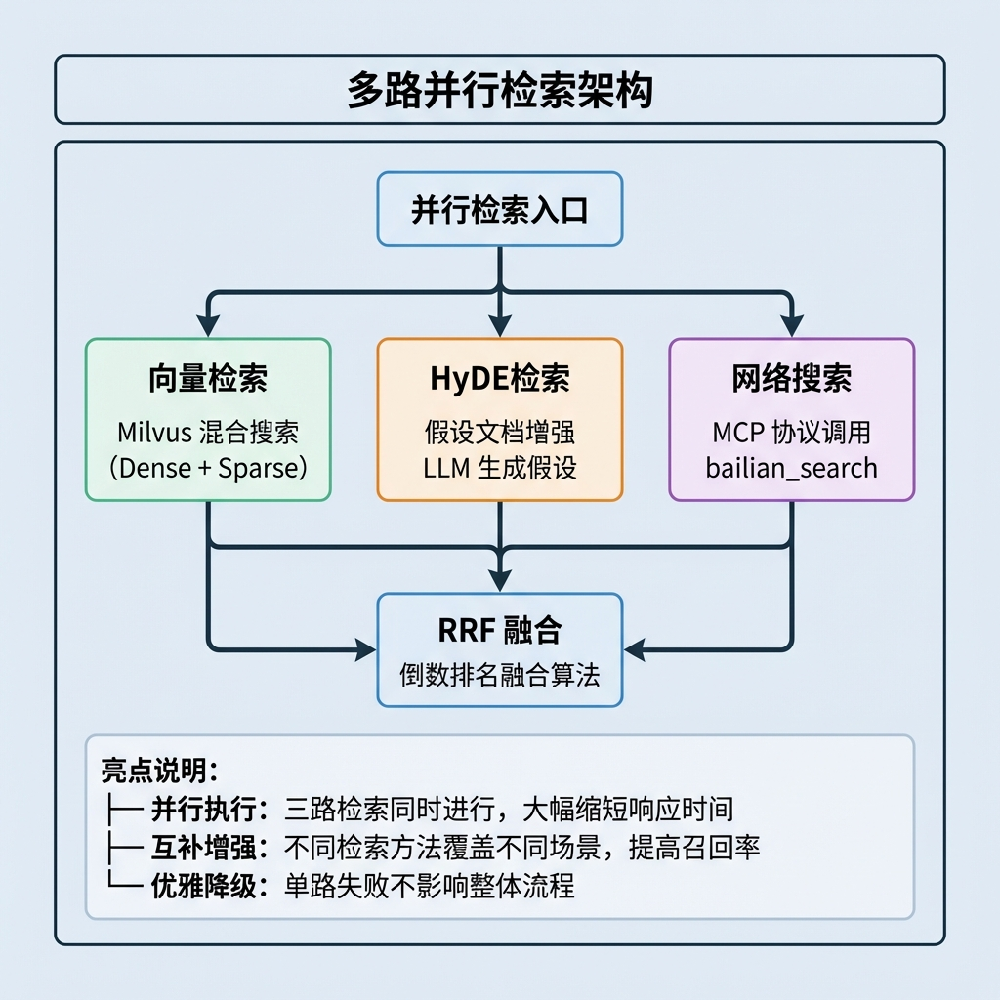
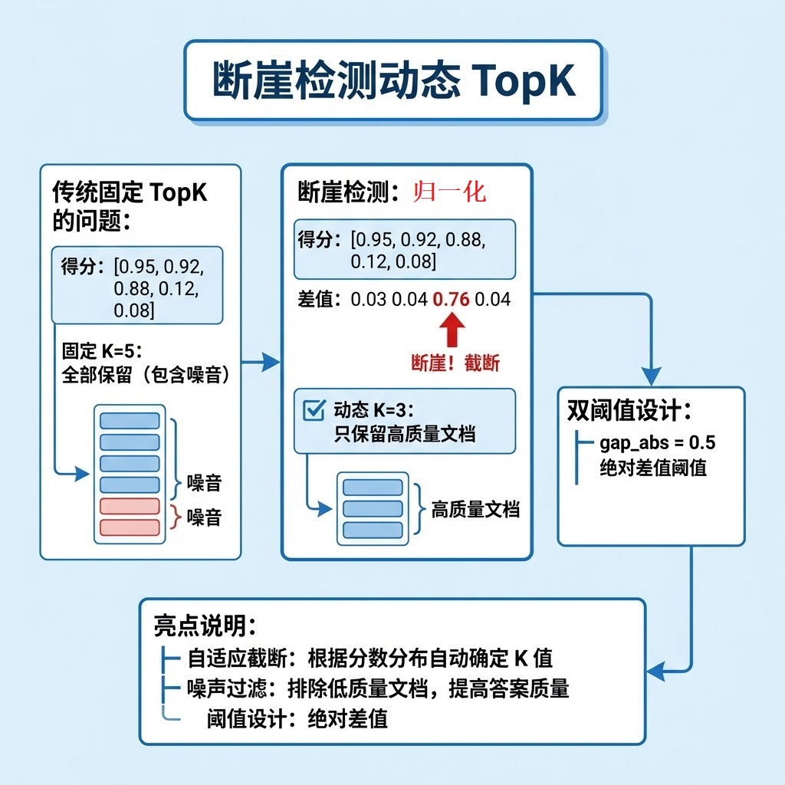
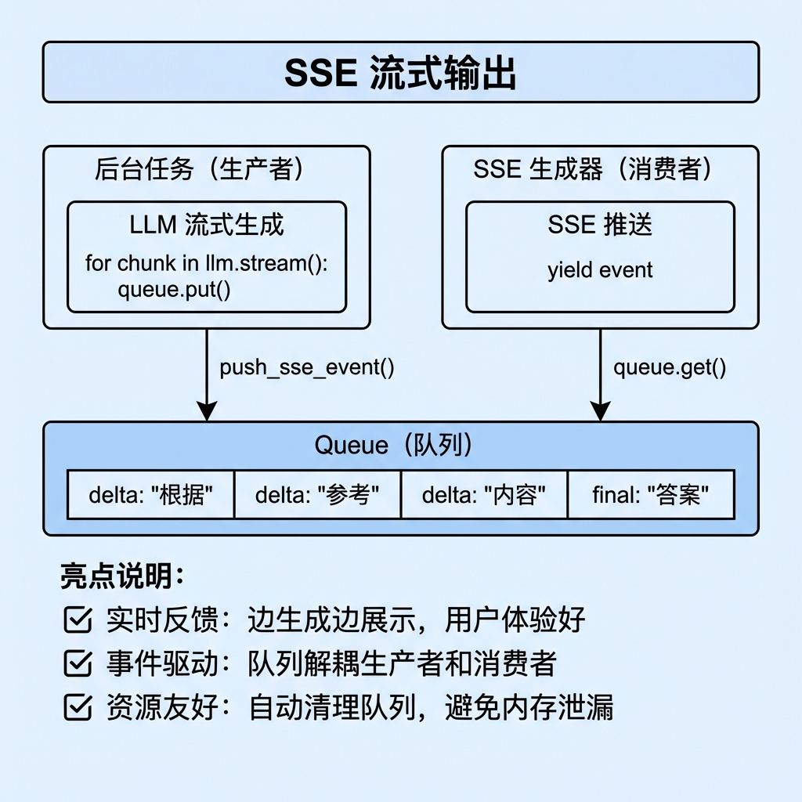
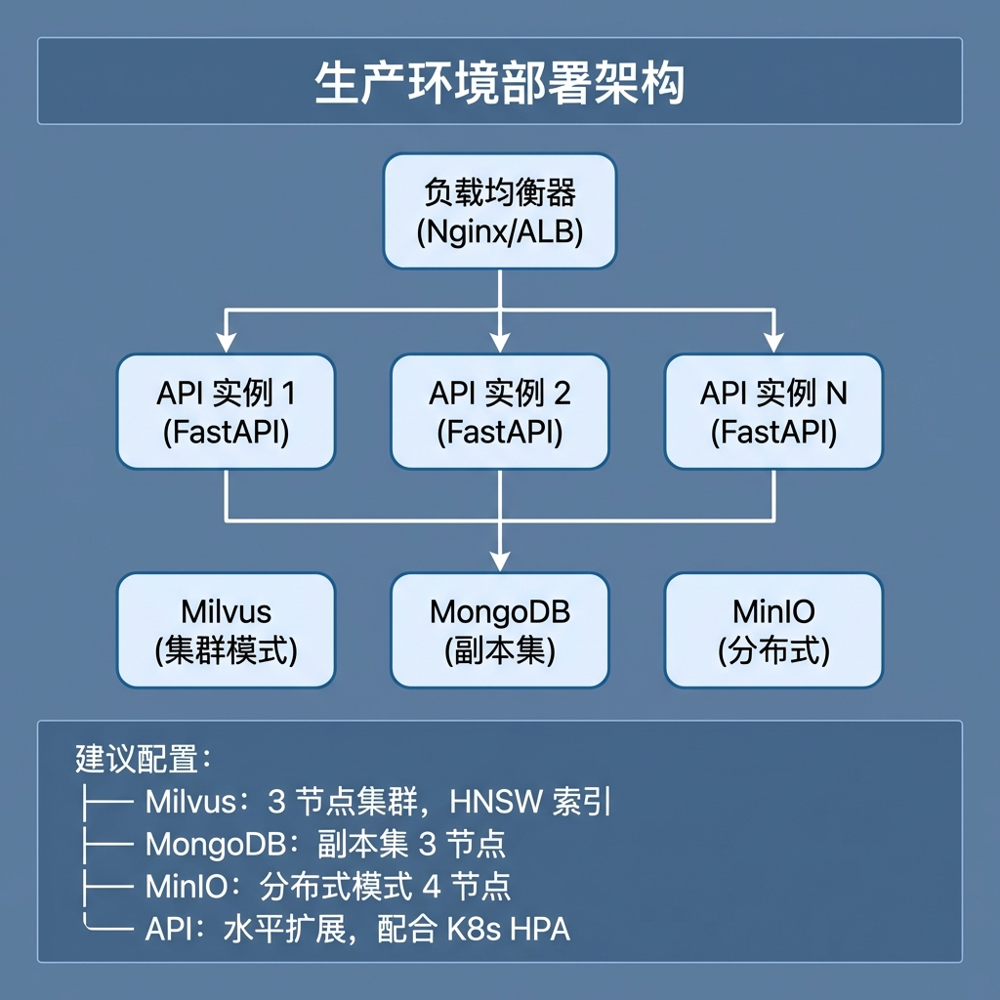

# 项目总结与技术全景

## 1. 项目概述

### 1.1 概览

**掌柜智库知识库系统** 是一个基于 RAG（Retrieval-Augmented Generation）架构的智能问答系统，专为商品知识库场景设计。系统支持 PDF 文档导入、多路检索、流式答案生成等功能。

### 1.2 核心能力



### 1.3 系统架构



---

## 2. 第三方中间件与技术栈

### 2.1 核心中间件

| 中间件      | 官网地址                | 作用                           | 使用位置                     |
| ----------- | ----------------------- | ------------------------------ | ---------------------------- |
| **Milvus**  | https://milvus.io       | 向量数据库，存储和检索文档向量 | 向量检索节点、向量化入库节点 |
| **MongoDB** | https://www.mongodb.com | 文档数据库，存储对话历史       | 历史管理、答案生成节点       |
| **MinIO**   | https://min.io          | 对象存储，存储原始文件和图片   | 图片处理节点、PDF转换节点    |

### 2.2 AI/ML 框架与模型

| 框架/模型         | 官网地址                                       | 作用                            | 使用位置                 |
| ----------------- | ---------------------------------------------- | ------------------------------- | ------------------------ |
| **LangChain**     | https://python.langchain.com                   | LLM 应用框架，统一 LLM 调用接口 | 各 LLM 调用节点          |
| **LangGraph**     | https://langchain-ai.github.io/langgraph       | 工作流编排框架，构建 DAG 流程   | 主图编排（导入/查询）    |
| **BGE-M3**        | https://huggingface.co/BAAI/bge-m3             | 混合向量嵌入模型（稠密+稀疏）   | 向量化节点、向量检索节点 |
| **BGE-Reranker**  | https://huggingface.co/BAAI/bge-reranker-large | 重排序模型（交叉编码器）        | Rerank重排序节点         |
| **FlagEmbedding** | https://github.com/FlagOpen/FlagEmbedding      | 嵌入模型工具库                  | 向量化、重排序           |
| **marker-pdf**    | https://github.com/VikParuchuri/marker         | PDF 转 Markdown 工具            | PDF转换节点              |

### 2.3 Web 框架与协议

| 框架/协议    | 官网地址                        | 作用               | 使用位置           |
| ------------ | ------------------------------- | ------------------ | ------------------ |
| **FastAPI**  | https://fastapi.tiangolo.com    | 高性能 Web 框架    | 导入路由、查询路由 |
| **Pydantic** | https://docs.pydantic.dev       | 数据验证和序列化   | 请求/响应模型      |
| **Uvicorn**  | https://www.uvicorn.org         | ASGI 服务器        | 应用启动入口       |
| **SSE**      | MDN Web Docs                    | 服务端推送事件协议 | 流式输出           |
| **MCP**      | https://modelcontextprotocol.io | 模型上下文协议     | 网络搜索节点       |

### 2.4 Python 核心库

| 库                | 官网地址                                                     | 作用                  | 使用位置          |
| ----------------- | ------------------------------------------------------------ | --------------------- | ----------------- |
| **pymilvus**      | https://milvus.io/docs                                       | Milvus Python SDK     | 向量操作          |
| **pymongo**       | https://pymongo.readthedocs.io                               | MongoDB Python Driver | 历史记录管理      |
| **minio**         | https://min.io/docs/minio/linux/developers/python/minio-py.html | MinIO Python SDK      | 文件上传          |
| **python-dotenv** | https://github.com/theskumar/python-dotenv                   | 环境变量管理          | 各模块配置加载    |
| **asyncio**       | Python 标准库                                                | 异步编程支持          | 网络搜索节点、SSE |

---

## 3. 课件结构总览

### 3.1 课件目录

| 编号 |        文档名称         | 主题分类 |          核心内容          |
| :--: | :---------------------: | :------: | :------------------------: |
|  01  |        项目全景         |   概述   |     系统架构、技术选型     |
|  02  | 环境配置与服务部署指南  |   部署   | Docker、环境变量、服务启动 |
|  03  |    导入处理骨架代码     | 导入流程 | LangGraph、State、BaseNode |
|  04  | 入口节点与PDF转Markdown | 导入流程 |    marker-pdf、文件校验    |
|  05  |   图片处理与MinIO上传   | 导入流程 |    MinIO、图片 URL 替换    |
|  06  |      文档切分节点       | 导入流程 |    语义切分、Token 控制    |
|  07  |     商品名识别节点      | 导入流程 |     LLM 提取、向量对齐     |
|  08  |     切片向量化节点      | 导入流程 |      BGE-M3、混合向量      |
|  09  |    向量数据入库节点     | 导入流程 |      Milvus、批量插入      |
|  10  |    查询处理骨架代码     | 查询流程 |     查询架构、并行搜索     |
|  11  |     商品名确认节点      | 查询流程 |     指代消解、查询重写     |
|  12  |      向量检索节点       | 查询流程 |      Milvus 混合搜索       |
|  13  |      HyDE检索节点       | 查询流程 |       假设性文档增强       |
|  14  |       RRF融合节点       | 查询流程 |        倒数排名融合        |
|  15  |    Rerank重排序节点     | 查询流程 |     Reranker、断崖检测     |
|  16  |      答案生成节点       | 查询流程 |    提示词工程、流式输出    |
|  17  |      网络搜索节点       | 查询流程 |       MCP 协议、SSE        |
|  18  |     Web层与前端对接     |  API层   |     FastAPI、事件队列      |
|  19  |      项目总结指南       |   总结   |   技术栈、亮点、优化方向   |

---

## 4. 技术亮点

### 4.1 多路并行检索架构



### 4.2 混合向量检索

```python
# BGE-M3 生成两种向量
dense_vectors = model.encode(texts)['dense_vecs']   # 768 维稠密向量
sparse_vectors = model.encode(texts)['lexical_weights']  # 稀疏词权重

# Milvus 混合搜索
search_requests = [
    AnnSearchRequest(dense_vectors, "dense_vector", ...),
    AnnSearchRequest(sparse_vectors, "sparse_vector", ...),
]
results = collection.hybrid_search(
    search_requests,
    rerank=WeightedRanker(0.7, 0.3)  # 稠密:稀疏 = 7:3
)
```

**亮点说明：**

- **语义 + 词汇**：稠密向量捕获语义，稀疏向量保留关键词匹配
- **单模型双输出**：BGE-M3 一次编码生成两种向量
- **加权融合**：可配置的权重平衡两种检索能力

### 4.3 HyDE 假设性文档增强


### 4.4 断崖检测动态 TopK



### 4.5 SSE 流式输出



---

## 5. 可优化方向

### 5.1 性能优化

|   优化方向   |       现状       |      优化方案       |     预期效果     |
| :----------: | :--------------: | :-----------------: | :--------------: |
| **向量缓存** | 每次查询重新编码 | 添加 Redis 向量缓存 | 减少重复编码开销 |
| **批量处理** | 部分节点逐条处理 |    使用批量 API     | 提升吞吐量 30%+  |
| **异步 IO**  | 部分同步阻塞调用 |     全异步改造      |   提升并发能力   |
| **模型量化** |    FP16 推理     |      INT8 量化      | 降低显存占用 50% |

### 5.2 功能增强

|    功能方向    |    现状    |        增强方案         |    业务价值    |
| :------------: | :--------: | :---------------------: | :------------: |
| **多模态检索** | 仅文本检索 | 图片向量化 + 跨模态检索 | 支持"以图搜文" |
|  **增量更新**  |  全量重建  |    支持文档增量导入     |  降低更新成本  |
|  **权限控制**  | 无权限隔离 |   多租户 + 文档级权限   |   企业级部署   |
|  **答案评估**  | 无质量评估 |    添加答案评分机制     |  持续优化质量  |
|  **反馈学习**  | 无用户反馈 |   收集点赞/踩 + 微调    |   个性化优化   |


---

## 6. 部署架构参考

### 6.1 开发环境

```yaml
# docker-compose.dev.yml
version: '3.8'
services:
  milvus:
    image: milvusdb/milvus:v2.3.0
    ports:
      - "19530:19530"
    volumes:
      - ./volumes/milvus:/var/lib/milvus

  mongodb:
    image: mongo:6.0
    ports:
      - "27017:27017"

  minio:
    image: minio/minio:latest
    ports:
      - "9000:9000"
      - "9001:9001"
    command: server /data --console-address ":9001"
```

### 6.2 生产环境建议



---

## 7. 常见问题与解决方案

### 7.1 性能问题

| 问题       | 可能原因   | 解决方案                            |
| ---------- | ---------- | ----------------------------------- |
| 向量检索慢 | 索引未优化 | 调整 HNSW 参数（M, efConstruction） |
| LLM 响应慢 | 模型较大   | 使用更小模型或量化版本              |
| 内存溢出   | 批量过大   | 分批处理，限制单批大小              |
| 首次查询慢 | 模型冷启动 | 预热机制，预加载模型                |

### 7.2 质量问题

| 问题           | 可能原因        | 解决方案                 |
| -------------- | --------------- | ------------------------ |
| 召回率低       | 向量模型不匹配  | 使用领域微调模型         |
| 排序不准       | Reranker 效果差 | 更换或微调 Reranker      |
| 答案不相关     | 上下文噪声多    | 调整断崖阈值，减少 TopK  |
| 商品名识别错误 | 阈值设置不当    | 调整对齐阈值，增加候选数 |

### 7.3 稳定性问题

| 问题         | 可能原因       | 解决方案                   |
| ------------ | -------------- | -------------------------- |
| 连接超时     | 网络不稳定     | 添加重试机制和连接池       |
| 服务崩溃     | 异常未捕获     | 完善异常处理，添加健康检查 |
| 数据不一致   | 并发写入       | 使用分布式锁或事务         |
| SSE 连接断开 | 客户端网络波动 | 前端自动重连机制           |

---

## 8. 总结

### 8.1 技术选型总结

本项目采用了**成熟稳定**的技术栈：

- **LangGraph**：灵活的工作流编排，支持并行和条件分支
- **Milvus**：高性能向量检索，支持混合搜索
- **FastAPI**：现代 Python Web 框架，原生异步支持
- **BGE 系列模型**：开源中文语义理解模型，效果优秀

### 8.2 架构设计总结

- **分层架构**：API → 服务 → 流程 → 工具 → 基础设施
- **节点化设计**：每个处理步骤独立封装，易于测试和维护
- **并行处理**：多路检索并行执行，缩短响应时间
- **流式输出**：SSE 实时推送，提升用户体验
- **容错设计**：单点失败不影响整体流程

